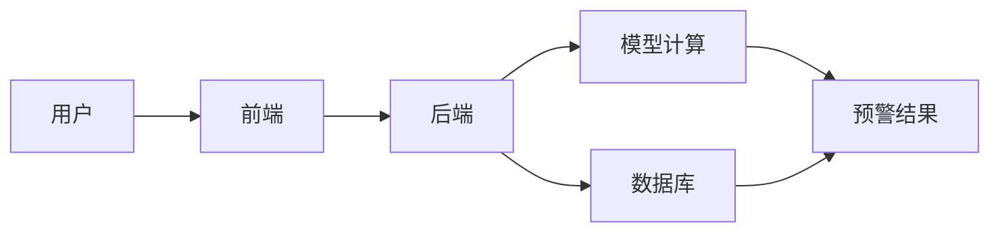
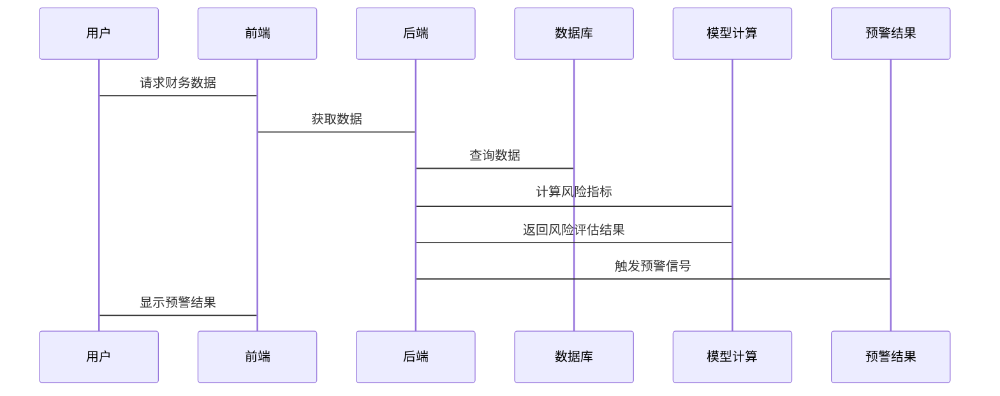

                 


# 构建智能化的企业财务风险预警系统

> 关键词：企业财务风险预警系统, 智能化, 机器学习, 数据分析, 财务风险管理

> 摘要：本文详细探讨了如何构建智能化的企业财务风险预警系统，从问题背景、核心概念到算法原理、系统架构、项目实战及最佳实践，逐一展开分析，旨在为企业财务风险管理提供科学化、系统化的解决方案。

---

# 第一部分: 企业财务风险预警系统背景与核心概念

## 第1章: 财务风险预警系统概述

### 1.1 问题背景

#### 1.1.1 企业财务风险的定义与分类
企业财务风险是指企业在经营过程中由于内外部环境变化、管理不善等因素，导致财务状况恶化，进而影响企业正常运营甚至引发危机的可能性。财务风险可以分为流动性风险、信用风险、市场风险、操作风险和法律风险等。

#### 1.1.2 财务风险对企业的影响
- 影响企业的偿债能力，可能导致企业信用评级下降。
- 影响投资者信心，可能导致股价波动。
- 可能引发连锁反应，导致供应链中断。
- 增加企业的运营成本，降低盈利能力。

#### 1.1.3 传统财务风险管理的局限性
- 依赖人工经验，主观性较强，难以量化。
- 数据分散，难以整合，缺乏系统性。
- 响应速度慢，无法实时预警。

### 1.2 问题描述

#### 1.2.1 财务风险预警的必要性
- 提前识别潜在风险，避免损失扩大。
- 优化资源配置，提升企业抗风险能力。
- 为管理层提供数据支持，提高决策效率。

#### 1.2.2 企业财务数据的特点
- 数据量大：涉及销售、成本、利润、现金流等多维度数据。
- 数据复杂：包括结构化数据和非结构化数据。
- 数据动态变化：受市场环境、政策变化等因素影响。

#### 1.2.3 财务风险预警系统的目标
- 实时监控企业财务状况，识别潜在风险。
- 提供风险预警信号，辅助管理层决策。
- 自动生成风险报告，便于后续分析。

### 1.3 问题解决

#### 1.3.1 数据驱动的财务风险管理
- 通过数据采集、处理和分析，实现对财务风险的量化评估。
- 利用大数据技术，整合多源数据，提高风险识别的准确性。

#### 1.3.2 智能化财务风险预警的核心思路
- 基于机器学习算法，构建风险评估模型。
- 通过实时数据分析，实现风险的智能化预警。

#### 1.3.3 系统化解决方案的设计思路
- 从数据采集到模型构建，再到预警触发，形成完整的系统化流程。
- 采用模块化设计，确保系统的可扩展性和可维护性。

### 1.4 边界与外延

#### 1.4.1 财务风险预警的边界
- 数据范围：仅限于财务相关数据，不涉及非财务数据。
- 预警范围：仅限于财务风险，不包括其他类型的风险（如市场风险、操作风险）。
- 系统范围：仅限于财务风险预警系统，不包括其他管理系统。

#### 1.4.2 相关领域的外延
- 数据分析领域：数据采集、处理、建模等技术。
- 人工智能领域：机器学习、深度学习等技术。
- 金融领域：风险管理、投资分析等知识。

#### 1.4.3 系统设计的范围界定
- 数据采集：从企业的财务系统中采集数据。
- 数据处理：清洗、特征提取、标准化等。
- 模型构建：基于机器学习算法构建风险评估模型。
- 预警触发：根据模型预测结果，触发预警信号。

## 第2章: 智能化财务风险预警的核心要素

### 2.1 数据源与数据预处理

#### 2.1.1 数据源的分类
- 结构化数据：财务报表、销售数据、成本数据等。
- 非结构化数据：市场新闻、行业报告、社交媒体数据等。

#### 2.1.2 数据清洗与特征提取
- 数据清洗：去除重复数据、处理缺失值、异常值等。
- 特征提取：从原始数据中提取有助于风险评估的特征，如财务比率、现金流变化率等。

#### 2.1.3 数据标准化与归一化
- 数据标准化：将数据转换为均值为0、标准差为1的形式。
- 数据归一化：将数据缩放到0到1的范围。

### 2.2 风险评估模型

#### 2.2.1 常见的风险评估方法
- 传统方法：基于财务比率的分析，如Z值模型、Altman Z’评分模型。
- 机器学习方法：逻辑回归、随机森林、支持向量机等。

#### 2.2.2 基于机器学习的模型选择
- 逻辑回归：适用于二分类问题，适合预测企业是否处于财务危机状态。
- 随机森林：适用于特征较多的情况，适合处理复杂的财务数据。
- 梯度提升树：适用于非线性关系，适合处理复杂的财务风险问题。

#### 2.2.3 模型训练与优化
- 数据分割：将数据分为训练集、验证集和测试集。
- 模型训练：使用训练数据训练模型，调整模型参数。
- 模型优化：通过交叉验证、网格搜索等方法优化模型性能。

### 2.3 预警机制设计

#### 2.3.1 预警阈值的设定
- 根据历史数据确定预警阈值，如将企业的财务状况分为正常、预警和危机三个等级。
- 根据企业的实际情况调整预警阈值，如行业差异、企业规模等。

#### 2.3.2 多级预警机制
- 根据风险程度设置多级预警，如黄色预警、橙色预警和红色预警。
- 根据预警级别采取不同的应对措施，如黄色预警时提醒管理层注意，橙色预警时启动应急方案。

#### 2.3.3 预警触发与反馈
- 当模型预测结果超过预警阈值时，系统自动触发预警信号。
- 根据预警信号，系统提供相应的建议和解决方案。

### 2.4 系统架构设计

#### 2.4.1 分层架构设计
- 数据层：负责数据的存储和管理。
- 业务逻辑层：负责数据处理、模型计算和预警触发。
- 用户界面层：提供直观的用户界面，供用户查看预警信息和分析结果。

#### 2.4.2 模块化设计原则
- 数据采集模块：负责从财务系统中采集数据。
- 数据处理模块：负责数据清洗、特征提取和标准化。
- 模型计算模块：负责模型训练、预测和优化。
- 预警触发模块：负责根据模型结果触发预警信号。

#### 2.4.3 可扩展性与可维护性
- 系统设计应具有良好的可扩展性，方便后续添加新的数据源或模型。
- 系统设计应具有良好的可维护性，方便后续进行bug修复和功能优化。

---

# 第二部分: 算法原理与数学模型

## 第3章: 算法原理与数学模型

### 3.1 风险评估的算法选择

#### 3.1.1 逻辑回归模型
- 逻辑回归是一种常用的二分类算法，适用于预测企业是否处于财务危机状态。
- 模型公式：
  $$ P(y=1|x) = \frac{e^{\beta_0 + \beta_1x}}{1 + e^{\beta_0 + \beta_1x}} $$
- 优势：模型解释性强，适合线性可分的问题。
- 动态调整：根据企业的财务状况变化，动态调整模型参数。

#### 3.1.2 支持向量机
- 支持向量机是一种基于统计学习的算法，适用于高维数据的分类和回归问题。
- 核心思想：在特征空间中找到一个超平面，使得正负样本尽可能分开。
- 优势：适合小样本数据，分类精度高。
- 动态调整：根据企业的财务数据变化，动态更新支持向量机模型。

#### 3.1.3 随机森林与梯度提升树
- 随机森林是一种基于决策树的集成算法，适用于高维数据和复杂场景。
- 梯度提升树是一种基于树的集成算法，适用于非线性关系和复杂场景。
- 模型公式：
  $$ y = \sum_{i=1}^{n} T(x_i) $$
  其中，$T(x_i)$ 表示每棵决策树的预测结果。

### 3.2 风险评估的数学模型

#### 3.2.1 线性回归模型
- 线性回归是一种简单且常用的回归算法，适用于线性关系的预测。
- 模型公式：
  $$ y = \beta_0 + \beta_1x_1 + \beta_2x_2 + ... + \beta_nx_n + \epsilon $$
- 应用场景：预测企业的财务状况变化趋势。

#### 3.2.2 决策树模型
- 决策树是一种基于树结构的分类和回归算法，适用于复杂场景和非线性关系。
- 核心思想：根据特征的重要性，逐步分裂数据，形成树结构。
- 优势：模型解释性强，适合处理多分类问题。

#### 3.2.3 贝叶斯网络
- 贝叶斯网络是一种基于概率论的图形化模型，适用于复杂的依赖关系。
- 核心思想：通过构建概率分布，计算各个特征对风险的影响概率。
- 模型公式：
  $$ P(y|x) = \frac{P(x|y)P(y)}{P(x)} $$

---

## 第4章: 系统分析与架构设计方案

### 4.1 项目介绍

#### 4.1.1 项目背景
- 企业需要实时监控财务状况，及时发现潜在风险。
- 传统的财务风险管理依赖人工经验，效率低下，容易出错。
- 基于机器学习的智能化财务风险预警系统可以提高风险识别的准确性和效率。

### 4.2 系统功能设计

#### 4.2.1 领域模型


#### 4.2.2 系统架构


#### 4.2.3 系统接口设计
- 数据接口：从财务系统中获取数据，格式为JSON或CSV。
- 模型接口：提供API，供其他系统调用模型计算结果。
- 预警接口：根据模型结果，触发预警信号。

#### 4.2.4 系统交互


---

## 第5章: 项目实战

### 5.1 环境安装

#### 5.1.1 安装Python
```bash
python --version
pip install --upgrade pip
```

#### 5.1.2 安装机器学习库
```bash
pip install numpy pandas scikit-learn
```

### 5.2 系统核心实现源代码

#### 5.2.1 数据处理代码
```python
import pandas as pd
import numpy as np

# 数据加载
data = pd.read_csv('financial_data.csv')

# 数据清洗
data = data.dropna()
data = data.drop_duplicates()

# 特征提取
features = data[['revenue', 'cost', 'profit', 'cash_flow']]
target = data['risk_level']

# 数据标准化
from sklearn.preprocessing import StandardScaler
scaler = StandardScaler()
features_scaled = scaler.fit_transform(features)
```

#### 5.2.2 模型训练代码
```python
from sklearn.model_selection import train_test_split
from sklearn.linear_model import LogisticRegression
from sklearn.ensemble import RandomForestClassifier

# 数据分割
X_train, X_test, y_train, y_test = train_test_split(features_scaled, target, test_size=0.2)

# 模型训练
model_lr = LogisticRegression()
model_lr.fit(X_train, y_train)
model_rf = RandomForestClassifier()
model_rf.fit(X_train, y_train)
```

#### 5.2.3 预警触发代码
```python
import joblib
import numpy as np

# 模型保存
joblib.dump(model_lr, 'lr_model.pkl')
joblib.dump(model_rf, 'rf_model.pkl')

# 预警触发
def trigger预警():
    # 加载模型
    model_lr = joblib.load('lr_model.pkl')
    model_rf = joblib.load('rf_model.pkl')
    
    # 预测结果
    predictions_lr = model_lr.predict(X_test)
    predictions_rf = model_rf.predict(X_test)
    
    # 预警判断
    for i in range(len(X_test)):
        if predictions_lr[i] == 1 or predictions_rf[i] == 1:
            print(f"触发预警，企业{i+1}存在潜在风险。")

trigger预警()
```

### 5.3 实际案例分析

#### 5.3.1 案例背景
某制造企业最近的财务数据出现异常，销售收入下降，利润减少，现金流紧张。

#### 5.3.2 数据分析
- 销售收入同比下降10%。
- 利润率下降5%。
- 流动比率低于行业平均水平。

#### 5.3.3 模型预测
- 逻辑回归模型预测结果：预警状态。
- 随机森林模型预测结果：危机状态。

#### 5.3.4 预警结果
- 系统触发红色预警，提示企业存在严重财务风险。

### 5.4 项目小结

#### 5.4.1 项目总结
- 成功构建了智能化的财务风险预警系统。
- 系统能够实时监控企业财务状况，准确识别潜在风险。

#### 5.4.2 经验与教训
- 数据质量对模型性能影响较大，需要加强数据清洗和特征提取。
- 模型选择需要根据实际情况进行调整，不能一成不变。

#### 5.4.3 未来优化方向
- 引入更多数据源，如市场新闻、行业报告等。
- 优化模型性能，提高预警的准确性和及时性。
- 增加用户友好的可视化界面，便于用户理解和使用。

---

## 第6章: 最佳实践

### 6.1 小结
- 智能化财务风险预警系统能够显著提高企业的风险识别能力和应对能力。
- 机器学习算法的应用为企业财务管理提供了新的思路和方法。

### 6.2 注意事项
- 数据隐私和安全问题需要高度重视，确保数据的安全性和合规性。
- 模型的可解释性需要加强，便于管理层理解和决策。
- 系统的可扩展性和可维护性需要考虑，方便后续的功能优化和技术升级。

### 6.3 拓展阅读
- 《机器学习实战》
- 《Python机器学习》
- 《数据驱动的金融分析》

---

# 作者

作者：AI天才研究院/AI Genius Institute & 禅与计算机程序设计艺术 /Zen And The Art of Computer Programming

