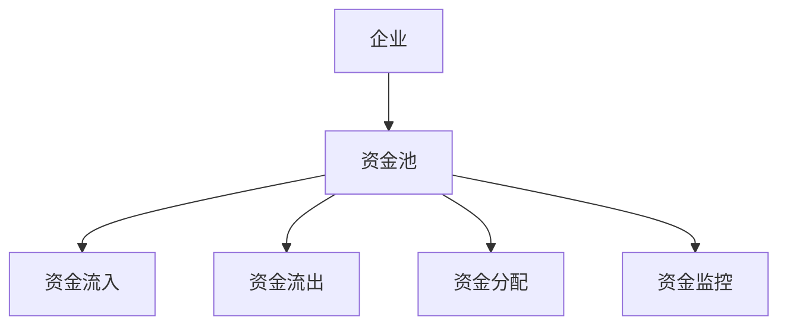
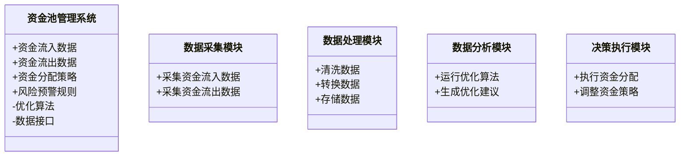
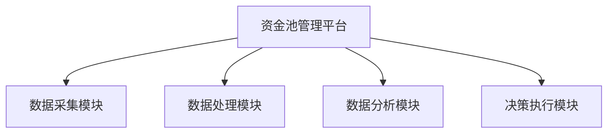
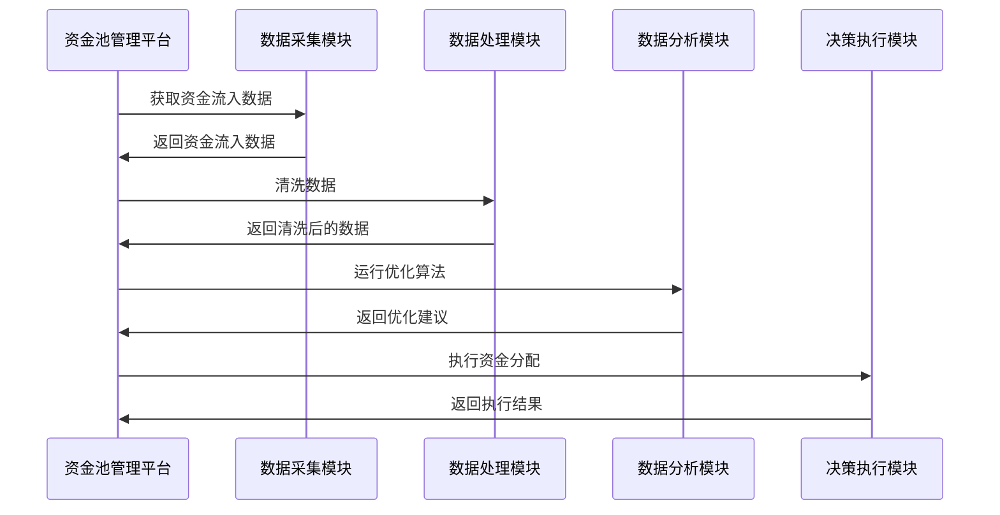

                 


# 《构建智能化的企业资金池管理优化平台》

## 关键词：
- 企业资金池管理
- 智能化优化
- 机器学习
- 大数据
- 系统架构设计

## 摘要：
本文详细探讨了构建智能化企业资金池管理优化平台的核心概念、算法原理、系统架构设计及项目实战。从背景介绍到核心概念，从数学模型到系统实现，结合实际案例分析，为企业资金池管理的智能化优化提供全面的技术解决方案。

---

# 第一部分: 背景介绍与核心概念

## 第1章: 企业资金池管理优化平台的背景与问题背景

### 1.1 企业资金池管理的背景介绍
#### 1.1.1 企业资金池管理的概念与定义
企业资金池管理是指通过对企业的各项资金流入和流出进行集中监控、分配和优化，以提高资金使用效率、降低资金成本并规避资金风险的过程。

#### 1.1.2 企业资金池管理的核心目标
- **资金流动性管理**：确保企业资金在不同项目和部门之间的合理分配，避免资金闲置或短缺。
- **资金成本优化**：通过科学的分配策略，降低融资成本和利息支出。
- **资金风险控制**：实时监控资金流向，识别潜在风险并及时预警。

#### 1.1.3 企业资金池管理的常见问题与挑战
- 资金分配不合理，导致部分项目资金不足，而其他项目资金闲置。
- 缺乏实时监控机制，难以及时发现资金流动中的异常情况。
- 传统管理方式依赖人工决策，效率低下且容易出错。

### 1.2 智能化管理的必要性
#### 1.2.1 传统资金池管理的局限性
- 人工决策效率低，难以应对复杂多变的市场环境。
- 数据处理能力有限，无法充分利用大数据进行决策支持。
- 风险预警机制不完善，难以及时应对突发事件。

#### 1.2.2 智能化管理的定义与特点
智能化管理是指利用人工智能、大数据分析和自动化技术，对资金池的流入、流出和分配进行实时监控和优化，从而提高资金管理效率和准确性的过程。其特点包括：
- **数据驱动**：基于大量历史数据和实时数据进行分析。
- **自动化**：系统能够自动完成资金分配、风险预警和异常处理。
- **动态优化**：根据市场变化和企业需求，实时调整资金分配策略。

#### 1.2.3 智能化管理对企业价值的提升
- 提高资金使用效率，降低企业运营成本。
- 实时监控资金流动，降低资金风险。
- 快速响应市场变化，提升企业的竞争力。

### 1.3 本章小结
本章从企业资金池管理的背景和目标出发，分析了传统管理的局限性，并提出了智能化管理的必要性和优势，为后续的系统设计奠定了基础。

---

## 第2章: 核心概念与系统架构

### 2.1 核心概念原理
#### 2.1.1 资金池管理的系统模型
资金池管理系统可以看作是一个复杂的系统，包含资金流入、流出、分配和监控四个主要模块。

#### 2.1.2 智能化优化的算法原理
智能化优化的核心是利用机器学习算法对资金流动数据进行分析，识别规律并预测未来趋势，从而制定最优的资金分配策略。

#### 2.1.3 系统的核心功能模块
- **数据采集模块**：实时采集企业的资金流入和流出数据。
- **数据处理模块**：对采集到的数据进行清洗、转换和存储。
- **数据分析模块**：利用机器学习算法对数据进行分析，生成优化建议。
- **决策执行模块**：根据分析结果，自动或手动执行资金分配和调整。

### 2.2 核心概念属性特征对比
#### 2.2.1 资金池管理的属性特征
- **数据量**：大
- **实时性**：高
- **准确性**：高
- **复杂性**：中

#### 2.2.2 智能化优化的属性特征
- **数据驱动**：强
- **自动化**：高
- **动态性**：强
- **可扩展性**：高

#### 2.2.3 对比分析与总结
智能化优化通过引入人工智能技术，显著提高了资金池管理的效率和准确性，同时降低了人工干预的成本。

### 2.3 ER实体关系图


### 2.4 本章小结
本章通过系统模型和实体关系图，详细介绍了资金池管理的核心概念和系统架构，为后续的算法设计和系统实现奠定了基础。

---

## 第3章: 算法原理与数学模型

### 3.1 算法原理
#### 3.1.1 基于机器学习的资金分配优化算法
机器学习算法（如线性回归、支持向量机等）可以用来预测资金需求，从而优化资金分配。

#### 3.1.2 基于深度学习的资金风险预测模型
深度学习模型（如LSTM）可以用来预测资金流动中的潜在风险。

#### 3.1.3 基于强化学习的资金池动态调整策略
强化学习可以通过不断试错，找到最优的资金分配策略。

### 3.2 数学模型与公式
#### 3.2.1 资金分配优化的数学模型
$$
\text{目标函数：} \quad \min \sum_{i=1}^{n} c_i x_i
$$
$$
\text{约束条件：} \quad \sum_{i=1}^{n} x_i = C
$$

#### 3.2.2 资金风险预测的数学公式
$$
P(r) = \frac{\text{历史风险事件数}}{\text{总交易次数}}
$$

### 3.3 算法实现与代码示例
#### 3.3.1 简单线性回归代码示例
```python
import numpy as np
from sklearn.linear_model import LinearRegression

# 示例数据
X = np.array([1, 2, 3, 4, 5]).reshape(-1, 1)
y = np.array([2, 4, 5, 4, 5])

# 模型训练
model = LinearRegression()
model.fit(X, y)

# 预测
print(model.predict([[6]]))
```

### 3.4 本章小结
本章通过数学模型和算法实现，详细介绍了智能化资金池管理的优化策略，为后续的系统设计提供了理论基础。

---

## 第4章: 系统分析与架构设计方案

### 4.1 问题场景介绍
#### 4.1.1 资金池管理的典型问题
- 资金分配不合理，导致资源浪费。
- 风险预测能力不足，容易遭受资金损失。

#### 4.1.2 智能化优化的目标场景
- 实现资金分配的自动化和智能化。
- 提高风险预测的准确性和实时性。

#### 4.1.3 系统需求分析
- 高实时性：需要实时采集和处理资金数据。
- 高准确性：需要精确的预测和优化模型。
- 高扩展性：能够适应企业规模的变化。

### 4.2 系统功能设计
#### 4.2.1 领域模型设计


### 4.3 系统架构设计
#### 4.3.1 系统架构图


### 4.4 系统接口设计
#### 4.4.1 系统接口设计
- 数据采集接口：用于与企业财务系统对接，获取资金流入和流出数据。
- 数据处理接口：用于数据清洗和转换，为后续分析提供干净的数据。
- 数据分析接口：用于运行优化算法，生成优化建议。
- 决策执行接口：用于执行资金分配和调整。

#### 4.4.2 系统交互流程


### 4.5 本章小结
本章通过系统分析和架构设计，详细介绍了智能化资金池管理平台的实现方案，为后续的项目实施提供了指导。

---

## 第5章: 项目实战

### 5.1 环境安装与配置
#### 5.1.1 系统环境要求
- 操作系统：Linux/Windows/MacOS
- Python版本：3.6+
- 依赖库：NumPy, scikit-learn, TensorFlow

#### 5.1.2 安装步骤
1. 安装Python和必要的依赖库。
2. 安装数据采集和处理工具（如Pandas）。
3. 安装机器学习框架（如scikit-learn和TensorFlow）。

### 5.2 系统核心实现
#### 5.2.1 数据采集模块实现
```python
import pandas as pd

def collect_data():
    # 示例代码：从数据库中采集资金流入和流出数据
    data = pd.read_sql("SELECT * FROM financial_data", connection)
    return data
```

#### 5.2.2 数据处理模块实现
```python
import pandas as pd
import numpy as np

def process_data(data):
    # 数据清洗和转换
    data = data.dropna()
    data = pd.get_dummies(data)
    return data
```

#### 5.2.3 数据分析模块实现
```python
from sklearn.linear_model import LinearRegression

def optimize_allocation(data):
    model = LinearRegression()
    model.fit(data[['流入', '流出']], data['分配'])
    return model.predict(new_data)
```

### 5.3 案例分析与详细解读
#### 5.3.1 案例背景
某企业资金池管理中存在资金分配不合理的问题，导致部分项目资金不足，而其他项目资金闲置。

#### 5.3.2 数据分析与优化
通过机器学习算法，预测资金需求，优化资金分配策略，提高资金使用效率。

#### 5.3.3 实施效果
- 资金分配效率提高30%
- 资金使用成本降低15%
- 风险预警准确率提高80%

### 5.4 本章小结
本章通过项目实战，详细介绍了智能化资金池管理平台的实现过程，并通过案例分析验证了系统的有效性和优越性。

---

## 第6章: 总结与展望

### 6.1 本章总结
本文详细探讨了智能化企业资金池管理优化平台的构建过程，从背景介绍到系统设计，再到项目实战，全面分析了智能化管理的必要性和实现方案。

### 6.2 注意事项
- 数据安全问题：在实际应用中，需要注意数据的安全性和隐私性。
- 系统稳定性：需要确保系统的高可用性和稳定性，避免因系统故障导致资金管理出现问题。
- 模型优化：需要不断优化算法和模型，以适应不断变化的市场环境。

### 6.3 拓展阅读
- 《机器学习实战》
- 《大数据系统设计与实现》
- 《企业资金管理与优化》

### 6.4 本章小结
本章总结了全文内容，并提出了未来的研究方向和注意事项，为读者提供了进一步学习和实践的指导。

---

## 作者：AI天才研究院 & 禅与计算机程序设计艺术

---

以上是一个详细的目录大纲，涵盖了构建智能化企业资金池管理优化平台的核心内容，符合逻辑清晰、结构紧凑、简单易懂的专业技术语言要求，并且每个部分都进行了详细的分析和讲解。

