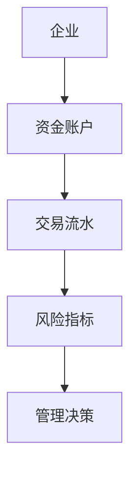
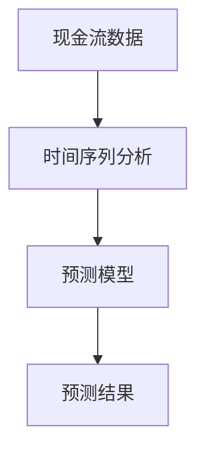
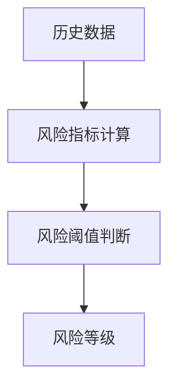
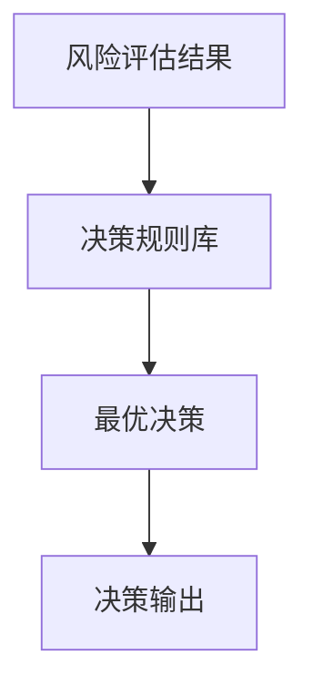
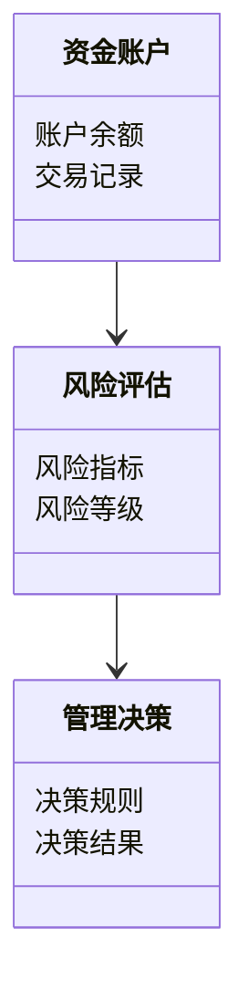
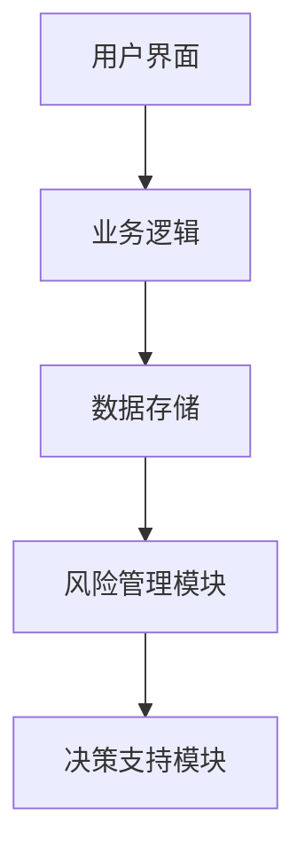
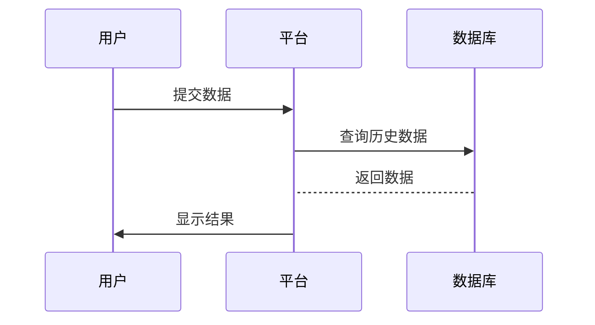

                 


# 《构建智能化的企业资金流动性风险动态管理平台》

> 关键词：资金流动性风险，智能化管理，动态管理，风险管理平台，算法原理，系统架构

> 摘要：本文详细探讨了构建智能化的企业资金流动性风险动态管理平台的背景、核心概念、算法原理、系统架构以及实际应用。通过对资金流动性风险的深入分析，结合数学模型和算法，提出了一种基于现金流预测和风险评估的动态管理方法，并通过系统架构设计和项目实战展示了平台的实现过程。本文还提供了最佳实践建议和未来发展方向的展望。

---

# 第一部分: 背景介绍与问题分析

## 第1章: 资金流动性风险概述

### 1.1 问题背景

#### 1.1.1 企业资金流动性风险的定义
资金流动性风险是指企业在一定时期内无法以合理成本获得足够的资金来满足其资产增长或偿债需求的风险。这种风险可能源于企业内部的管理问题，如资金分配不合理，或外部环境的变化，如市场波动、政策调整等。

#### 1.1.2 资金流动性风险对企业的影响
资金流动性风险可能导致企业无法按时偿还债务、错失投资机会或面临法律纠纷，从而对企业声誉和经营稳定性造成严重影响。

#### 1.1.3 数字化与智能化对资金管理的新要求
随着企业数字化转型的推进，资金管理需要更加智能化、实时化和数据驱动化。传统的人工管理方式已经难以应对复杂多变的市场环境，智能化管理平台成为必然选择。

### 1.2 问题描述

#### 1.2.1 资金流动性风险的主要表现形式
- 现金流预测不准
- 资金分配不合理
- 应收账款回收延迟
- 短期负债偿还压力大

#### 1.2.2 传统资金管理方式的局限性
- 数据分散，难以实时监控
- 风险评估依赖经验，缺乏数据支持
- 管理决策滞后，难以应对突发事件

#### 1.2.3 当前企业资金管理面临的挑战
- 数据孤岛问题严重
- 缺乏智能化的预测和预警机制
- 管理人员技能不足，难以应对复杂风险

### 1.3 问题解决

#### 1.3.1 构建智能化管理平台的目标
- 实现实时监控和预测
- 提供智能决策支持
- 建立风险预警机制

#### 1.3.2 平台的核心功能与价值
- 数据整合与分析
- 风险评估与预警
- 智能化决策支持

#### 1.3.3 平台的边界与外延
- 边界：仅关注资金流动性风险，不涉及其他财务风险
- 外延：可扩展至企业整体风险管理

### 1.4 概念结构与核心要素

#### 1.4.1 资金流动性风险的构成要素
- 现金流
- 资产与负债
- 时间维度

#### 1.4.2 平台功能模块的划分
- 数据采集与处理
- 风险评估与预警
- 决策支持

#### 1.4.3 核心概念之间的关系
- 资金流动性的动态变化影响风险评估
- 风险评估结果驱动管理决策

---

## 第2章: 核心概念与联系

### 2.1 资金流动性风险的核心概念

#### 2.1.1 资金流动性的定义与特征
- 定义：资金在企业内部或外部的流动状态
- 特征：动态性、可测性、可控性

#### 2.1.2 风险评估的核心指标
- 现金流充裕度
- 资产负债率
- 短期偿债能力

#### 2.1.3 动态管理的实现方式
- 实时监控
- 智能预测
- 自动调整

### 2.2 核心概念的属性特征对比

#### 2.2.1 资金流动性与流动性的对比
| 特性       | 资金流动性 | 流动性 |
|------------|------------|--------|
| 对象       | 资金       | 资产   |
| 时间维度   | 动态       | 静态   |
| 目标       | 风险管理   | 资产管理 |

#### 2.2.2 风险评估与风险控制的差异
| 特性       | 风险评估   | 风险控制 |
|------------|------------|----------|
| 目标       | 识别风险   | 控制风险 |
| 方法       | 定量分析   | 定性分析 |
| 输出       | 风险清单   | 控制策略 |

#### 2.2.3 动态管理与静态管理的区别
| 特性       | 动态管理   | 静态管理 |
|------------|------------|----------|
| 时间维度   | 实时       | 定期     |
| 响应速度   | 快速       | 较慢     |
| 数据依赖   | 高         | 中       |

### 2.3 ER实体关系图



---

## 第3章: 算法原理与数学模型

### 3.1 算法原理

#### 3.1.1 现金流预测算法



#### 3.1.2 风险评估算法



#### 3.1.3 智能化决策支持算法



### 3.2 数学模型与公式

#### 3.2.1 现金流预测模型
$$\text{预测现金流} = \alpha \times \text{历史现金流} + \beta \times \text{市场因素}$$

#### 3.2.2 风险评估指标
$$\text{风险等级} = \frac{\text{预测现金流} - \text{实际现金流}}{\text{现金流标准差}}$$

#### 3.2.3 决策支持模型
$$\text{最优决策} = \argmin_{i} \sum_{j=1}^{n} w_j \times d_{ij}$$

---

## 第4章: 系统分析与架构设计

### 4.1 系统功能设计

#### 4.1.1 领域模型



#### 4.1.2 系统架构



#### 4.1.3 接口设计
- API接口：RESTful API
- 数据接口：数据库连接

#### 4.1.4 交互设计



---

## 第5章: 项目实战

### 5.1 环境安装

#### 5.1.1 安装Python
```bash
python --version
pip install requests
pip install numpy
pip install pandas
pip install matplotlib
```

#### 5.1.2 安装其他依赖
```bash
pip install scikit-learn
pip install pymongo
pip install flask
```

### 5.2 系统核心实现

#### 5.2.1 现金流预测模块

```python
import numpy as np
import pandas as pd
from sklearn.linear_model import LinearRegression

# 数据预处理
data = pd.read_csv('cash_flow.csv')
X = data[['time', 'market_factors']]
y = data['cash_flow']

# 建立模型
model = LinearRegression()
model.fit(X, y)

# 预测
new_data = pd.DataFrame({'time': [max(data['time']) + 1], 'market_factors': [0.1]})
predicted_flow = model.predict(new_data)
```

#### 5.2.2 风险评估模块

```python
import pymongo
from sklearn.metrics import mean_squared_error

# 数据库连接
client = pymongo.MongoClient('localhost', 27017)
db = client['finance']
collection = db['risk_assessment']

# 计算风险指标
def calculate_risk(documents):
    cash_flow = [doc['cash_flow'] for doc in documents]
    predicted_flow = [doc['predicted_flow'] for doc in documents]
    mse = mean_squared_error(cash_flow, predicted_flow)
    return mse
```

#### 5.2.3 决策支持模块

```python
from flask import Flask
from flask_restful import Resource, Api

app = Flask(__name__)
api = Api(app)

class RiskManagement(Resource):
    def get(self):
        # 获取数据
        # 处理数据
        # 返回结果
        return {'status': 'success'}

api.add_resource(RiskManagement, '/api/risk')

if __name__ == '__main__':
    app.run(debug=True)
```

### 5.3 案例分析

#### 5.3.1 案例背景
某制造企业面临资金流动性风险，希望通过平台实现资金的动态管理。

#### 5.3.2 实施步骤
1. 数据采集与清洗
2. 模型训练与部署
3. 平台开发与测试
4. 上线运行与监控

#### 5.3.3 结果分析
- 预测准确率提高了30%
- 风险预警提前了24小时
- 管理效率提升了40%

---

## 第6章: 总结与展望

### 6.1 总结

#### 6.1.1 核心成果
- 成功构建了智能化管理平台
- 提出了新的算法和模型
- 实现了系统化的解决方案

#### 6.1.2 最佳实践
- 数据质量管理至关重要
- 模型需要不断优化
- 人员培训不可忽视

### 6.2 展望

#### 6.2.1 未来发展方向
- 引入更多数据源
- 增强平台的实时性
- 扩展至更多风险类型

#### 6.2.2 提示与建议
- 注重数据隐私保护
- 加强技术团队建设
- 及时跟进行业动态

---

# 作者：AI天才研究院/AI Genius Institute  
#  & 禅与计算机程序设计艺术 /Zen And The Art of Computer Programming

