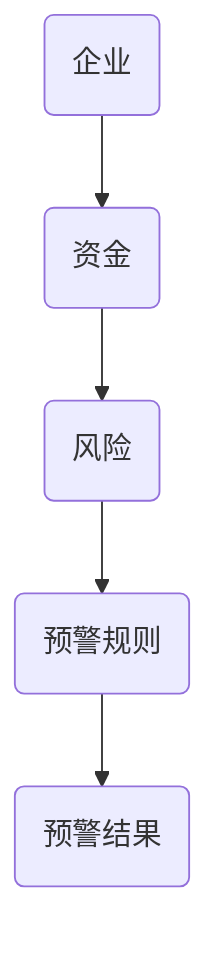
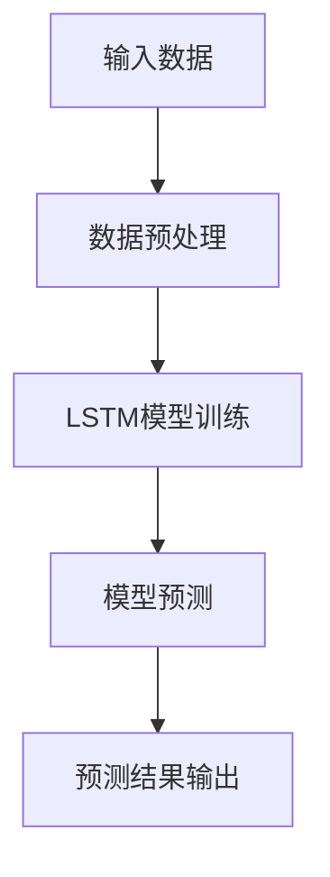
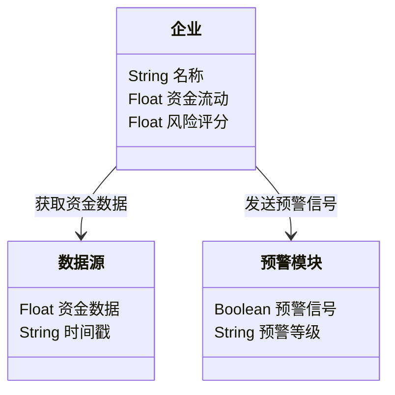
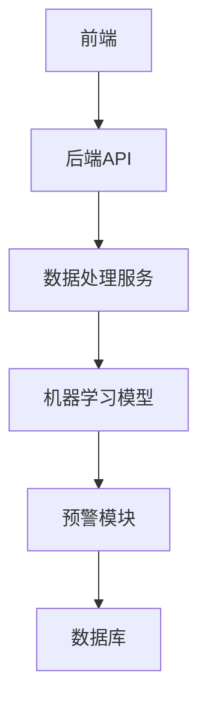

                 


# 构建智能化的企业资金流动性风险预警平台

> 关键词：资金流动性风险、智能化预警、机器学习、企业风险管理、实时监控

> 摘要：本文详细探讨了如何构建智能化的企业资金流动性风险预警平台。从背景介绍到系统架构设计，从算法实现到项目实战，系统地分析了平台构建的全过程。文章结合实际案例，深入浅出地阐述了如何利用机器学习技术，特别是基于LSTM的时间序列预测模型，实现对企业资金流动性风险的实时监控和预警。通过本文的讲解，读者可以全面理解资金流动性风险预警平台的核心概念、实现原理和实际应用。

---

## 第一章: 企业资金流动性风险预警平台的背景与意义

### 1.1 企业资金流动性风险的背景介绍
#### 1.1.1 企业资金流动性风险的定义与特点
企业资金流动性风险是指企业在一定时期内无法以合理成本获得足够的资金来满足其资产增长或偿债需求的风险。其特点是：
- **动态性**：资金流动随市场环境变化而波动。
- **突发性**：风险可能在短时间内迅速放大。
- **复杂性**：涉及多个内外部因素的交互作用。

#### 1.1.2 资金流动性风险对企业的影响
资金流动性风险可能导致企业面临以下问题：
- **资金链断裂**：无法按时偿还债务，影响企业正常运营。
- **信誉损失**：资金链问题可能损害企业声誉，影响未来融资。
- **机会成本**：由于资金不足，错失市场机会。

#### 1.1.3 智能化预警平台的必要性
传统的财务报表分析和人工监控方式难以应对资金流动性风险的动态性和突发性。智能化预警平台通过实时数据采集、机器学习算法和大数据分析，能够快速识别潜在风险，为企业提供及时的预警信息。

---

### 1.2 企业资金流动性风险预警的现状与挑战
#### 1.2.1 现有风险预警方法的局限性
传统预警方法主要依赖财务指标分析，存在以下问题：
- **滞后性**：基于历史数据的分析无法预测未来的风险。
- **单一性**：仅关注财务指标，忽视市场环境和企业行为的交互作用。
- **低效性**：人工监控效率低下，难以实时处理大量数据。

#### 1.2.2 数据获取与处理的难点
- 数据来源分散，清洗难度大。
- 数据维度多样，处理复杂。
- 数据实时性要求高，对计算能力提出挑战。

#### 1.2.3 技术实现中的主要挑战
- 复杂的算法实现：需要处理非线性关系和时间序列数据。
- 高性能计算：实时处理大量数据需要强大的计算能力。
- 系统稳定性：预警平台需要7×24小时稳定运行。

---

### 1.3 智能化预警平台的目标与意义
#### 1.3.1 平台建设的核心目标
- 实时监控企业资金流动情况。
- 通过机器学习算法预测资金流动性风险。
- 提供实时预警信息，辅助企业决策。

#### 1.3.2 平台对企业管理的价值
- 提高资金管理效率。
- 降低资金链断裂风险。
- 优化企业资本结构。

#### 1.3.3 平台对行业发展的推动作用
- 提供行业基准，推动企业风险管理标准化。
- 促进行业技术进步，推动智能化技术在金融领域的应用。

---

## 第二章: 企业资金流动性风险预警的核心概念与联系

### 2.1 核心概念的定义与原理
#### 2.1.1 资金流动性风险的构成要素
- **资金来源**：企业的融资渠道和方式。
- **资金用途**：企业的投资和运营需求。
- **市场环境**：宏观经济环境和金融市场状况。

#### 2.1.2 智能化预警的关键技术
- **大数据分析**：处理海量数据，提取有价值的信息。
- **机器学习**：利用算法预测资金流动性风险。
- **实时监控**：通过流数据处理技术实现实时预警。

---

### 2.2 核心概念的属性特征对比
#### 2.2.1 资金流动与风险的对比分析
| 属性 | 资金流动 | 资金风险 |
|------|----------|----------|
| 时间性 | 实时性高 | 动态变化 |
| 数据量 | 大 | 需精确计算 |
| 影响因素 | 多 | 复杂 |

#### 2.2.2 不同预警方法的特征对比
| 方法 | 传统财务分析 | 机器学习模型 | 时间序列预测 |
|------|---------------|--------------|--------------|
| 数据依赖 | 历史财务数据 | 多维度数据 | 时间序列数据 |
| 预测能力 | 低 | 高 | 高 |
| 实时性 | 低 | 中 | 高 |

---

### 2.3 实体关系图（ER图）架构
#### 2.3.1 实体关系图的构建
- **企业**：资金流动的主体。
- **资金**：企业的资金流动情况。
- **风险**：资金流动中潜在的风险。
- **预警规则**：用于判断风险的规则。
- **预警结果**：最终的预警输出。

#### 2.3.2 关键实体之间的关系描述


---

## 第三章: 资金流动性风险预警的算法原理与实现

### 3.1 基于时间序列的预测模型
#### 3.1.1 LSTM模型的原理与优势
LSTM（长短期记忆网络）是一种特殊的RNN（循环神经网络），能够有效捕捉时间序列数据中的长期依赖关系。其优势包括：
- 能够处理序列数据的长距离依赖。
- 具有记忆单元，可以存储长期信息。

#### 3.1.2 时间序列预测的基本流程
1. 数据预处理：清洗数据，提取特征。
2. 模型训练：使用LSTM网络训练模型。
3. 模型预测：利用训练好的模型进行预测。
4. 预警判断：根据预测结果生成预警信号。

---

### 3.2 算法实现的数学模型
#### 3.2.1 LSTM模型的数学公式
$$ \text{LSTM} = \text{Input} + \text{Forget} \times \text{Previous State} + \text{Output} \times \text{Candidate State} $$

#### 3.2.2 LSTM单元的组成部分
- **输入门（Input Gate）**：决定当前输入的信息如何影响当前状态。
- **遗忘门（Forget Gate）**：决定如何遗忘之前的状态。
- **输出门（Output Gate）**：决定当前状态如何输出到输出层。

---

### 3.3 算法实现的代码示例
#### 3.3.1 LSTM模型的实现代码
```python
import tensorflow as tf
from tensorflow.keras.layers import LSTM, Dense
model = tf.keras.Sequential()
model.add(LSTM(64, input_shape=(timesteps, features)))
model.add(Dense(1))
model.compile(optimizer='adam', loss='mean_squared_error')
```

#### 3.3.2 模型训练与预测
```python
# 训练
model.fit(X_train, y_train, epochs=10, batch_size=32)

# 预测
predictions = model.predict(X_test)
```

---

### 3.4 算法实现的流程图


---

## 第四章: 系统分析与架构设计

### 4.1 系统功能设计
#### 4.1.1 系统功能模块划分
- **数据采集模块**：实时采集企业资金数据。
- **数据处理模块**：清洗和转换数据。
- **模型预测模块**：利用LSTM模型预测风险。
- **预警模块**：根据预测结果生成预警信号。

#### 4.1.2 领域模型（类图）


---

### 4.2 系统架构设计
#### 4.2.1 系统架构图


#### 4.2.2 关键组件说明
- **前端**：用户界面，展示预警信息。
- **后端API**：接收请求，调用数据处理服务。
- **数据处理服务**：清洗和转换数据，调用机器学习模型。
- **机器学习模型**：进行预测，返回结果。
- **预警模块**：根据预测结果生成预警信号。
- **数据库**：存储企业资金数据和预警记录。

---

## 第五章: 项目实战

### 5.1 环境安装与配置
- **Python**：安装Python 3.8及以上版本。
- **TensorFlow**：安装TensorFlow 2.0及以上版本。
- **Jupyter Notebook**：用于数据处理和模型训练。

### 5.2 系统核心实现
#### 5.2.1 数据采集
```python
import pandas as pd
data = pd.read_csv('资金数据.csv')
```

#### 5.2.2 数据预处理
```python
from sklearn.preprocessing import MinMaxScaler
scaler = MinMaxScaler()
data_scaled = scaler.fit_transform(data)
```

#### 5.2.3 模型训练
```python
model.fit(X_train, y_train, epochs=10, batch_size=32)
```

#### 5.2.4 预警判断
```python
threshold = 0.8  # 预警阈值
if predictions > threshold:
    send预警信号
```

### 5.3 案例分析
假设某企业资金流动数据如下：
| 时间 | 资金余额（万元） |
|------|-----------------|
| 1月 | 1000            |
| 2月 | 950             |
| 3月 | 800             |
| 4月 | 700             |

通过LSTM模型预测，发现5月的资金余额可能低于700万元，触发预警。

---

## 第六章: 总结与展望

### 6.1 项目总结
通过构建智能化的企业资金流动性风险预警平台，企业能够实现资金流动的实时监控和风险预警，显著降低资金链断裂的风险。平台的核心优势包括：
- **实时性**：基于流数据处理技术，实现实时监控。
- **准确性**：利用机器学习算法，提高预测精度。
- **可扩展性**：支持多企业、多数据源的扩展。

### 6.2 项目展望
未来，智能化预警平台可以在以下方面进一步优化：
- **多模态数据融合**：结合文本、图像等多模态数据，提高预测精度。
- **自适应学习**：实现模型的自适应优化，提升预警效果。
- **智能化决策支持**：结合知识图谱技术，提供决策支持。

---

## 附录

### 附录A: 术语解释
- **LSTM**：长短期记忆网络。
- **流数据处理**：实时处理数据流的技术。

### 附录B: 相关工具与库
- **TensorFlow**：深度学习框架。
- **Pandas**：数据处理库。
- **Jupyter Notebook**：数据处理和模型训练工具。

---

## 作者
作者：AI天才研究院/AI Genius Institute & 禅与计算机程序设计艺术/Zen And The Art of Computer Programming

---

通过本文的详细讲解，读者可以全面理解企业资金流动性风险预警平台的核心概念、实现原理和实际应用。从背景介绍到系统架构设计，从算法实现到项目实战，本文为构建智能化的资金流动性风险预警平台提供了全面的指导和参考。

