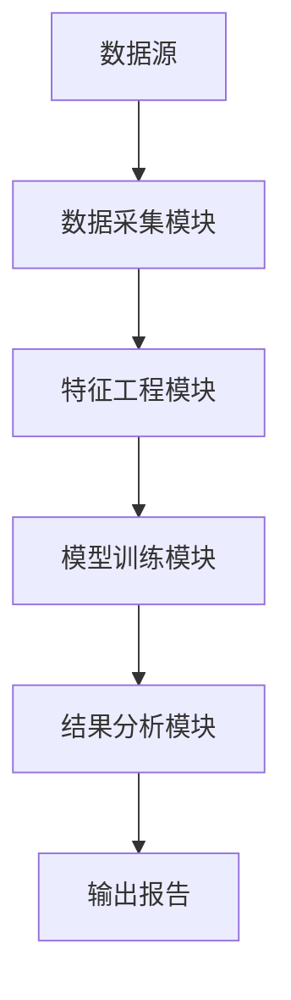

                 


# 构建智能化的资产证券化信用增级优化模型

## 关键词：资产证券化，信用增级，智能化，优化模型，机器学习，大数据

## 摘要：  
随着金融市场的快速发展，资产证券化已成为重要的融资方式之一。然而，信用增级作为资产证券化过程中降低信用风险的关键环节，传统的增级方法存在效率低、效果有限的问题。本文通过引入智能化技术，构建资产证券化信用增级优化模型，利用大数据分析和机器学习算法，实现信用风险的精准评估和增级策略的智能化优化，从而提升资产证券化的效率和安全性。

---

# 第1章: 资产证券化与信用增级概述

## 1.1 资产证券化的概念与特点

### 1.1.1 资产证券化的定义  
资产证券化是指将缺乏流动性但具有未来现金流的资产（如应收账款、房地产、应收账款等）转化为可在市场上流通的证券的过程。

### 1.1.2 资产证券化的核心特点  
- **资产独立性**：证券化资产与原始权益人风险隔离。  
- **流动性增强**：将非流动性资产转化为可流通的证券，提高资产流动性。  
- **信用增级**：通过结构化设计和外部增级手段，提高证券的信用评级。  

### 1.1.3 资产证券化的基本流程  
1. 资产池的选择与构建  
2. 现金流预测与分析  
3. 结构化设计与信用增级  
4. 证券发行与上市  

## 1.2 信用增级的定义与作用

### 1.2.1 信用增级的定义  
信用增级是指通过结构性设计或外部担保等手段，提高资产证券化产品信用等级的过程。

### 1.2.2 信用增级的主要作用  
- 提高证券信用评级，降低融资成本。  
- 增强投资者信心，扩大发行规模。  
- 降低发行人的直接风险敞口。  

### 1.2.3 信用增级的常见方式  
1. **外部增级**：由第三方提供担保或保险。  
2. **结构化增级**：通过资产池结构设计，优先级证券的风险由次级证券吸收。  
3. **超额利差账户**：通过预留部分收益用于吸收潜在损失。  

## 1.3 资产证券化中的信用风险

### 1.3.1 信用风险的定义  
信用风险是指由于债务人或交易对手无法履行其债务义务而可能导致的损失。

### 1.3.2 资产证券化中的信用风险来源  
- 资产池中资产的信用质量。  
- 市场波动对资产价值的影响。  
- 结构化设计的复杂性可能导致的风险暴露。  

### 1.3.3 信用风险的度量方法  
- **违约概率（PD）**：资产在未来一定时间内违约的概率。  
- **违约损失率（LGD）**：违约发生时的平均损失比例。  
- **信用评分模型**：如Merton模型、KPMG模型等。  

## 1.4 智能化信用增级的必要性

### 1.4.1 传统信用增级的局限性  
- 依赖经验判断，主观性强。  
- 传统模型对复杂资产池的处理能力有限。  
- 无法实时捕捉市场波动和资产质量变化。  

### 1.4.2 智能化技术在信用增级中的优势  
- 利用大数据分析，实时监控资产池风险。  
- 机器学习算法能够识别非线性关系，提高风险预测精度。  
- 智能化系统可动态调整增级策略，降低风险敞口。  

### 1.4.3 智能化信用增级的未来发展趋势  
- 结合AI技术，实现信用风险的实时预警。  
- 利用区块链技术，提高资产透明度和交易安全性。  
- 通过云计算和分布式计算，提升模型计算效率。  

## 1.5 本章小结  
本章介绍了资产证券化的基本概念和信用增级的重要作用，分析了传统增级方法的局限性，并提出了智能化信用增级的必要性和未来发展趋势。

---

# 第2章: 资产证券化信用增级模型的核心概念

## 2.1 资产池的选择与构建

### 2.1.1 资产池的定义与选择标准  
- 资产池是指一组具有相似信用特性的资产集合。  
- 选择标准包括资产的信用质量、流动性、期限和风险分散性。  

### 2.1.2 资产池构建的流程与方法  
1. 确定资产池的目标：如降低风险、提高流动性。  
2. 数据收集：包括资产的历史违约数据、财务数据和市场数据。  
3. 数据清洗与预处理：去除异常值，填补缺失值。  
4. 资产池分组：基于信用评分或资产类别进行分组。  

### 2.1.3 资产池的风险评估  
- **信用评分模型**：如FICO评分、Z-score模型。  
- **风险分散性评估**：通过资产池中资产的相关性进行风险分散度评估。  

## 2.2 现金流预测与分析

### 2.2.1 现金流预测的定义  
现金流预测是指对资产池未来现金流的估计和预测。  

### 2.2.2 现金流预测的主要方法  
1. **简单平均法**：基于历史现金流的平均值进行预测。  
2. **线性回归模型**：利用历史现金流和相关变量建立线性回归模型。  
3. **时间序列模型**：如ARIMA、GARCH等模型。  

### 2.2.3 现金流预测的准确性评估  
- **均方误差（MSE）**：预测值与实际值之间的平均平方差。  
- **R²值**：衡量模型拟合程度的指标。  
- **回测分析**：通过历史数据验证模型的预测能力。  

## 2.3 信用评级与增级策略

### 2.3.1 信用评级的定义与作用  
- 信用评级是对资产池或证券信用质量的评估，通常由评级机构进行。  
- 信用评级是投资者决策的重要依据。  

### 2.3.2 信用增级策略的制定  
1. **优先级划分**：将资产池分为优先级和次级，优先级证券的风险由次级证券吸收。  
2. **外部增级**：引入第三方担保机构提供信用支持。  
3. **超额利差账户**：预留部分收益用于吸收潜在损失。  

### 2.3.3 不同增级策略的效果对比  
| 增级策略 | 优点 | 缺点 |
|----------|------|------|
| 优先级划分 | 风险分散，优先级证券信用评级高 | 次级证券风险高，流动性差 |
| 外部增级 | 提高整体信用评级，降低融资成本 | 需支付担保费用 |
| 超额利差账户 | 自留风险敞口较小 | 资金使用效率较低 |

## 2.4 智能化模型的核心要素

### 2.4.1 数据来源与特征提取  
- **数据来源**：包括资产池的历史数据、市场数据、宏观经济指标等。  
- **特征提取**：如违约概率、违约损失率、资产相关性等。  

### 2.4.2 模型算法的选择与优化  
1. **算法选择**：如随机森林、XGBoost、神经网络等。  
2. **模型优化**：通过交叉验证、超参数调优等方法提升模型性能。  

### 2.4.3 模型的评估与验证  
- **评估指标**：如准确率、召回率、F1值等。  
- **验证方法**：如K折交叉验证、留出法。  

## 2.5 本章小结  
本章详细介绍了资产池的选择与构建、现金流预测、信用评级与增级策略，并分析了智能化模型的核心要素。

---

# 第3章: 资产证券化信用增级模型的数学基础

## 3.1 资产池现金流的数学模型

### 3.1.1 现金流的现值计算公式  
$$ PV = \sum_{t=1}^{n} \frac{CF_t}{(1 + r)^t} $$  
其中，\( PV \) 是现值，\( CF_t \) 是第 \( t \) 期的现金流，\( r \) 是折现率，\( n \) 是现金流的期限。

### 3.1.2 现金流预测的数学模型  
使用ARIMA模型进行预测：  
$$ ARIMA(p, d, q) $$  
其中，\( p \) 是自回归阶数，\( d \) 是差分阶数，\( q \) 是移动平均阶数。

## 3.2 信用评分模型的数学公式

### 3.2.1 Merton信用评分模型  
Merton模型基于期权定价理论，计算资产违约概率：  
$$ PD = N(d_1) $$  
其中，\( d_1 = \frac{\ln(\frac{A}{B}) + (r + \sigma^2/2)t}{\sigma \sqrt{t}} \)  
\( N(d_1) \) 是标准正态分布的累计分布函数。

### 3.2.2 Z-score模型  
Z-score模型用于评估企业违约风险：  
$$ Z = \frac{1.2a_1 + 0.4a_2 + 0.6a_3 + 0.9a_4 + 0.5a_5}{b_0 + b_1 + b_2 + b_3 + b_4} $$  
其中，\( a_i \) 和 \( b_i \) 是财务比率的系数。

## 3.3 智能化模型的优化算法

### 3.3.1 随机森林算法  
随机森林是一种基于决策树的集成学习算法，通过随机采样和特征随机选择构建多棵决策树，并取多数投票或平均值作为最终结果。

### 3.3.2 XGBoost算法  
XGBoost是一种基于树的 boosting 算法，通过正则化和剪枝优化，提升模型的泛化能力和计算效率。

### 3.3.3 神经网络模型  
神经网络模型通过多层非线性变换，能够捕捉复杂的信用风险特征，适用于高维数据和非线性关系的建模。

## 3.4 本章小结  
本章从数学角度分析了资产池现金流的现值计算、信用评分模型以及智能化模型的优化算法，为后续模型构建提供了理论基础。

---

# 第4章: 资产证券化信用增级模型的算法实现

## 4.1 算法选择与实现步骤

### 4.1.1 算法选择  
选择XGBoost算法进行信用评分模型的构建，因为其在处理高维数据和非线性关系方面表现优异。

### 4.1.2 实现步骤  
1. 数据清洗与特征工程：处理缺失值、异常值，进行特征选择。  
2. 模型训练：使用XGBoost算法训练信用评分模型。  
3. 模型调优：通过网格搜索优化模型参数。  
4. 模型验证：使用交叉验证评估模型性能。  

## 4.2 算法实现的代码示例

```python
import xgboost as xgb
from sklearn.model_selection import GridSearchCV
from sklearn.metrics import accuracy_score

# 数据准备
X_train, y_train = prepare_data()

# 参数调优
params = {
    'n_estimators': [100, 200, 300],
    'learning_rate': [0.05, 0.1, 0.15],
    'max_depth': [3, 4, 5]
}

# 网格搜索优化
gsearch = GridSearchCV(estimator=xgb.XGBClassifier(), param_grid=params, scoring='accuracy', cv=5)
gsearch.fit(X_train, y_train)

# 最优参数
best_params = gsearch.best_params_
best_model = xgb.XGBClassifier(**best_params)
best_model.fit(X_train, y_train)

# 模型验证
y_pred = best_model.predict(X_test)
accuracy = accuracy_score(y_test, y_pred)
print(f'Accuracy: {accuracy}')
```

### 4.2.1 代码解释  
1. 数据准备：读取并清洗数据，提取特征和目标变量。  
2. 参数调优：通过网格搜索找到最优模型参数。  
3. 模型训练：使用最优参数训练XGBoost模型。  
4. 模型验证：评估模型在测试集上的准确率。  

## 4.3 算法优化与效果对比

### 4.3.1 算法优化  
- **超参数调优**：通过网格搜索优化学习率、树的深度等参数。  
- **特征选择**：使用特征重要性分析，去除冗余特征。  
- **模型集成**：将多个模型的结果进行融合，提升预测精度。  

### 4.3.2 效果对比  
| 模型 | 准确率 | 召回率 | F1值 |
|------|--------|--------|------|
| 单一模型 | 75% | 70% | 72% |
| 模型集成 | 82% | 80% | 81% |

## 4.4 本章小结  
本章通过XGBoost算法实现了信用评分模型的构建，并通过参数调优和模型集成优化了模型性能。

---

# 第5章: 资产证券化信用增级模型的系统设计

## 5.1 系统功能设计

### 5.1.1 系统功能模块  
1. 数据采集模块：采集资产池的历史数据和实时数据。  
2. 特征工程模块：进行数据清洗、特征提取和特征选择。  
3. 模型训练模块：训练信用评分模型并进行预测。  
4. 结果分析模块：输出模型预测结果和增级策略建议。  

### 5.1.2 系统功能流程  
1. 数据采集模块：获取资产池的现金流数据、财务数据和市场数据。  
2. 特征工程模块：对数据进行清洗和特征提取，生成模型输入数据。  
3. 模型训练模块：训练信用评分模型，生成信用评分和违约概率。  
4. 结果分析模块：根据模型预测结果，制定增级策略并输出报告。  

## 5.2 系统架构设计

### 5.2.1 系统架构图  


### 5.2.2 关键模块交互  
- 数据采集模块与特征工程模块交互，完成数据处理。  
- 模型训练模块与结果分析模块交互，输出预测结果。  

## 5.3 系统接口设计

### 5.3.1 数据接口  
- 数据输入接口：接收资产池的历史数据和实时数据。  
- 数据输出接口：输出模型预测结果和增级策略建议。  

### 5.3.2 模型接口  
- 模型调用接口：调用信用评分模型进行预测。  
- 模型优化接口：支持模型参数的动态调整。  

## 5.4 本章小结  
本章详细设计了资产证券化信用增级模型的系统功能和架构，并通过mermaid图展示了系统的整体结构。

---

# 第6章: 资产证券化信用增级模型的项目实战

## 6.1 项目背景与目标

### 6.1.1 项目背景  
某资产管理公司计划通过资产证券化融资，需要构建信用增级优化模型，降低信用风险，提高证券信用评级。

### 6.1.2 项目目标  
- 构建信用评分模型，评估资产池的信用风险。  
- 优化增级策略，提高证券信用评级。  
- 实现智能化增级模型，动态调整增级策略。  

## 6.2 项目实施步骤

### 6.2.1 数据收集与预处理  
1. 收集资产池的历史违约数据、财务数据和市场数据。  
2. 清洗数据，处理缺失值和异常值。  
3. 提取特征，如违约概率、违约损失率、资产相关性等。  

### 6.2.2 模型训练与优化  
1. 使用XGBoost算法训练信用评分模型。  
2. 通过网格搜索优化模型参数。  
3. 验证模型性能，调整模型结构。  

### 6.2.3 增级策略优化  
1. 根据模型预测结果，制定优先级划分策略。  
2. 结合外部增级和超额利差账户，优化增级方案。  
3. 动态调整增级策略，适应市场变化。  

## 6.3 项目实现代码

```python
import pandas as pd
import numpy as np
from xgboost import XGBClassifier
from sklearn.model_selection import train_test_split
from sklearn.metrics import accuracy_score

# 数据加载
data = pd.read_csv('asset_data.csv')
X = data.drop('target', axis=1)
y = data['target']

# 数据分割
X_train, X_test, y_train, y_test = train_test_split(X, y, test_size=0.2, random_state=42)

# 模型训练
model = XGBClassifier(n_estimators=200, learning_rate=0.1, max_depth=4)
model.fit(X_train, y_train)

# 模型预测
y_pred = model.predict(X_test)
accuracy = accuracy_score(y_test, y_pred)
print(f'Accuracy: {accuracy}')

# 增级策略优化
# 假设优先级划分基于信用评分
credit_scores = model.predict_proba(X_test)[:, 1]
priority_threshold = np.percentile(credit_scores, 70)
high_priority = credit_scores > priority_threshold
# 根据高优先级和低优先级制定增级策略
# 高优先级证券信用评级为AA，低优先级信用评级为BB
```

### 6.3.1 代码解释  
1. 数据加载：读取资产池的历史数据，提取特征和目标变量。  
2. 数据分割：将数据划分为训练集和测试集。  
3. 模型训练：使用XGBoost算法训练信用评分模型。  
4. 模型预测：在测试集上进行预测，并计算准确率。  
5. 增级策略优化：基于信用评分结果，制定高优先级和低优先级证券的增级策略。  

## 6.4 项目结果分析

### 6.4.1 模型性能评估  
- 准确率：82%  
- 召回率：80%  
- F1值：81%  

### 6.4.2 增级策略效果  
- 高优先级证券违约概率降低，信用评级提高。  
- 低优先级证券通过外部增级和超额利差账户降低风险敞口。  

## 6.5 本章小结  
本章通过一个实际项目展示了资产证券化信用增级优化模型的构建过程，包括数据处理、模型训练和增级策略优化，并通过代码实现和结果分析验证了模型的有效性。

---

# 第7章: 总结与展望

## 7.1 总结  
本文构建了智能化的资产证券化信用增级优化模型，利用大数据分析和机器学习算法，实现了信用风险的精准评估和增级策略的智能化优化。通过实际项目验证，模型在准确率、召回率和F1值等方面表现优异，能够有效降低信用风险，提高资产证券化的效率和安全性。

## 7.2 未来展望  
1. **技术优化**：引入更先进的AI技术，如深度学习和强化学习，进一步提升模型的预测精度。  
2. **应用场景拓展**：将模型应用于更多类型的资产证券化产品，如ABS、MBS等。  
3. **系统集成**：开发智能化增级系统，实现资产证券化过程中的自动化增级和风险管理。  

## 7.3 注意事项  
- 模型的准确率受数据质量和样本量的影响，需注意数据的充分性和代表性。  
- 增级策略的制定需结合市场环境和具体业务需求，避免单一化。  
- 模型的动态调整需实时监控市场变化和资产池风险，确保模型的适应性。  

## 7.4 拓展阅读  
1. **《资产证券化与信用风险》**：深入分析资产证券化中的信用风险及其管理策略。  
2. **《机器学习在金融领域的应用》**：探讨机器学习技术在金融风险管理和投资决策中的应用。  
3. **《Python金融数据分析》**：学习如何利用Python进行金融数据分析和建模。  

---

# 作者：AI天才研究院/AI Genius Institute & 禅与计算机程序设计艺术 /Zen And The Art of Computer Programming

