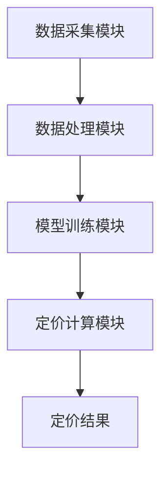
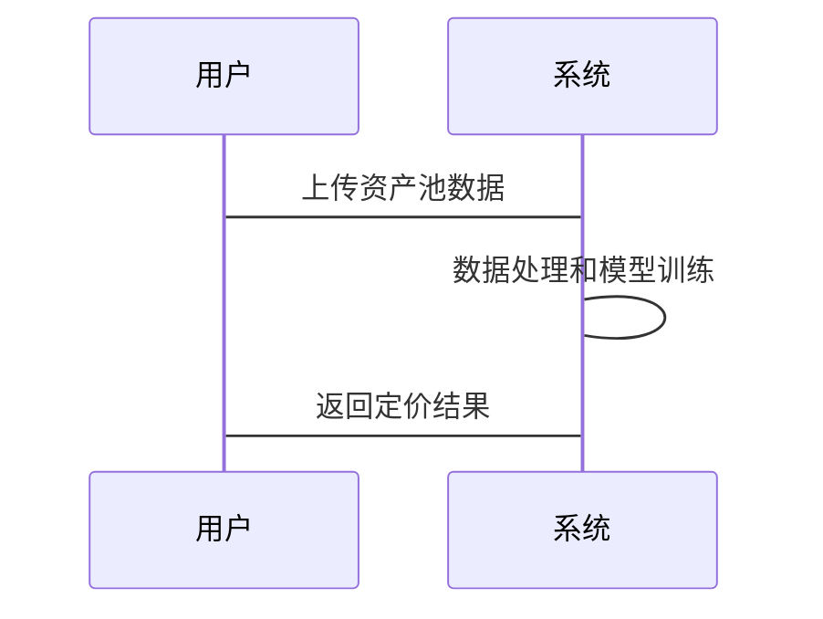

                 


# 构建智能化的资产证券化定价模型

> **关键词**: 资产证券化, 定价模型, 机器学习, 智能化, 金融建模, 算法原理

> **摘要**: 资产证券化定价模型是金融领域的重要工具，本文从背景、核心概念、算法原理、系统架构到实战项目，详细讲解如何构建智能化的资产证券化定价模型，涵盖现金流预测、信用评级、机器学习算法和系统设计等内容。

---

# 第1章: 资产证券化定价模型概述

## 1.1 资产证券化的概念与特点

### 1.1.1 资产证券化的定义
资产证券化是指将缺乏流动性但具有未来现金流的资产（如房地产、应收账款等）转化为可以在市场上流通的证券的过程。通过这一过程，投资者可以购买这些证券，获得相应的现金流收益。

### 1.1.2 资产证券化的核心特点
- **资产隔离**：证券化资产与原始发行人资产隔离，降低风险。
- **流动性增强**：将原本低流动性资产转化为高流动性的证券。
- **信用增级**：通过结构化设计提高证券的信用评级，降低投资者风险。

### 1.1.3 资产证券化与传统金融工具的区别
| 特性 | 资产证券化 | 传统债券 |
|------|------------|-----------|
| 信用风险 | 结构化设计降低风险 | 依赖发行人的信用 |
| 流动性 | 高流动性 | 低流动性 |
| 期限 | 多样化 | 固定期限 |

---

## 1.2 定价模型的基本原理

### 1.2.1 定价模型的定义
定价模型是通过数学公式和算法，估算资产证券化产品市场价格的工具。定价模型的核心是预测未来现金流，并折现到当前价值。

### 1.2.2 定价模型的核心要素
1. **现金流预测**：预测资产池未来的现金流。
2. **折现率**：根据市场利率和风险因素确定折现率。
3. **信用风险**：评估资产池的违约风险。

### 1.2.3 定价模型的应用场景
- 证券发行定价
- 投资者收益计算
- 风险管理与监控

---

## 1.3 资产证券化定价模型的必要性

### 1.3.1 资产证券化市场的需求
随着资产证券化市场规模的扩大，传统的定价方法难以满足复杂需求，智能化定价模型成为必然选择。

### 1.3.2 定价模型在资产证券化中的作用
- 提供准确的市场价格预测
- 优化资产池结构
- 降低市场风险

### 1.3.3 智能化定价模型的优势
- 高度自动化：减少人为干预，提高效率。
- 高精度：利用机器学习提升预测准确性。
- 实时更新：根据市场变化动态调整定价。

---

## 1.4 本章小结
本章介绍了资产证券化的基本概念、定价模型的原理及其必要性，为后续章节奠定了基础。

---

# 第2章: 资产证券化定价模型的核心要素

## 2.1 资产池的构成与特征

### 2.1.1 资产池的定义
资产池是资产证券化的基础，由一组相似的资产组成，如住房抵押贷款或应收账款。

### 2.1.2 资产池的分类
- **零售资产**：如个人贷款、信用卡应收账款。
- **机构资产**：如企业贷款、商业抵押贷款。

### 2.1.3 资产池的特征分析
- **分散性**：资产池中资产种类多样，降低整体风险。
- **期限**：资产池中资产的平均期限影响证券的期限结构。
- **信用质量**：资产池中资产的信用评级影响证券的信用风险。

---

## 2.2 定价模型的输入变量

### 2.2.1 资产池现金流预测
现金流预测是定价模型的核心输入，需考虑资产池的违约率和提前还款率。

### 2.2.2 资产池信用评级
信用评级反映了资产池的整体信用风险，影响证券的信用等级和市场利率。

### 2.2.3 市场因子
- **利率**：市场利率变化影响证券的折现率。
- **波动率**：市场波动性影响证券的价格波动。

---

## 2.3 定价模型的输出结果

### 2.3.1 资产证券化产品的定价
定价模型输出证券的市场价格，供发行人和投资者参考。

### 2.3.2 不同投资者的定价差异
不同投资者的风险偏好和资金成本不同，影响其对证券的定价。

### 2.3.3 定价模型的准确性评估
通过历史数据验证模型的预测准确性，调整模型参数以提高预测精度。

---

## 2.4 核心概念与联系的表格对比

| 概念 | 描述 | 关联性 |
|------|------|--------|
| 资产池 | 资产集合 | 输入定价模型的核心数据 |
| 现金流预测 | 预测未来现金流 | 定价模型的主要输入 |
| 信用评级 | 资产池的信用风险评估 | 影响定价的重要因素 |
| 市场因子 | 宏观经济因素 | 定价模型的外部变量 |

---

# 第3章: 现金流预测与信用评级

## 3.1 现金流预测的核心算法

### 3.1.1 线性回归模型
使用历史数据训练线性回归模型，预测未来的现金流。

### 3.1.2 支持向量机（SVM）
通过非线性模型提高预测精度。

### 3.1.3 随机森林
利用集成学习方法，提高预测的准确性和稳定性。

---

## 3.2 信用评级的机器学习方法

### 3.2.1 XGBoost算法
通过梯度提升树模型，评估资产池的信用风险。

### 3.2.2 神经网络
使用深度学习模型捕捉复杂的信用风险特征。

---

## 3.3 现金流预测与信用评级的结合

通过现金流预测和信用评级的结合，优化定价模型的准确性。

---

# 第4章: 系统架构与实现

## 4.1 系统架构设计

### 4.1.1 系统模块划分
- 数据采集模块：获取资产池数据和市场数据。
- 数据处理模块：清洗和预处理数据。
- 模型训练模块：训练现金流预测和信用评级模型。
- 定价计算模块：根据模型输出定价结果。

### 4.1.2 系统架构图（Mermaid）



---

## 4.2 接口设计与交互流程

### 4.2.1 API接口
- `/api/v1/assets`：上传资产池数据。
- `/api/v1/prices`：获取定价结果。

### 4.2.2 交互流程图（Mermaid）



---

# 第5章: 项目实战

## 5.1 环境配置

### 5.1.1 安装Python
```bash
python --version
pip install numpy pandas scikit-learn
```

### 5.1.2 安装Jupyter Notebook
```bash
pip install jupyter
jupyter notebook
```

---

## 5.2 核心代码实现

### 5.2.1 数据处理代码

```python
import pandas as pd
import numpy as np

# 读取数据
data = pd.read_csv('assets.csv')
# 数据清洗
data = data.dropna()
# 数据标准化
from sklearn.preprocessing import StandardScaler
scaler = StandardScaler()
scaled_data = scaler.fit_transform(data)
```

---

### 5.2.2 训练现金流预测模型

```python
from sklearn.linear_model import LinearRegression
model = LinearRegression()
model.fit(scaled_data, target)
```

---

## 5.3 实际案例分析

### 5.3.1 数据来源与分析
使用某资产池的历史数据，分析其现金流特征和信用风险。

### 5.3.2 模型训练与验证
通过交叉验证评估模型的准确性，调整参数优化预测效果。

---

## 5.4 项目小结

本章通过实际案例展示了如何从数据处理到模型训练，最终实现资产证券化定价模型。

---

# 第6章: 总结与展望

## 6.1 全文总结

本文详细讲解了资产证券化定价模型的构建过程，从背景介绍到系统实现，为读者提供了全面的知识体系。

---

## 6.2 未来展望

随着人工智能技术的发展，智能化定价模型将更加精准和高效，未来可能会引入更复杂的算法和大数据分析技术。

---

## 6.3 最佳实践 Tips

- 数据质量是模型准确性的关键。
- 定期更新模型参数，适应市场变化。
- 选择合适的算法，结合业务场景进行优化。

---

## 6.4 注意事项

- 风险模型需要定期校准和验证。
- 注意数据隐私和合规性问题。

---

## 6.5 拓展阅读

推荐阅读《金融风险管理》和《机器学习实战》等书籍，深入理解金融建模和机器学习技术。

---

# 作者

**作者：AI天才研究院 & 禅与计算机程序设计艺术**

---

通过以上章节的详细讲解，读者可以系统地掌握资产证券化定价模型的构建方法，从理论到实践，全面理解智能化定价模型的设计与实现。

