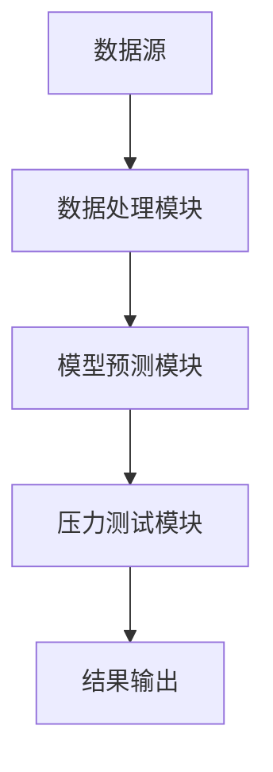

                 


# 构建智能化的资产证券化现金流压力测试模型

> **关键词**: 资产证券化, 现金流压力测试, 智能化模型, 算法原理, 系统架构

> **摘要**: 本文详细探讨了构建智能化资产证券化现金流压力测试模型的全过程，从模型背景、核心概念、算法原理到系统架构和项目实战，为读者提供了一套完整的解决方案。通过结合传统金融模型与现代人工智能技术，本文提出了一种创新的现金流预测和压力测试方法，能够有效评估资产证券化产品在不同压力情景下的现金流表现，为金融风险管理和投资决策提供有力支持。

---

## 第1章: 资产证券化与现金流压力测试概述

### 1.1 资产证券化的定义与特点
资产证券化是将一组特定资产的未来现金流转化为可在市场上交易的证券的过程。其核心特点包括：
- **资产独立性**: 资产池的现金流独立于发行人的其他资产。
- **结构化分层**: 通过分层技术将风险和收益分配给不同优先级的证券。
- **现金流预测**: 需要准确预测资产池的未来现金流。

### 1.2 现金流压力测试的定义与作用
现金流压力测试是评估资产池在极端市场条件或风险事件下的现金流表现的过程。其作用包括：
- **风险识别**: 发现潜在的现金流不足风险。
- **资本规划**: 为证券发行提供足够的流动性支持。
- **投资者保护**: 通过压力测试确保投资者利益。

### 1.3 资产证券化中的现金流管理
资产证券化中的现金流管理涉及现金流的预测、分配和风险控制。现金流预测是压力测试的基础，需考虑市场波动、违约风险等因素。

---

## 第2章: 资产证券化现金流压力测试模型的背景与问题分析

### 2.1 资产证券化中的现金流压力测试需求
随着金融市场的发展，资产证券化产品的复杂性增加，传统的现金流预测方法难以应对极端风险。智能化模型的需求日益迫切。

### 2.2 智能化现金流压力测试模型的核心问题
- **现金流预测的准确性**: 如何提高预测的精度。
- **动态性问题**: 如何应对市场环境的快速变化。
- **模型的可解释性**: 如何确保模型结果的透明性。

### 2.3 模型的边界与外延
- **边界条件**: 模型适用于特定类型的资产池。
- **外延应用**: 模型可扩展至其他金融产品。

---

## 第3章: 资产证券化现金流压力测试模型的核心概念

### 3.1 资产池的定义与特征
资产池是资产证券化的基础，其特征包括资产种类、规模、信用评级等。

### 3.2 现金流预测方法
- **传统方法**: 时间序列分析。
- **现代方法**: 机器学习模型（如XGBoost、LSTM）。

### 3.3 现金流风险因素
包括市场利率、违约率、提前还款率等。

---

## 第4章: 资产证券化现金流压力测试模型的算法原理

### 4.1 时间序列预测模型
使用ARIMA模型进行现金流预测，公式为：
$$ ARIMA(p, d, q) $$
其中，p为自回归阶数，d为差分阶数，q为移动平均阶数。

### 4.2 机器学习模型
使用LSTM进行预测，代码如下：

```python
import keras
from keras.layers import LSTM, Dense
model = keras.Sequential()
model.add(LSTM(64, input_shape=(timesteps, features)))
model.add(Dense(1))
model.compile(loss='mean_squared_error', optimizer='adam')
```

---

## 第5章: 系统分析与架构设计

### 5.1 问题场景介绍
系统需处理大规模数据，支持多情景压力测试。

### 5.2 系统功能设计
- 数据处理模块：清洗和预处理。
- 模型预测模块：现金流预测。
- 压力测试模块：模拟极端情景。

### 5.3 系统架构图



---

## 第6章: 项目实战

### 6.1 环境安装
安装Python、TensorFlow、Keras等工具。

### 6.2 核心代码实现
实现现金流预测的Python代码：

```python
import numpy as np
import pandas as pd
from sklearn.model_selection import train_test_split
from sklearn.metrics import mean_squared_error
from keras.models import Sequential
from keras.layers import LSTM, Dense

# 数据预处理
data = pd.read_csv('cash_flow.csv')
X = data.iloc[:, 1:-1].values
y = data.iloc[:, -1].values
X_train, X_test, y_train, y_test = train_test_split(X, y, test_size=0.2)

# 模型训练
model = Sequential()
model.add(LSTM(64, input_shape=(X_train.shape[1], 1)))
model.add(Dense(1))
model.compile(loss='mean_squared_error', optimizer='adam')
model.fit(X_train, y_train, epochs=100, batch_size=32)

# 模型预测
y_pred = model.predict(X_test)
print(mean_squared_error(y_test, y_pred))
```

---

## 第7章: 最佳实践与总结

### 7.1 最佳实践
- 数据清洗：确保数据质量。
- 模型调优：通过网格搜索优化参数。
- 结果验证：使用回测方法验证模型的有效性。

### 7.2 总结
本文详细介绍了构建智能化资产证券化现金流压力测试模型的过程，结合传统金融模型与现代人工智能技术，提出了一种创新的解决方案。该模型能够有效评估资产池的现金流风险，为金融投资决策提供支持。

---

**作者**: AI天才研究院/AI Genius Institute & 禅与计算机程序设计艺术 /Zen And The Art of Computer Programming

