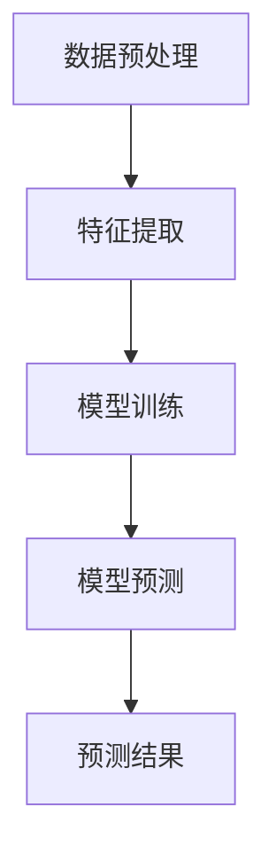
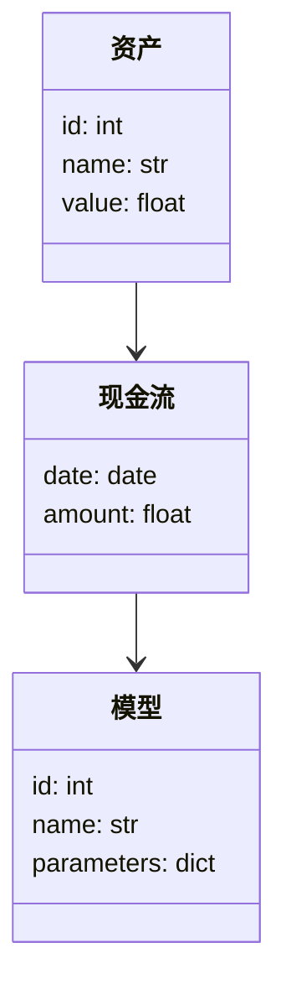
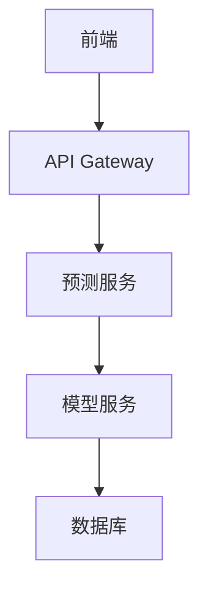
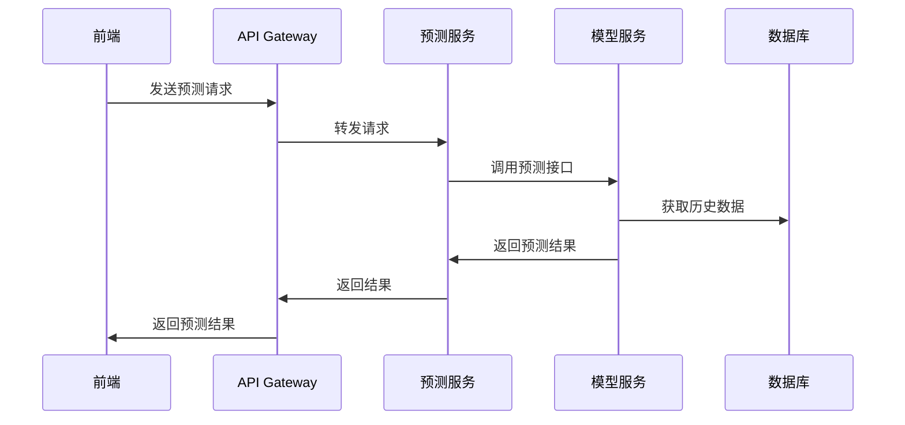

                 


# 构建智能化的资产证券化现金流预测模型

## 关键词：
- 资产证券化
- 现金流预测
- 智能化模型
- 机器学习
- 算法实现

## 摘要：
本文详细探讨了如何构建智能化的资产证券化现金流预测模型。通过分析资产证券化的核心概念、现金流预测的重要性以及智能化预测的必要性，文章介绍了模型的核心概念、算法原理、系统架构设计和项目实战。文章结合实际案例，详细阐述了模型的构建过程，包括数据预处理、特征提取、模型训练、系统架构设计以及接口设计，最后总结了项目经验与注意事项。

---

# 第三部分: 现金流预测模型的算法原理

## 第3章: 现金流预测模型的算法原理

### 3.1 算法选择与原理

#### 3.1.1 常见现金流预测算法
现金流预测常用的算法包括线性回归、随机森林和神经网络等。每种算法都有其优缺点，适用于不同的场景。

#### 3.1.2 算法的优缺点对比
| 算法         | 优点                               | 缺点                               |
|--------------|------------------------------------|------------------------------------|
| 线性回归     | 简单，易于解释，适合线性关系       | 非线性关系表现较差                 |
| 随机森林     | 非线性能力强，鲁棒性好             | 对特征工程依赖较高                 |
| 神经网络     | 能处理复杂非线性关系，适合时间序列 | 计算复杂，需要大量数据             |

#### 3.1.3 算法选择的原则
- 数据特征：线性关系选择线性回归，非线性关系选择随机森林或神经网络。
- 数据量：神经网络需要大量数据，小数据集选择随机森林。
- 计算资源：神经网络计算复杂，资源有限时选择线性回归或随机森林。

### 3.2 机器学习算法实现

#### 3.2.1 线性回归模型
线性回归模型是最简单的回归算法，假设特征与目标变量之间存在线性关系。

##### 模型公式
$$ y = \beta_0 + \beta_1 x_1 + \beta_2 x_2 + \dots + \beta_n x_n + \epsilon $$

##### 代码实现
```python
from sklearn.linear_model import LinearRegression

# 数据预处理
X = df[['特征1', '特征2', ...]]
y = df['目标变量']

# 模型训练
model = LinearRegression()
model.fit(X, y)

# 预测
y_pred = model.predict(X)
```

#### 3.2.2 随机森林模型
随机森林是一种基于决策树的集成学习算法，通过多棵树投票或平均来提高预测准确性。

##### 代码实现
```python
from sklearn.ensemble import RandomForestRegressor

# 数据预处理
X = df[['特征1', '特征2', ...]]
y = df['目标变量']

# 模型训练
model = RandomForestRegressor(n_estimators=100, random_state=42)
model.fit(X, y)

# 预测
y_pred = model.predict(X)
```

#### 3.2.3 神经网络模型
神经网络是一种模仿人脑结构的深度学习算法，适合处理复杂非线性关系。

##### 模型公式
$$ y = f(Wx + b) $$
其中，$f$ 是激活函数，$W$ 是权重矩阵，$b$ 是偏置。

##### 代码实现
```python
import tensorflow as tf
from tensorflow.keras import layers

# 数据预处理
X = df[['特征1', '特征2', ...]].values
y = df['目标变量'].values

# 模型构建
model = tf.keras.Sequential([
    layers.Dense(64, activation='relu'),
    layers.Dense(1)
])

# 编译模型
model.compile(optimizer='adam', loss='mean_squared_error')

# 训练
model.fit(X, y, epochs=100, batch_size=32)
```

### 3.3 算法流程图



### 3.4 算法实现注意事项
- **数据预处理**：特征工程对模型性能影响重大，需进行标准化、归一化处理。
- **超参数调优**：如随机森林的n_estimators，神经网络的 epochs 等。
- **模型评估**：使用均方误差（MSE）、平均绝对误差（MAE）等指标评估模型性能。

## 本章小结
本章详细讲解了现金流预测模型的算法选择与实现，重点介绍了线性回归、随机森林和神经网络三种算法的原理与代码实现，并通过流程图展示了算法的整体流程。通过对比不同算法的优缺点，帮助读者选择适合的模型。

---

# 第四部分: 系统分析与架构设计方案

## 第4章: 系统分析与架构设计方案

### 4.1 问题场景介绍

#### 4.1.1 问题描述
在资产证券化过程中，准确预测现金流对投资者和发行方至关重要。传统方法依赖历史数据和专家经验，难以捕捉复杂市场变化。

#### 4.1.2 问题解决
通过构建智能化模型，利用机器学习算法自动分析海量数据，提高预测精度和效率。

#### 4.1.3 边界与外延
- 输入：历史现金流数据、市场指标、资产特征。
- 输出：预测现金流、风险评估。
- 边界：仅考虑可量化的因素，不包括政策变化等不可预测因素。

### 4.2 系统功能设计

#### 4.2.1 领域模型类图


#### 4.2.2 系统架构设计

##### 系统架构图


##### 接口设计
- **API Gateway**: 提供REST接口，接收请求，路由到相应服务。
- **预测服务**: 负责接收请求，调用模型服务进行预测。
- **模型服务**: 承载机器学习模型，处理预测请求，返回结果。

#### 4.2.3 系统交互流程

##### 序列图


### 4.3 本章小结
本章从系统角度分析了现金流预测模型的构建，设计了系统的功能模块、架构和交互流程，为后续实现奠定了基础。

---

# 第五部分: 项目实战

## 第5章: 项目实战

### 5.1 环境安装

#### 5.1.1 安装依赖
```bash
pip install numpy pandas scikit-learn tensorflow seaborn
```

#### 5.1.2 数据获取
使用公开数据集或模拟数据，确保数据包含资产信息和历史现金流。

### 5.2 系统核心实现

#### 5.2.1 数据预处理代码
```python
import pandas as pd
import numpy as np

# 读取数据
data = pd.read_csv('现金流数据.csv')

# 数据清洗
data.dropna(inplace=True)
data = pd.get_dummies(data)
```

#### 5.2.2 特征提取代码
```python
from sklearn.preprocessing import StandardScaler

scaler = StandardScaler()
X = scaler.fit_transform(data.drop('目标变量', axis=1))
y = data['目标变量']
```

#### 5.2.3 模型训练与预测代码
```python
from sklearn.ensemble import RandomForestRegressor

model = RandomForestRegressor(n_estimators=100, random_state=42)
model.fit(X, y)
y_pred = model.predict(X)
```

#### 5.2.4 模型评估代码
```python
from sklearn.metrics import mean_squared_error, mean_absolute_error

mse = mean_squared_error(y, y_pred)
mae = mean_absolute_error(y, y_pred)
print(f'MSE: {mse}, MAE: {mae}')
```

### 5.3 实际案例分析

#### 5.3.1 数据可视化
使用Seaborn库绘制历史现金流分布图和预测结果对比图。

#### 5.3.2 模型优化
通过网格搜索调优随机森林模型参数，提升预测精度。

### 5.4 项目总结

#### 5.4.1 成功经验
- 数据预处理和特征工程对模型性能影响重大。
- 神经网络在处理时间序列数据时表现优异。

#### 5.4.2 不足之处
- 数据量不足时，模型泛化能力有限。
- 复杂模型计算资源消耗大。

### 5.5 本章小结
本章通过实际项目案例，详细展示了现金流预测模型的构建过程，包括数据预处理、特征提取、模型训练、评估与优化。

---

# 第六部分: 总结与扩展

## 第6章: 总结与扩展

### 6.1 总结

#### 6.1.1 全书内容回顾
本文从资产证券化的背景出发，详细讲解了现金流预测模型的构建过程，包括算法选择、系统架构设计和项目实战。

#### 6.1.2 最佳实践 tips
- 数据预处理是关键，特征工程提升模型性能。
- 算法选择要考虑数据特征和计算资源。
- 模型评估需结合业务场景，多指标验证。

### 6.2 小结

#### 6.2.1 项目经验总结
项目中需注意数据质量、模型选择和计算资源的合理分配。

#### 6.2.2 注意事项
- 数据泄露风险：防止敏感信息泄露。
- 模型过拟合：合理调整模型复杂度。
- 计算资源限制：选择适合的算法和硬件配置。

### 6.3 拓展阅读

#### 6.3.1 推荐书籍
- 《机器学习实战》
- 《深度学习》

#### 6.3.2 技术博客
- TensorFlow官方文档
- Keras官方文档

### 6.4 本章小结
本文总结了现金流预测模型的构建经验，并给出了后续学习和实践的方向。

---

# 作者信息

作者：AI天才研究院/AI Genius Institute & 禅与计算机程序设计艺术 /Zen And The Art of Computer Programming

---

# 结语
本文系统地介绍了智能化的资产证券化现金流预测模型的构建过程，从理论到实践，为读者提供了全面的指导。希望本文能为相关领域的从业者提供有价值的参考和启发。

