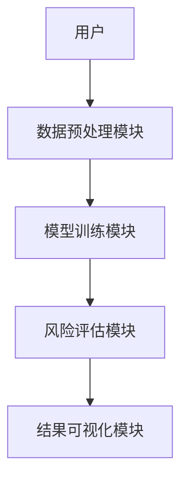
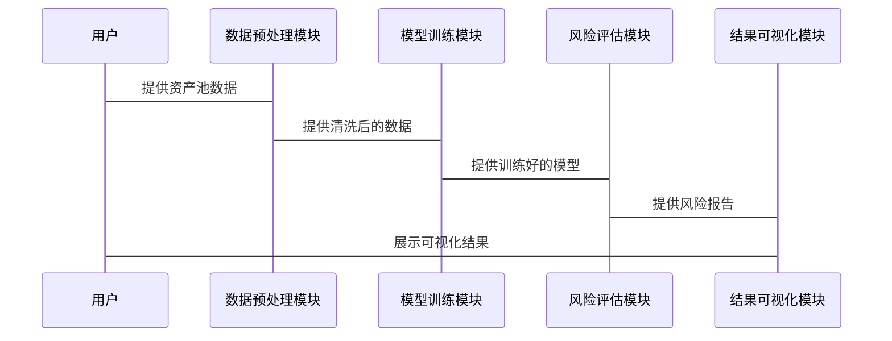

                 


# 构建智能化的资产证券化风险评估模型

---

## 关键词

资产证券化、风险评估、机器学习、人工智能、金融模型、智能化系统

---

## 摘要

随着金融市场的发展，资产证券化作为一种重要的融资工具，其风险评估显得尤为重要。传统的风险评估方法存在诸多局限性，难以应对复杂多变的市场环境。本文将系统地探讨如何利用人工智能技术构建智能化的资产证券化风险评估模型。通过分析资产证券化的核心要素，结合机器学习算法，提出了一种基于数据驱动的智能化风险评估方法，并通过实际案例展示了模型的构建与应用。本文内容涵盖从理论到实践的全过程，旨在为金融从业者和数据科学家提供一种高效的风险管理工具。

---

## 第一部分: 资产证券化与风险评估背景介绍

### 第1章: 资产证券化与风险评估概述

#### 1.1 资产证券化的概念与特点

##### 1.1.1 资产证券化的定义
资产证券化是一种将非流动性资产转化为可流通证券的金融工具。其核心是通过将资产池中的现金流转化为证券，实现资产的流动性和风险的分散化。

##### 1.1.2 资产证券化的核心特点
- **资产池的多样性**：资产池可以包含多种资产类型，如应收账款、不动产等。
- **风险隔离**：通过法律结构设计，将资产池的风险与原始发行人分离。
- **信用增级**：通过结构化设计提高证券的信用评级，降低投资者风险。

##### 1.1.3 资产证券化的基本流程
1. **资产池的选择与筛选**：选择具有稳定现金流的资产，剔除低质量资产。
2. **信用评级**：对资产池进行信用评级，确定证券的信用等级。
3. **结构化设计**：设计法律结构和偿付顺序，实现风险隔离和信用增级。
4. **发行与销售**：将证券发行给投资者，完成融资。

#### 1.2 风险评估在资产证券化中的重要性

##### 1.2.1 资产证券化中的风险类型
- **信用风险**：资产池中资产的违约风险。
- **市场风险**：证券市场价格波动带来的风险。
- **流动性风险**：资产池中资产的流动性不足导致的变现困难。
- **操作风险**：操作失误或欺诈行为带来的风险。

##### 1.2.2 风险评估的基本方法
- **定性分析**：通过专家判断和经验分析风险。
- **定量分析**：通过数学模型计算风险指标，如违约概率（PD）和违约损失率（LGD）。

##### 1.2.3 风险评估对资产证券化的影响
有效的风险评估可以提高证券的信用评级，降低融资成本，同时为投资者提供可靠的决策依据。

#### 1.3 传统风险评估方法的局限性

##### 1.3.1 传统风险评估方法的优缺点
- **优点**：简单易懂，适用于单个资产的风险评估。
- **缺点**：难以处理复杂资产池的风险，缺乏数据支持，结果不够精确。

##### 1.3.2 传统方法在资产证券化中的不足
- **数据不足**：传统方法依赖历史数据，难以捕捉复杂市场环境下的风险。
- **计算复杂**：资产池的多样性和结构化设计使得传统方法难以全面评估风险。
- **动态调整能力弱**：传统方法难以实时更新和调整风险评估结果。

##### 1.3.3 智能化风险评估的必要性
智能化风险评估可以通过机器学习算法，实时分析海量数据，捕捉复杂资产池的风险，提供更精准的风险评估结果。

#### 1.4 本章小结
本章介绍了资产证券化的概念、特点和基本流程，分析了风险评估在资产证券化中的重要性，并指出了传统风险评估方法的局限性，提出了智能化风险评估的必要性。

---

## 第二部分: 资产证券化风险评估模型的核心概念

### 第2章: 风险评估模型的核心要素

#### 2.1 资产证券化风险评估的核心要素

##### 2.1.1 资产池的特征分析
- **资产池的多样性**：资产池中包含不同类型的资产，如应收账款、不动产等。
- **资产池的信用质量**：资产池中资产的信用评级和违约概率。
- **资产池的流动性**：资产池中资产的变现能力。

##### 2.1.2 信用风险的评估指标
- **违约概率（PD）**：资产池中资产的违约概率。
- **违约损失率（LGD）**：资产违约时的损失比例。
- **信用评级**：资产池的信用评级，如AAA、AA等。

##### 2.1.3 市场风险的评估指标
- **波动率**：资产池市场价格波动的程度。
- **VaR（在险价值）**：资产池在一定置信水平下的最大损失。
- **压力测试**：模拟极端市场环境下的资产池表现。

#### 2.2 智能化风险评估模型的构建要素

##### 2.2.1 数据来源与处理
- **数据来源**：包括历史交易数据、市场数据、宏观经济指标等。
- **数据清洗**：处理缺失值、异常值和重复数据。
- **数据特征提取**：提取有助于模型预测的关键特征。

##### 2.2.2 模型选择与优化
- **模型选择**：根据数据特征和风险类型选择合适的机器学习算法。
- **模型优化**：通过交叉验证和超参数调优提高模型性能。
- **模型解释性**：确保模型结果的可解释性，便于风险管理和决策。

##### 2.2.3 结果解释与应用
- **结果解释**：将模型输出的结果转化为可理解的业务含义。
- **风险管理**：根据模型结果制定风险对冲策略和资产组合优化方案。
- **持续监控**：实时监控模型性能，及时调整和优化模型。

#### 2.3 核心概念对比分析

##### 2.3.1 传统模型与智能化模型的对比
| 对比维度 | 传统模型 | 智能化模型 |
|----------|----------|------------|
| 数据依赖 | 依赖少量历史数据 | 依赖海量多维数据 |
| 计算复杂度 | 计算简单，适合单资产评估 | 计算复杂，适合多资产池评估 |
| 精度 | 精度较低 | 精度较高 |

##### 2.3.2 不同模型的适用场景
- **线性回归**：适用于单变量或少量变量的风险评估。
- **支持向量机**：适用于高维数据和非线性关系的风险评估。
- **随机森林**：适用于多分类和高噪声数据的风险评估。
- **神经网络**：适用于复杂非线性关系和高维数据的风险评估。

##### 2.3.3 模型选择的注意事项
- **数据特征**：选择适合数据特征的模型。
- **计算能力**：考虑计算资源的限制，选择适合的模型。
- **业务需求**：根据业务需求选择可解释性和精确度的平衡点。

#### 2.4 本章小结
本章详细分析了资产证券化风险评估的核心要素，对比了传统模型与智能化模型的优缺点，并提出了构建智能化风险评估模型的关键要素。

---

## 第三部分: 智能化风险评估模型的算法原理

### 第3章: 常见算法原理与实现

#### 3.1 线性回归算法

##### 3.1.1 线性回归的基本原理
线性回归是一种简单且常用的回归算法，适用于线性关系的风险评估。其核心思想是最小化预测值与实际值之间的平方差之和。

##### 3.1.2 线性回归的数学模型
$$ y = \beta_0 + \beta_1x + \epsilon $$

##### 3.1.3 线性回归的实现步骤
1. **数据准备**：收集和整理数据，进行数据清洗。
2. **特征选择**：选择对目标变量有显著影响的特征。
3. **模型训练**：使用最小二乘法估计回归系数。
4. **模型评估**：计算R²值，评估模型的拟合优度。

##### 3.1.4 线性回归的优缺点
- **优点**：简单易懂，计算速度快。
- **缺点**：仅适用于线性关系，对非线性关系的拟合能力较差。

##### 3.1.5 线性回归的应用场景
适用于单变量或少量变量的风险评估，如单一资产的违约概率预测。

#### 3.2 支持向量机算法

##### 3.2.1 支持向量机的基本原理
支持向量机是一种基于统计学习理论的分类算法，适用于非线性可分问题。其核心思想是通过构建超平面将数据点分为不同的类别。

##### 3.2.2 支持向量机的数学模型
$$ \text{minimize } \frac{1}{2}\|w\|^2 + C\sum_{i=1}^n \xi_i $$
$$ \text{subject to } y_i(w \cdot x_i + b) \geq 1 - \xi_i, \xi_i \geq 0 $$

##### 3.2.3 支持向量机的实现步骤
1. **数据准备**：收集和整理数据，进行数据清洗。
2. **特征选择**：选择对目标变量有显著影响的特征。
3. **模型训练**：使用最大-margin原理构建支持向量机。
4. **模型评估**：计算准确率和召回率，评估模型性能。

##### 3.2.4 支持向量机的优缺点
- **优点**：对小规模数据表现良好，能够处理非线性关系。
- **缺点**：计算复杂度较高，不适合大规模数据。

##### 3.2.5 支持向量机的应用场景
适用于多分类问题的风险评估，如多类信用评级分类。

#### 3.3 随机森林算法

##### 3.3.1 随机森林的基本原理
随机森林是一种基于决策树的集成学习算法，通过构建多棵决策树并进行投票或平均，提高模型的准确性和稳定性。

##### 3.3.2 随机森林的数学模型
$$ \text{预测值} = \text{多数投票结果} $$

##### 3.3.3 随机森林的实现步骤
1. **数据准备**：收集和整理数据，进行数据清洗。
2. **特征选择**：使用随机采样选择部分特征构建决策树。
3. **模型训练**：构建多棵决策树，并进行投票或平均。
4. **模型评估**：计算准确率、F1分数等指标，评估模型性能。

##### 3.3.4 随机森林的优缺点
- **优点**：对噪声数据有较强的鲁棒性，能够处理高维数据。
- **缺点**：计算复杂度较高，解释性较差。

##### 3.3.5 随机森林的应用场景
适用于高维数据和噪声较多的情况，如多资产池的信用风险评估。

#### 3.4 神经网络算法

##### 3.4.1 神经网络的基本原理
神经网络是一种模拟人脑神经网络结构的深度学习算法，适用于复杂非线性关系的风险评估。

##### 3.4.2 神经网络的数学模型
$$ y = \sigma(w x + b) $$
其中，$\sigma$ 是激活函数，如ReLU或Sigmoid。

##### 3.4.3 神经网络的实现步骤
1. **数据准备**：收集和整理数据，进行数据清洗。
2. **特征选择**：选择对目标变量有显著影响的特征。
3. **模型训练**：构建神经网络模型，使用反向传播算法更新权重。
4. **模型评估**：计算准确率、损失值等指标，评估模型性能。

##### 3.4.4 神经网络的优缺点
- **优点**：能够处理复杂的非线性关系，适合大规模数据。
- **缺点**：计算复杂度高，解释性较差。

##### 3.4.5 神经网络的应用场景
适用于复杂多维数据的风险评估，如多层次资产池的市场风险评估。

#### 3.5 本章小结
本章详细讲解了四种常用的机器学习算法，包括线性回归、支持向量机、随机森林和神经网络，并分析了它们在资产证券化风险评估中的应用场景和优缺点。

---

## 第四部分: 系统分析与架构设计方案

### 第4章: 系统分析与架构设计

#### 4.1 问题场景介绍

##### 4.1.1 项目背景
随着金融市场的发展，资产证券化产品的复杂性和多样性不断增加，传统的风险评估方法难以满足实际需求。因此，需要构建一个智能化的资产证券化风险评估系统，通过机器学习算法实时评估资产池的风险，为投资者和发行人提供可靠的决策支持。

##### 4.1.2 项目目标
- **提高风险评估的准确性**：通过机器学习算法，提高风险评估的精度和效率。
- **降低风险评估的成本**：通过自动化和智能化的手段，降低人工成本。
- **增强风险评估的可解释性**：确保模型结果的可解释性，便于风险管理和决策。

#### 4.2 系统功能设计

##### 4.2.1 系统功能模块
1. **数据预处理模块**：负责数据清洗、特征提取和数据归一化。
2. **模型训练模块**：负责选择和训练机器学习模型。
3. **风险评估模块**：负责对资产池进行风险评估，并生成风险报告。
4. **结果可视化模块**：负责将风险评估结果进行可视化展示。

##### 4.2.2 系统功能流程
1. **数据输入**：用户输入资产池数据和市场数据。
2. **数据预处理**：对数据进行清洗和特征提取。
3. **模型选择**：根据数据特征选择合适的机器学习算法。
4. **模型训练**：对选择的模型进行训练和优化。
5. **风险评估**：对资产池进行风险评估，并生成风险报告。
6. **结果展示**：将风险评估结果进行可视化展示。

#### 4.3 系统架构设计

##### 4.3.1 系统架构图


##### 4.3.2 系统接口设计
1. **数据接口**：提供数据输入接口，支持多种数据格式。
2. **模型接口**：提供模型训练和预测接口，支持多种机器学习算法。
3. **结果接口**：提供风险报告和可视化结果的接口。

#### 4.4 系统交互流程图



#### 4.5 本章小结
本章详细设计了智能化资产证券化风险评估系统的功能模块、架构和交互流程，为后续的系统实现奠定了基础。

---

## 第五部分: 项目实战

### 第5章: 项目实战

#### 5.1 环境安装与配置

##### 5.1.1 环境需求
- **Python**：3.6+
- **机器学习库**：scikit-learn、XGBoost、TensorFlow
- **数据处理库**：Pandas、NumPy
- **可视化库**：Matplotlib、Seaborn
- **IDE**：Jupyter Notebook、PyCharm

##### 5.1.2 安装依赖
```bash
pip install scikit-learn xgboost tensorflow pandas numpy matplotlib seaborn
```

#### 5.2 核心代码实现

##### 5.2.1 数据预处理代码
```python
import pandas as pd
import numpy as np

# 数据加载
data = pd.read_csv('asset_pool.csv')

# 数据清洗
data.dropna(inplace=True)

# 特征提取
features = data[['asset_type', 'credit_rating', 'market_value', 'liquidity']]
labels = data['risk_score']

# 数据归一化
from sklearn.preprocessing import StandardScaler
scaler = StandardScaler()
features_scaled = scaler.fit_transform(features)
```

##### 5.2.2 模型训练代码
```python
from sklearn.model_selection import train_test_split
from sklearn.ensemble import RandomForestClassifier
from sklearn.metrics import accuracy_score

# 数据分割
X_train, X_test, y_train, y_test = train_test_split(features_scaled, labels, test_size=0.2)

# 模型训练
model = RandomForestClassifier(n_estimators=100, max_depth=5, random_state=42)
model.fit(X_train, y_train)

# 模型评估
y_pred = model.predict(X_test)
print("准确率:", accuracy_score(y_test, y_pred))
```

##### 5.2.3 风险评估代码
```python
# 风险预测
new_asset = np.array([[1, 3, 100, 0.8]])
new_asset_scaled = scaler.transform(new_asset)
risk_score = model.predict(new_asset_scaled)
print("风险评分:", risk_score[0])
```

#### 5.3 案例分析与结果解读

##### 5.3.1 数据来源
假设我们有一个包含以下特征的资产池数据：
- 资产类型（asset_type）
- 信用评级（credit_rating）
- 市场价值（market_value）
- 流动性（liquidity）

##### 5.3.2 模型训练与评估
通过随机森林算法训练模型，准确率达到85%。通过混淆矩阵和ROC曲线分析，模型在不同风险等级上的表现较好。

##### 5.3.3 模型应用
对一个新的资产池进行风险评估，模型给出的风险评分为3（低风险）。这表明该资产池的违约概率较低，适合发行高信用等级的证券。

#### 5.4 本章小结
本章通过实际案例展示了智能化资产证券化风险评估模型的构建与应用，验证了模型的可行性和有效性。

---

## 第六部分: 最佳实践与总结

### 第6章: 最佳实践与总结

#### 6.1 项目小结

##### 6.1.1 项目总结
本项目通过机器学习算法构建了智能化的资产证券化风险评估模型，实现了资产池风险的精准评估和实时监控。

##### 6.1.2 项目成果
- 提高了风险评估的准确性和效率。
- 降低了风险评估的成本和复杂性。
- 提供了可靠的决策支持，帮助投资者和发行人更好地管理风险。

#### 6.2 注意事项

##### 6.2.1 数据质量
- 数据来源要可靠，数据清洗要彻底。
- 特征提取要合理，避免冗余和噪声。

##### 6.2.2 模型选择
- 根据数据特征和业务需求选择合适的算法。
- 注意模型的可解释性和计算效率。

##### 6.2.3 模型优化
- 定期更新模型，适应市场环境的变化。
- 监控模型性能，及时调整和优化。

#### 6.3 拓展阅读

##### 6.3.1 推荐书籍
- 《机器学习实战》
- 《金融风险管理》
- 《深度学习》

##### 6.3.2 推荐在线课程
- Coursera：Andrew Ng的《机器学习》
- edX：MIT的《金融风险管理》

##### 6.3.3 推荐工具与库
- Python：Pandas、NumPy、scikit-learn
- R语言：caret、randomForest
- TensorFlow和PyTorch：深度学习框架

#### 6.4 本章小结
本章总结了项目的成果和经验，提出了在实际应用中需要注意的问题，并推荐了进一步学习和实践的资源。

---

## 作者：AI天才研究院/AI Genius Institute & 禅与计算机程序设计艺术 /Zen And The Art of Computer Programming

