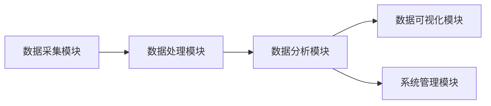
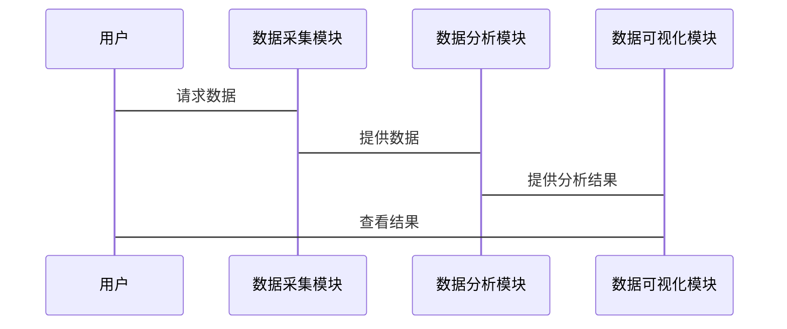

                 


# 构建智能化的资产负债管理系统

> **关键词**：智能化、资产负债管理、人工智能、大数据、机器学习、系统架构

> **摘要**：随着金融市场的日益复杂化，智能化的资产负债管理成为企业财务管理的重要方向。本文从智能化资产负债管理的背景出发，详细探讨了相关技术基础、核心算法、系统架构设计以及项目实战，结合实际案例分析，全面解析了构建智能化资产负债管理系统的各个方面。

---

# 第一章：智能化资产负债管理概述

## 1.1 资产负债管理的基本概念

### 1.1.1 资产负债管理的定义

资产负债管理是企业财务管理的重要组成部分，旨在通过优化资产和负债的结构与比例，实现企业价值最大化和风险最小化。传统的资产负债管理依赖人工分析和经验判断，而智能化资产负债管理则借助人工智能、大数据等技术，实现自动化、智能化的管理。

### 1.1.2 资产负债管理的核心要素

- **资产**：企业拥有的资源，包括现金、应收账款、存货、固定资产等。
- **负债**：企业欠款的债务，包括应付账款、短期借款、长期借款等。
- **所有者权益**：企业净资产的价值，等于资产减去负债。

### 1.1.3 智能化资产负债管理的必要性

随着市场的波动和经济环境的不确定性，传统的人工管理方式难以应对复杂多变的市场环境。智能化资产负债管理能够实时监控资产和负债的变化，预测风险，优化配置，从而提高企业的财务健康度。

---

## 1.2 智能化资产负债管理的背景与趋势

### 1.2.1 传统资产负债管理的局限性

- 数据量大、复杂性高，人工处理效率低。
- 风险预测能力有限，难以应对突发事件。
- 缺乏实时性，无法快速响应市场变化。

### 1.2.2 智能化技术在金融领域的应用

人工智能、大数据、云计算等技术的快速发展为资产负债管理的智能化提供了技术支持。例如，机器学习可以用于风险预测和资产配置，自然语言处理可以用于分析财务报告和市场信息。

### 1.2.3 行业趋势与未来发展

智能化资产负债管理将成为企业财务管理的主流趋势。未来，随着技术的进一步发展，智能化管理系统将更加精准、高效，能够实时优化资产和负债结构，降低风险，提高企业竞争力。

---

## 1.3 本章小结

本章从智能化资产负债管理的基本概念出发，分析了传统管理的局限性，探讨了智能化技术的应用背景，并展望了未来的发展趋势。接下来，我们将深入探讨智能化资产负债管理的核心技术。

---

# 第二章：智能化资产负债管理的技术基础

## 2.1 大数据技术在资产负债管理中的应用

### 2.1.1 数据采集与处理

智能化资产负债管理需要处理大量的财务数据和市场信息。数据采集可以通过API接口、数据库连接等方式实现，数据处理则包括清洗、转换和整合。

### 2.1.2 数据存储与管理

数据存储可以采用关系型数据库（如MySQL）或分布式数据库（如Hadoop）。大数据技术（如Hadoop、Spark）可以用于高效处理和存储海量数据。

### 2.1.3 数据分析与挖掘

通过大数据分析技术，可以提取资产和负债的关联性、趋势和风险点。例如，使用聚类分析发现资产和负债的潜在关联。

### 2.1.4 数据可视化

数据可视化工具（如Tableau、Power BI）可以帮助用户直观理解数据，发现潜在的财务问题。

---

## 2.2 人工智能技术在资产负债管理中的应用

### 2.2.1 机器学习算法

机器学习算法可以用于风险预测、资产配置优化等。例如，使用支持向量机（SVM）进行信用风险分类。

### 2.2.2 自然语言处理技术

自然语言处理（NLP）可以用于分析财务报告和新闻，提取市场信息，辅助决策。

### 2.2.3 深度学习技术

深度学习（如神经网络）可以用于复杂的模式识别，例如识别市场波动对资产和负债的影响。

---

## 2.3 本章小结

本章介绍了大数据和人工智能技术在智能化资产负债管理中的应用，强调了数据处理、分析和可视化的技术基础。接下来，我们将深入探讨智能化资产负债管理的算法原理。

---

# 第三章：智能化资产负债管理的算法原理

## 3.1 机器学习算法

### 3.1.1 线性回归

线性回归用于预测连续型变量，例如预测企业的负债增长率。数学模型如下：

$$ y = \beta_0 + \beta_1x + \epsilon $$

其中，$y$ 是目标变量，$x$ 是自变量，$\epsilon$ 是误差项。

### 3.1.2 支持向量机（SVM）

SVM用于分类问题，例如分类企业的财务状况是否健康。其核心思想是通过找到一个超平面，将数据点分为两类。

### 3.1.3 随机森林

随机森林是一种集成学习算法，用于分类和回归问题。它通过构建多个决策树，取其平均值或多数投票结果作为最终预测。

### 3.1.4 神经网络

神经网络是一种深度学习算法，用于复杂的模式识别。例如，可以用于识别市场波动对资产和负债的影响。

---

## 3.2 聚类算法

### 3.2.1 K-means算法

K-means算法用于将数据点分为K个簇。例如，可以用于将企业的财务指标分为几类，识别不同类型的资产或负债。

### 3.2.2 层次聚类

层次聚类是一种逐步合并或分割数据点的算法，用于发现数据中的层次结构。

### 3.2.3 DBSCAN算法

DBSCAN算法基于密度的聚类算法，能够发现任意形状的簇。

---

## 3.3 分类算法

### 3.3.1 K-近邻算法（KNN）

KNN算法用于分类问题，例如分类企业的信用风险等级。

### 3.3.2 决策树

决策树是一种基于特征的分类算法，例如用于分类企业的财务状况。

### 3.3.3 贝叶斯分类器

贝叶斯分类器基于概率论，例如用于预测企业的违约概率。

---

## 3.4 算法对比与选择

### 3.4.1 算法性能对比

- 线性回归适用于线性关系。
- SVM适用于小规模数据的分类。
- 随机森林适用于高维数据。
- 神经网络适用于复杂模式识别。

### 3.4.2 算法适用场景

选择算法时需要考虑数据量、数据类型、问题类型等因素。

---

## 3.5 本章小结

本章详细介绍了机器学习和聚类算法在智能化资产负债管理中的应用，并给出了算法选择的建议。接下来，我们将探讨智能化资产负债管理的系统架构设计。

---

# 第四章：智能化资产负债管理的系统架构设计

## 4.1 系统功能模块划分

### 4.1.1 数据采集模块

负责从数据库、API接口等来源采集财务数据。

### 4.1.2 数据处理模块

对采集的数据进行清洗、转换和整合。

### 4.1.3 数据分析模块

使用机器学习算法进行风险预测和资产配置优化。

### 4.1.4 数据可视化模块

将分析结果可视化，帮助用户理解数据。

### 4.1.5 系统管理模块

负责系统的配置、监控和维护。

---

## 4.2 系统架构设计

### 4.2.1 分层架构设计

将系统分为数据层、业务逻辑层和表现层，便于模块化开发和维护。

### 4.2.2 微服务架构设计

将系统功能分解为多个微服务，例如数据采集服务、数据分析服务等，提高系统的扩展性和灵活性。

### 4.2.3 高可用性设计

通过负载均衡、容灾备份等技术，确保系统的高可用性。

---

## 4.3 系统架构图



---

## 4.4 系统接口设计

### 4.4.1 数据接口

通过API接口与企业财务系统对接，获取实时数据。

### 4.4.2 用户接口

提供友好的用户界面，方便用户进行操作和查询。

---

## 4.5 系统交互设计



---

## 4.6 本章小结

本章详细介绍了智能化资产负债管理系统的功能模块、架构设计和系统接口设计。接下来，我们将通过一个实际案例来展示系统实现的过程。

---

# 第五章：智能化资产负债管理系统项目实战

## 5.1 项目背景

某企业希望通过智能化资产负债管理系统优化资产和负债结构，降低风险。

## 5.2 环境安装

### 5.2.1 安装Python

使用Anaconda安装Python 3.8及以上版本。

### 5.2.2 安装依赖库

安装numpy、pandas、scikit-learn、matplotlib等库。

## 5.3 核心代码实现

### 5.3.1 数据处理代码

```python
import pandas as pd

# 读取数据
data = pd.read_csv('financial_data.csv')

# 数据清洗
data.dropna(inplace=True)
data['ratio'] = data['资产'] / data['负债']
```

### 5.3.2 风险预测代码

```python
from sklearn.svm import SVC
from sklearn.model_selection import train_test_split

# 划分训练集和测试集
X = data[['资产', '负债']]
y = data['风险等级']
X_train, X_test, y_train, y_test = train_test_split(X, y, test_size=0.2)

# 训练模型
model = SVC()
model.fit(X_train, y_train)

# 预测
y_pred = model.predict(X_test)
```

### 5.3.3 数据可视化代码

```python
import matplotlib.pyplot as plt

plt.scatter(data['资产'], data['负债'], c=data['风险等级'])
plt.xlabel('资产')
plt.ylabel('负债')
plt.colorbar(label='风险等级')
plt.show()
```

## 5.4 项目小结

通过实际案例分析，展示了智能化资产负债管理系统的实现过程。接下来，我们将总结系统建设中的经验和教训，并给出优化建议。

---

# 第六章：智能化资产负债管理系统最佳实践

## 6.1 系统优化建议

### 6.1.1 数据实时性

建议使用实时数据源，确保系统的预测和分析基于最新的数据。

### 6.1.2 系统安全性

建议采用数据加密、访问控制等技术，确保系统的安全性。

## 6.2 小结

本章总结了系统建设中的经验和教训，并给出了优化建议。通过智能化资产负债管理系统的建设，企业可以实现财务管理和决策的智能化和高效化。

---

# 第七章：总结与展望

## 7.1 本文总结

本文从智能化资产负债管理的背景出发，详细探讨了相关技术基础、算法原理、系统架构设计以及项目实战。通过实际案例分析，展示了智能化资产负债管理系统的实现过程。

## 7.2 未来展望

未来，随着人工智能和大数据技术的进一步发展，智能化资产负债管理系统将更加智能化、自动化。例如，可以引入区块链技术进行数据溯源，或者利用边缘计算实现本地化的实时分析。

---

# 作者

**作者：AI天才研究院 & 禅与计算机程序设计艺术**

---

通过本文的详细讲解，读者可以全面了解智能化资产负债管理系统的构建过程和技术细节，为企业的财务管理提供新的思路和方法。

