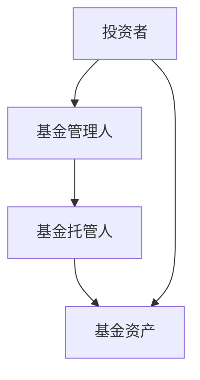
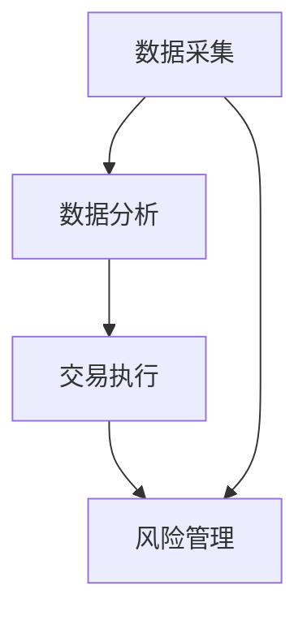

                 


# 查尔斯·布兰德的契约型封闭基金套利

> 关键词：契约型封闭基金，套利，金融市场，投资策略，风险管理

> 摘要：本文深入探讨了查尔斯·布兰德的契约型封闭基金套利策略，分析其核心概念、算法原理、系统架构及实际应用，帮助读者理解如何在金融市场中利用套利机会优化投资组合。

---

# 第一部分：契约型封闭基金套利的背景与核心概念

## 第1章：契约型封闭基金套利的背景介绍

### 1.1 问题背景

#### 1.1.1 金融市场的套利机会
金融市场中的价格差异为套利提供了基础。套利是指利用不同市场或资产之间的价格差异，以低买高卖的方式获利。这种策略在传统金融和现代金融中都扮演着重要角色。

#### 1.1.2 契约型封闭基金的特点
契约型封闭基金是一种通过契约形式组织的基金，基金份额在封闭期内不得赎回。其特点是资金运作灵活，适合长期投资，且基金份额固定，投资者无法中途赎回。

#### 1.1.3 套利在金融市场中的作用
套利在金融市场中起到价格发现和市场流动性的作用，同时有助于消除无风险套利机会，促进市场效率。

### 1.2 问题描述

#### 1.2.1 契约型封闭基金的定义
契约型封闭基金是通过契约形式设立，投资者通过购买基金份额参与投资，基金在封闭期内不得赎回，资金用于特定投资目标。

#### 1.2.2 套利的基本原理
套利者利用不同市场或资产的价格差异，在一个市场买入资产，同时在另一个市场卖出相同或类似的资产，从而获利。

#### 1.2.3 问题解决的必要性
契约型封闭基金的套利策略可以帮助投资者在封闭期内优化资产配置，同时利用市场价差获利，但需要考虑市场流动性、价格波动等风险。

### 1.3 问题解决

#### 1.3.1 套利的基本策略
套利策略包括跨市场套利、跨期套利、跨资产套利等，投资者需根据市场环境选择合适的策略。

#### 1.3.2 套利的实现路径
通过分析市场价差，设计套利模型，利用技术手段自动执行交易，同时控制风险。

#### 1.3.3 套利的风险控制
套利者需关注市场流动性、价格波动、交易成本等因素，制定风险管理策略。

### 1.4 边界与外延

#### 1.4.1 套利的边界条件
套利需在合法合规的范围内进行，避免操纵市场或违反金融监管规定。

#### 1.4.2 套利的外延应用
套利策略不仅适用于契约型封闭基金，还可应用于其他金融产品，如ETF、股票等。

#### 1.4.3 套利与其他金融工具的关系
套利是金融市场中的一种常见策略，与其他工具如对冲基金、指数基金等结合使用，可提升投资收益。

### 1.5 概念结构与核心要素

#### 1.5.1 核心概念的组成
契约型封闭基金套利涉及基金、市场价差、套利策略、交易执行等多个要素。

#### 1.5.2 核心要素的对比分析
- 基金类型：契约型封闭基金与其他基金类型（如开放型基金）的对比。
- 套利策略：跨市场套利与跨期套利的对比。

#### 1.5.3 概念结构的层次分解
从市场环境、基金结构、套利策略三个层次分析契约型封闭基金套利的实现机制。

---

## 第2章：契约型封闭基金套利的核心概念与联系

### 2.1 核心概念的原理

#### 2.1.1 套利的基本原理
套利者通过买入低价资产、卖出高价资产，利用价格差异获利，同时承担市场风险。

#### 2.1.2 契约型封闭基金的运作机制
基金通过契约形式设立，投资者购买基金份额，资金用于特定投资，封闭期内不得赎回。

#### 2.1.3 套利与基金运作的结合点
套利者利用契约型封闭基金的市场价格与 NAV（净资产价值）差异进行套利，需关注市场价差和流动性。

### 2.2 核心概念的属性特征对比

#### 2.2.1 不同套利策略的特征对比
- 跨市場套利：利用不同市場的价格差异。
- 跨期套利：利用同一资产在不同时间的价格差异。
- 跨资产套利：利用相关资产的价格差异。

#### 2.2.2 契约型封闭基金与开放基金的对比
- 契约型封闭基金：基金份额固定，封闭期内不得赎回。
- 开放基金：基金份额可随时赎回，流动性高。

#### 2.2.3 套利与投机的对比
套利基于价格差异，具有较低风险；投机基于价格变动，风险较高。

### 2.3 ER实体关系图



---

## 第3章：契约型封闭基金套利的算法原理

### 3.1 算法原理的数学模型

#### 3.1.1 套利定价模型（APT）

$$ E(r_i) = r_f + \beta_i (E(r_m) - r_f) $$

其中：
- \( E(r_i) \) 是资产 \( i \) 的预期收益。
- \( r_f \) 是无风险利率。
- \( \beta_i \) 是资产 \( i \) 的贝塔系数。
- \( E(r_m) \) 是市场预期收益。

#### 3.1.2 套利机会的识别
通过比较资产的市场价与 NAV，识别套利机会。当市场价格低于 NAV 时，买入基金；当市场价格高于 NAV 时，卖出基金。

### 3.2 算法实现

#### 3.2.1 套利策略的实现步骤
1. 数据采集：收集契约型封闭基金的市场价格和 NAV 数据。
2. 套利机会识别：计算价差，判断是否存在套利空间。
3. 交易执行：根据价差信号，执行买入或卖出交易。
4. 风险管理：控制交易风险，设定止损点。

#### 3.2.2 套利算法的代码实现

```python
import pandas as pd
import numpy as np

# 假设df是基金数据，包含'price'和'nav'列
df['spread'] = df['price'] - df['nav']
df['signal'] = np.where(df['spread'] > 0, 1, -1)
df['signal'] = np.where(df['spread'] < 0, -1, df['signal'])
```

---

## 第4章：契约型封闭基金套利的系统分析与架构设计方案

### 4.1 系统分析

#### 4.1.1 问题场景介绍
套利者需要实时监控契约型封闭基金的市场价格和 NAV，识别套利机会，并迅速执行交易。

#### 4.1.2 系统功能设计
- 数据采集模块：采集基金市场价和 NAV 数据。
- 数据分析模块：计算价差，识别套利机会。
- 交易执行模块：根据信号执行买卖交易。
- 风险管理模块：控制交易风险，设定止损点。

### 4.2 系统架构设计



---

## 第5章：契约型封闭基金套利的项目实战

### 5.1 项目实战环境安装

```bash
pip install pandas numpy matplotlib
```

### 5.2 核心代码实现

```python
import pandas as pd
import numpy as np

# 数据预处理
df = pd.read_csv('fund_data.csv')
df['spread'] = df['price'] - df['nav']

# 套利信号生成
df['signal'] = np.where(df['spread'] > 0.05, 1, 0)
df['signal'] = np.where(df['spread'] < -0.05, -1, df['signal'])

# 交易执行
positions = []
capital = 1000000
for i in range(len(df)):
    if df['signal'].iloc[i] == 1:
        # 买入
        shares = int(capital / df['price'].iloc[i])
        capital -= shares * df['price'].iloc[i]
        positions.append(shares)
    elif df['signal'].iloc[i] == -1:
        # 卖出
        shares_to_sell = positions[-1]
        capital += shares_to_sell * df['price'].iloc[i]
        positions.pop()
```

### 5.3 实际案例分析

假设某契约型封闭基金的市场价格为10元，NAV为10.1元，价差为-0.1元，套利者可卖出基金份额，预期市场价格回归至 NAV，从而获利。

---

## 第6章：契约型封闭基金套利的最佳实践与总结

### 6.1 最佳实践

#### 6.1.1 技术实现
- 确保数据采集的实时性和准确性。
- 优化算法模型，提升套利机会的识别能力。
- 加强风险管理，控制交易风险。

#### 6.1.2 风险管理
- 设置止损点，避免重大损失。
- 分散投资，降低风险集中度。

### 6.2 小结

通过本文的分析，读者可以理解查尔斯·布兰德的契约型封闭基金套利的实现机制，掌握套利策略的设计与实现方法，并能够在实际投资中灵活运用。

### 6.3 注意事项

- 套利者需遵守金融监管规定，避免操纵市场。
- 套利策略的有效性依赖于市场环境和数据质量。
- 需定期优化套利模型，适应市场变化。

### 6.4 拓展阅读

推荐阅读《金融市场的套利机会与风险控制》、《契约型基金的投资策略与风险管理》等书籍，深入理解套利在金融投资中的应用。

---

# 作者：AI天才研究院/AI Genius Institute & 禅与计算机程序设计艺术 /Zen And The Art of Computer Programming

