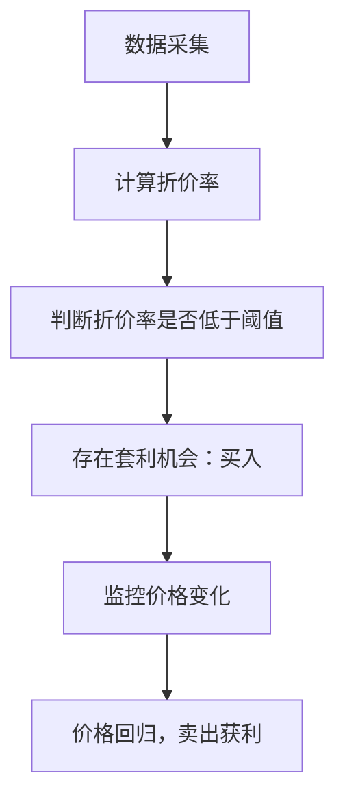
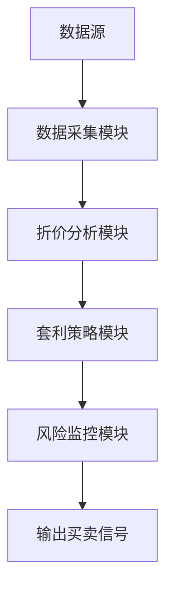

                 


# 查尔斯·布兰德的封闭基金折价套利技巧

> **关键词**：封闭基金，折价套利，数学模型，系统设计，Python代码

> **摘要**：本文详细探讨了查尔斯·布兰德提出的封闭基金折价套利技巧，从封闭基金的定义、折价现象的分析，到套利的算法原理、系统设计及项目实战，为读者提供全面的指导。文章结合理论与实践，帮助读者理解如何利用折价套利的机会，实现收益最大化。

---

## 第1章：封闭基金的定义与运作机制

### 1.1 封闭基金的定义与特点

封闭基金（Closed-end Fund）是一种在交易所上市交易的基金，其份额数量固定，投资者不能通过基金管理公司申购或赎回，只能在二级市场上买卖。与开放式基金不同，封闭基金的份额总数固定，因此其价格受市场供需关系的影响较大。

#### 特点对比表

| 特性          | 封闭基金                  | 开放式基金                |
|---------------|--------------------------|--------------------------|
| 份额固定性    | 是                      | 否                      |
| 交易方式      | 二级市场交易             | 直接申购/赎回            |
| 资产流动性    | 较低                    | 较高                    |

### 1.2 封闭基金的市场特点

封闭基金的价格受市场情绪、流动性等因素影响，常出现折价或溢价现象。折价是指基金的市场价格低于其净值，溢价则相反。折价现象为套利者提供了机会。

### 1.3 折价套利的背景与基本原理

折价套利的基本原理是通过买入折价的封闭基金，等待其价格回归至净值或溢价状态，从而获利。套利者需要关注折价率（Price-to-NAV ratio）的计算：

$$ \text{折价率} = \frac{\text{市场价格}}{\text{基金净值}} $$

当折价率低于1时，存在套利机会。

---

## 第2章：封闭基金的折价现象分析

### 2.1 折价产生的原因

折价的产生主要由以下因素引起：

1. **市场供需失衡**：投资者大量抛售导致价格低于净值。
2. **市场情绪影响**：投资者恐慌性抛售，导致价格下跌。
3. **流动性不足**：交易量小导致价格波动大。

### 2.2 折价与溢价的对比分析

| 特性      | 折价                  | 溢价                  |
|-----------|----------------------|----------------------|
| 价格      | 低于净值              | 高于净值              |
| 投资机会  | 套利机会              | 风险较高              |

### 2.3 折价套利的条件与策略

#### 折价套利的条件

1. 折价率低于一定阈值。
2. 市场流动性足够，便于买卖。
3. 市场波动较小，避免价格大幅波动。

#### 折价套利的策略选择

1. 长期持有策略：买入折价封闭基金，等待价格回归。
2. 短期套利策略：利用市场波动，快速买卖获利。

---

## 第3章：折价套利的算法原理

### 3.1 折价套利的算法流程

以下是折价套利的算法流程图：



### 3.2 折价套利的数学模型

#### 折价率计算公式

$$ \text{折价率} = \frac{\text{市场价格}}{\text{基金净值}} $$

当折价率 $< 0.95$ 时，存在套利机会。

#### 套利收益计算公式

假设买入价格为 $P_{\text{buy}}$，卖出价格为 $P_{\text{sell}}$，则套利收益为：

$$ \text{收益} = P_{\text{sell}} - P_{\text{buy}} $$

---

## 第4章：折价套利的系统分析与架构设计

### 4.1 系统功能模块划分

系统主要功能模块包括：

1. **数据采集模块**：采集封闭基金的市场价格和净值数据。
2. **折价分析模块**：计算折价率，判断套利机会。
3. **套利策略模块**：根据条件生成买卖信号。
4. **风险监控模块**：监控市场风险，调整策略。

### 4.2 系统架构设计

以下是系统架构图：



---

## 第5章：折价套利的项目实战

### 5.1 实战环境搭建

#### 环境要求

- Python 3.8+
- 数据分析库：pandas、numpy
- 绘图库：matplotlib

### 5.2 实战代码实现

以下是折价套利的Python代码示例：

```python
import pandas as pd
import numpy as np

# 数据采集模块
def fetch_data(ticker):
    # 模拟数据
    data = {
        'Date': ['2023-10-01', '2023-10-02', '2023-10-03'],
        'Price': [10.0, 10.5, 11.0],
        'NAV': [12.0, 12.5, 13.0]
    }
    return pd.DataFrame(data)

# 折价分析模块
def calculate_discount(ticker_data):
    discount = ticker_data['Price'] / ticker_data['NAV']
    return discount

# 套利策略模块
def generate_signals(discount, threshold=0.95):
    signals = []
    for d in discount:
        if d < threshold:
            signals.append('Buy')
        else:
            signals.append('Hold')
    return signals

# 风险监控模块
def monitor_risk(prices):
    volatility = prices.std()
    return volatility < 0.2

# 主函数
def main():
    ticker = 'FUND123'
    data = fetch_data(ticker)
    discount = calculate_discount(data)
    signals = generate_signals(discount)
    risk = monitor_risk(data['Price'])
    
    if risk and 'Buy' in signals:
        print("存在套利机会：买入")
    else:
        print("无套利机会")

if __name__ == "__main__":
    main()
```

### 5.3 实战案例分析

假设某封闭基金的市场价格和净值数据如下：

| 日期       | 价格   | 净值   |
|------------|--------|--------|
| 2023-10-01 | 10.0   | 12.0   |
| 2023-10-02 | 10.5   | 12.5   |
| 2023-10-03 | 11.0   | 13.0   |

计算折价率：

$$ \text{折价率} = \frac{\text{价格}}{\text{净值}} = [0.833, 0.84, 0.846] $$

由于折价率低于0.95，系统发出买入信号。经过一段时间后，价格回归至净值，卖出获利。

---

## 第6章：最佳实践与注意事项

### 6.1 折价套利的注意事项

1. **市场风险**：市场波动可能导致亏损。
2. **流动性风险**：封闭基金流动性差，可能难以快速买卖。
3. **操作风险**：系统故障或数据错误可能导致损失。

### 6.2 折价套利的优化建议

1. **系统优化**：增加数据源的多样性，提高计算效率。
2. **策略优化**：结合多种套利策略，降低风险。
3. **风险控制**：设置止损点，避免重大损失。

---

## 第7章：总结与未来展望

### 7.1 本书内容总结

本文详细介绍了查尔斯·布兰德的封闭基金折价套利技巧，从理论到实践，帮助读者掌握套利的机会与策略。

### 7.2 未来研究方向

1. 研究市场波动对套利的影响。
2. 探索人工智能在套利中的应用。
3. 分析不同市场环境下的套利策略。

---

**作者：AI天才研究院/AI Genius Institute & 禅与计算机程序设计艺术 /Zen And The Art of Computer Programming**

---

这篇文章通过系统性的分析和实践，为读者提供了关于封闭基金折价套利的全面指导，从理论到代码实现，帮助读者掌握这一技巧。

