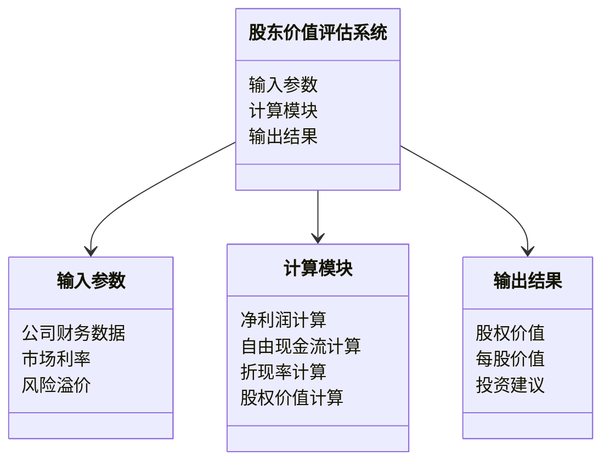

                 


# 查尔斯·布兰登的所有者收益：股东视角的价值评估

**关键词：** 所有者收益, 股东价值评估, 股东权益, 企业治理, 股权价值, 股票投资, 股东回报

**摘要：** 本文从股东视角出发，详细探讨查尔斯·布兰登的所有者收益理论，结合实际案例和数学模型，分析股东价值评估的核心概念、计算方法和系统架构，最后通过项目实战和最佳实践，帮助读者全面理解如何从股东角度评估企业价值。

---

## 第一部分: 所有者收益的背景与概念

### 第1章: 所有者收益的定义与背景

#### 1.1 所有者收益的核心概念

##### 1.1.1 什么是所有者收益
所有者收益（Owner Earnings）是指公司所有者通过经营公司所获得的经济利益。它不仅包括公司分配给股东的利润，还包括股东通过持有股权间接获得的财富增长。所有者收益的核心在于从股东的角度衡量公司创造价值的能力。

##### 1.1.2 股东视角的价值评估意义
从股东视角评估公司价值，是现代企业治理的核心任务之一。通过分析所有者收益，股东可以更好地理解公司的经营状况、盈利能力以及未来发展的潜力。这种评估有助于股东做出更明智的投资决策。

##### 1.1.3 所有者收益与公司治理的关系
所有者收益与公司治理密不可分。有效的公司治理能够最大化股东利益，而股东收益的评估反过来也能够为公司治理提供重要的反馈机制。例如，通过分析股东收益，公司可以发现治理中的问题并进行优化。

#### 1.2 股东价值评估的背景

##### 1.2.1 现代企业价值评估的发展历程
从传统的企业价值评估到现代的所有者收益分析，股东价值评估经历了从简单到复杂的演变。早期的评估方法主要关注企业的账面价值，而现代方法则更加注重企业的未来盈利能力。

##### 1.2.2 股东价值评估的现状与挑战
随着全球经济的复杂化，股东价值评估面临诸多挑战，例如市场波动、经济周期变化以及企业内部治理问题等。这些因素都可能影响所有者收益的评估结果。

##### 1.2.3 为什么所有者收益是关键
所有者收益是股东价值评估的核心指标之一，因为它直接反映了公司为股东创造财富的能力。通过分析所有者收益，股东可以更好地理解公司的价值创造过程。

### 第2章: 所有者收益的核心要素

#### 2.1 所有者收益的构成要素

##### 2.1.1 净利润与股东权益的关系
净利润是公司盈利能力的核心指标，而股东权益则是公司资产减去负债后的净值。两者之间的关系是所有者收益分析的基础。

##### 2.1.2 股东收益的多维度分析
所有者收益不仅包括当期利润，还包括未来利润的折现值。因此，需要从时间价值和风险调整两个维度进行分析。

##### 2.1.3 股东价值的外部影响因素
外部因素如市场利率、行业竞争状况等，都会影响所有者收益的评估结果。这些因素需要在分析中被充分考虑。

#### 2.2 股东价值评估的理论基础

##### 2.2.1 股权价值的基本公式
股权价值 = 净利润 / 加权平均资本成本（WACC）

##### 2.2.2 股东价值与企业绩效的关系
股东价值与企业绩效密切相关，但两者并不是简单的线性关系。企业绩效的好坏会影响股东价值的波动。

##### 2.2.3 股东价值评估的边界与外延
股东价值评估需要明确其边界，例如评估的时间范围、评估的主体等。同时，还需要考虑其外延，例如不同行业、不同规模公司的评估差异。

---

## 第二部分: 所有者收益的计算与模型

### 第3章: 所有者收益的计算方法

#### 3.1 股东收益的财务指标分析

##### 3.1.1 净利润与股东收益的关系
净利润是所有者收益的基础，但需要结合股东权益和其他因素进行调整。

##### 3.1.2 每股收益（EPS）的计算与意义
每股收益（EPS）= 净利润 / 平均股份数
EPS是衡量公司盈利能力的重要指标，但需要结合其他因素进行综合分析。

##### 3.1.3 股东权益的变动分析
股东权益的变动反映了公司资本结构的变化，需要结合所有者收益进行综合分析。

#### 3.2 股东价值评估的模型

##### 3.2.1 常用股东价值评估模型概述
- 股权自由现金流模型（FCFE）
- 现金流折现模型（DCF）
- 市盈率模型
- 市净率模型

##### 3.2.2 DCF模型的原理与应用
通过将未来的自由现金流折现，计算出股权价值。
$$ 股权价值 = \sum_{t=1}^{n} \frac{FCFE_t}{(1 + r)^t} $$

##### 3.2.3 其他股东价值评估方法对比
通过对比不同模型的优缺点，选择最适合的评估方法。

### 第4章: 所有者收益的多维度分析

#### 4.1 股东收益的时间价值分析

##### 4.1.1 资金的时间价值与股东收益
时间价值是所有者收益分析的重要因素，需要通过折现率进行调整。

##### 4.1.2 折现率的确定与影响
折现率的高低直接影响股权价值的计算结果，需要根据市场利率和公司风险水平进行调整。

##### 4.1.3 不同时间维度下的股东收益计算
短期收益与长期收益的平衡是所有者收益分析的重要内容。

#### 4.2 股东收益的风险调整分析

##### 4.2.1 风险与收益的平衡
高风险投资需要更高的预期收益，反之亦然。

##### 4.2.2 风险调整的股东价值评估
通过调整折现率或风险溢价，反映不同风险水平下的股东价值差异。

##### 4.2.3 不同风险水平下的股东收益计算
通过案例分析，展示不同风险水平下所有者收益的计算方法。

---

## 第三部分: 股东价值评估的系统分析

### 第5章: 股东价值评估的系统架构

#### 5.1 问题场景介绍
通过一个具体案例，展示如何从股东视角进行价值评估。

#### 5.2 系统功能设计

##### 5.2.1 领域模型（mermaid类图）


#### 5.3 系统架构设计（mermaid架构图）


#### 5.4 系统交互设计（mermaid序列图）
```mermaid
sequenceDiagram
    客户端 -> 服务端: 发送评估请求
    服务端 -> 数据库: 查询公司数据
    并发
    服务端 -> 计算引擎: 开始计算
    计算引擎 -> 报表生成器: 生成结果
    服务端 -> 客户端: 返回评估结果
```

---

## 第四部分: 项目实战

### 第6章: 项目实战与案例分析

#### 6.1 环境安装
需要安装Python、pandas、numpy、scipy等库。

#### 6.2 核心实现代码

##### 6.2.1 DCF模型实现
```python
import numpy as np

def calculate_equity_value(FCFE, WACC, n):
    return np.npv(WACC, FCFE) + FCFE[-1]/(1+WACC)**n
```

##### 6.2.2 风险调整的计算
```python
def risk_adjusted_value(current_value, risk_premium):
    return current_value * (1 + risk_premium)
```

#### 6.3 案例分析
通过具体公司案例，展示如何应用上述模型进行股东价值评估。

#### 6.4 项目小结
总结项目实现的关键点和注意事项。

---

## 第五部分: 最佳实践与小结

### 第7章: 最佳实践与小结

#### 7.1 最佳实践
- 定期更新财务数据和市场信息
- 综合考虑多维度因素
- 合理设置参数和假设

#### 7.2 小结
通过本文的分析，读者可以全面理解查尔斯·布兰登的所有者收益理论，并能够从股东视角进行价值评估。

#### 7.3 注意事项
- 数据来源的可靠性
- 参数设置的合理性
- 模型的适用性

#### 7.4 拓展阅读
建议进一步阅读相关书籍和文献，深入学习股东价值评估的前沿理论。

---

**作者：AI天才研究院/AI Genius Institute & 禅与计算机程序设计艺术 /Zen And The Art of Computer Programming**

