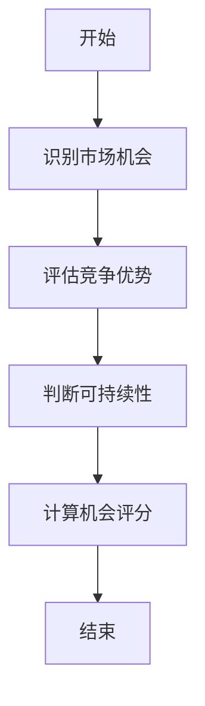
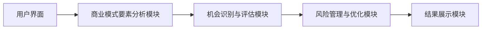

                 


# 查理·芒格的商业模式分析框架

> 关键词：查理·芒格，商业模式分析，多元思维模型，机会识别，风险管理，企业价值评估

> 摘要：本文将深入分析查理·芒格的商业模式分析框架，结合其多元思维模型，探讨如何在现代商业环境中识别机会、评估风险并优化商业模式。通过系统的理论介绍、算法原理解析和实际案例分析，为读者提供一套科学的商业模式分析方法。

---

## 第一部分: 查理·芒格的商业模式分析框架概述

### 第1章: 查理·芒格与多元思维模型

#### 1.1 查理·芒格的生平与思想

##### 1.1.1 查理·芒格的生平简介
查理·芒格（Charlie Munger）是美国著名投资家，沃伦·巴菲特（Warren Buffett）的长期合作伙伴。他不仅是伯克希尔·哈撒韦公司（Berkshire Hathaway）的副主席，还以他的“多元思维模型”（Mental Models）闻名于世。芒格的思想深深影响了巴菲特的投资策略，并被广泛应用于商业分析和决策中。

##### 1.1.2 芒格投资哲学的核心理念
芒格的投资哲学强调长期价值和风险管理。他主张通过多元思维模型来分析问题，即从多个学科的角度（如心理学、经济学、物理学等）来理解商业现象，从而做出更明智的决策。

##### 1.1.3 多元思维模型的定义与特点
多元思维模型是指通过多个学科的视角来分析问题，从而避免单一思维的局限性。其特点包括：
- **跨学科性**：整合多个学科的知识。
- **系统性**：从整体角度分析问题。
- **动态性**：能够适应变化和不确定性。

#### 1.2 商业模式分析框架的背景与意义

##### 1.2.1 商业模式分析的必要性
商业模式是企业创造和传递价值的方式。分析商业模式可以帮助企业识别机会、优化运营并应对竞争。

##### 1.2.2 芒格视角下的商业模式特征
芒格认为，成功的商业模式必须具备可持续的竞争优势和清晰的价值主张。他强调企业必须关注客户的需求，并通过创新来应对市场的变化。

##### 1.2.3 企业价值评估的核心要素
企业价值评估的核心要素包括市场需求、竞争优势、可持续性以及风险管理能力。这些要素构成了芒格商业模式分析框架的基础。

---

### 第2章: 芒格商业模式分析框架的核心概念

#### 2.1 多元思维模型在商业模式中的应用

##### 2.1.1 多元思维模型的构成要素
多元思维模型在商业模式分析中的构成要素包括：
- **价值主张**：企业提供的产品或服务是否满足客户的需求。
- **客户关系**：企业与客户之间的互动是否有效。
- **核心竞争力**：企业在市场中的竞争优势。
- **风险管理**：企业如何应对潜在的风险。

##### 2.1.2 不同学科视角对商业模式的影响
通过不同学科的视角分析商业模式，可以帮助企业发现潜在的问题和机会。例如，心理学可以帮助理解客户行为，经济学可以帮助分析市场趋势。

##### 2.1.3 多元思维模型在商业决策中的作用
多元思维模型可以帮助企业在复杂多变的市场环境中做出更明智的决策。它能够帮助企业在竞争中找到差异化的优势，并制定更有效的战略。

#### 2.2 芒格商业模式分析框架的结构

##### 2.2.1 价值主张的识别与评估
价值主张是商业模式的核心。识别和评估价值主张需要考虑市场需求、客户痛点以及产品的独特性。

##### 2.2.2 客户关系的建立与维护
客户关系是商业模式成功的关键。企业需要通过有效的客户关系管理来提高客户忠诚度和满意度。

##### 2.2.3 核心竞争力的分析与提升
核心竞争力是企业在市场中的竞争优势。分析核心竞争力需要考虑企业的资源、能力和技术。

---

### 第3章: 芒格商业模式分析框架的算法原理

#### 3.1 商业模式分析的算法流程

##### 3.1.1 数据采集与预处理
数据采集是商业模式分析的第一步。需要收集市场数据、客户反馈以及竞争对手的信息。预处理包括数据清洗和特征提取。

##### 3.1.2 商业模式要素的特征提取
特征提取是将商业模式的各个要素（如价值主张、客户关系）转化为可量化的指标。

##### 3.1.3 商业模式评分模型的构建
通过构建评分模型，可以对商业模式的各个要素进行量化评估。评分模型需要考虑多个因素，如市场需求、竞争优势和可持续性。

#### 3.2 商业模式评分模型的数学公式

##### 3.2.1 机会识别的评分公式
$$ 机会评分 = \frac{市场需求 + 竞争优势 + 可持续性}{3} $$

##### 3.2.2 风险评估的数学模型
$$ 风险系数 = \sum_{i=1}^{n} (风险因子_i \times 权重_i) $$

#### 3.3 商业模式分析的算法实现

##### 3.3.1 机会识别的流程图


---

### 第4章: 芒格商业模式分析框架的系统架构设计

#### 4.1 系统功能设计

##### 4.1.1 商业模式要素分析模块
该模块用于分析商业模式的各个要素，包括价值主张、客户关系和核心竞争力。

##### 4.1.2 机会识别与评估模块
该模块用于识别市场机会并评估其可行性。

##### 4.1.3 风险管理与优化模块
该模块用于评估潜在风险并提出优化建议。

#### 4.2 系统架构图


---

### 第5章: 芒格商业模式分析框架的项目实战

#### 5.1 项目环境与工具安装

##### 5.1.1 系统运行环境要求
需要安装Python、Jupyter Notebook以及相关数据分析库（如Pandas、Scikit-learn）。

##### 5.1.2 开发工具的安装与配置
安装Jupyter Notebook并配置Python环境。

##### 5.1.3 数据采集工具的使用
使用网络爬虫或API接口采集市场数据和客户反馈。

#### 5.2 核心代码实现

##### 5.2.1 商业模式评分模型的代码实现
```python
def calculate_opportunity_score(market_demand, competitive_advantage, s
```

