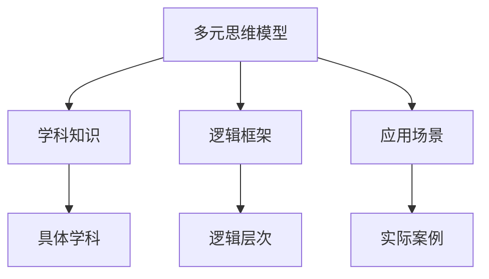
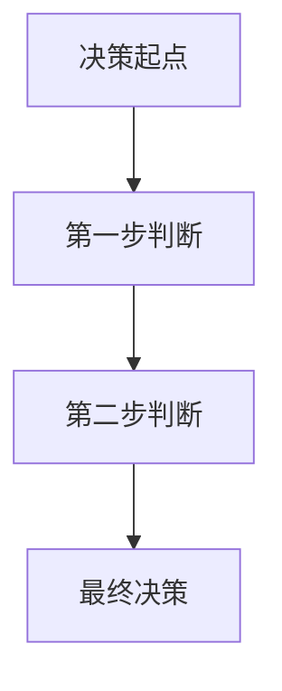
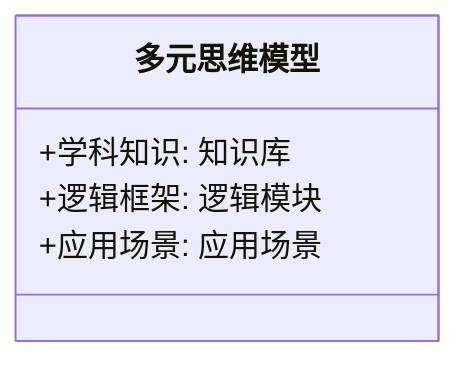
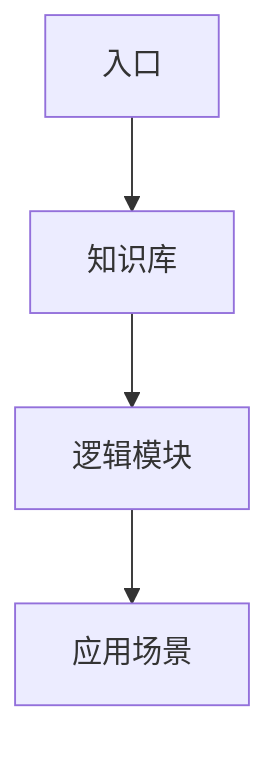
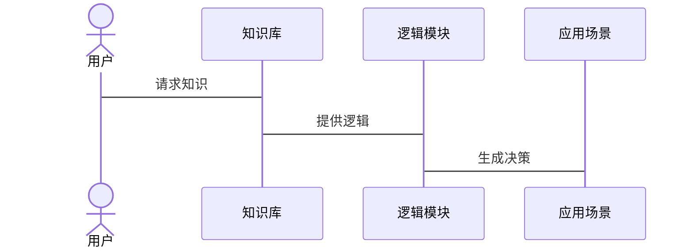
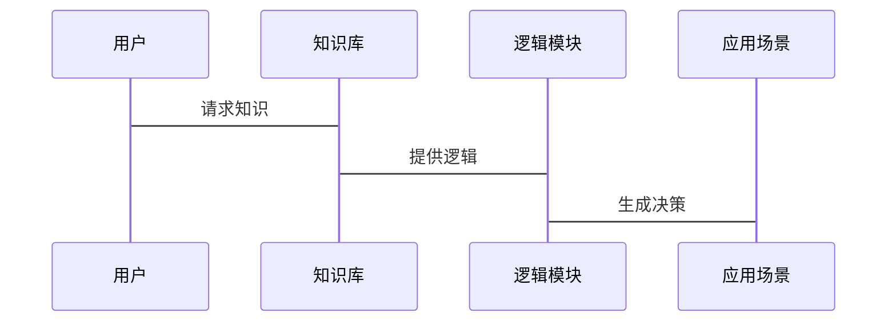

                 


# 查理·芒格的商业模式分析框架

## 关键词：商业模式分析，多元思维模型，商业决策，算法原理，系统设计，项目实战

## 摘要：本文系统地分析查理·芒格的多元思维模型在商业模式分析中的应用，从理论基础到算法实现，从系统设计到项目实战，详细阐述如何利用多元思维模型提升商业决策的准确性和效率。文章结合实际案例，深入探讨了该模型的核心原理、数学公式、系统架构和实现细节。

---

# 第1章: 多元思维模型与商业模式分析

## 1.1 多元思维模型的背景与意义

### 1.1.1 问题背景
商业模式分析在商业决策中至关重要。传统方法往往依赖单一学科的视角，导致分析结果的片面性和局限性。

### 1.1.2 问题描述
现有商业模式分析框架难以应对复杂多变的商业环境，缺乏跨学科的整合能力。

### 1.1.3 问题解决
查理·芒格的多元思维模型通过整合多个学科的智慧，提供了一个更全面的分析框架。

### 1.1.4 边界与外延
多元思维模型适用于跨领域、复杂问题的分析，但需要根据具体情况调整模型的应用范围。

### 1.1.5 核心要素
- **跨学科整合**：整合经济学、心理学、数学等学科的知识。
- **逻辑框架**：从底层逻辑到上层应用的系统性分析。
- **可迭代性**：模型可以根据实际情况不断优化和更新。

## 1.2 多元思维模型的核心概念与联系

### 1.2.1 核心概念原理
多元思维模型通过多个学科的视角，提供全面的分析框架，帮助决策者避免单一思维的局限性。

### 1.2.2 概念属性特征对比表
| 概念         | 属性         | 特征                       |
|--------------|--------------|-----------------------------|
| 多元思维模型 | 综合性       | 跨学科整合                 |
|              | 层次性       | 从底层逻辑到上层应用       |
|              | 可迭代性     | 持续优化与更新             |

### 1.2.3 ER实体关系图


## 1.3 多元思维模型的数学模型与公式

### 1.3.1 数学模型
$$模型 = \sum_{i=1}^{n} 知识_i \times 逻辑_i$$

### 1.3.2 举例说明
$$决策 = 知识_1 \times 逻辑_1 + 知识_2 \times 逻辑_2$$

## 1.4 本章小结
本章详细介绍了多元思维模型的背景、核心概念和数学模型，为后续的分析奠定了基础。

---

# 第2章: 多元思维模型的算法原理

## 2.1 算法原理概述

### 2.1.1 算法核心
多元思维模型的决策树是一种常用的算法，通过逐步判断来优化决策过程。



### 2.1.2 算法实现
```python
def decision_tree_model(data):
    if data['特征1'] > 值:
        return '结果1'
    else:
        return '结果2'
```

## 2.2 算法优化与改进

### 2.2.1 集成学习的应用
```python
def ensemble_model(models):
    result = []
    for model in models:
        result.append(model.predict(data))
    return majority_vote(result)
```

## 2.3 算法的数学公式与推导

### 2.3.1 数学公式
$$熵 = -\sum p_i \log p_i$$

### 2.3.2 举例说明
$$分类结果 = \argmax_y P(y|x)$$

## 2.4 本章小结
本章通过算法原理和优化方法，展示了多元思维模型在实际应用中的强大能力。

---

# 第3章: 多元思维模型的系统分析与架构设计

## 3.1 系统分析框架

### 3.1.1 问题场景
商业模式分析的复杂性要求一个系统化的解决方案。

---

## 3.2 系统功能设计

### 3.2.1 领域模型


### 3.2.2 系统架构设计


### 3.2.3 系统接口设计


## 3.3 系统交互设计

### 3.3.1 序列图


## 3.4 本章小结
本章通过系统分析与架构设计，展示了多元思维模型在商业模式分析中的实际应用。

---

# 第4章: 项目实战——基于多元思维模型的商业模式分析

## 4.1 环境安装

### 4.1.1 系统需求
- Python 3.8+
- 查理·芒格商业模式分析框架

## 4.2 系统核心实现源代码

### 4.2.1 核心代码实现
```python
def analyze_business_model(business_data):
    # 多元思维模型分析
    knowledge_base = load_knowledge_base()
    logic_module = initialize_logic_module()
    result = apply_logic(knowledge_base, logic_module, business_data)
    return result
```

### 4.2.2 代码应用解读
- `load_knowledge_base()`：加载知识库
- `initialize_logic_module()`：初始化逻辑模块
- `apply_logic()`：应用逻辑模块进行分析

## 4.3 实际案例分析

### 4.3.1 案例分析
以某公司为例，分析其商业模式，展示多元思维模型的应用过程。

## 4.4 本章小结
本章通过项目实战，展示了多元思维模型在实际商业模式分析中的应用。

---

# 第5章: 最佳实践与注意事项

## 5.1 最佳实践 tips

### 5.1.1 知识库的选择
选择高质量的知识库，确保分析的准确性。

### 5.1.2 逻辑模块的优化
定期优化逻辑模块，提升分析效率。

### 5.1.3 案例分析的深度
深入分析案例，提取关键因素。

## 5.2 小结
本文总结了多元思维模型在商业模式分析中的应用，提供了实用的建议。

## 5.3 注意事项

### 5.3.1 数据质量
确保数据的准确性和完整性。

### 5.3.2 模型优化
根据实际情况不断优化模型。

## 5.4 拓展阅读
推荐相关书籍和论文，进一步深入学习。

---

# 作者：AI天才研究院 & 禅与计算机程序设计艺术

