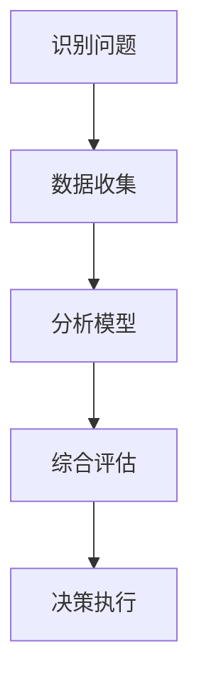
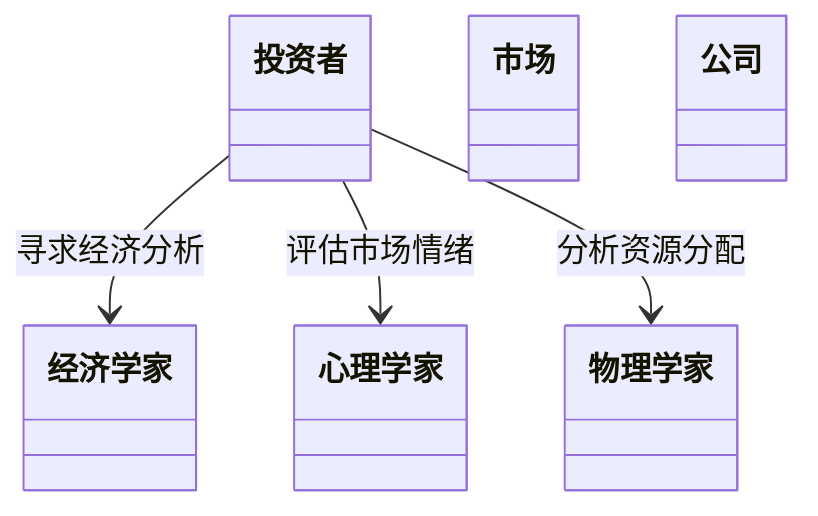

                 


# 查理·芒格的多元思维模型在投资中的应用

> 关键词：查理·芒格，多元思维模型，投资决策，心理认知，经济模型，系统分析

> 摘要：查理·芒格的多元思维模型是一种通过多学科视角进行决策的方法，本文将详细探讨其在投资中的应用。从模型的起源、核心概念、算法原理到系统架构，再到项目实战，最后总结最佳实践，全面解析多元思维模型如何帮助投资者做出更明智的决策。

---

# 第1章: 多元思维模型的背景与核心概念

## 1.1 多元思维模型的起源

### 1.1.1 查理·芒格的生平简介
查理·芒格是伯克希尔·哈撒韦公司的副主席，被誉为投资界的传奇人物。他提倡的多元思维模型源于他对心理学、经济学、物理学等多个学科的深刻理解。

### 1.1.2 多元思维模型的提出背景
在传统投资方法中，投资者往往局限于单一学科的视角，容易忽略其他领域的潜在影响。芒格提出多元思维模型，旨在通过跨学科分析来降低决策风险。

### 1.1.3 多元思维模型的核心理念
芒格认为，投资者应通过多个学科的视角分析问题，避免单一思维的局限性，从而做出更全面的决策。

## 1.2 多元思维模型的核心概念

### 1.2.1 问题背景与问题描述
在投资决策中，投资者需要考虑市场波动、公司基本面、宏观经济等多个因素。单一学科的分析往往不足以应对复杂的投资环境。

### 1.2.2 多元思维模型的定义与特点
多元思维模型是一种通过整合多个学科的思维框架来分析问题的方法，具有全面性、系统性和动态性等特点。

### 1.2.3 多元思维模型的边界与外延
尽管多元思维模型广泛应用于投资领域，但它也有其局限性，需要结合具体情境灵活运用。

### 1.2.4 核心要素与概念结构
多元思维模型的核心要素包括心理学中的认知偏差、经济学中的理性决策、物理学中的能量守恒等，这些要素共同构建了模型的结构。

## 1.3 多元思维模型在投资中的重要性

### 1.3.1 投资中的问题与挑战
投资决策面临信息不对称、市场波动、人为情绪等多种挑战，单一思维难以应对。

### 1.3.2 多元思维模型的应用价值
通过跨学科分析，投资者能够更全面地评估风险和机会，提高决策的准确性。

### 1.3.3 其他投资方法的对比分析
对比传统基本面分析和技术分析，多元思维模型的优势在于其全面性和灵活性。

---

# 第2章: 多元思维模型的核心概念与联系

## 2.1 多元思维模型的原理

### 2.1.1 多元思维模型的构成要素
模型由多个学科的思维框架组成，每个框架都提供了独特的视角和工具。

### 2.1.2 各个学科思维模型的相互作用
不同学科的思维模型通过相互作用，提供更全面的分析和更可靠的结论。

## 2.2 核心概念属性对比

### 2.2.1 不同思维模型的属性特征对比表格
以下表格展示了心理学、经济学和物理学等学科思维模型的属性对比：

| 学科   | 属性       | 描述                                   |
|--------|------------|--------------------------------------|
| 心理学 | 认知偏差    | 人们在决策中常见的思维错误           |
| 经济学 | 理性决策    | 假设人们在决策时以理性为目标         |
| 物理学 | 能量守恒    | 资源分配的动态平衡                   |

## 2.3 ER实体关系图

### 2.3.1 实体关系图的 mermaid 流程图
```mermaid
erDiagram
    actor 投资者
    actor 市场
    actor 公司
    actor 经济学家
    actor 心理学家
    actor 物理学家
   投资者 -> 经济学家 : 寻求经济分析
   投资者 -> 心理学家 : 评估市场情绪
   投资者 -> 物理学家 : 分析资源分配
   经济学家 -> 市场 : 影响价格波动
   公司 -> 市场 : 提供产品和服务
   市场 -> 投资者 : 反馈市场信息
```

---

# 第3章: 多元思维模型的算法原理

## 3.1 算法原理概述

### 3.1.1 多元思维模型的决策流程
1. 识别问题：明确投资目标和潜在风险。
2. 数据收集：收集与投资相关的多方面信息。
3. 分析模型：应用多个学科的思维模型进行分析。
4. 综合评估：结合各模型的分析结果，评估投资机会。
5. 决策执行：基于综合评估做出投资决策。

### 3.1.2 算法的输入输出说明
- **输入**：市场数据、公司基本面、宏观经济指标等。
- **输出**：投资决策建议，包括买入、卖出或持有。

## 3.2 算法的 mermaid 流程图



## 3.3 算法实现的 Python 源代码

```python
def multi思维模型分析():
    # 数据收集
    市场数据 = 收集市场数据()
    公司基本面 = 分析公司基本面()
    宏观经济指标 = 获取宏观经济指标()

    # 分析模型
    心理分析 = 分析市场情绪(市场数据)
    经济分析 = 评估经济状况(宏观经济指标)
    物理分析 = 分析资源分配(公司基本面)

    # 综合评估
    综合结果 = 综合分析(心理分析, 经济分析, 物理分析)

    # 决策执行
    投资决策 = 生成决策建议(综合结果)

    return 投资决策

multi思维模型分析()
```

---

# 第4章: 数学模型与公式

## 4.1 数学模型概述

### 4.1.1 相关数学模型的介绍
多元思维模型涉及概率论、统计学和优化理论等数学工具。

## 4.2 数学公式的详细讲解

### 4.2.1 投资组合预期收益的公式
$$ E(r_p) = \sum w_i r_i $$
其中，\( w_i \) 是资产 \( i \) 的权重，\( r_i \) 是资产 \( i \) 的预期收益率。

### 4.2.2 马科维茨投资组合理论的公式
$$ \text{优化目标：} \min \sigma_p^2 $$
$$ \text{约束条件：} \sum w_i = 1, \sum w_i r_i = E(r_p) $$

## 4.3 示例说明

### 4.3.1 使用示例解释公式的应用
假设投资组合由两只股票组成，权重分别为0.6和0.4，预期收益率分别为10%和15%。则组合的预期收益率为：
$$ E(r_p) = 0.6 \times 10\% + 0.4 \times 15\% = 13\% $$

---

# 第5章: 系统分析与架构设计

## 5.1 问题场景介绍

### 5.1.1 投资决策的复杂性分析
在复杂的市场环境中，投资者需要考虑多方面的信息和潜在风险。

## 5.2 项目介绍

### 5.2.1 项目目标与范围
本项目旨在构建一个基于多元思维模型的投资决策支持系统，帮助投资者做出更明智的投资决策。

## 5.3 系统功能设计

### 5.3.1 领域模型的 mermaid 类图


## 5.4 系统架构设计

### 5.4.1 系统架构的 mermaid 架构图
```mermaid
container 投资决策系统
    service 数据收集模块
    service 数据分析模块
    service 投资建议模块
end

container 数据源
    service 市场数据源
    service 公司基本面数据源
    service 宏观经济数据源
end

数据收集模块 --> 数据源 : 获取数据
数据分析模块 --> 数据源 : 分析数据
投资建议模块 --> 数据分析模块 : 生成建议
```

## 5.5 系统接口设计

### 5.5.1 API接口设计
- 数据收集模块提供API接口，供投资者调用数据。
- 数据分析模块提供分析结果的API，供投资建议模块调用。

---

# 第6章: 项目实战

## 6.1 环境安装

### 6.1.1 安装Python和相关库
安装Python和Pandas、NumPy、Matplotlib等库，用于数据处理和可视化。

## 6.2 系统核心实现源代码

### 6.2.1 数据收集模块的代码实现
```python
import pandas as pd

def 收集市场数据():
    # 示例代码：从数据库中读取数据
    data = pd.read_csv('market_data.csv')
    return data
```

### 6.2.2 数据分析模块的代码实现
```python
def 分析市场情绪(data):
    # 示例代码：计算市场情绪指标
    情绪指标 = data['价格'].rolling(20).mean().std()
    return 情绪指标
```

## 6.3 代码应用解读与分析

### 6.3.1 数据收集与处理
从市场数据中提取关键指标，如价格、成交量等。

## 6.4 实际案例分析

### 6.4.1 案例分析：苹果公司的投资价值评估
1. 数据收集：获取苹果公司的市场数据、财务数据和宏观经济指标。
2. 分析模型：应用心理学、经济学和物理学的思维模型进行分析。
3. 综合评估：结合各模型的分析结果，评估苹果公司的投资价值。

## 6.5 项目小结

### 6.5.1 项目总结
通过项目实战，验证了多元思维模型在投资中的有效性。

---

# 第7章: 最佳实践

## 7.1 心得体会与总结

### 7.1.1 心得体会
应用多元思维模型需要持续学习和实践，才能真正掌握其精髓。

### 7.1.2 总结
多元思维模型是一种强大的工具，能够帮助投资者做出更全面、更可靠的决策。

## 7.2 小结

### 7.2.1 知识回顾
回顾本文的主要内容，包括背景、核心概念、算法原理、系统架构和项目实战。

## 7.3 注意事项

### 7.3.1 注意事项
- 多元思维模型的应用需要结合具体情境。
- 需要不断更新知识，以适应变化的市场环境。

## 7.4 拓展阅读

### 7.4.1 拓展阅读资料
- 查理·芒格的著作《Poor Charlie's Almanack》
- 投资相关的学术论文和书籍

---

# 结语

查理·芒格的多元思维模型为投资决策提供了全新的视角和方法。通过本文的详细讲解和案例分析，读者可以更好地理解和应用这一模型，做出更明智的投资决策。

---

# 作者

作者：AI天才研究院/AI Genius Institute & 禅与计算机程序设计艺术 /Zen And The Art of Computer Programming

