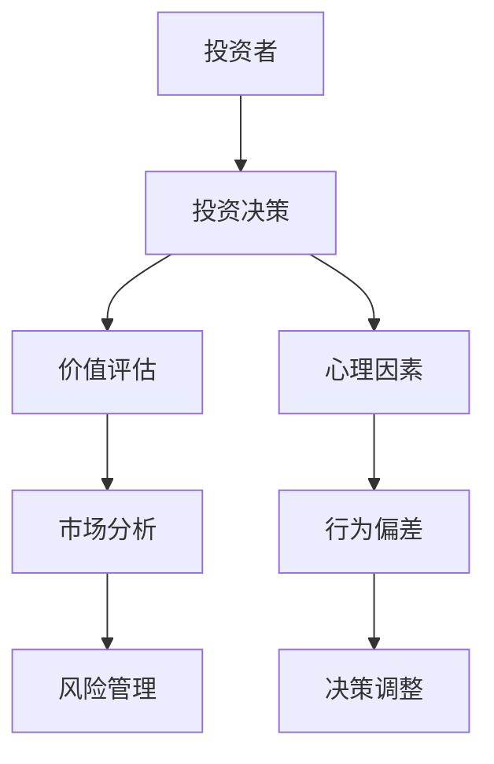
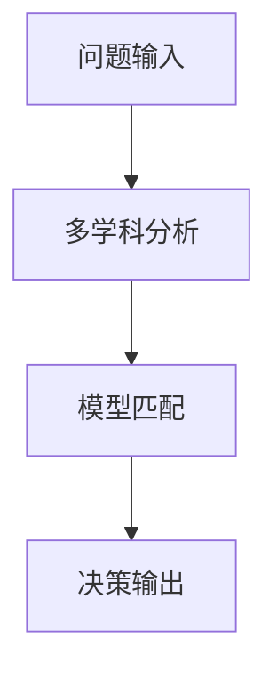
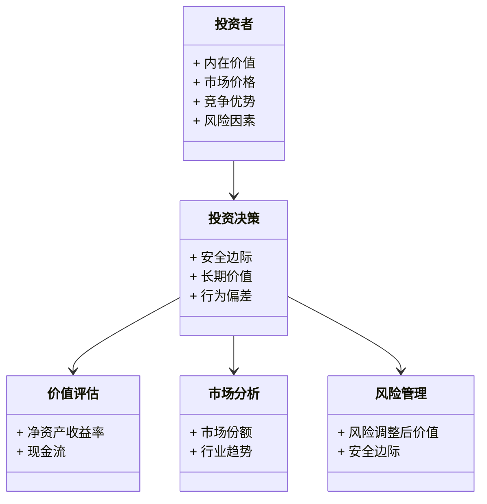
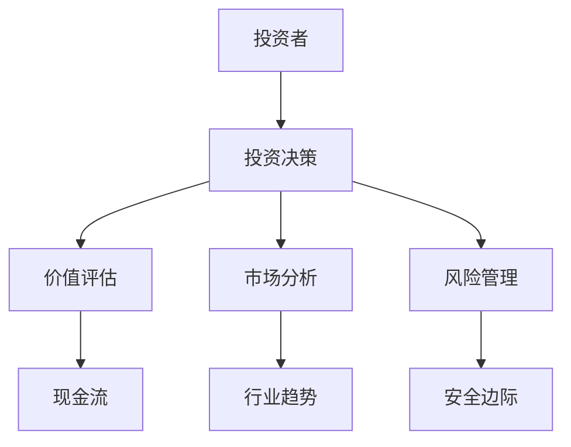

                 

# 查理·芒格的跨学科思维在投资中的应用

> 关键词：查理·芒格，跨学科思维，投资，多元思维模型，心理学，经济学

> 摘要：本文深入探讨了查理·芒格的跨学科思维在投资中的应用。通过分析芒格的生平、投资理念、多元思维模型及其在实际投资中的应用，文章揭示了跨学科思维如何帮助投资者做出更明智的决策。文章还结合具体案例，展示了芒格如何通过跨学科分析来评估投资机会，并提出了投资者在实际操作中可以借鉴的策略。

---

## 第一部分: 背景介绍

### 第1章: 查理·芒格的生平与投资理念

#### 1.1 查理·芒格的生平简介
查理·芒格（Charlie Munger）是美国著名投资者和伯克希尔·哈撒韦公司（Berkshire Hathaway）的副主席。他出生于1924年，毕业于加州大学洛杉矶分校（UCLA）法学专业，并在哈佛法学院获得法学硕士学位。芒格的职业生涯始于律师，但他后来转向投资领域，并与沃伦·巴菲特（Warren Buffett）共同创立了伯克希尔·哈撒韦公司。

芒格以其独特的投资理念和跨学科思维方式闻名。他认为，投资不仅仅是对市场的分析，更是对人性、心理、经济学、心理学等多学科的综合理解。

#### 1.2 芒格的投资理念
芒格的投资理念以价值投资为核心，强调寻找那些具有持续竞争优势、良好管理和合理估值的企业进行长期投资。他提出的“安全边际”概念，即以低于内在价值的价格买入优质资产，是其投资策略的重要组成部分。

此外，芒格还强调了长期主义的投资理念，认为短期市场的波动不应影响长期投资的决策。

#### 1.3 芒格的思维模型
芒格的跨学科思维模型是其投资成功的关键。他将多个学科的核心原理整合到投资决策中，形成了一套独特的分析框架。这种思维方式被称为“多元思维模型”（Multi-Disciplinary Thinking Model，MTM），它包括心理学、经济学、生物学、物理学等多个学科的知识。

---

### 第2章: 芒格跨学科思维的核心概念与联系

#### 2.1 芒格思维模型的核心原理
芒格思维模型的核心原理包括以下几个方面：

1. **心理学**：芒格深刻理解人类认知的局限性，尤其是行为偏差（如过度自信、从众心理等）对投资决策的影响。
2. **经济学**：芒格的价值投资理论基于经济学中的“价值”概念，即寻找市场定价低于内在价值的企业。
3. **生物学**：芒格将企业的竞争优势类比为生物的进化优势，认为只有具备竞争优势的企业才能在长期中存活并增长。
4. **物理学**：芒格借鉴物理学中的能量守恒定律，认为企业的价值最终会反映其创造的经济价值。

#### 2.2 芒格思维模型与传统投资理论的对比
传统的投资理论主要依赖于市场分析、技术分析和基本分析，而芒格的思维模型则强调多学科的综合应用。以下是两者的对比：

| 对比维度 | 传统投资理论 | 芒格思维模型 |
|----------|---------------|--------------|
| 分析方法 | 侧重于单一学科（如经济学、金融学） | 跨学科综合分析 |
| 投资策略 | 短期波动驱动 | 长期价值驱动 |
| 风险管理 | 侧重于市场波动 | 侧重于内在价值 |

#### 2.3 芒格思维模型的ER实体关系图
以下是芒格思维模型的ER实体关系图：

---

## 第二部分: 芒格跨学科思维的算法原理

### 第3章: 芒格跨学科思维的算法流程

#### 3.1 芒格思维模型的算法流程
芒格思维模型的算法流程如下：

#### 3.2 芒格思维模型的数学模型
以下是芒格思维模型中几个关键的数学公式：

1. **安全边际计算公式**：
   $$ 安全边际 = 内在价值 - 市场价格 $$

2. **长期价值计算公式**：
   $$ 长期价值 = \sum_{t=1}^{n} 现金流_t \times (1 + r)^{-t} $$

3. **竞争优势评估公式**：
   $$ 竞争优势 = 市场份额 + 净资产收益率 $$

---

### 第4章: 芒格思维模型的系统分析与架构设计

#### 4.1 问题场景介绍
在投资决策中，投资者需要综合考虑企业的内在价值、市场环境、竞争态势和风险因素。芒格通过多元思维模型，将这些因素整合到一个统一的框架中。

#### 4.2 系统功能设计
以下是芒格思维模型的领域模型：

#### 4.3 系统架构设计
以下是芒格思维模型的系统架构图：

---

### 第5章: 芒格思维模型的项目实战

#### 5.1 项目介绍
假设我们有一个投资案例，即评估一家科技公司的投资价值。

#### 5.2 核心实现
以下是芒格思维模型的核心实现步骤：

1. **价值评估**：计算公司的内在价值，包括现金流折现法。
2. **市场分析**：分析行业趋势和公司市场份额。
3. **竞争优势评估**：评估公司的竞争优势，包括净资产收益率。
4. **风险管理**：计算安全边际。

#### 5.3 实际案例分析
以苹果公司为例，应用芒格思维模型进行投资分析：

1. **内在价值计算**：
   $$ 内在价值 = \sum_{t=1}^{n} 现金流_t \times (1 + r)^{-t} $$

2. **竞争优势评估**：
   $$ 竞争优势 = 市场份额 + 净资产收益率 $$

3. **安全边际计算**：
   $$ 安全边际 = 内在价值 - 市场价格 $$

---

## 第三部分: 最佳实践与小结

### 第6章: 最佳实践与小结

#### 6.1 最佳实践
1. **跨学科学习**：投资者应广泛学习心理学、经济学、生物学等学科，以提升对市场的理解。
2. **长期投资**：坚持长期价值投资，避免短期市场的波动干扰。
3. **风险管理**：始终关注安全边际，确保投资的稳健性。

#### 6.2 小结
芒格的跨学科思维模型为投资者提供了一种全新的分析框架。通过整合多个学科的核心原理，投资者可以更全面地评估投资机会，做出更明智的决策。

---

## 作者

作者：AI天才研究院/AI Genius Institute & 禅与计算机程序设计艺术/Zen And The Art of Computer Programming

