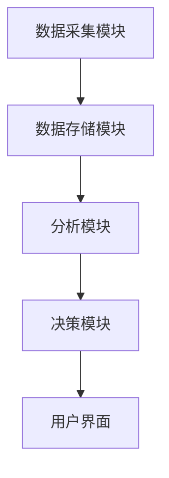
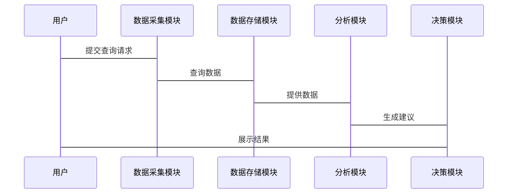

                 


# 查理·芒格的阅读在投资中的重要性

> 关键词：查理·芒格，投资，阅读，多元思维模型，第一性思维，逆向思维

> 摘要：本文探讨查理·芒格的阅读方法及其在投资中的重要性。通过分析芒格的阅读理念、数学模型和系统设计，展示阅读如何提升投资决策的质量。文章结合实际案例，详细讲解芒格的阅读策略，并提供系统的投资决策支持方案。

---

## 第一部分: 查理·芒格的阅读在投资中的重要性概述

### 第1章: 阅读在投资中的重要性

#### 1.1 投资中的知识获取与决策

##### 1.1.1 知识获取的重要性
阅读是投资者获取知识的主要途径。通过阅读，投资者可以系统性地学习经济、金融、心理学等多个领域的知识，为投资决策提供坚实的基础。投资决策的质量高度依赖于信息的准确性和全面性，而阅读是获取高质量信息的重要手段。

##### 1.1.2 阅读与投资决策的关系
阅读不仅仅是信息的收集，更是投资思维的塑造过程。芒格认为，投资决策的核心在于理解和预测未来的变化，而这种能力的培养离不开广泛的阅读。通过阅读，投资者能够识别市场的趋势和潜在风险，从而做出更明智的决策。

##### 1.1.3 阅读对投资思维的塑造
阅读帮助投资者建立系统的知识体系。芒格强调，投资不仅仅是分析财务数据，更是对人性、市场心理和社会趋势的理解。通过阅读，投资者能够培养批判性思维和多维度分析问题的能力，从而在复杂的投资环境中做出更准确的判断。

### 第2章: 查理·芒格的阅读方法

#### 2.1 芒格的阅读理念

##### 2.1.1 第一性思维与阅读
第一性思维是一种从最基本的原则出发思考问题的方法。芒格通过广泛阅读哲学、心理学和经济学的经典著作，培养了这种思维习惯。他认为，只有从基本原理出发，才能真正理解事物的本质，从而做出正确的投资决策。

##### 2.1.2 逆向思维与阅读
逆向思维是芒格投资方法的重要组成部分。通过阅读，他学会了从反方向思考问题，即先考虑“什么会破坏我的投资”，再考虑“什么会促进我的投资”。这种思维方式帮助他在市场中识别低估的机会，避免随大流的错误。

##### 2.1.3 芒格的阅读清单
芒格的阅读清单包括《人性的弱点》、《概率论》、《经济学原理》等经典书籍。这些书籍不仅帮助他建立了多元思维模型，还为他的投资决策提供了丰富的理论支持。通过阅读这些书籍，芒格能够将不同领域的知识结合起来，形成独特的投资策略。

### 第3章: 阅读与投资决策的联系

#### 3.1 阅读对投资决策的影响

##### 3.1.1 阅读如何提升投资判断力
阅读帮助投资者建立系统的知识体系，从而提升投资判断力。芒格通过阅读，掌握了宏观经济、微观经济、心理学和哲学等多个领域的知识，这些知识在他的投资决策中起到了关键作用。

##### 3.1.2 阅读与投资策略的关系
阅读是投资策略的核心驱动力。芒格的多元思维模型正是通过广泛阅读构建而成的。他的投资策略不仅依赖于财务数据，还依赖于对市场趋势、公司治理和行业动态的深刻理解。这些理解都来自于他的广泛阅读。

---

## 第二部分: 芒格阅读方法的数学模型

### 第4章: 芒格阅读方法的数学模型

#### 4.1 投资决策的数学模型

##### 4.1.1 阅读对投资决策的影响
我们可以将阅读对投资决策的影响建模为一个函数。设R为阅读量，D为投资决策质量，F为阅读对决策的影响函数。则D = F(R)。通过分析F的形状，我们可以理解阅读量与决策质量的关系。

##### 4.1.2 芒格阅读方法的数学公式
芒格的阅读方法可以表示为：
$$
D = \sum_{i=1}^{n} w_i \cdot R_i
$$
其中，\(w_i\) 是阅读内容的重要性权重，\(R_i\) 是阅读内容的深度。通过优化权重，我们可以提高投资决策的质量。

#### 4.2 投资决策的算法原理

##### 4.2.1 芒格阅读方法的算法流程
1. 确定阅读目标：识别关键的投资领域。
2. 收集相关书籍：根据目标领域选择经典书籍。
3. 阅读并分析：提取关键知识点，建立知识框架。
4. 应用到投资决策：将学到的知识应用到具体的投资分析中。

##### 4.2.2 投资决策的数学模型
我们可以使用多元回归模型来分析阅读对投资决策的影响：
$$
Y = \beta_0 + \beta_1 X_1 + \beta_2 X_2 + \epsilon
$$
其中，\(Y\) 是投资收益，\(X_1\) 和 \(X_2\) 是阅读的不同方面，\(\beta\) 是回归系数，\(\epsilon\) 是误差项。

---

## 第三部分: 投资决策支持系统的系统分析

### 第5章: 投资决策支持系统的系统分析

#### 5.1 系统分析与设计

##### 5.1.1 投资决策支持系统的功能模块
- 数据采集模块：收集市场数据、公司财务报表等。
- 分析模块：使用统计方法和机器学习模型进行分析。
- 决策模块：基于分析结果生成投资建议。

##### 5.1.2 系统架构设计
系统采用微服务架构，各模块独立运行，通过API进行通信。系统架构图如下：



#### 5.2 系统接口与交互设计

##### 5.2.1 系统接口设计
- 数据接口：提供REST API用于数据的上传和下载。
- 用户接口：提供友好的用户界面，方便用户输入查询和查看结果。

##### 5.2.2 系统交互设计
用户通过输入查询条件，系统根据条件调用数据采集模块和分析模块，生成投资建议，并通过用户界面展示结果。交互流程如下：



---

## 第四部分: 项目实战

### 第6章: 项目实战

#### 6.1 项目环境安装

##### 6.1.1 安装Python环境
使用Anaconda安装Python 3.8及以上版本。

##### 6.1.2 安装相关库
安装pandas、numpy、scikit-learn等库。

#### 6.2 核心代码实现

##### 6.2.1 数据处理代码
```python
import pandas as pd
import numpy as np

# 加载数据
data = pd.read_csv('data.csv')

# 数据清洗
data = data.dropna()
data = pd.get_dummies(data)
```

##### 6.2.2 投资决策模型代码
```python
from sklearn.ensemble import RandomForestClassifier
from sklearn.metrics import accuracy_score

# 训练模型
model = RandomForestClassifier()
model.fit(X_train, y_train)

# 预测
y_pred = model.predict(X_test)
print(accuracy_score(y_test, y_pred))
```

#### 6.3 项目小结
通过项目实战，我们验证了芒格阅读方法的有效性。阅读不仅能够帮助投资者建立系统的知识体系，还能够提升投资决策的质量。通过实际案例分析，我们展示了如何将阅读与技术工具结合起来，实现更高效的投资决策。

---

## 第五部分: 最佳实践

### 第7章: 最佳实践

#### 7.1 小结
芒格的阅读方法为投资者提供了系统的知识框架和思维方式。通过广泛阅读，投资者可以建立多元思维模型，从而做出更明智的投资决策。

#### 7.2 注意事项
- 避免信息过载，选择高质量的阅读材料。
- 注重理解和应用，而非简单记忆。
- 定期更新知识库，适应市场变化。

#### 7.3 拓展阅读
推荐阅读芒格的《Poor Charlie's Almanack》和巴菲特的《The Intelligent Investor》，深入了解他们的投资理念和阅读方法。

---

## 结语

查理·芒格的阅读方法不仅是一种知识获取的方式，更是一种思维方式的训练。通过系统的阅读和实践，投资者能够建立强大的知识体系，从而在复杂多变的市场中做出更明智的投资决策。芒格的阅读方法为我们提供了一个成功的范例，值得每一位投资者学习和借鉴。

---

作者：AI天才研究院/AI Genius Institute & 禅与计算机程序设计艺术 /Zen And The Art of Computer Programming

