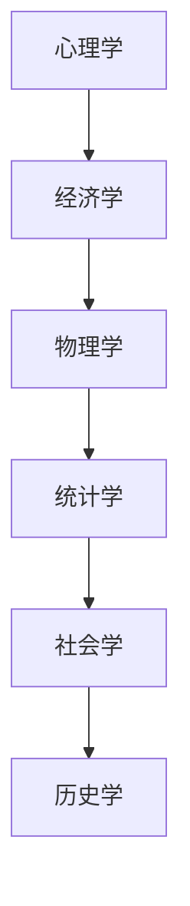
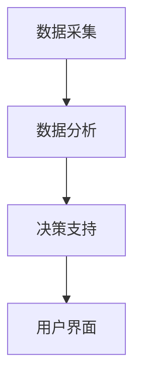
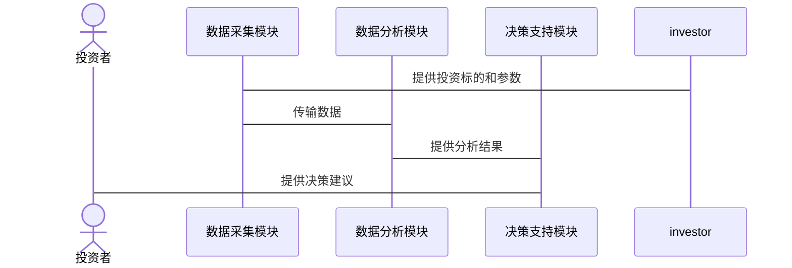

                 


# 查理芒格的多元思维模型：价值投资的跨学科应用

> 关键词：多元思维模型, 价值投资, 查理芒格, 跨学科, 投资策略, 系統思考

> 摘要：查理·芒格的多元思维模型是一种将多个学科知识整合起来进行决策的思维方式，其在价值投资领域具有重要的应用。本文将从多元思维模型的核心概念、算法原理、数学模型、系统架构设计、项目实战等多方面进行详细探讨，深入剖析其在价值投资中的跨学科应用。

---

## 第一部分：查理芒格的多元思维模型概述

### 第1章：多元思维模型的背景与核心概念

#### 1.1 多元思维模型的定义与背景
- **查理·芒格的多元思维模型**是一种将多个学科的知识整合起来，通过多维度的思考方式来分析和解决问题的方法。它不仅仅是对单一学科知识的掌握，更强调知识之间的交叉与融合。
- **价值投资**是一种以基本面分析为基础的投资策略，强调以低于内在价值的价格购买优质资产。芒格的多元思维模型为价值投资提供了更深层次的理论支持。
- **与其他投资方法的区别**：传统投资方法往往依赖于单一的分析框架，而多元思维模型则强调多学科、多维度的综合分析，从而更全面地评估投资标的的价值。

#### 1.2 多元思维模型的核心要素
- **知识的跨学科整合**：芒格的多元思维模型强调从心理学、经济学、物理学等多个学科中汲取知识，形成一个完整的知识网络。
- **思维的多维度分析**：通过多维度的思考，投资者能够从不同的角度分析问题，避免单一维度分析的局限性。
- **投资决策的系统性框架**：芒格通过多元思维模型构建了一个系统的投资框架，帮助投资者更全面地评估投资标的的价值。

#### 1.3 多元思维模型的边界与外延
- **应用范围**：多元思维模型不仅适用于价值投资，还可以应用于其他领域，如商业决策、风险管理等。
- **局限性**：尽管多元思维模型提供了丰富的视角，但在实际操作中可能会面临信息过载和复杂性增加的问题。
- **与其他投资方法的对比**：传统的基本面分析和量化分析方法各有优劣，而多元思维模型则是对这两种方法的补充和提升。

---

### 第2章：多元思维模型的核心概念与联系

#### 2.1 多元思维模型的原理
- **系统性分析**：芒格的多元思维模型强调从系统的角度分析问题，将各个学科的知识视为系统的一部分，从而更好地理解问题的本质。
- **网络结构**：知识之间的联系形成了一个复杂的网络结构，这种结构能够帮助投资者发现不同学科之间的联系，从而更全面地分析问题。
- **动态性与适应性**：多元思维模型具有较强的动态性和适应性，能够根据实际情况灵活调整分析框架。

#### 2.2 多元思维模型的核心概念对比
- **心理学与经济学的对比**：
  - **心理学**：关注人类行为和心理，帮助投资者理解市场参与者的心理变化。
  - **经济学**：关注资源分配和市场机制，帮助投资者理解经济环境对投资标的的影响。
- **物理学与统计学的对比**：
  - **物理学**：提供因果关系的分析方法，帮助投资者理解事物之间的内在联系。
  - **统计学**：提供数据分析的方法，帮助投资者从数据中发现规律。

#### 2.3 多元思维模型的ER实体关系图


---

### 第3章：多元思维模型的算法原理

#### 3.1 多元思维模型的算法概述
- **算法特点**：芒格的多元思维模型是一种基于知识整合的算法，强调多维度的分析和系统的思考。
- **算法流程**：
  1. 收集多个学科的相关知识。
  2. 分析这些知识之间的联系。
  3. 综合不同维度的信息，形成一个完整的分析框架。
  4. 根据分析结果，做出投资决策。

#### 3.2 多元思维模型的数学模型
- **概率论的应用**：
  - **贝叶斯定理**：用于在不确定条件下更新概率，帮助投资者做出更准确的判断。
  - **期望值计算**：通过计算不同可能结果的概率和收益，确定最佳的投资决策。
- **决策树的构建**：
  - 通过构建决策树，投资者可以清晰地看到不同决策路径的可能结果和概率。

#### 3.3 多元思维模型的算法实现
- **步骤**：
  1. 收集相关数据。
  2. 构建决策树。
  3. 计算概率和期望值。
  4. 根据结果做出决策。

---

### 第4章：多元思维模型的数学模型

#### 4.1 多元思维模型的概率计算
- **公式**：$$P(A|B) = \frac{P(B|A) \cdot P(A)}{P(B)}$$
- **解释**：贝叶斯定理用于在已知B发生的条件下，计算A发生的概率。

#### 4.2 多元思维模型的决策树构建
- **示例**：
  - **节点A**：是否进入市场。
    - **分支1**：进入市场，收益为100万。
    - **分支2**：不进入市场，收益为0。
  - **节点B**：市场表现。
    - **分支1**：市场好，收益为200万。
    - **分支2**：市场差，收益为50万。

#### 4.3 多元思维模型的优化算法
- **公式**：$$\text{期望值} = \sum (P_i \cdot R_i)$$
- **解释**：通过计算不同可能结果的期望值，选择期望值最大的方案作为最佳决策。

---

### 第5章：系统分析与架构设计

#### 5.1 问题场景介绍
- **目标**：构建一个基于多元思维模型的投资系统，帮助投资者做出更全面的投资决策。

#### 5.2 系统功能设计
- **需求分析**：投资者需要从多个维度分析投资标的，包括基本面、市场环境、行业趋势等。
- **功能模块**：
  - 数据采集模块：收集相关数据。
  - 数据分析模块：对数据进行分析和处理。
  - 决策支持模块：根据分析结果，提供决策支持。

#### 5.3 系统架构设计


#### 5.4 系统接口设计
- **输入接口**：接收投资者输入的投资标的和相关参数。
- **输出接口**：输出分析结果和决策建议。

#### 5.5 系统交互设计


---

### 第6章：项目实战

#### 6.1 环境配置
- **工具**：Python、Jupyter Notebook、相关数据分析库（如Pandas、NumPy）。

#### 6.2 系统核心实现源代码
```python
import pandas as pd
import numpy as np

# 数据采集
data = pd.read_csv('investment_data.csv')

# 数据分析
mean_return = np.mean(data['return'])
std_deviation = np.std(data['return'])

# 决策支持
if mean_return > std_deviation:
    print("投资建议：进入市场")
else:
    print("投资建议：观望")
```

#### 6.3 代码应用解读与分析
- **数据采集**：从CSV文件中读取投资数据。
- **数据分析**：计算收益的均值和标准差，评估投资风险。
- **决策支持**：根据均值和标准差的比较，给出投资建议。

#### 6.4 实际案例分析
- **案例**：分析某公司的基本面数据，使用多元思维模型进行投资决策。

---

### 第7章：最佳实践、小结、注意事项和拓展阅读

#### 7.1 最佳实践
- **持续学习**：不断扩展知识面，提升多元思维的能力。
- **系统思考**：在投资决策中，注重多维度的分析和系统的思考。

#### 7.2 小结
- 本文详细介绍了查理·芒格的多元思维模型在价值投资中的跨学科应用，从核心概念、算法原理、数学模型、系统架构设计到项目实战，为投资者提供了全面的指导。

#### 7.3 注意事项
- **信息过载**：在实际操作中，可能会面临信息过多的问题，需要合理筛选和整合信息。
- **动态调整**：市场环境不断变化，需要根据实际情况动态调整分析框架。

#### 7.4 拓展阅读
- 推荐阅读《查理·芒格的智慧：论生活与投资》、《投资的智慧：芒格的多元思维模型》等书籍。

---

## 作者：AI天才研究院/AI Genius Institute & 禅与计算机程序设计艺术 /Zen And The Art of Computer Programming

