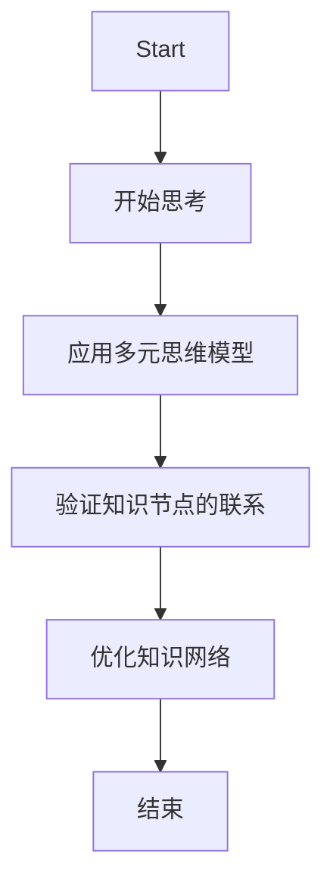
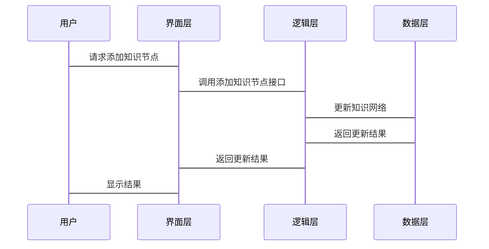

                 


# 查理芒格的跨学科思维方法

## 关键词：跨学科思维、多元思维模型、查理芒格、知识网络、风险管理

## 摘要：查理芒格以其独特的跨学科思维方法闻名，他通过多元思维模型将不同领域的知识整合，形成一个强大的知识网络，从而做出更明智的决策。本文将详细解析芒格的跨学科思维方法，探讨其核心概念、算法原理、系统架构以及实际应用，帮助读者掌握这一强大的思维工具。

---

## 第一部分：跨学科思维的背景与核心概念

### 第1章：背景介绍

#### 1.1 跨学科思维的問題背景
- **当前知识割裂的问题**：现代社会的知识呈现碎片化趋势，人们往往只专注于某一领域，导致知识之间的孤立和割裂。
- **问题解决的挑战**：复杂问题通常涉及多个学科，单一领域的知识无法有效解决。
- **跨学科思维的必要性**：通过整合不同领域的知识，能够更全面地理解和解决问题。

#### 1.2 跨学科思维的核心要素
- **多元思维模型的定义**：多元思维模型是指将多个学科的核心原理整合到一个系统中，形成一个知识网络。
- **贝壳理论与知识网络的构建**：芒格提出“知識是<constellation>，而非<constellation中的单一星星>”，强调知识之间的联系。
- **跨学科思维的边界与外延**：跨学科思维不仅限于某一领域，而是跨越所有相关领域的综合性思维。

#### 1.3 查理芒格思想的核心框架
- **贪婪的反面**：芒格强调避免“愚钝”，通过广泛涉猎不同领域的知识来降低认知偏差。
- **风险管理观**：跨学科思维帮助识别潜在风险，避免单一视角的决策错误。
- **实践意义**：跨学科思维是芒格成功的关键，他通过整合经济学、心理学、数学等领域的知识，形成独特的决策模式。

---

### 第2章：跨学科思维的核心概念与联系

#### 2.1 多元思维模型的原理
- **多元思维模型的属性特征对比表**：
  | 属性 | 特征 |
  |------|------|
  | 知识节点 | 孤立的知识点 |
  | 知识网络 | 节点之间的联系 |
  | 知识权重 | 节点之间的权重关系 |
- **贝壳理论的ER实体关系图**：
  ```mermaid
  graph TD
    A[经济学] --> B[心理学]
    B --> C[数学]
    C --> D[逻辑学]
    D --> E[哲学]
  ```

#### 2.2 跨学科思维的数学模型
- **知识网络的数学表达**：
  $$
  \text{知识网络} = \{ (k_i, w_{ij}) \mid k_i \in K, w_{ij} \in W \}
  $$
  其中，$K$ 表示知识节点集合，$W$ 表示知识节点之间的权重关系。
- **知识节点的权重计算**：
  $$
  w_{ij} = \frac{1}{\text{distance}(k_i, k_j)} 
  $$
  其中，$\text{distance}(k_i, k_j)$ 表示知识节点 $k_i$ 和 $k_j$ 之间的距离。

#### 2.3 跨学科思维的mermaid流程图


---

### 第3章：跨学科思维的算法原理

#### 3.1 贝壳理论的算法实现
- **步骤1**：定义知识节点。
- **步骤2**：建立知识节点之间的连接。
- **步骤3**：计算知识节点之间的权重。
- **步骤4**：优化知识网络。

#### 3.2 跨学科思维的Python实现
```python
class KnowledgeNode:
    def __init__(self, name):
        self.name = name
        self.connections = {}

    def connect(self, other, weight):
        self.connections[other] = weight
        other.connections[self] = weight

# 示例代码
node1 = KnowledgeNode("经济学")
node2 = KnowledgeNode("心理学")
node1.connect(node2, 0.8)

print(node1.connections)  # 输出：{心理学: 0.8}
```

---

## 第二部分：系统分析与架构设计

### 第4章：系统分析与架构设计方案

#### 4.1 问题场景介绍
- **问题描述**：如何利用跨学科思维方法解决实际问题？
- **项目介绍**：构建一个基于多元思维模型的知识管理系统。

#### 4.2 系统功能设计
- **领域模型mermaid类图**：
  ```mermaid
  classDiagram
      class KnowledgeNode {
          name: string
          connections: dict
      }
      class KnowledgeNetwork {
          nodes: list
          weights: dict
      }
      KnowledgeNode --> KnowledgeNetwork
  ```

#### 4.3 系统架构设计
- **系统架构mermaid架构图**：
  ```mermaid
  rectangle 数据层
  rectangle 逻辑层
  rectangle 表现层
  数据层 --> 逻辑层
  逻辑层 --> 表现层
  ```

#### 4.4 系统接口设计
- **接口1**：添加知识节点。
- **接口2**：计算知识节点权重。
- **接口3**：优化知识网络。

#### 4.5 系统交互mermaid序列图


---

## 第三部分：项目实战

### 第5章：项目实战

#### 5.1 环境安装
- **Python 3.8+**
- **Mermaid工具**

#### 5.2 系统核心实现源代码
```python
class KnowledgeNetwork:
    def __init__(self):
        self.nodes = []
        self.weights = {}

    def add_node(self, node):
        self.nodes.append(node)

    def calculate_weights(self):
        for node in self.nodes:
            for neighbor in node.connections:
                weight = node.connections[neighbor]
                self.weights[(node.name, neighbor.name)] = weight

# 示例代码
network = KnowledgeNetwork()
node1 = KnowledgeNode("经济学")
node2 = KnowledgeNode("心理学")
network.add_node(node1)
network.add_node(node2)
node1.connect(node2, 0.8)
network.calculate_weights()
print(network.weights)  # 输出：{('经济学', '心理学'): 0.8}
```

#### 5.3 代码应用解读与分析
- **知识网络构建**：通过定义知识节点和连接，构建一个知识网络。
- **权重计算**：计算知识节点之间的权重，反映它们之间的联系强度。
- **网络优化**：根据权重优化知识网络，提高决策的准确性。

#### 5.4 案例分析
- **案例描述**：利用跨学科思维方法分析一个投资决策问题。
- **步骤1**：定义相关知识节点。
- **步骤2**：建立知识节点之间的连接。
- **步骤3**：计算知识节点之间的权重。
- **步骤4**：优化知识网络，得出决策建议。

---

## 第四部分：总结与展望

### 第6章：总结与展望

#### 6.1 最佳实践 tips
- **广泛涉猎**：多学习不同领域的知识，构建知识网络。
- **注重联系**：关注知识之间的联系，而不是孤立的知识点。
- **持续优化**：定期优化知识网络，提高决策的准确性。

#### 6.2 小结
查理芒格的跨学科思维方法是一种强大的思维工具，能够帮助我们更全面地理解和解决问题。通过构建知识网络，整合不同领域的知识，形成一个强大的决策系统。

#### 6.3 注意事项
- **避免信息过载**：不要追求过多的知识节点，保持知识网络的简洁性。
- **注重实践**：将跨学科思维方法应用到实际问题中，验证其有效性。

#### 6.4 拓展阅读
- **书籍推荐**：
  - 《穷查理宝典》
  - 《思考，快与慢》
  - 《知识的边界》

---

## 作者：AI天才研究院 & 禅与计算机程序设计艺术

---

以上是《查理芒格的跨学科思维方法》的技术博客文章的完整思考过程。希望这篇文章能帮助读者理解跨学科思维的核心思想和实际应用，并能够将这些方法应用到实际问题中。

