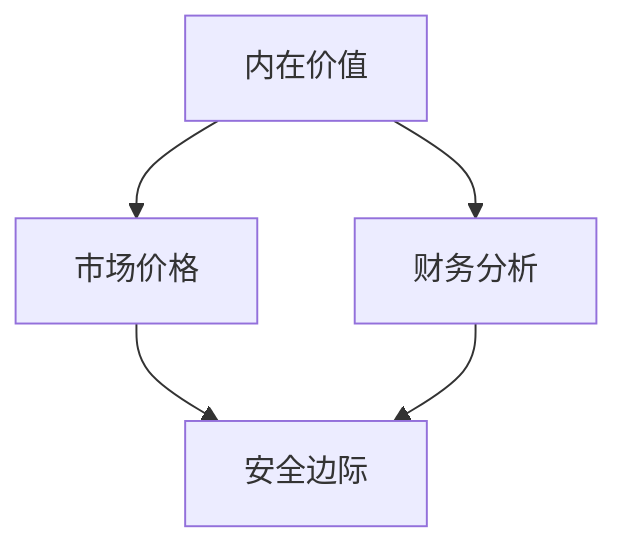
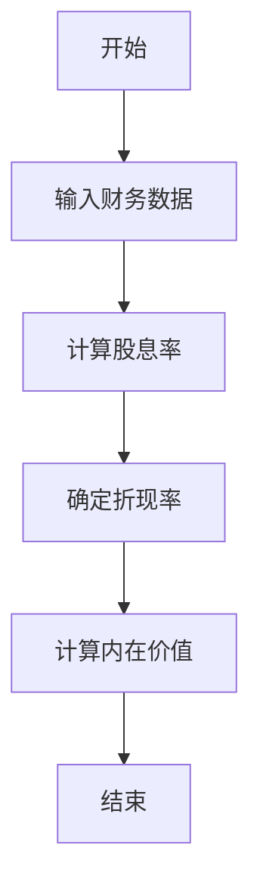

                 


```markdown
# 格雷厄姆·多德的固定收益证券分析方法

## 关键词：固定收益证券，格雷厄姆·多德，价值投资，内在价值，安全边际

## 摘要：格雷厄姆·多德的固定收益证券分析方法是一种基于价值投资的策略，通过深入分析财务报表和市场状况，计算内在价值并设置安全边际来选择投资标的。本文详细阐述了该方法的核心理念、数学模型、系统架构及实际案例，帮助读者全面掌握这一经典投资方法。

---

# 第1章: 固定收益证券的基本概念

## 1.1 固定收益证券的定义与特点
### 1.1.1 固定收益证券的定义
固定收益证券是指那些定期支付固定利息，并在特定时间偿还本金的金融工具。这类证券包括国债、企业债、市政债等。

### 1.1.2 固定收益证券的核心特点
1. **固定利息支付**：投资者在约定时间内获得固定的利息收入。
2. **本金偿还**：在债券到期时，发行人必须偿还本金。
3. **风险可控**：相对于股票，固定收益证券的风险较低，回报相对稳定。

### 1.1.3 固定收益证券的分类
1. **国债**：由政府发行，信用风险最低。
2. **企业债**：由企业发行，信用风险较高。
3. **市政债**：由地方政府发行，信用风险介于国债和企业债之间。

## 1.2 格雷厄姆·多德分析方法的背景
### 1.2.1 价值投资的起源
价值投资是一种投资策略，强调购买低于其内在价值的资产。这一理念由本杰明·格雷厄姆和戴维·多德在20世纪初提出。

### 1.2.2 多德对固定收益证券的贡献
多德进一步发展了格雷厄姆的理论，尤其是在固定收益证券的分析方法上，提出了更为系统的内在价值计算模型。

### 1.2.3 分析方法的应用场景
格雷厄姆·多德分析方法适用于评估固定收益证券的内在价值，帮助投资者识别被市场低估的债券。

## 1.3 格雷厄姆·多德分析的核心理念
### 1.3.1 股票的内在价值
内在价值是基于公司基本面计算出的理论价值，与市场波动无关。

### 1.3.2 市场先生与投资者心态
格雷厄姆提出的“市场先生”概念提醒投资者不要受市场情绪影响，而是关注内在价值。

### 1.3.3 安全边际的概念
安全边际是指内在价值与市场价格之间的差异，确保在市场价格波动时仍能获得收益。

---

# 第2章: 格雷厄姆·多德分析方法的核心框架

## 2.1 格雷厄姆·多德分析方法的步骤
### 2.1.1 确定投资目标
明确投资目标，如追求稳定收益或长期资本增值。

### 2.1.2 分析财务报表
通过分析公司的财务报表，评估其盈利能力和财务健康状况。

### 2.1.3 计算内在价值
基于财务数据和市场环境，计算债券的内在价值。

## 2.2 核心概念与联系
### 2.2.1 内在价值计算模型
内在价值是基于未来现金流的折现计算得出的。

### 2.2.2 财务比率分析
关键财务比率包括市盈率、市净率、股息率等，用于评估资产的估值。

### 2.2.3 安全边际的量化
通过比较市场价格与内在价值，确定安全边际的大小。

## 2.3 核心概念对比表
| 概念                | 格雷厄姆·多德方法       | 其他方法         |
|---------------------|-----------------------|-----------------|
| 核心理念            | 内在价值与安全边际     | 市场趋势与技术分析|
| 分析步骤            | 财务分析与价值评估     | 价格波动与形态分析|
| 应用场景            | 稳定收益与长期投资     | 短期交易与投机   |

## 2.4 核心概念对比图


---

# 第3章: 格雷厄姆·多德分析的数学模型

## 3.1 内在价值计算公式
### 3.1.1 股息贴现模型（DDM）
股息贴现模型用于计算股票的内在价值，公式为：
$$ V = \frac{D}{r - g} $$
其中，\(D\) 是股息，\(r\) 是折现率，\(g\) 是股息增长率。

### 3.1.2 股权自由现金流模型（FCFE）
股权自由现金流模型用于计算股权的价值，公式为：
$$ V = \frac{FCFE}{r - g} $$

## 3.2 数学模型的详细推导
### 3.2.1 股息贴现模型的公式推导
股息贴现模型假设股息以恒定增长率 \(g\) 增长，未来现金流的现值即为股票的内在价值。

### 3.2.2 股权自由现金流模型的公式推导
股权自由现金流模型假设股权现金流以恒定增长率 \(g\) 增长，未来现金流的现值即为股权的内在价值。

## 3.3 实际案例分析
### 3.3.1 某公司股票的内在价值计算
假设某公司股息为 $1，折现率为 10%，股息增长率为 5%，则其内在价值为：
$$ V = \frac{1}{0.10 - 0.05} = 20 $$

### 3.3.2 案例分析的步骤与结果
1. 收集财务数据，计算股息和增长率。
2. 应用股息贴现模型计算内在价值。
3. 比较市场价格与内在价值，确定安全边际。

## 3.4 算法原理与流程图


---

# 第4章: 系统分析与架构设计

## 4.1 系统分析框架
### 4.1.1 问题场景介绍
设计一个固定收益证券分析系统，帮助投资者计算内在价值并评估安全边际。

### 4.1.2 系统功能需求
1. 数据采集模块：获取公司财务数据。
2. 分析模块：计算内在价值和安全边际。
3. 报告生成模块：输出分析结果。

### 4.1.3 系统功能模块划分
1. 数据采集模块
2. 数据分析模块
3. 报告生成模块

## 4.2 系统架构设计
### 4.2.1 系统架构图


### 4.2.2 系统交互图


---

# 第5章: 项目实战

## 5.1 环境安装
1. 安装Python编程环境。
2. 安装相关库，如pandas、numpy。

## 5.2 系统核心实现源代码
```python
import pandas as pd

def calculate_intrinsic_value(dividends, growth_rate, discount_rate):
    return dividends / (discount_rate - growth_rate)

# 示例数据
dividends = 1
growth_rate = 0.05
discount_rate = 0.10

# 计算内在价值
intrinsic_value = calculate_intrinsic_value(dividends, growth_rate, discount_rate)
print(f"内在价值为：{intrinsic_value}")
```

## 5.3 代码应用解读与分析
上述代码实现了股息贴现模型的计算，用户可以根据实际情况调整输入参数。

## 5.4 实际案例分析
假设某公司股息为 $1，折现率为 10%，股息增长率为 5%，则其内在价值为 20。

## 5.5 项目小结
通过本项目，读者可以掌握格雷厄姆·多德分析方法的实际应用，并能够编写简单的Python代码进行计算。

---

# 第6章: 最佳实践

## 6.1 小结
格雷厄姆·多德分析方法是一种基于内在价值的投资策略，通过计算内在价值和设置安全边际来选择投资标的。

## 6.2 注意事项
1. 分析过程中需结合市场实际情况。
2. 定期更新财务数据和市场信息。
3. 风险控制是投资成功的关键。

## 6.3 拓展阅读
建议读者阅读《证券分析》（作者：本杰明·格雷厄姆、戴维·多德）以深入理解该方法。

---

# 作者：AI天才研究院/AI Genius Institute & 禅与计算机程序设计艺术 /Zen And The Art of Computer Programming
```

