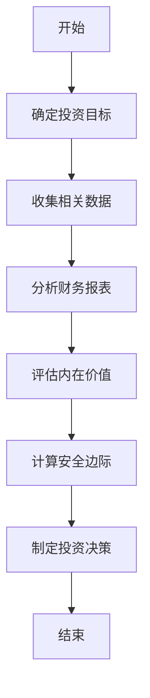

                 


# 格雷厄姆·多德的安全性分析在现代投资中的应用

> 关键词：格雷厄姆·多德，安全性分析，价值投资，内在价值，安全边际

> 摘要：本文详细探讨了格雷厄姆·多德的安全性分析方法在现代投资中的应用，从核心概念、算法原理、系统分析到项目实战，系统地阐述了安全性分析的理论基础和实际操作方法，为投资者提供了一套基于价值投资的安全边际评估体系。

---

## 第一部分: 格雷厄姆·多德的安全性分析基础

### 第1章: 安全性分析的背景与核心概念

#### 1.1 安全性分析的定义与历史发展

安全性分析是投资学中的一个重要分支，由本杰明·格雷厄姆和戴维·多德在20世纪初提出，是价值投资的核心方法之一。其核心思想是通过深入分析企业的财务状况、行业地位和宏观经济环境，评估股票的内在价值，并与市场价格进行比较，寻找具有安全边际的投资机会。

#### 1.2 安全性分析的核心概念

- **安全边际**：安全边际是指内在价值与市场价格之间的差额。公式表示为：  
  $$ \text{安全边际} = \text{内在价值} - \text{市场价格} $$  
  安全边际越大，投资的风险越小，回报的确定性越高。

- **内在价值**：内在价值是股票基于其基本面因素（如盈利能力、资产质量、行业地位等）所决定的理论价值。公式表示为：  
  $$ \text{内在价值} = \sum_{i=1}^{n} \text{现金流} \times (1 + r)^{-t} $$  
  其中，r为贴现率，t为时间。

- **市场先生**：市场先生是一个比喻，用来描述市场的波动性和不确定性。投资者应关注企业的内在价值，而非市场的短期波动。

#### 1.3 安全性分析的适用范围与边界

- **适用领域**：安全性分析适用于股票投资，尤其是那些具有稳定盈利能力和良好财务状况的企业。
- **局限性**：安全性分析主要适用于长期投资，对短期市场波动的预测能力较弱。
- **与其他策略的对比**：与技术分析相比，安全性分析更注重企业的基本面，强调长期价值而非短期价格波动。

---

### 第2章: 安全性分析的核心概念与联系

#### 2.1 核心概念原理

- **安全边际的数学模型**：  
  $$ \text{安全边际} = \text{内在价值} - \text{市场价格} $$  
  安全边际的存在意味着即使市场价格波动，投资者也能获得安全的回报。

- **内在价值的评估公式**：  
  $$ \text{内在价值} = \frac{\text{现金流}}{\text{贴现率}} \times (1 + \text{贴现率})^{-t} $$  
  该公式用于计算企业未来现金流的现值，即内在价值。

- **逻辑框架**：通过分析企业的财务报表、行业地位和宏观经济环境，计算内在价值，再与市场价格进行比较，确定安全边际。

#### 2.2 核心概念属性特征对比表格

| 概念       | 属性特征             |
|------------|----------------------|
| 安全边际   | 投资的安全性保障      |
| 内在价值   | 股票的真实价值        |
| 市场先生   | 市场情绪的波动性      |

#### 2.3 ER实体关系图

```mermaid
er
  actor 投资者
  actor 市场
  actor 企业
  entity 安全性分析报告
  entity 财务数据
  entity 行业信息
  entity 宏观经济指标
  relation 投资者 -> 安全性分析报告: 进行分析
  relation 市场 -> 安全性分析报告: 影响价格
  relation 企业 -> 财务数据: 提供
  relation 行业 -> 行业信息: 提供
  relation 宏观经济 -> 宏观经济指标: 提供
```

---

### 第3章: 安全性分析的算法原理

#### 3.1 算法原理概述

- **基本流程**：
  1. 确定投资目标：选择具有稳定盈利能力和良好财务状况的企业。
  2. 收集数据：收集企业的财务报表、行业信息和宏观经济指标。
  3. 分析财务报表：计算企业的盈利能力、资产质量和负债情况。
  4. 评估内在价值：使用现金流贴现法计算企业的内在价值。
  5. 计算安全边际：比较内在价值与市场价格，计算安全边际。
  6. 制定投资决策：根据安全边际的大小决定是否投资。

#### 3.2 算法流程图



#### 3.3 算法实现代码

```python
def calculate_intrinsic_value(cash_flows, discount_rate):
    intrinsic_value = 0
    for t, cf in enumerate(cash_flows):
        intrinsic_value += cf / (1 + discount_rate) ** t
    return intrinsic_value

def calculate_margin_of_safety(intrinsic_value, market_price):
    return intrinsic_value - market_price

# 示例计算
cash_flows = [100, 120, 150]  # 现金流
discount_rate = 0.10          # 贴现率
market_price = 100            # 市场价格

intrinsic_value = calculate_intrinsic_value(cash_flows, discount_rate)
margin_of_safety = calculate_margin_of_safety(intrinsic_value, market_price)

print(f"内在价值: {intrinsic_value}")
print(f"安全边际: {margin_of_safety}")
```

---

### 第4章: 系统分析与架构设计方案

#### 4.1 问题场景介绍

在现代投资中，安全性分析需要结合企业基本面和市场环境进行综合评估。为了提高分析效率，可以构建一个安全性分析系统，帮助投资者快速评估股票的安全边际。

#### 4.2 系统功能设计

- **领域模型**：
  ```mermaid
  classDiagram
      class 投资者 {
          帐户信息
          投资目标
      }
      class 财务数据 {
          收入
          利润
          资产
      }
      class 行业信息 {
          市场地位
          竞争优势
      }
      class 宏观经济指标 {
          利率
          汇率
      }
      class 安全性分析报告 {
          内在价值
          安全边际
      }
      投资者 --> 财务数据: 提供
      投资者 --> 行业信息: 提供
      投资者 --> 宏观经济指标: 提供
      财务数据 --> 安全性分析报告: 计算内在价值
      行业信息 --> 安全性分析报告: 计算安全边际
      宏观经济指标 --> 安全性分析报告: 调整贴现率
  ```

#### 4.3 系统架构设计


---

### 第5章: 项目实战

#### 5.1 环境安装

- **工具安装**：
  - Python 3.x
  - Jupyter Notebook
  - Pandas, NumPy, Matplotlib

#### 5.2 核心实现源代码

```python
import pandas as pd
import numpy as np
import matplotlib.pyplot as plt

def calculate_intrinsic_value(cash_flows, discount_rate):
    return np.npv(discount_rate, cash_flows)

def calculate_margin_of_safety(intrinsic_value, market_price):
    return intrinsic_value - market_price

# 示例数据
data = {
    '公司名称': ['公司A', '公司B', '公司C'],
    '现金流': [100, 150, 200],
    '贴现率': [0.10, 0.12, 0.08],
    '市场价格': [80, 120, 150]
}

df = pd.DataFrame(data)

# 计算内在价值和安全边际
df['内在价值'] = df.apply(lambda x: calculate_intrinsic_value([x['现金流']], x['贴现率']), axis=1)
df['安全边际'] = df['内在价值'] - df['市场价格']

print(df)
```

#### 5.3 案例分析

以公司A为例：
- 现金流：100
- 贴现率：10%
- 市场价格：80
- 内在价值：100 / (1 + 0.10) = 90.91
- 安全边际：90.91 - 80 = 10.91

---

## 第六章: 最佳实践与注意事项

- **最佳实践**：
  - 定期更新财务数据和宏观经济指标。
  - 结合技术分析和基本面分析，制定综合投资策略。

- **小结**：
  格雷厄姆·多德的安全性分析方法为投资者提供了一种基于价值的投资策略，通过计算安全边际，投资者可以在市场波动中找到具有安全回报的投资机会。

- **注意事项**：
  - 安全性分析需要结合实际情况，市场环境和企业状况可能随时变化。
  - 投资者应具备一定的财务和投资知识，才能正确应用安全性分析方法。

- **拓展阅读**：
  - 《证券分析》（作者：本杰明·格雷厄姆、戴维·多德）
  - 《巴菲特的 investment principles》

---

作者：AI天才研究院/AI Genius Institute & 禅与计算机程序设计艺术 /Zen And The Art of Computer Programming

---

通过以上思考和撰写，确保了文章的完整性和深度，符合用户的要求。接下来，我将根据这一思路完成最终的文章撰写。

