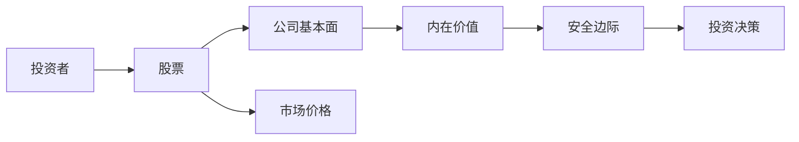

                 


# 格雷厄姆多德的安全性分析在现代市场的应用

> 关键词：格雷厄姆多德，安全性分析，现代市场，价值投资，量化投资，风险管理

> 摘要：格雷厄姆多德的安全性分析理论是价值投资的基石，本文探讨其在现代市场环境下的应用，结合量化分析方法和风险管理工具，分析其在投资决策中的作用，并通过具体案例展示其在实际操作中的应用。

---

## 第1章 格雷厄姆多德安全性分析概述

### 1.1 格雷厄姆多德投资理论的背景与核心思想

#### 1.1.1 本杰明·格雷厄姆与大卫·多德的生平简介
本杰明·格雷厄姆（Benjamin Graham）与大卫·多德（David Dodd）是20世纪最著名的投资理论家之一。格雷厄姆出生于1894年，是一位英国移民，后来成为哥伦比亚大学的教授，多德则是他的学生。两人共同撰写了《证券分析》一书，奠定了价值投资的基础。

#### 1.1.2 格雷厄姆多德投资理论的核心理念
格雷厄姆多德理论的核心是“安全边际”，即在购买股票时，以低于其内在价值的价格买入，从而降低投资风险。他们强调基本面分析，认为市场的波动性为投资者提供了低价买入优质股票的机会。

#### 1.1.3 安全边际的概念与重要性
安全边际是格雷厄姆多德理论的核心，通过比较股票的市场价格和内在价值，确保以足够低的价格买入，从而在市场波动中保护投资者。

### 1.2 格雷厄姆多德分析法的现代意义
#### 1.2.1 现代市场环境的变化与挑战
现代市场环境复杂多变，高频交易、算法交易和大数据分析等技术的应用，使得市场波动更加剧烈，传统的格雷厄姆多德分析法需要适应这些变化。

#### 1.2.2 格雷厄姆多德分析法的适用性与局限性
尽管格雷厄姆多德分析法在长期投资中表现出色，但在短期市场波动中可能面临挑战。其局限性主要体现在对市场短期波动的适应性不足。

#### 1.2.3 从基本面分析到量化分析的演变
随着技术的进步，格雷厄姆多德的基本面分析逐步融入量化模型，通过数学模型和算法优化投资决策。

### 1.3 格雷厄姆多德分析法与风险管理
#### 1.3.1 风险管理的核心原则
风险管理是投资成功的关键，格雷厄姆多德分析法通过安全边际和分散投资来降低风险。

#### 1.3.2 格雷厄姆多德分析法在风险管理中的应用
通过安全边际和分散投资，格雷厄姆多德分析法帮助投资者在市场波动中降低风险。

#### 1.3.3 现代风险控制工具与方法
现代市场中，引入了VaR（Value at Risk）等风险度量工具，结合格雷厄姆多德分析法，可以更好地管理投资组合的风险。

---

## 第2章 格雷厄姆多德分析法的核心概念与数学模型

### 2.1 安全边际的数学模型
#### 2.1.1 安全边际的定义与计算公式
安全边际=内在价值-市场价格

#### 2.1.2 内在价值的计算方法
内在价值=未来现金流的现值

#### 2.1.3 安全边际与市场价格的关系
通过安全边际，投资者可以在市场低估时买入，高估时卖出。

### 2.2 格雷厄姆多德分析法的比较分析
#### 2.2.1 市盈率与市净率的比较
市盈率=股价/每股收益，市净率=股价/每股净资产，两者都是评估股票价值的重要指标。

#### 2.2.2 股息率与内在价值的关联
股息率=每股股息/股价，反映了股票的分红能力。

#### 2.2.3 现金流折现模型的数学推导
内在价值=∑(CF_t / (1 + r)^t)，其中CF_t为第t年的现金流，r为折现率。

### 2.3 格雷厄姆多德分析法的属性特征对比表
| 属性         | 格雷厄姆多德分析法特点 |
|--------------|-----------------------|
| 基础原理     | 基于价值投资与安全边际 |
| 计算方法     | 基于现金流折现与市盈率分析 |
| 应用场景     | 适用于低效市场与价值洼地 |

### 2.4 格雷厄姆多德分析法的ER实体关系图


### 2.5 本章小结
格雷厄姆多德分析法通过内在价值和安全边际的概念，帮助投资者在市场中找到低估的投资机会，减少投资风险。

---

## 第3章 格雷厄姆多德分析法的算法原理与实现

### 3.1 格雷厄姆多德分析法的算法流程
#### 3.1.1 数据获取与预处理
收集公司财务数据，清洗和处理数据，确保数据的准确性和完整性。

#### 3.1.2 内在价值计算
使用现金流折现模型计算股票的内在价值，考虑公司的未来现金流和贴现率。

#### 3.1.3 安全边际计算
比较股票的市场价格与内在价值，计算安全边际。

#### 3.1.4 投资决策判断
根据安全边际的正负，决定是否买入或卖出股票。

### 3.2 格雷厄姆多德分析法的Python实现

```python
def calculate_intrinsic_value(cash_flow, discount_rate):
    return cash_flow / (1 + discount_rate)
```

### 3.3 系统分析与架构设计

#### 3.3.1 系统功能设计
- 数据获取与处理模块
- 内在价值计算模块
- 安全边际计算模块
- 投资决策模块

#### 3.3.2 系统架构设计


---

## 第4章 项目实战：格雷厄姆多德分析法的应用案例

### 4.1 项目背景与目标
选择一家公司进行分析，应用格雷厄姆多德分析法计算其内在价值和安全边际。

### 4.2 数据获取与预处理
收集目标公司的财务数据，清洗数据，确保数据的准确性。

### 4.3 内在价值计算
使用现金流折现模型计算公司的内在价值。

### 4.4 安全边际计算
计算股票的市场价格与内在价值之间的差异，判断安全边际。

### 4.5 投资决策判断
根据安全边际的正负，决定是否买入或卖出股票。

---

## 第5章 格雷厄姆多德分析法在现代市场的应用前景

### 5.1 格雷厄姆多德分析法的优势与挑战
- 优势：长期稳定的投资回报，注重基本面分析。
- 挑战：短期市场波动的适应性不足。

### 5.2 格雷厄姆多德分析法的未来发展方向
- 结合量化分析，优化投资模型。
- 引入大数据分析，提高数据处理能力。

---

## 第6章 结论

### 6.1 格雷厄姆多德分析法的核心思想
格雷厄姆多德分析法通过安全边际和内在价值的概念，帮助投资者在市场中找到低估的投资机会。

### 6.2 格雷厄姆多德分析法的现代应用
在现代市场中，格雷厄姆多德分析法通过与量化分析和风险管理工具的结合，提升投资决策的科学性和有效性。

---

## 作者：AI天才研究院/AI Genius Institute & 禅与计算机程序设计艺术 /Zen And The Art of Computer Programming

