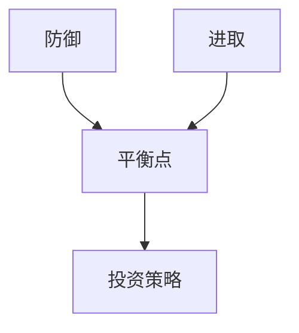
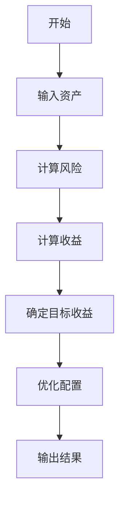
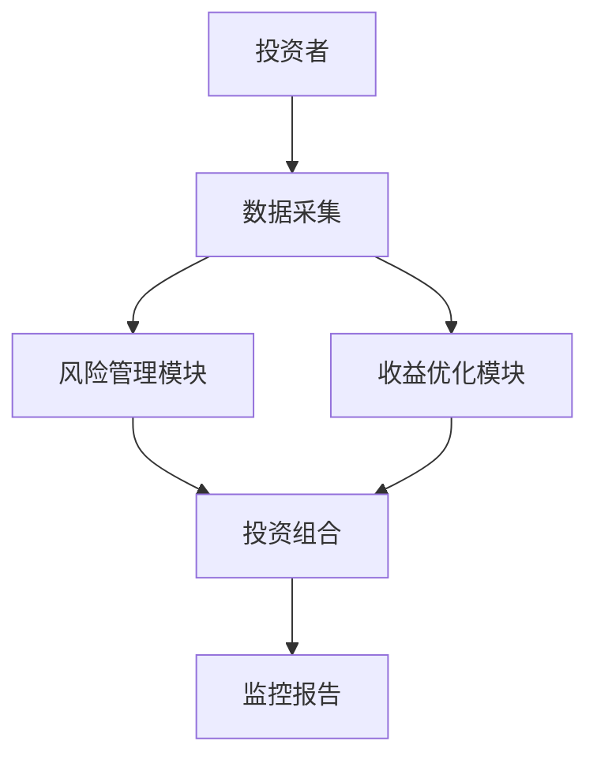

                 


# 《格雷厄姆的'中庸之道'：在防御与进取之间找平衡》

## 关键词：投资学，防御与进取，中庸之道，风险管理，资产配置，投资策略

## 摘要

本文探讨了格雷厄姆提出的“中庸之道”在投资中的应用，重点分析了防御与进取之间的平衡点。通过理论与实践相结合，本文提出了风险管理模型、资产配置策略，并通过案例分析展示了如何在实际投资中应用这些方法，帮助投资者在不同市场环境下实现稳健收益。

---

## 第一部分：背景介绍

### 第1章：投资学基础与中庸之道的起源

#### 1.1 投资学的基本概念

投资是指将资金投入某一项目或资产，以期在未来获得收益的行为。投资的核心在于通过科学的分析和决策，最大化收益并最小化风险。投资学作为一门研究资金流动、资产定价和投资决策的学科，为投资者提供了理论基础和工具。

#### 1.2 中庸之道的哲学基础

中庸之道是中国传统文化中的一个重要概念，源自儒家思想，强调在事物两端寻找平衡点，避免极端。在投资中，中庸之道体现在避免过于保守或激进，寻找风险与收益的平衡。

#### 1.3 防御与进取的定义与特点

- **防御性投资**：以稳健收益为目标，注重本金安全，风险较低。适合风险厌恶型投资者，如债券、货币市场工具等。
- **进取性投资**：追求高收益，风险较高。适合风险承受能力强的投资者，如股票、高风险债券等。

---

### 第2章：防御与进取的平衡点

#### 2.1 防御与进取的相互关系

防御与进取并非对立，而是相辅相成。在市场波动时，防御性资产可保护本金，而进取性资产则在市场上涨时带来超额收益。平衡点在于根据市场环境调整两者的比例。

#### 2.2 平衡点的定义与意义

平衡点是指在投资组合中，防御与进取资产的配置比例达到最优，既保证本金安全，又追求适度收益。通过动态调整比例，投资者可在不同市场环境中保持稳健投资。

#### 2.3 概念属性特征对比表格

| 概念 | 属性 | 特征 |
|------|------|------|
| 防御 | 稳定性 | 低风险 |
| 进取 | 收益性 | 高风险 |

#### 2.4 ER实体关系图



---

## 第二部分：算法原理讲解

### 第3章：风险评估与资产配置

#### 3.1 风险评估模型

风险评估是投资决策的关键步骤。通过评估资产的波动性、相关性和市场敏感性，投资者可以量化潜在风险。

- **波动性**：资产价格的波动程度，通常用标准差衡量。
- **相关性**：资产价格变动的相关性，影响投资组合的分散效果。
- **市场敏感性**：资产对市场变动的反应程度，通常用贝塔系数衡量。

#### 3.2 资产配置模型

资产配置是投资组合管理的核心，涉及决定各类资产的权重。常用模型包括现代投资组合理论和风险平价模型。

- **现代投资组合理论（MPT）**：由哈里·马科维茨提出，强调通过分散投资降低风险。
- **风险平价模型**：根据资产的风险贡献进行配置，平衡风险与收益。

#### 3.3 算法流程图



---

## 第三部分：系统分析与架构设计

### 第4章：防御与进取平衡的投资系统

#### 4.1 系统功能设计

- **输入模块**：接收市场数据和投资者偏好。
- **处理模块**：计算风险和收益，优化配置。
- **输出模块**：生成投资策略和监控报告。

#### 4.2 系统架构设计



---

## 第四部分：项目实战

### 第5章：投资组合模拟与代码实现

#### 5.1 环境安装

- Python 3.8+
- 导入必要的库：pandas、numpy、matplotlib、scipy.optimize

#### 5.2 核心代码实现

```python
import numpy as np
import pandas as pd
import matplotlib.pyplot as plt
from scipy.optimize import minimize

def portfolio_var(weights, covariance_matrix):
    return np.dot(weights.T, np.dot(covariance_matrix, weights))

def min_variance(weights, covariance_matrix):
    return minimize(portfolio_var, weights, args=covariance_matrix, 
                   method='SLSQP', bounds=[(0,1), (0,1)], constraints={'type': 'eq', 'fun': lambda w: np.sum(w)-1})

# 示例数据：两只资产的协方差矩阵
cov_matrix = np.array([[0.01, 0.005], [0.005, 0.02]])
weights = np.array([0.5, 0.5])

result = min_variance(weights, cov_matrix)
print('最小方差权重：', result.x)
```

---

## 第五部分：总结与最佳实践

### 第6章：总结与注意事项

#### 6.1 总结

格雷厄姆的中庸之道强调在防御与进取之间找到平衡，通过科学的资产配置和风险管理，投资者可以在不同市场环境下实现稳健收益。

#### 6.2 最佳实践 tips

- 定期调整投资组合，根据市场变化优化配置。
- 结合个人风险承受能力，选择合适的投资策略。
- 长期投资，避免频繁交易。

---

## 作者：AI天才研究院 & 禅与计算机程序设计艺术

---

这篇博客通过系统地分析防御与进取的平衡点，结合理论与实践，为投资者提供了科学的投资策略。希望读者能够通过本文，理解并应用中庸之道，实现稳健的投资收益。

