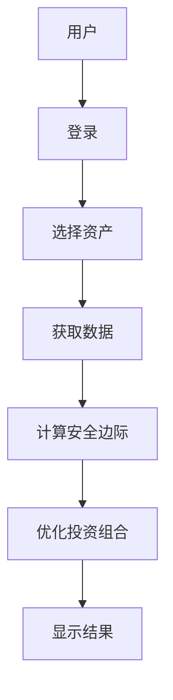
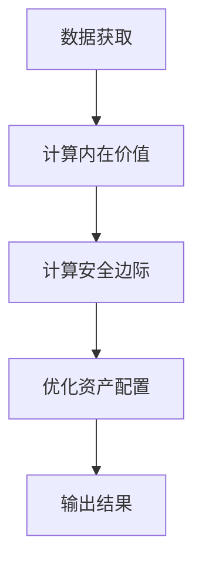

                 


# 《格雷厄姆的'保证金安全'概念：确保投资本金安全》

## 关键词：保证金安全, 投资本金安全, 格雷厄姆投资理论, 安全边际, 风险控制, 投资组合优化, 现金流折现法

## 摘要：  
本文深入探讨了格雷厄姆的“保证金安全”概念，分析其在投资本金保护中的核心作用。通过理论解析、数学建模、系统设计和项目实战，阐述了如何利用安全边际、资产估值和投资组合优化等方法确保资金安全，实现稳健收益。文章结合现代投资理论和实际案例，为投资者提供了科学的投资策略和风险管理方法。

---

# 第1章: 保证金安全的定义与背景

## 1.1 保证金安全的核心概念

### 1.1.1 保证金安全的定义
保证金安全是指在投资过程中，通过合理配置资产和控制风险，确保投资本金不受损失或尽可能减少损失的策略。其核心在于在不确定的市场环境中，通过科学的方法评估资产的真实价值，并在此基础上进行投资决策。

### 1.1.2 保证金安全的核心要素
1. **安全边际**：投资标的市场价格低于其内在价值的部分，是本金安全的重要保障。
2. **风险控制**：通过分散投资、止损机制等手段降低投资风险。
3. **资产配置**：根据市场环境和个人风险承受能力，合理分配不同类型资产的比例。

### 1.1.3 保证金安全与本金安全的关系
保证金安全是实现本金安全的核心策略。通过保证金安全机制，投资者能够在市场波动中保护本金，确保投资目标的实现。

## 1.2 保证金安全的背景与问题背景

### 1.2.1 投资市场的风险与不确定性
投资市场充满了不确定性，价格波动、经济周期变化和政策调整都可能影响投资收益。在这样的环境中，如何保护本金成为投资者的核心关注点。

### 1.2.2 保证金安全问题的提出
在股票、债券等金融资产的投资中，投资者往往面临市场价格波动的风险。为了确保本金安全，需要引入保证金安全机制，通过安全边际和资产估值等方法，降低投资风险。

### 1.2.3 格雷厄姆投资理论的启示
格雷厄姆的投资理论强调“安全边际”和“价值投资”，主张以低于内在价值的价格买入资产，从而在市场波动中保护本金安全。这种理论为保证金安全机制提供了理论基础。

## 1.3 保证金安全的核心目标

### 1.3.1 投资本金的保护
通过合理配置资产和控制风险，确保投资本金在市场波动中不受损失或尽可能减少损失。

### 1.3.2 风险控制的实现
通过安全边际和分散投资等策略，降低投资组合的整体风险，确保投资目标的实现。

### 1.3.3 投资收益的稳定化
在确保本金安全的前提下，通过优化资产配置和风险管理，实现投资收益的稳定增长。

---

# 第2章: 保证金安全的核心理论与原则

## 2.1 格雷厄姆的保证金安全理论

### 2.1.1 安全边际的概念
安全边际是投资标的市场价格与内在价值之间的差额。它反映了市场对资产价值的低估程度，是投资安全的重要保障。

### 2.1.2 资产评估的核心原则
格雷厄姆强调通过现金流折现法评估资产的内在价值，确保以低于内在价值的价格买入资产，从而在市场波动中保护本金安全。

### 2.1.3 投资决策的逻辑框架
1. **评估资产的内在价值**：通过现金流折现法计算资产的真实价值。
2. **确定安全边际**：计算市场价格与内在价值的差额，确保有足够的安全边际。
3. **构建投资组合**：根据安全边际和风险承受能力，合理分配资产。

## 2.2 保证金安全的核心原则

### 2.2.1 风险控制的第一性原理
在投资过程中，风险控制是首要原则。通过分散投资、设置止损点等方法，降低投资组合的整体风险。

### 2.2.2 资产配置的分散化策略
将资金分配到不同资产类别（如股票、债券、现金等）和不同行业，降低特定资产或行业波动带来的风险。

### 2.2.3 投资组合的动态调整
根据市场环境和资产价值的变化，定期调整投资组合，优化资产配置，确保本金安全。

## 2.3 格雷厄姆投资策略的现代应用

### 2.3.1 安全边际的计算方法
1. **内在价值计算**：使用现金流折现法评估资产的内在价值。
2. **安全边际计算**：市场价格 - 内在价值 = 安全边际。

### 2.3.2 资产评估的多维度分析
结合市盈率、市净率等估值指标，全面评估资产的价值，确保安全边际的合理性。

### 2.3.3 投资组合的风险管理
通过现代投资组合理论（MPT）优化资产配置，降低投资组合的整体风险。

---

# 第3章: 保证金安全的数学模型与算法原理

## 3.1 安全边际的数学模型

### 3.1.1 安全边际的计算公式
$$\text{安全边际} = \text{市场价格} - \text{内在价值}$$

### 3.1.2 内在价值的评估公式
$$\text{内在价值} = \frac{\text{未来现金流}}{\text{折现率}}$$

### 3.1.3 安全边际与投资决策的关系
通过计算安全边际，投资者可以判断投资标的是否具有足够的安全空间，从而做出科学的投资决策。

## 3.2 投资组合的风险评估与优化

### 3.2.1 风险-收益权衡的数学模型
$$\text{收益} = \sum w_i \times r_i$$
$$\text{风险} = \sqrt{\sum w_i^2 \times \sigma_i^2}$$
其中，\(w_i\) 是资产 \(i\) 的权重，\(r_i\) 是资产 \(i\) 的预期收益，\(\sigma_i\) 是资产 \(i\) 的收益波动率。

### 3.2.2 现代投资组合理论（MPT）的应用
通过优化资产配置，使投资组合的预期收益最大化，同时最小化风险。

### 3.2.3 算法实现
1. **输入参数**：资产的预期收益、波动率和相关系数。
2. **计算最优权重**：使用拉格朗日乘数法求解最优资产配置。
3. **输出结果**：最优收益、最优风险和资产权重。

## 3.3 保证金安全的算法实现

### 3.3.1 安全边际计算的Python代码
```python
def calculate_margin_of_safety(price, intrinsic_value):
    return price - intrinsic_value
```

### 3.3.2 投资组合风险评估的Python代码
```python
import numpy as np

def portfolio_risk(weights, returns, cov_matrix):
    variance = np.dot(weights.T, np.dot(cov_matrix, weights))
    return np.sqrt(variance)
```

---

# 第4章: 系统分析与架构设计

## 4.1 问题场景介绍
在本文中，我们将设计一个基于格雷厄姆保证金安全理论的投资管理系统，帮助投资者实现投资本金的安全和收益的稳定增长。

## 4.2 系统功能设计

### 4.2.1 功能模块划分
1. **数据获取模块**：获取投资标的的市场数据和财务数据。
2. **安全边际计算模块**：计算投资标的的安全边际。
3. **投资组合优化模块**：优化资产配置，降低投资风险。

### 4.2.2 系统架构设计
使用分层架构，包括数据层、业务逻辑层和用户界面层。

### 4.2.3 系统接口设计
1. **数据接口**：提供API获取市场数据。
2. **用户接口**：提供友好的用户界面，方便用户进行投资决策。

## 4.3 系统交互流程

### 4.3.1 系统交互流程图


### 4.3.2 系统功能流程图


---

# 第5章: 项目实战

## 5.1 环境配置

### 5.1.1 Python环境安装
安装Python和必要的库（如Pandas、NumPy、Matplotlib）。

### 5.1.2 数据源获取
从Yahoo Finance获取股票数据。

## 5.2 核心代码实现

### 5.2.1 安全边际计算代码
```python
import pandas as pd
import numpy as np

def calculate_margin_of_safety(price, intrinsic_value):
    return price - intrinsic_value

# 示例数据
data = {
    '公司': ['A', 'B', 'C'],
    '价格': [100, 90, 80],
    '内在价值': [120, 100, 85]
}

df = pd.DataFrame(data)

# 计算安全边际
df['安全边际'] = df.apply(lambda x: calculate_margin_of_safety(x['价格'], x['内在价值']), axis=1)
print(df)
```

### 5.2.2 投资组合优化代码
```python
import numpy as np

def portfolio_risk(weights, returns, cov_matrix):
    variance = np.dot(weights.T, np.dot(cov_matrix, weights))
    return np.sqrt(variance)

# 示例数据
returns = np.array([0.1, 0.2, 0.15])
cov_matrix = np.array([[0.05, 0.02, 0.03],
                        [0.02, 0.06, 0.04],
                        [0.03, 0.04, 0.07]])

# 使用拉格朗日乘数法求解最优权重
weights = np.array([0.4, 0.3, 0.3])
optimal_risk = portfolio_risk(weights, returns, cov_matrix)
print(optimal_risk)
```

## 5.3 案例分析与实现解读

### 5.3.1 投资组合构建
1. **选择资产**：选择股票、债券和现金作为投资标的。
2. **计算安全边际**：根据市场价格和内在价值计算安全边际。
3. **优化资产配置**：根据风险承受能力和市场环境优化资产权重。

### 5.3.2 风险管理策略
1. **止损机制**：设定止损点，避免重大损失。
2. **动态调整**：定期重新评估投资组合，根据市场变化进行调整。

## 5.4 项目小结

### 5.4.1 实践总结
通过实际案例分析，我们验证了格雷厄姆保证金安全理论的有效性，同时展示了如何通过数学模型和算法优化投资组合。

### 5.4.2 经验分享
在实际操作中，需要结合市场环境和投资者自身风险偏好，灵活调整投资策略。

---

# 第6章: 总结与展望

## 6.1 核心理念总结

### 6.1.1 保证金安全的核心理念
通过安全边际和资产配置，确保投资本金安全，实现稳健收益。

### 6.1.2 现代投资策略的结合
将格雷厄姆理论与现代投资组合理论相结合，优化资产配置，降低投资风险。

## 6.2 未来展望

### 6.2.1 AI与大数据的应用
利用人工智能和大数据技术，进一步优化资产配置和风险管理。

### 6.2.2 投资环境的变化
随着市场的不断发展，保证金安全策略需要不断调整和优化，以适应新的投资环境。

---

# 作者：AI天才研究院/AI Genius Institute & 禅与计算机程序设计艺术 /Zen And The Art of Computer Programming

