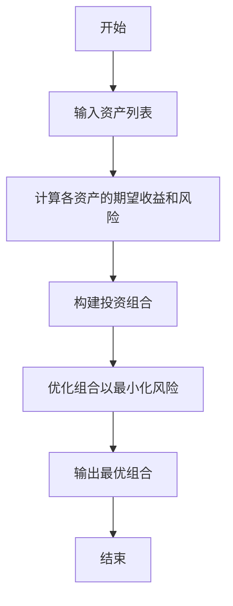
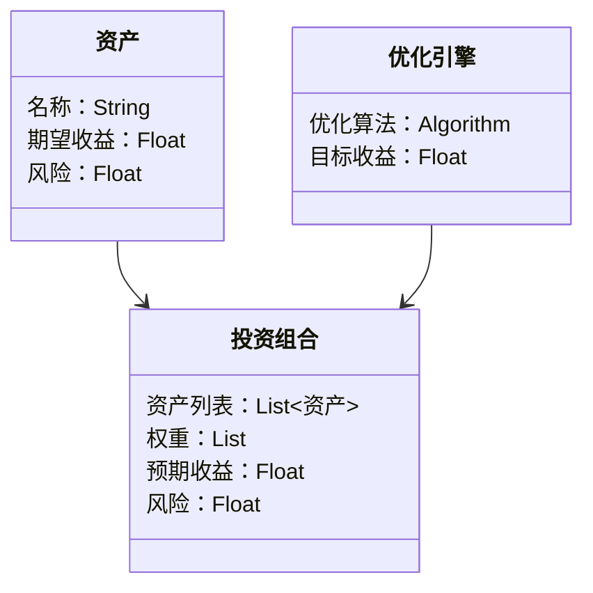
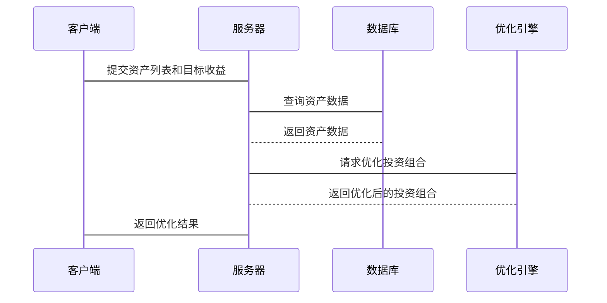

                 


# 格雷厄姆的Group Approach：分散风险的智慧

## 关键词：格雷厄姆，Group Approach，分散投资，风险管理，投资组合优化，现代投资组合理论

## 摘要：本文深入探讨了格雷厄姆的Group Approach策略，分析了其在分散投资中的核心思想和应用。通过对比传统投资与现代投资组合理论，本文详细解析了Group Approach的算法原理、系统架构及实际案例，并给出了最佳实践建议，帮助读者掌握分散投资的智慧。

---

# 第一部分: 引言

## 第1章: 分散投资的智慧

### 1.1 格雷厄姆的Group Approach概述

#### 1.1.1 分散投资的核心理念

分散投资是一种通过将资金分配到不同的资产或资产类别来降低风险的投资策略。其核心思想是“不要将所有鸡蛋放在一个篮子里”，通过多样化投资来减少特定资产或市场的波动对整体投资组合的影响。

#### 1.1.2 Group Approach的定义与特点

格雷厄姆的Group Approach是一种基于分散投资思想的具体策略，强调通过将投资组合分散到多个相关或不相关的资产或资产组别中，来优化风险与收益的平衡。其特点包括：

1. **分散性**：通过投资多个资产或资产类别降低特定风险。
2. **系统性**：采用量化方法优化投资组合。
3. **长期性**：注重长期投资，避免短期市场波动的干扰。

#### 1.1.3 格雷厄姆的投资哲学与现代投资组合理论的联系

格雷厄姆的投资哲学强调安全边际和价值投资，而现代投资组合理论（MPT）则通过数学模型优化投资组合的风险与收益。Group Approach将两者结合，既注重资产的内在价值，又通过分散投资降低风险。

---

## 1.2 分散投资的历史演变

#### 1.2.1 传统投资与现代投资组合理论的对比

- **传统投资**：基于个股或单个资产的投资，风险较高。
- **现代投资组合理论**：通过分散投资降低风险，强调资产配置和风险优化。

#### 1.2.2 Group Approach在投资策略中的地位

Group Approach作为分散投资的一种实现方式，填补了传统投资与现代投资组合理论之间的空白，为投资者提供了一种系统化、可操作的投资策略。

#### 1.2.3 分散投资在不同市场环境下的应用

无论市场环境如何变化，分散投资都能通过降低特定风险，为投资者提供更稳定的投资回报。

---

## 1.3 本章小结

本章介绍了格雷厄姆的Group Approach策略，分析了分散投资的核心理念及其在现代投资理论中的地位。通过对比传统投资与现代投资组合理论，读者可以理解Group Approach的独特价值。

---

# 第二部分: 核心概念与原理

## 第2章: Group Approach的核心概念

### 2.1 分散投资的数学模型

#### 2.1.1 投资组合的期望收益与风险模型

投资组合的期望收益可以通过加权平均计算，而风险则通过方差或标准差衡量。

- 期望收益：$$E(r_p) = \sum w_i E(r_i)$$
- 方差：$$Var(r_p) = \sum w_i^2 Var(r_i) + 2 \sum w_i w_j Cov(r_i, r_j)$$

#### 2.1.2 马科维茨投资组合理论的简化与扩展

马科维茨的投资组合理论通过优化投资组合的收益-风险比，为Group Approach提供了理论基础。Group Approach在此基础上，进一步强调资产的多样化配置。

#### 2.1.3 Group Approach的数学表达式

$$\text{Minimize } \sigma^2 \text{ subject to } \mathbf{w}^T \mathbf{r} = r_c$$

其中，$\sigma^2$ 表示投资组合的方差，$\mathbf{w}$ 是权重向量，$\mathbf{r}$ 是资产的期望收益向量，$r_c$ 是目标收益。

### 2.2 分散投资的属性特征对比

#### 2.2.1 单一投资与组合投资的对比表格

| 属性 | 单一投资 | 组合投资 |
|------|----------|----------|
| 风险 | 高       | 低       |
| 收益 | 不稳定   | 稳定     |
| 复杂度 | 低       | 高       |

#### 2.2.2 Group Approach与现代投资组合理论的ER实体关系图

```mermaid
erDiagram
    inv : 投资组合
    as : 资产
    r : 投资者
    inv --> as : 包含
    inv --> r : 属于
    as --> r : 属于
```

### 2.3 算法原理讲解

#### 2.3.1 Group Approach的算法流程图（mermaid）



---

## 第3章: Group Approach的系统架构设计

### 3.1 系统功能设计

#### 3.1.1 领域模型（mermaid 类图）



### 3.2 系统架构设计

#### 3.2.1 系统架构（mermaid 架构图）


### 3.3 系统接口设计

#### 3.3.1 接口设计

- 输入接口：资产列表、目标收益
- 输出接口：优化后的投资组合

#### 3.3.2 交互流程图（mermaid 序列图）



---

## 第4章: Group Approach的项目实战

### 4.1 环境安装与配置

#### 4.1.1 环境要求

- Python 3.8+
- numpy, pandas, matplotlib

### 4.2 核心代码实现

```python
import numpy as np

def group_approach_optimizer(asset_returns, target_return):
    # 计算协方差矩阵
    covariance_matrix = np.cov(asset_returns.T)
    
    # 初始化权重向量
    weights = np.array([1.0 / len(asset_returns)] * len(asset_returns))
    
    # 优化目标：最小化方差
    def objective(weights):
        return np.dot(weights.T, np.dot(covariance_matrix, weights))
    
    # 约束条件：权重之和为1，且满足目标收益
    constraints = [
        {'type': 'eq', 'fun': lambda w: np.sum(w) - 1},
        {'type': 'eq', 'fun': lambda w: np.dot(weights.T, asset_returns) - target_return}
    ]
    
    # 使用 scipy 优化器
    from scipy.optimize import minimize
    result = minimize(objective, weights, constraints=constraints)
    
    return result.x
```

### 4.3 代码解读与分析

上述代码通过优化算法，找到满足目标收益的最小方差投资组合。优化过程使用了scipy的最小化函数，并通过约束条件确保权重之和为1且满足目标收益。

### 4.4 实际案例分析

假设我们有三只股票，其历史收益率如下：

```python
returns = np.array([[0.1, 0.2, 0.15],
                    [0.05, 0.15, 0.1],
                    [0.2, 0.08, 0.12]])
```

通过Group Approach优化器，我们可以找到最优的投资组合。

---

## 第5章: 最佳实践与风险管理

### 5.1 分散投资的注意事项

1. **资产配置**：根据市场环境调整资产配置。
2. **再平衡**：定期调整投资组合以保持目标配置。
3. **长期视角**：分散投资的效果在长期表现更明显。

### 5.2 小结与总结

通过本文的分析，读者可以理解Group Approach的理论基础和实际应用。分散投资不仅是一种风险管理策略，更是一种科学的投资方法。

### 5.3 拓展阅读

推荐阅读格雷厄姆的《证券分析》和马科维茨的《投资组合理论》。

---

# 作者：AI天才研究院/AI Genius Institute & 禅与计算机程序设计艺术 /Zen And The Art of Computer Programming

