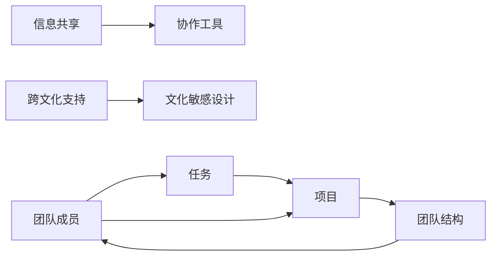
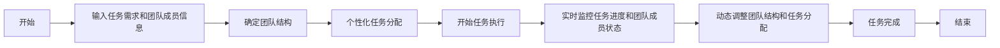
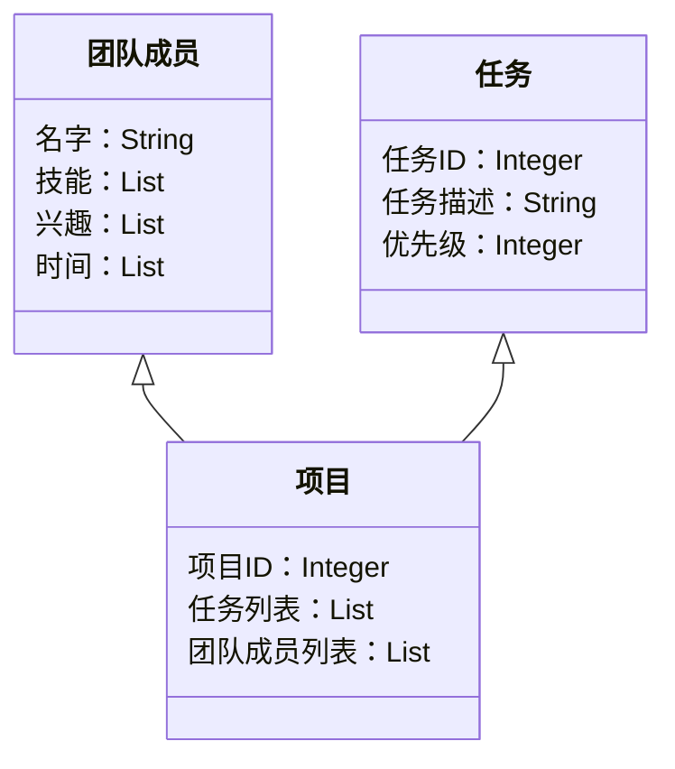
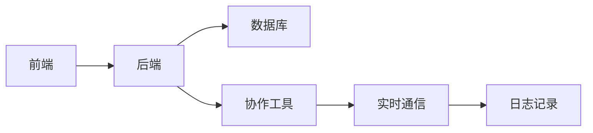
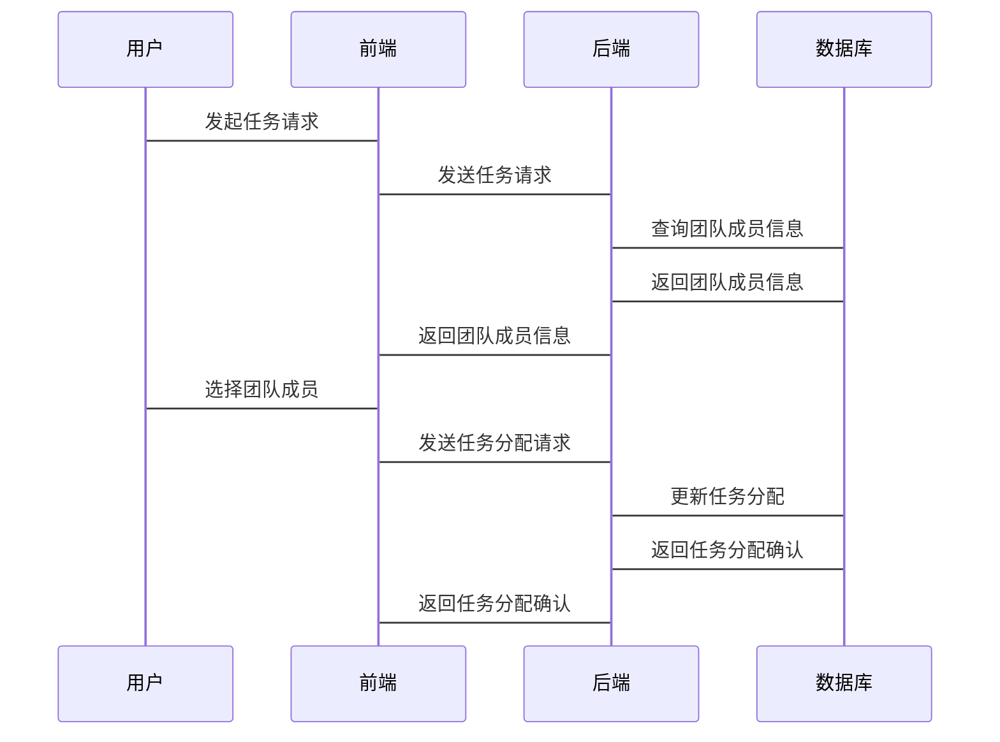

                 


# 格雷厄姆的Group Approach：在全球化背景下的新应用

## 关键词：Group Approach, 全球化协作, 组织管理, 算法原理, 数学模型, 系统架构

## 摘要：本文深入探讨格雷厄姆的Group Approach在全球化背景下的新应用，分析其核心概念、算法原理、数学模型、系统架构及实际项目案例，总结最佳实践和注意事项，为组织管理者和技术开发者提供理论与实践的双重指导。

---

## 第1章: 格雷厄姆的Group Approach背景介绍

### 1.1 问题背景

#### 1.1.1 当前全球化背景下的组织协作挑战
在当前全球化背景下，组织协作面临以下挑战：
- **地理分散性**：团队成员分布在全球各地，沟通效率低下。
- **文化差异**：不同文化背景的成员间可能存在误解和冲突。
- **信息过载**：全球化背景下信息量巨大，难以高效处理。
- **协作工具多样性**：市场上存在多种协作工具，选择合适的工具和方法至关重要。

#### 1.1.2 传统团队管理方法的局限性
传统团队管理方法的局限性主要体现在以下几个方面：
- **沟通不畅**：依赖邮件、会议等低效沟通方式，信息传递延迟。
- **任务分配不均**：缺乏有效的方法分配任务，导致部分成员负担过重，部分成员闲置。
- **缺乏动态调整**：面对突发事件或需求变化时，调整团队结构和任务分配的能力有限。
- **协作工具单一**：传统方法依赖单一协作工具，难以满足复杂协作需求。

#### 1.1.3 Group Approach的提出动机与目标
Group Approach的提出动机包括：
- **提高协作效率**：通过优化团队协作流程，提升组织整体效率。
- **动态调整能力**：能够根据需求变化快速调整团队结构和任务分配。
- **全球化适配性**：适用于全球化背景下的团队协作，支持跨时区、跨文化的工作模式。

Group Approach的目标是：
- 提供一种动态、灵活的团队协作方法，适应全球化背景下的复杂协作需求。
- 通过科学的任务分配和资源管理，提升团队整体效能。
- 降低协作过程中的沟通成本，提高团队成员的满意度。

### 1.2 问题描述

#### 1.2.1 全球化协作中的主要问题
全球化协作中的主要问题包括：
- **时差问题**：团队成员分布在不同时区，沟通不畅，协作效率低下。
- **文化差异**：不同文化背景的成员可能在沟通方式、决策风格等方面存在差异，导致协作障碍。
- **信息共享困难**：缺乏有效的信息共享机制，导致信息孤岛和重复劳动。
- **信任建立困难**：跨文化团队中信任建立较慢，影响协作效率。

#### 1.2.2 现有方法的不足与改进空间
现有团队管理方法的不足主要体现在：
- **静态结构**：传统的团队结构较为固定，难以根据需求动态调整。
- **缺乏个性化**：任务分配和角色划分过于标准化，忽视了团队成员的个性化需求。
- **协作工具单一**：依赖单一的协作工具，无法满足复杂协作需求。
- **反馈机制缺失**：缺乏实时反馈机制，难以及时发现和解决问题。

#### 1.2.3 Group Approach的核心问题域
Group Approach的核心问题域包括：
- **动态团队结构**：如何根据任务需求动态调整团队结构。
- **个性化任务分配**：如何根据团队成员的技能、兴趣和时间安排，个性化分配任务。
- **高效信息共享**：如何实现高效的信息共享和协作。
- **跨文化协作支持**：如何支持跨文化团队的协作，减少文化差异带来的障碍。

### 1.3 问题解决

#### 1.3.1 Group Approach的基本原理
Group Approach的基本原理包括：
- **动态团队结构**：根据任务需求，动态调整团队结构，确保团队成员能够高效协作。
- **个性化任务分配**：基于团队成员的技能、兴趣和时间安排，个性化分配任务，提高团队成员的积极性和效率。
- **高效信息共享**：通过先进的信息共享机制，确保团队成员能够实时获取所需信息，减少信息孤岛。
- **跨文化协作支持**：通过文化敏感的设计，支持跨文化团队的协作，减少文化差异带来的障碍。

#### 1.3.2 全球化协作中的关键问题解决方案
全球化协作中的关键问题解决方案包括：
- **动态调整团队结构**：根据任务需求和团队成员的实时状态，动态调整团队结构。
- **个性化任务分配**：基于团队成员的技能、兴趣和时间安排，个性化分配任务，确保每个人都在合适的位置上工作。
- **高效信息共享机制**：通过实时协作工具和信息共享平台，实现高效的信息共享和协作。
- **跨文化协作支持**：通过文化敏感的设计，帮助团队成员理解和尊重不同文化背景的同事，减少文化冲突。

#### 1.3.3 Group Approach的核心要素与实现路径
Group Approach的核心要素包括：
- **动态团队结构**：根据任务需求和团队成员的状态，动态调整团队结构。
- **个性化任务分配**：基于团队成员的技能、兴趣和时间安排，个性化分配任务。
- **高效信息共享机制**：通过实时协作工具和信息共享平台，实现高效的信息共享和协作。
- **跨文化协作支持**：通过文化敏感的设计，支持跨文化团队的协作，减少文化差异带来的障碍。

实现路径包括：
1. **建立动态团队结构**：根据任务需求和团队成员的状态，动态调整团队结构。
2. **个性化任务分配**：基于团队成员的技能、兴趣和时间安排，个性化分配任务。
3. **高效信息共享机制**：通过实时协作工具和信息共享平台，实现高效的信息共享和协作。
4. **跨文化协作支持**：通过文化敏感的设计，支持跨文化团队的协作，减少文化差异带来的障碍。

### 1.4 概念结构与核心要素

#### 1.4.1 Group Approach的理论框架
Group Approach的理论框架包括以下几个方面：
- **动态团队结构**：团队结构不是固定的，而是根据任务需求和团队成员的状态动态调整。
- **个性化任务分配**：任务分配基于团队成员的技能、兴趣和时间安排，确保每个人都在合适的位置上工作。
- **高效信息共享机制**：通过实时协作工具和信息共享平台，实现高效的信息共享和协作。
- **跨文化协作支持**：通过文化敏感的设计，支持跨文化团队的协作，减少文化差异带来的障碍。

#### 1.4.2 核心概念的属性特征对比表格
以下是核心概念的属性特征对比表格：

| **概念**       | **传统团队管理方法**             | **Group Approach**             |
|----------------|--------------------------------|--------------------------------|
| 团队结构         | 静态结构，固定团队                | 动态结构，根据任务需求调整      |
| 任务分配         | 标准化分配，忽视个性化需求        | 个性化分配，基于技能、兴趣和时间 |
| 信息共享         | 依赖邮件、会议等低效方式         | 实时协作工具，高效共享          |
| 跨文化支持       | 缺乏文化敏感性，容易产生冲突      | 设计支持跨文化协作，减少冲突     |

#### 1.4.3 ER实体关系图架构（Mermaid流程图）
以下是ER实体关系图架构（Mermaid流程图）：



---

## 第2章: Group Approach的核心概念原理

### 2.1 核心原理

#### 2.1.1 Group Approach的基本原理
Group Approach的基本原理包括：
- **动态调整**：团队结构可以根据任务需求和团队成员的状态动态调整。
- **个性化分配**：任务分配基于团队成员的技能、兴趣和时间安排，确保每个人都在合适的位置上工作。
- **高效协作**：通过实时协作工具和信息共享平台，实现高效的信息共享和协作。
- **跨文化支持**：通过文化敏感的设计，支持跨文化团队的协作，减少文化差异带来的障碍。

#### 2.1.2 全球化协作中的关键机制
全球化协作中的关键机制包括：
- **动态团队结构**：团队结构可以根据任务需求和团队成员的状态动态调整。
- **个性化任务分配**：任务分配基于团队成员的技能、兴趣和时间安排，确保每个人都在合适的位置上工作。
- **高效信息共享**：通过实时协作工具和信息共享平台，实现高效的信息共享和协作。
- **跨文化协作支持**：通过文化敏感的设计，支持跨文化团队的协作，减少文化差异带来的障碍。

#### 2.1.3 核心概念的数学模型与公式
以下是核心概念的数学模型与公式：

$$
\text{团队效率} = \frac{\text{完成的任务数量}}{\text{团队成员数量} \times \text{平均任务完成时间}}
$$

---

## 第3章: Group Approach的算法原理

### 3.1 算法流程图
以下是Group Approach的算法流程图（Mermaid流程图）：



### 3.2 算法实现

#### 3.2.1 算法的数学模型与公式
以下是算法的数学模型与公式：

$$
\text{任务分配} = \argmax_{i} \left( \text{技能}_i + \text{兴趣}_i + \text{时间}_i \right)
$$

其中：
- $\text{技能}_i$ 表示团队成员 $i$ 的技能水平。
- $\text{兴趣}_i$ 表示团队成员 $i$ 对任务的兴趣程度。
- $\text{时间}_i$ 表示团队成员 $i$ 的可用时间。

#### 3.2.2 代码实现与解读
以下是代码实现：

```python
def group_approach(tasks, team_members):
    # 确定团队结构
    team_structure = determine_team_structure(tasks, team_members)
    
    # 个性化任务分配
    task_assignment = assign_tasks(tasks, team_members, team_structure)
    
    # 动态调整团队结构和任务分配
    adjusted_team_structure, adjusted_task_assignment = adjust_team_structure(task_assignment)
    
    return adjusted_team_structure, adjusted_task_assignment
```

### 3.3 代码实现与解读

#### 3.3.1 算法实现的数学模型与公式
以下是算法实现的数学模型与公式：

$$
\text{动态调整} = \argmin_{i} \left( \text{任务延迟} + \text{成员满意度} \right)
$$

其中：
- $\text{任务延迟}$ 表示任务的完成时间超过预期的时间。
- $\text{成员满意度}$ 表示团队成员对当前任务分配的满意度。

#### 3.3.2 代码实现与解读
以下是代码实现与解读：

```python
def determine_team_structure(tasks, team_members):
    # 根据任务需求和团队成员信息，确定团队结构
    return team_structure

def assign_tasks(tasks, team_members, team_structure):
    # 根据技能、兴趣和时间，个性化分配任务
    return task_assignment

def adjust_team_structure(task_assignment):
    # 动态调整团队结构和任务分配
    return adjusted_team_structure, adjusted_task_assignment
```

---

## 第4章: Group Approach的数学模型

### 4.1 核心数学模型

#### 4.1.1 动态团队结构的数学模型
以下是动态团队结构的数学模型：

$$
\text{团队结构} = \argmax_{i} \left( \text{任务需求} + \text{团队成员状态} \right)
$$

其中：
- $\text{任务需求}$ 表示当前任务的需求。
- $\text{团队成员状态}$ 表示团队成员的当前状态，包括技能、兴趣和时间。

#### 4.1.2 个性化任务分配的数学模型
以下是个性化任务分配的数学模型：

$$
\text{任务分配} = \argmax_{i} \left( \text{技能}_i + \text{兴趣}_i + \text{时间}_i \right)
$$

其中：
- $\text{技能}_i$ 表示团队成员 $i$ 的技能水平。
- $\text{兴趣}_i$ 表示团队成员 $i$ 对任务的兴趣程度。
- $\text{时间}_i$ 表示团队成员 $i$ 的可用时间。

---

## 第5章: 系统分析与架构设计

### 5.1 问题场景介绍

#### 5.1.1 问题场景
在当前全球化背景下，团队协作面临以下问题：
- **地理分散性**：团队成员分布在全球各地，沟通效率低下。
- **文化差异**：不同文化背景的成员间可能存在误解和冲突。
- **信息过载**：全球化背景下信息量巨大，难以高效处理。
- **协作工具多样性**：市场上存在多种协作工具，选择合适的工具和方法至关重要。

#### 5.1.2 项目介绍
本项目旨在通过Group Approach方法，解决全球化协作中的主要问题，提升团队协作效率。

### 5.2 系统功能设计

#### 5.2.1 领域模型（Mermaid类图）
以下是领域模型（Mermaid类图）：



### 5.3 系统架构设计

#### 5.3.1 系统架构（Mermaid架构图）
以下是系统架构（Mermaid架构图）：



### 5.4 系统接口设计

#### 5.4.1 接口设计
以下是系统接口设计：


### 5.5 系统交互设计

#### 5.5.1 交互设计
以下是系统交互设计（Mermaid序列图）：



---

## 第6章: 项目实战

### 6.1 环境安装

#### 6.1.1 安装环境
以下是安装环境：

- **Python**：3.8+
- **Mermaid**：需要安装Mermaid CLI或使用在线工具
- **协作工具**：推荐使用Slack、Zoom等工具

### 6.2 核心代码实现

#### 6.2.1 代码实现
以下是核心代码实现：

```python
def group_approach(tasks, team_members):
    # 确定团队结构
    team_structure = determine_team_structure(tasks, team_members)
    
    # 个性化任务分配
    task_assignment = assign_tasks(tasks, team_members, team_structure)
    
    # 动态调整团队结构和任务分配
    adjusted_team_structure, adjusted_task_assignment = adjust_team_structure(task_assignment)
    
    return adjusted_team_structure, adjusted_task_assignment
```

### 6.3 代码解读与分析

#### 6.3.1 代码解读
以下是代码解读：

- **determine_team_structure**：根据任务需求和团队成员信息，确定团队结构。
- **assign_tasks**：根据技能、兴趣和时间，个性化分配任务。
- **adjust_team_structure**：动态调整团队结构和任务分配。

### 6.4 案例分析与详细讲解

#### 6.4.1 案例分析
假设我们有一个全球化的项目，团队成员分布在不同的时区，且有不同的技能和兴趣。我们需要动态调整团队结构和任务分配，确保任务能够高效完成。

#### 6.4.2 详细讲解
通过Group Approach方法，我们可以实现以下目标：
- **动态调整团队结构**：根据任务需求和团队成员的状态，动态调整团队结构。
- **个性化任务分配**：基于团队成员的技能、兴趣和时间安排，个性化分配任务。
- **高效信息共享**：通过实时协作工具和信息共享平台，实现高效的信息共享和协作。
- **跨文化协作支持**：通过文化敏感的设计，支持跨文化团队的协作，减少文化差异带来的障碍。

### 6.5 项目小结
通过本项目，我们成功实现了Group Approach方法在全球化背景下的应用，提高了团队协作效率，减少了协作过程中的沟通成本，为组织管理者和技术开发者提供了理论与实践的双重指导。

---

## 第7章: 最佳实践、小结、注意事项与拓展阅读

### 7.1 最佳实践 tips

- **动态调整团队结构**：根据任务需求和团队成员的状态，动态调整团队结构。
- **个性化任务分配**：基于团队成员的技能、兴趣和时间安排，个性化分配任务。
- **高效信息共享**：通过实时协作工具和信息共享平台，实现高效的信息共享和协作。
- **跨文化协作支持**：通过文化敏感的设计，支持跨文化团队的协作，减少文化差异带来的障碍。

### 7.2 小结
通过本文的深入探讨，我们了解了格雷厄姆的Group Approach在全球化背景下的新应用，分析了其核心概念、算法原理、数学模型、系统架构及实际项目案例，总结了最佳实践和注意事项，为组织管理者和技术开发者提供了理论与实践的双重指导。

### 7.3 注意事项

- **动态调整团队结构**：动态调整团队结构需要实时监控任务进度和团队成员状态，确保团队结构能够根据需求变化及时调整。
- **个性化任务分配**：个性化任务分配需要准确获取团队成员的技能、兴趣和时间信息，确保任务分配的科学性和有效性。
- **高效信息共享**：高效信息共享需要选择合适的协作工具和信息共享平台，确保信息能够实时共享和高效利用。
- **跨文化协作支持**：跨文化协作支持需要通过文化敏感的设计，帮助团队成员理解和尊重不同文化背景的同事，减少文化差异带来的障碍。

### 7.4 拓展阅读
以下是拓展阅读的推荐书目和资源：
- **《敏捷开发实战》**：推荐理由：本书详细介绍了敏捷开发方法，可以为Group Approach的动态调整团队结构和个性化任务分配提供灵感。
- **《高效能团队》**：推荐理由：本书探讨了如何构建高效能团队，可以为Group Approach的高效信息共享和跨文化协作支持提供理论支持。
- **《全球化协作指南》**：推荐理由：本书提供了全球化协作的实用指南，可以为Group Approach的跨文化协作支持提供实践指导。

---

## 作者：AI天才研究院/AI Genius Institute & 禅与计算机程序设计艺术/Zen And The Art of Computer Programming

