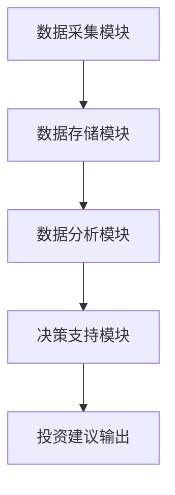

                 


# 格雷厄姆的Secondary Companies：二线公司的潜力

## 关键词：Secondary Companies，格雷厄姆，价值投资，投资潜力，二线公司，财务分析，竞争优势

## 摘要：  
本文深入探讨了格雷厄姆的价值投资理论中Secondary Companies（二线公司）的概念、特点及其投资潜力。通过分析二线公司的定义、估值方法、财务指标、竞争优势和实际案例，本文揭示了如何通过格雷厄姆的理论框架识别和投资具有成长潜力的二线公司。文章还结合数学模型和系统架构，提供了实际操作的指导和风险管理策略，帮助投资者更好地理解和应用这一投资理念。

---

## 第一章：Secondary Companies的背景与定义

### 1.1 价值投资的核心理念  
价值投资是一种基于对公司内在价值的深入分析的投资策略，旨在以低于内在价值的价格买入优质资产。格雷厄姆作为价值投资的鼻祖，提出了“Margin of Safety”（安全边际）的概念，即以低于合理估值的价格买入资产，以降低投资风险并确保长期收益。

### 1.2 Secondary Companies的定义  
Secondary Companies（二线公司）通常指那些市场关注度较低、市值较小、但在特定行业或市场中具有竞争优势的公司。这些公司往往未被主流投资者关注，但具备较高的成长潜力和投资价值。

### 1.3 Secondary Companies与Primary Companies的对比  
- **Primary Companies（一线公司）**：通常是行业龙头、市场占有率高、市值大、关注度高。  
- **Secondary Companies（二线公司）**：规模较小、市场占有率较低，但可能在特定细分市场中具有竞争优势，且估值相对较低。  

Secondary Companies的优势在于其潜在的成长性和较高的投资回报率，尤其是在市场周期性波动中，二线公司可能因估值修复而带来超额收益。

---

## 第二章：Secondary Companies的价值评估方法

### 2.1 格雷厄姆的估值模型  
格雷厄姆提出了多种估值方法，其中包括市盈率（P/E）和市净率（P/B）等指标。以下是常用的估值公式：

- **市盈率（P/E）**：  
  $$ P/E = \frac{\text{股价}}{\text{每股收益}} $$  
  该指标反映了市场对公司盈利能力的定价。通常，P/E低于行业平均水平的公司可能具有估值优势。

- **市净率（P/B）**：  
  $$ P/B = \frac{\text{股价}}{\text{每股净资产}} $$  
  该指标适用于资产密集型行业，衡量了股价与资产价值之间的关系。

### 2.2 财务指标分析  
在评估Secondary Companies时，需要重点关注以下财务指标：

#### 1. 资产负债表分析  
- **流动比率**：  
  $$ \text{流动比率} = \frac{\text{流动资产}}{\text{流动负债}} $$  
  该指标反映了公司的短期偿债能力。  
- **资产负债率**：  
  $$ \text{资产负债率} = \frac{\text{总负债}}{\text{总资产}} $$  
  该指标衡量了公司的财务杠杆风险。

#### 2. 利润表分析  
- **净利润率**：  
  $$ \text{净利润率} = \frac{\text{净利润}}{\text{营业收入}} $$  
  该指标反映了公司的盈利能力。  
- **收入增长率**：  
  $$ \text{收入增长率} = \frac{\text{本期收入} - \text{上期收入}}{\text{上期收入}} \times 100\% $$  
  该指标衡量了公司的增长潜力。

#### 3. 现金流量表分析  
- **经营活动现金流**：  
  $$ \text{经营活动现金流} = \text{营业收入} - \text{经营成本} - \text{税费} $$  
  该指标反映了公司经营活动的现金流入和流出情况。

### 2.3 竞争优势分析  
在评估Secondary Companies时，需要重点关注其竞争优势，包括：

- **成本优势**：公司是否在生产成本上具有优势，从而能够以更低的价格提供产品或服务。  
- **技术优势**：公司是否拥有独特的技术或专利，能够提供差异化的产品。  
- **市场定位**：公司是否在特定市场中占据领先地位，具有较高的客户忠诚度。  

---

## 第三章：Secondary Companies的投资策略

### 3.1 投资组合构建  
在构建Secondary Companies的投资组合时，建议采用分散投资策略，以降低风险。以下是构建投资组合的步骤：

1. **行业选择**：选择具有增长潜力的行业，如科技、医疗、消费等领域。  
2. **公司筛选**：根据估值指标（如P/E、P/B）和财务指标（如净利润率、收入增长率）筛选潜在的Secondary Companies。  
3. **风险评估**：评估公司的财务风险和市场风险，确保投资组合的分散性。  
4. **动态调整**：定期评估投资组合的表现，根据市场变化进行调整。

### 3.2 投资风险与风险管理  
Secondary Companies的投资风险主要包括市场风险、流动性风险和公司特定风险。为了降低风险，投资者可以采取以下策略：

1. **分散投资**：通过投资多个Secondary Companies分散风险。  
2. **长期持有**：避免频繁交易，降低交易成本和市场波动的影响。  
3. **定期再平衡**：定期评估投资组合的表现，根据市场变化进行再平衡。

### 3.3 投资案例分析  
以下是一个Secondary Companies的投资案例：

假设某投资者关注消费行业，筛选出一家市值较小的食品加工公司。通过分析发现，该公司具有较高的净利润率（15%）和稳定的收入增长（年均增长10%），且市盈率（15倍）低于行业平均水平（20倍）。投资者以合理的价格买入该公司股票，长期持有，最终获得超额收益。

---

## 第四章：数学模型与估值方法

### 4.1 格雷厄姆的内在价值计算  
格雷厄姆提出了内在价值的计算方法，公式如下：

$$ \text{内在价值} = \frac{\text{预期收益}}{\text{折现率}} $$  

其中，预期收益可以根据公司未来几年的净利润预测进行估算，折现率可以根据市场利率和风险偏好进行调整。

### 4.2 市盈率与市净率的对比  
市盈率和市净率是常用的估值指标，以下是两者对比：

| 指标 | 市盈率（P/E） | 市净率（P/B） |
|------|----------------|----------------|
| 定义 | 股价/每股收益  | 股价/每股净资产 |
| 适用场景 | 盈利稳定的公司 | 资产密集型公司 |

### 4.3 财务指标的综合分析  
通过综合分析市盈率、市净率、净利润率等指标，可以更全面地评估Secondary Companies的投资价值。例如，可以使用以下公式计算综合估值指标：

$$ \text{综合估值指标} = \frac{P/E + P/B + \text{净利润率}}{3} $$  

---

## 第五章：系统架构与投资工具

### 5.1 系统架构设计  
为了系统化地筛选和评估Secondary Companies，可以设计一个投资分析系统，包括以下几个模块：

1. **数据采集模块**：获取公司财务数据、市场数据等。  
2. **数据分析模块**：对数据进行清洗、整理和分析。  
3. **决策支持模块**：根据分析结果生成投资建议。  

系统架构图如下：



### 5.2 投资工具的实现  
以下是实现投资分析系统的Python代码示例：

```python
import pandas as pd
import numpy as np

# 数据采集
def get_financial_data(ticker):
    # 获取公司财务数据
    pass

# 数据分析
def calculate_valuationMetrics(df):
    df['P/E'] = df['股价'] / df['每股收益']
    df['P/B'] = df['股价'] / df['每股净资产']
    df['净利润率'] = df['净利润'] / df['营业收入']
    return df

# 决策支持
def generate_recommendation(df):
    recommendation = []
    for index, row in df.iterrows():
        if row['P/E'] < industry_average_pe and row['P/B'] < industry_average_pb:
            recommendation.append('买入')
        elif row['P/E'] > industry_average_pe and row['P/B'] > industry_average_pb:
            recommendation.append('卖出')
        else:
            recommendation.append('观望')
    return recommendation

# 示例应用
tickers = [' Company A', ' Company B', ' Company C']
recommendations = []
for ticker in tickers:
    data = get_financial_data(ticker)
    metrics = calculate_valuationMetrics(data)
    rec = generate_recommendation(metrics)
    recommendations.append(rec)
```

---

## 第六章：风险管理与策略调整

### 6.1 风险管理策略  
在投资Secondary Companies时，需要重点关注以下风险：

1. **市场风险**：市场波动可能影响股票价格。  
2. **流动性风险**：部分Secondary Companies的股票流动性较差，可能难以快速变现。  
3. **公司特定风险**：个别公司可能面临财务危机或管理问题。

### 6.2 策略调整  
根据市场环境和公司情况的变化，投资者需要定期调整投资策略。例如：

- 在市场上涨时，可以适当增加Secondary Companies的仓位。  
- 在市场下跌时，可以减少仓位以规避风险。

---

## 第七章：总结与展望

### 7.1 总结  
本文详细探讨了格雷厄姆的价值投资理论在Secondary Companies中的应用，分析了二线公司的定义、估值方法、竞争优势以及投资策略。通过实际案例和系统架构的设计，本文为投资者提供了理论指导和实践参考。

### 7.2 展望  
未来，随着市场的不断发展，Secondary Companies的投资潜力将进一步显现。投资者可以通过技术进步和数据分析，进一步优化投资策略，挖掘更多具有成长潜力的Secondary Companies。

---

## 作者：AI天才研究院 & 禅与计算机程序设计艺术

