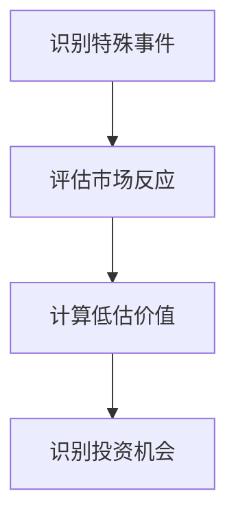
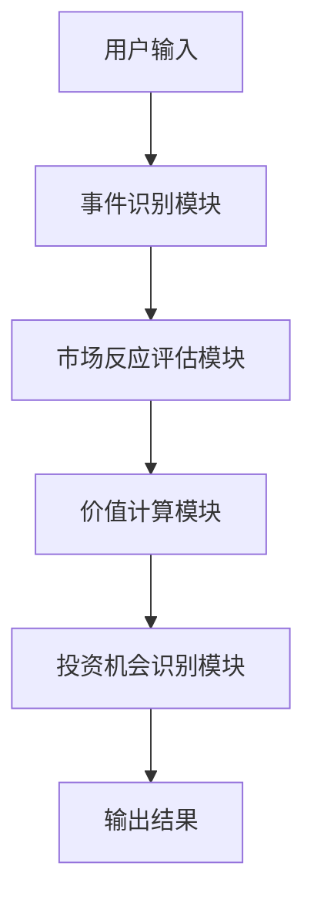
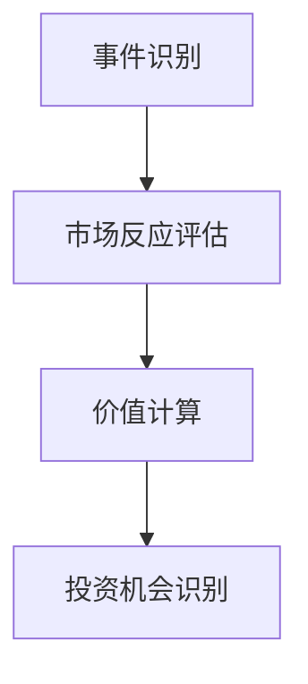

                 


# 格雷厄姆的Special Situations：在公司分拆和重组中寻机会

> 关键词：Special Situations, 公司分拆, 重组, 投资机会, 格雷厄姆, 价值投资

> 摘要：本文详细探讨了格雷厄姆的Special Situations理论在公司分拆和重组中的应用，分析了如何通过识别这些特殊情境来寻找投资机会。文章从理论基础、算法原理、系统架构到项目实战，全面解析了Special Situations的投资策略，并提供了丰富的案例和代码实现，帮助读者理解和应用这一理论。

---

## 第一部分：Special Situations的背景与定义

### 第1章：Special Situations的定义与核心概念

#### 1.1 Special Situations的定义
格雷厄姆的Special Situations是指那些在公司运营中出现的独特事件或情况，这些事件通常会导致公司的价值被市场低估。通过识别这些特殊情况，投资者可以发现潜在的投资机会。

##### 1.1.1 格雷厄姆的Special Situations理论概述
Special Situations理论是价值投资的重要组成部分，强调通过分析公司的特殊事件来寻找被低估的投资机会。这些事件可能包括公司分拆、重组、收购或债务重组等。

##### 1.1.2 Special Situations在投资中的应用
在公司分拆和重组中，Special Situations可以帮助投资者识别那些因市场反应不足而被低估的公司或资产。通过分析这些事件，投资者可以在市场波动中找到潜在的收益。

##### 1.1.3 Special Situations的核心要素与特征
Special Situations的核心要素包括：
1. **市场低估**：公司价值因市场反应不足而被低估。
2. **特殊事件**：如分拆、重组等事件导致公司价值变化。
3. **可操作性**：投资者可以通过分析这些事件找到投资机会。

---

### 第2章：公司分拆与重组的背景

#### 2.1 公司分拆的定义与类型
公司分拆是指将一个公司拆分成两个或多个独立的公司，通常是为了优化资产结构或提高公司价值。

##### 2.1.1 分拆的动机
分拆的动机可能包括：
- 优化资产结构。
- 提高子公司独立性。
- 吸引投资者。

##### 2.1.2 分拆的类型
分拆的类型包括：
- **资产分拆**：将公司的一部分资产独立出来。
- **业务分拆**：将某一业务部门独立出来。

#### 2.2 公司重组的定义与类型
公司重组是指通过调整资产、负债和股权结构，优化公司运营和价值。

##### 2.2.1 重组的动机
重组的动机可能包括：
- 提高效率。
- 降低负债。
- 避免破产。

##### 2.2.2 重组的类型
重组的类型包括：
- **债务重组**：调整债务结构。
- **股权重组**：调整股权结构。

---

## 第二部分：Special Situations的核心概念与联系

### 第3章：Special Situations的核心概念

#### 3.1 核心概念的原理
Special Situations的核心原理在于识别市场低估的机会。通过分析公司分拆和重组等事件，投资者可以找到那些因市场反应不足而被低估的公司或资产。

##### 3.1.1 核心概念的属性特征
Special Situations的属性特征包括：
- **独特性**：事件的独特性导致市场反应不足。
- **可预测性**：事件的可预测性使投资者能够提前识别机会。
- **可操作性**：投资者可以通过分析这些事件找到投资机会。

##### 3.1.2 核心概念的对比分析
下表对比了Special Situations与其他投资策略的特征：

| 特征               | Special Situations          | 其他投资策略       |
|--------------------|------------------------------|--------------------|
| 投资逻辑           | 识别特殊事件                | 分析长期趋势        |
| 投资机会           | 市场低估的特殊事件          | 行业增长            |
| 投资风险           | 事件不确定性较高            | 市场波动风险         |

---

### 第4章：Special Situations的数学模型与算法原理

#### 4.1 算法原理概述
Special Situations的识别可以通过数学模型来实现。以下是算法原理的详细步骤：

##### 4.1.1 算法步骤
1. **识别特殊事件**：识别公司分拆或重组等特殊事件。
2. **评估市场反应**：评估市场对这些事件的反应。
3. **计算低估价值**：计算公司因市场反应不足而被低估的价值。

##### 4.1.2 算法流程图


#### 4.2 数学模型与公式
以下是Special Situations识别的数学模型：

##### 4.2.1 计算公司价值
$$
\text{公司价值} = \text{资产价值} - \text{负债价值}
$$

##### 4.2.2 计算市场低估价值
$$
\text{低估价值} = \text{公司价值} - \text{市场价值}
$$

---

## 第三部分：Special Situations的系统分析与架构设计

### 第5章：系统分析与架构设计

#### 5.1 项目背景
本项目旨在通过分析公司分拆和重组等特殊事件，识别被低估的投资机会。

#### 5.2 系统功能设计
系统功能包括：
- **事件识别**：识别公司分拆和重组等特殊事件。
- **市场反应评估**：评估市场对这些事件的反应。
- **价值计算**：计算公司因市场反应不足而被低估的价值。

##### 5.2.1 系统架构设计


#### 5.3 系统架构图


---

## 第四部分：Special Situations的项目实战

### 第6章：项目实战

#### 6.1 环境安装
需要安装以下工具：
- Python 3.x
- 数据分析库（Pandas, NumPy）
- 图表库（Matplotlib, Seaborn）

#### 6.2 核心代码实现
以下是识别Special Situations的Python代码示例：

##### 6.2.1 识别特殊事件
```python
def identify_special_events(company_data):
    special_events = []
    for company in company_data:
        if company['events'].includes('spin-off') or company['events'].includes('restructuring'):
            special_events.append(company)
    return special_events
```

##### 6.2.2 计算低估价值
```python
def calculate_undervaluation(special_events):
    undervalued_companies = []
    for company in special_events:
        market_value = company['market_value']
        intrinsic_value = company['intrinsic_value']
        if intrinsic_value > market_value:
            undervalued_companies.append(company)
    return undervalued_companies
```

#### 6.3 案例分析
以下是一个实际案例分析：

##### 6.3.1 案例背景
某公司进行业务分拆，市场反应不足，导致其子公司价值被低估。

##### 6.3.2 数据分析
使用Python代码分析分拆前后市场反应，计算公司价值和市场价值。

##### 6.3.3 投资建议
基于分析结果，建议投资者买入该公司的股票。

---

## 第五部分：Special Situations的投资策略与注意事项

### 第7章：最佳实践与注意事项

#### 7.1 投资策略
- **长期投资**：关注公司分拆和重组等长期事件。
- **分散投资**：分散投资以降低风险。

#### 7.2 小结
Special Situations是一种有效的投资策略，通过识别市场低估的特殊事件，投资者可以在公司分拆和重组中找到投资机会。

#### 7.3 注意事项
- **市场风险**：市场反应可能不如预期。
- **信息不全**：需要充分的信息来识别特殊事件。

#### 7.4 拓展阅读
建议阅读格雷厄姆的《证券分析》以深入了解Special Situations理论。

---

## 结语

通过本文的详细分析，读者可以深入了解格雷厄姆的Special Situations理论在公司分拆和重组中的应用。从理论基础到算法实现，再到项目实战，本文为投资者提供了全面的指导，帮助他们在市场中识别投资机会。

---

## 作者信息

作者：AI天才研究院/AI Genius Institute & 禅与计算机程序设计艺术 /Zen And The Art of Computer Programming

