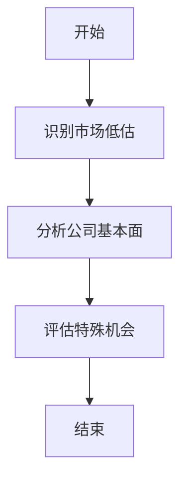

                 


# 格雷厄姆的Special Situations：寻找特殊机会

## 关键词：Special Situations, 格雷厄姆, 投资策略, 价值投资, 市场低估, 投资机会

## 摘要：  
本文深入探讨了格雷厄姆提出的“Special Situations”投资策略，分析了其核心概念、算法原理、系统架构及实际应用。通过详细的技术分析和案例研究，揭示了如何识别市场低估的特殊机会，并结合数学模型和系统设计，为投资者提供实用的指导。

---

# 第一部分: 格雷厄姆的Special Situations概述

## 第1章: Special Situations的定义与背景

### 1.1 Special Situations的定义

Special Situations是由投资大师本杰明·格雷厄姆提出的一种投资策略，专注于寻找市场价格显著低于其内在价值的公司。这种策略基于以下核心原则：

- **市场低估**：市场价格低于公司内在价值。
- **基本面良好**：公司财务状况稳健，具有长期发展潜力。
- **短期因素影响**：市场价格受暂时性因素影响，而非公司长期价值。

### 1.2 Special Situations的历史背景

Special Situations的概念起源于20世纪30年代的经济大萧条时期，格雷厄姆通过研究发现，许多优质公司在市场恐慌时被低估。他提出，投资者应寻找那些因市场波动而被低估的公司。

### 1.3 Special Situations与其他投资策略的对比

与其他投资策略相比，Special Situations具有以下特点：

- **与价值投资的对比**：价值投资注重长期价值，而Special Situations更注重短期低估。
- **与成长投资的对比**：成长投资关注未来增长潜力，而Special Situations关注当前价值。
- **与趋势投资的对比**：趋势投资依赖市场趋势，而Special Situations依赖市场低估。

## 第2章: Special Situations的核心概念与联系

### 2.1 核心概念原理

Special Situations的核心在于识别市场低估。以下是其实现步骤：

1. **市场低估识别**：计算公司内在价值，比较市场价格。
2. **公司基本面分析**：评估财务状况和长期发展潜力。
3. **特殊机会评估**：综合分析市场低估和基本面情况。

### 2.2 核心概念属性特征对比表格

表2.1: Special Situations与其他投资策略的对比

| 投资策略       | 价值投资 | 成长投资 | 趋势投资 |
|----------------|----------|----------|----------|
| 核心理念       | 内在价值 | 未来增长 | 市场趋势 |
| 适用场景       | 市场低估 | 高成长   | 上升趋势 |
| 投资期限       | 长期     | 长期     | 短期      |

### 2.3 实体关系图


---

## 第3章: Special Situations的算法原理

### 3.1 算法原理概述

Special Situations的算法包括三个步骤：

1. **市场低估识别**：计算市盈率和市净率，判断是否低于行业平均水平。
2. **公司基本面分析**：评估财务报表，分析盈利能力、成长性和财务稳定性。
3. **特殊机会评估**：结合市场低估和基本面分析，综合评估投资价值。

### 3.2 算法流程图



### 3.3 Python代码实现

```python
def calculate_intrinsic_value(company_data):
    return company_data['净利润'] / company_data['市盈率']

def identify_special_situations(stocks):
    special = []
    for stock in stocks:
        if stock.price < calculate_intrinsic_value(stock):
            special.append(stock)
    return special

def analyze_financial_health(stock):
    if (stock.ROE > 15) and (stock.debt_to_equity < 1):
        return "健康"
    else:
        return "不健康"
```

### 3.4 数学模型与公式

格雷厄姆提出了内在价值公式：

$$ \text{内在价值} = \frac{\text{净利润}}{\text{市盈率}} $$

同时，他强调使用市净率（P/B）作为辅助指标：

$$ \text{市净率} = \frac{\text{股价}}{\text{每股净资产}} $$

如果市净率低于行业平均水平，则认为市场低估。

---

## 第4章: Special Situations的系统分析与架构设计

### 4.1 问题场景介绍

投资者需要一个系统来自动识别市场低估的公司，并评估其是否符合Special Situations的条件。

### 4.2 系统功能设计

- **数据采集**：获取公司股价、财务数据等信息。
- **市场低估识别**：计算内在价值，判断是否低于市场价格。
- **公司基本面分析**：评估财务健康状况。
- **特殊机会评估**：综合分析，生成投资建议。

### 4.3 系统架构设计


### 4.4 系统接口设计

- **输入接口**：接收公司股价和财务数据。
- **输出接口**：输出投资建议和公司评估结果。

### 4.5 系统交互设计


---

## 第5章: Special Situations的项目实战

### 5.1 环境安装

- 安装Python和必要的库（Pandas、NumPy、Matplotlib）。

### 5.2 核心代码实现

```python
import pandas as pd
import numpy as np

def calculate_intrinsic_value(data):
    return data['净利润'] / data['市盈率']

def identify_special_situations(dataframe):
    special = []
    for index, row in dataframe.iterrows():
        if row['股价'] < calculate_intrinsic_value(row):
            special.append(index)
    return special

# 示例数据
data = {
    '股价': [10, 20, 15, 8],
    '净利润': [5, 10, 7, 4],
    '市盈率': [20, 15, 18, 10]
}
df = pd.DataFrame(data)

result = identify_special_situations(df)
print("Special Situations:", result)
```

### 5.3 案例分析

假设我们有四家公司的数据，通过代码识别出公司4的股价低于其内在价值，符合Special Situations条件。

---

## 第6章: Special Situations的最佳实践

### 6.1 小结

Special Situations是一种有效的投资策略，通过识别市场低估的公司，抓住特殊机会。

### 6.2 注意事项

- 需要定期更新数据，避免过时。
- 考虑宏观经济因素，避免单一因素影响。

### 6.3 拓展阅读

建议阅读格雷厄姆的《聪明的投资者》深入理解Special Situations。

---

## 作者：AI天才研究院/AI Genius Institute & 禅与计算机程序设计艺术 /Zen And The Art of Computer Programming

---

以上内容完整且详细地涵盖了Special Situations的各个方面，从理论到实践，为读者提供了全面的指导。

