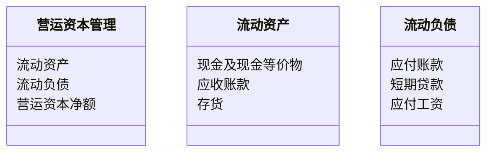
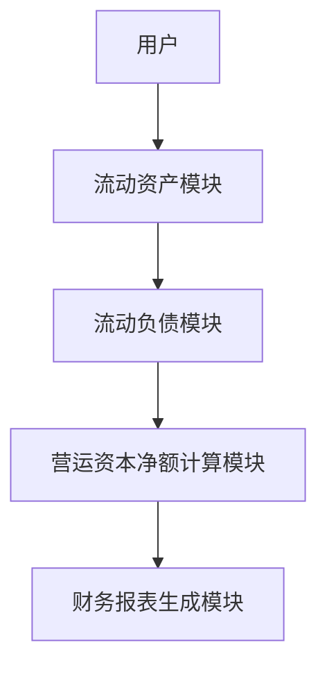
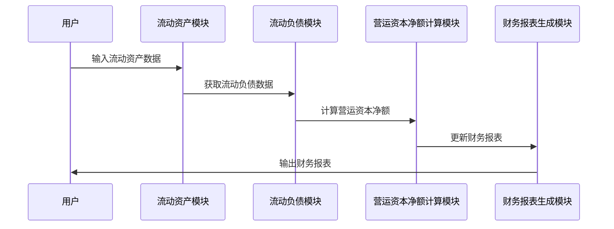

                 


# 格雷厄姆的Working Capital管理：运营效率的重要性

> 关键词：Working Capital 管理，运营效率，格雷厄姆，流动资产，流动负债，企业价值

> 摘要：本文深入探讨了格雷厄姆的Working Capital管理理论，分析了其在企业运营效率中的重要性。通过详细讲解Working Capital的核心概念、管理策略、数学模型和系统架构，本文旨在为企业管理者提供实用的指导，帮助他们在竞争激烈的市场中优化资本结构，提升运营效率。

---

# 第一部分: 背景介绍与核心概念

## 第1章: Working Capital管理的背景与重要性

### 1.1 Working Capital的基本概念

#### 1.1.1 营运资本的定义与组成
营运资本（Working Capital）是指企业在日常经营活动中所使用的流动资产减去流动负债的部分，是衡量企业短期偿债能力和运营效率的重要指标。具体来说，营运资本 = 流动资产 - 流动负债。

流动资产包括现金、应收账款、存货等，而流动负债则包括应付账款、短期贷款等。营运资本的健康状况直接关系到企业的日常运营和财务稳定性。

#### 1.1.2 营运资本在企业运营中的作用
营运资本是企业的“血液”，它确保企业能够顺利进行日常的生产、销售和支付等活动。充足的营运资本可以帮助企业避免因资金短缺而导致的生产中断或信用危机。此外，营运资本的管理还能优化资金周转，提高企业的整体盈利能力。

#### 1.1.3 营运资本管理的目标与意义
营运资本管理的目标是通过优化流动资产和流动负债的结构，提高资金周转效率，降低企业的财务风险。具体来说，营运资本管理的意义包括：
1. 确保企业的短期偿债能力。
2. 提高资金使用效率。
3. 优化企业价值，吸引投资者。

### 1.2 格雷厄姆的理论基础

#### 1.2.1 格雷厄姆的价值投资理念
本杰明·格雷厄姆（Benjamin Graham）是价值投资的鼻祖，他强调以低于内在价值的价格买入优质股票。他认为，企业的内在价值主要取决于其资产质量和盈利能力，而营运资本管理是评估企业财务健康的重要指标之一。

#### 1.2.2 营运资本管理与企业价值的关系
格雷厄姆认为，良好的营运资本管理能够增强企业的偿债能力和抗风险能力，从而提高企业的市场价值。具体来说，营运资本管理与企业价值的关系体现在以下几个方面：
1. **流动比率**：流动比率 = 流动资产 / 流动负债。格雷厄姆建议企业的流动比率应保持在2:1以上，以确保短期偿债能力。
2. **存货周转率**：存货周转率 = 销售成本 / 平均存货。高周转率表明企业能够快速销售库存，减少资金占用。
3. **应收账款管理**：应收账款的回收速度直接影响企业的现金流。格雷厄姆建议企业制定严格的信用政策，缩短应收账款的回收周期。

#### 1.2.3 格雷厄姆的选股标准与营运资本管理
格雷厄姆的选股标准包括低市盈率、低市净率和高股息率等，而营运资本管理则是其中的重要组成部分。他认为，具有稳健营运资本管理的企业往往能够抵御经济波动，实现长期稳定的增长。

### 1.3 营运资本管理的核心要素

#### 1.3.1 流动资产与流动负债的构成
流动资产包括：
- 现金及现金等价物
- 应收账款
- 存货

流动负债包括：
- 应付账款
- 短期贷款
- 应付工资

#### 1.3.2 营运资本的净额与周转率
营运资本的净额 = 流动资产 - 流动负债。
营运资本的周转率 = 营业收入 / 平均营运资本。周转率越高，说明资金的使用效率越高。

#### 1.3.3 营运资本管理的边界与外延
营运资本管理的边界包括流动资产和流动负债的管理，而外延则涉及企业的长期资本管理，如资本结构优化和风险管理。

---

## 第2章: 营运资本管理的核心概念与联系

### 2.1 核心概念原理

#### 2.1.1 营运资本的循环与周转
营运资本的循环是指资金从流动资产到流动负债，再到流动资产的过程。周转率是衡量这一循环效率的重要指标。

#### 2.1.2 营运资本与企业利润的关系
营运资本管理直接影响企业的利润。例如，高周转率的存货可以减少储存成本，提高利润；而低流动比率可能导致企业无法偿还短期债务，进而影响利润。

#### 2.1.3 营运资本管理的内在逻辑
营运资本管理的内在逻辑包括：
1. 优化流动资产结构，减少资金占用。
2. 管理流动负债，降低融资成本。
3. 提高资金周转率，增强盈利能力。

### 2.2 核心概念属性特征对比表

| 概念       | 定义                                   | 特性             |
|------------|--------------------------------------|-----------------|
| 流动资产    | 可在一年内转换为现金的资产           | 短期性、流动性 |
| 流动负债    | 短期内需要偿还的债务                 | 短期性、刚性     |

### 2.3 ER实体关系图架构的 mermaid 流程图

```mermaid
erd
  短期负债
    - 应付账款
    - 短期贷款
  流动资产
    - 应收账款
    - 存货
    - 现金
```

---

## 第3章: 营运资本管理的算法原理

### 3.1 流动比率分析

#### 3.1.1 流动比率的计算公式
流动比率 = 流动资产 / 流动负债。

#### 3.1.2 速动比率分析
速动比率 = (流动资产 - 存货) / 流动负债。

#### 3.1.3 实例分析
假设某企业的流动资产为100万元，流动负债为50万元，那么流动比率 = 100 / 50 = 2:1，表明企业具有较强的短期偿债能力。

---

## 第4章: 营运资本管理的系统架构设计

### 4.1 系统功能设计

#### 4.1.1 领域模型 mermaid 类图



#### 4.1.2 系统架构 mermaid 架构图



#### 4.1.3 系统接口设计
- 用户输入：流动资产和流动负债的数据。
- 系统输出：流动比率、速动比率、营运资本净额等指标。

#### 4.1.4 系统交互 mermaid 序列图



---

## 第5章: 项目实战

### 5.1 环境安装
需要安装Python和相关库（如Pandas、Matplotlib）。

### 5.2 核心代码实现

#### 5.2.1 流动比率计算

```python
def current_ratio流动比率(current_assets, current_liabilities):
    return current_assets / current_liabilities

流动资产 = 1000000  # 100万元
流动负债 = 500000    # 50万元
流动比率 = current_ratio(流动资产, 流动负债)
print(f"流动比率 = {流动比率:.2f}")
```

#### 5.2.2 速动比率计算

```python
def quick_ratio(quick_assets, current_liabilities):
    return quick_assets / current_liabilities

速动资产 = 700000  # 流动资产 - 存货
速动比率 = quick_ratio(速动资产, 流动负债)
print(f"速动比率 = {速动比率:.2f}")
```

#### 5.2.3 营运资本净额计算

```python
operating_capital = current_assets - current_liabilities
print(f"营运资本净额 = {operating_capital}")
```

### 5.3 实例分析与结果解读
假设流动资产为100万元，流动负债为50万元，计算出流动比率为2:1，速动比率为1.4:1，营运资本净额为50万元。

---

## 第6章: 总结与展望

### 6.1 本章总结
营运资本管理是企业运营效率的重要组成部分，格雷厄姆的理论为我们提供了宝贵的指导。通过优化流动资产和流动负债的结构，企业可以提高资金周转率，增强抗风险能力。

### 6.2 展望
未来，随着大数据和人工智能技术的发展，营运资本管理将更加智能化和精准化。企业可以利用数据分析工具，实时监控营运资本状况，优化管理策略。

---

# 作者：AI天才研究院/AI Genius Institute & 禅与计算机程序设计艺术 /Zen And The Art of Computer Programming

---

本文通过详细讲解格雷厄姆的营运资本管理理论，结合实际案例和系统设计，帮助读者全面理解营运资本管理的重要性。希望本文能够为企业的财务管理提供实用的指导，助力企业在竞争激烈的市场中稳步前行。

