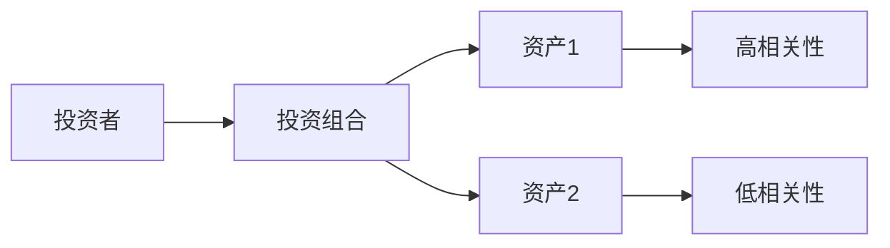
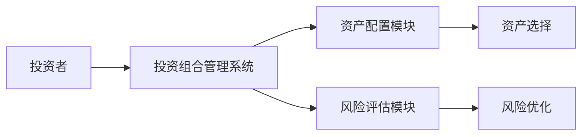
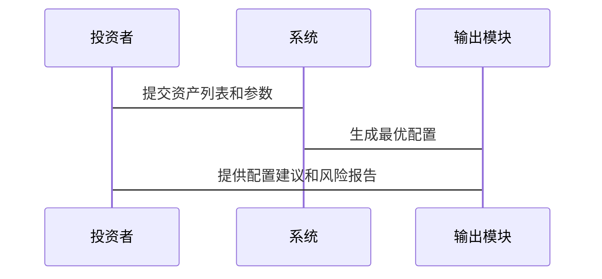

                 


# 格雷厄姆的diversification原则：降低投资风险

> 关键词：投资风险、diversification、格雷厄姆、资产配置、投资组合、风险管理

> 摘要：本文将详细探讨格雷厄姆的diversification原则，分析其在降低投资风险中的作用。通过理论分析、数学建模和系统设计，结合实际案例，深入讲解如何通过科学的资产配置和多元化策略，实现投资风险的有效控制。本文适合对投资管理和风险管理感兴趣的读者。

---

## 第一部分: 格雷厄姆的diversification原则基础

### 第1章: 投资风险与diversification概述

#### 1.1 投资风险的背景与问题背景
##### 1.1.1 投资风险的定义与分类
投资风险是指在投资过程中，由于市场波动、经济周期变化等因素，投资组合的收益可能低于预期甚至出现损失的风险。投资风险可以分为系统性风险（如市场风险、利率风险）和非系统性风险（如公司特有风险）。

##### 1.1.2 投资风险对企业与个人的影响
投资风险对企业的影响可能包括资本损失、利润下降甚至破产；对个人投资者的影响则可能包括财富缩水、无法实现财务目标等。

##### 1.1.3 现代投资组合理论的起源与发展
现代投资组合理论（MPT）由哈里·马科维茨在1952年提出，强调通过科学的资产配置来优化投资组合的风险和收益。MPT的核心思想是通过分散投资来降低非系统性风险。

#### 1.2 格雷厄姆的diversification原则
##### 1.2.1 diversification原则的核心概念
本杰明·格雷厄姆是价值投资的鼻祖，他提出的diversification原则强调通过广泛投资于不同资产类别或行业，来降低投资组合的整体风险。

##### 1.2.2 格雷厄姆投资理念的起源与特点
格雷厄姆的投资理念起源于20世纪初，他强调安全边际和长期投资。diversification原则是其投资策略的重要组成部分。

##### 1.2.3 diversification原则在现代投资中的地位
diversification原则是现代投资组合理论的重要组成部分，也是风险管理的核心策略之一。

#### 1.3 投资风险与diversification的关系
##### 1.3.1 投资风险的来源与影响因素
投资风险的来源包括市场波动、经济周期、公司基本面变化等。diversification通过分散投资，可以降低非系统性风险。

##### 1.3.2 diversification如何降低投资风险
通过投资于不同类型的资产，diversification可以减少单一资产对整体投资组合的影响，从而降低风险。

##### 1.3.3 diversification与其他风险管理方法的对比
diversification与保险、对冲等其他风险管理方法的区别在于，它通过资产配置实现风险分散。

#### 1.4 本章小结
本章介绍了投资风险的定义、来源以及diversification原则的核心概念，为后续分析奠定了基础。

---

### 第2章: 格雷厄姆diversification原则的核心概念与联系

#### 2.1 格雷厄姆diversification的原理
##### 2.1.1 资产配置的核心要素
资产配置需要考虑资产的类型、比例、相关性等因素。格雷厄姆强调投资于具有安全边际的资产，并分散投资以降低风险。

##### 2.1.2 投资组合的分散化策略
通过投资于不同资产类别（如股票、债券、房地产等）和不同行业，可以有效降低投资组合的风险。

##### 2.1.3 资产相关性对风险的影响
资产的相关性是影响diversification效果的重要因素。低相关性的资产可以更好地分散风险。

#### 2.2 核心概念对比分析
##### 2.2.1 资产相关性对比表格
| 资产类型 | 高相关性 | 低相关性 | 不相关 |
|----------|-----------|----------|--------|
| 股票     | 同行业    | 不同行业 | 跨资产 |
| 债券     | 同类型    | 不同类型 | 跨市场 |

##### 2.2.2 实体关系图


#### 2.3 格雷厄姆diversification的数学模型
##### 2.3.1 投资组合风险的数学公式
$$\text{投资组合风险} = \sqrt{w_1^2\sigma_1^2 + w_2^2\sigma_2^2 + 2w_1w_2\sigma_1\sigma_2\rho_{12}}$$

##### 2.3.2 投资组合收益的数学公式
$$\text{投资组合收益} = w_1r_1 + w_2r_2$$

#### 2.4 本章小结
本章详细分析了格雷厄姆diversification原则的核心概念及其数学模型，强调了资产相关性对风险的影响。

---

### 第3章: 格雷厄姆diversification的算法原理

#### 3.1 现代投资组合理论（MPT）概述
##### 3.1.1 MPT的核心思想
MPT通过优化资产配置，实现投资组合收益最大化和风险最小化。

##### 3.1.2 MPT的数学模型与公式
$$\text{投资组合的最优解} = \argmin_w \sigma^2 \text{ subject to } \mathbb{E}[r] = w^T \mu$$

#### 3.2 算法实现
##### 3.2.1 算法流程
1. 确定可投资资产及其预期收益和风险。
2. 计算资产之间的协方差矩阵。
3. 使用优化算法求解最优资产配置。

##### 3.2.2 Python代码实现
```python
import numpy as np
import scipy.optimize as optimize

def optimize_portfolio(expected_returns, covariance_matrix):
    n = len(expected_returns)
    # 定义目标函数
    def objective(x):
        return np.dot(x.T, np.dot(covariance_matrix, x))  
    # 约束条件：投资比例之和为1
    cons = ({'type': 'eq', 'fun': lambda x: np.sum(x) - 1})
    # 非负约束
    bounds = [(0, 1) for _ in range(n)]
    result = optimize.minimize(objective, np.ones(n)/n, method='SLSQP', constraints=cons, bounds=bounds)
    return result.x

# 示例数据
n_assets = 3
expected_returns = [0.1, 0.15, 0.08]
covariance_matrix = np.array([
    [0.02, 0.01, 0.01],
    [0.01, 0.03, 0.02],
    [0.01, 0.02, 0.03]
])

weights = optimize_portfolio(expected_returns, covariance_matrix)
print("最优权重：", weights)
```

#### 3.3 本章小结
本章通过MPT的理论和算法，详细讲解了如何通过优化资产配置实现diversification。

---

## 第二部分: 格雷厄姆diversification原则的系统分析与设计

### 第4章: 格雷厄姆diversification原则的系统分析

#### 4.1 系统功能设计
##### 4.1.1 系统架构设计


##### 4.1.2 系统架构图


#### 4.2 系统接口设计
##### 4.2.1 输入接口
- 用户输入：资产列表、预期收益、风险参数。
##### 4.2.2 输出接口
- 最优资产配置建议。
- 投资组合风险评估报告。

#### 4.3 系统交互流程


#### 4.4 本章小结
本章通过系统架构和交互流程，展示了如何将格雷厄姆的diversification原则应用于实际投资管理中。

---

## 第三部分: 格雷厄姆diversification原则的项目实战

### 第5章: 格雷厄姆diversification原则的项目实战

#### 5.1 项目环境与工具安装
- 工具：Python、NumPy、SciPy、Matplotlib。
- 环境：Jupyter Notebook。

#### 5.2 核心系统实现
##### 5.2.1 资产选择与权重计算
```python
def calculate_asset_weights(portfolio_size, expected_returns, covariance_matrix):
    # 使用优化算法求解最优权重
    weights = optimize_portfolio(expected_returns, covariance_matrix)
    # 计算投资组合风险
    portfolio_variance = np.dot(weights.T, np.dot(covariance_matrix, weights))
    portfolio_return = np.dot(expected_returns, weights)
    return weights, portfolio_return, portfolio_variance

# 示例计算
weights, return_, variance = calculate_asset_weights(3, expected_returns, covariance_matrix)
print("投资组合预期收益：", return_)
print("投资组合风险：", variance)
```

#### 5.3 项目小结
本章通过实际案例，展示了如何使用Python代码实现格雷厄姆的diversification原则。

---

## 第四部分: 总结与最佳实践

### 第6章: 总结与最佳实践

#### 6.1 小结
格雷厄姆的diversification原则是降低投资风险的重要策略。通过科学的资产配置和分散化投资，可以有效降低非系统性风险。

#### 6.2 注意事项
- 需要定期调整资产配置。
- 需要关注资产的相关性。

#### 6.3 拓展阅读
- 马科维茨的《投资学原理》
- 格雷厄姆的《聪明的投资者》

---

## 作者：AI天才研究院/AI Genius Institute & 禅与计算机程序设计艺术 /Zen And The Art of Computer Programming

---

以上是文章的完整目录和部分具体内容。如果需要进一步扩展或调整，请随时告诉我！

