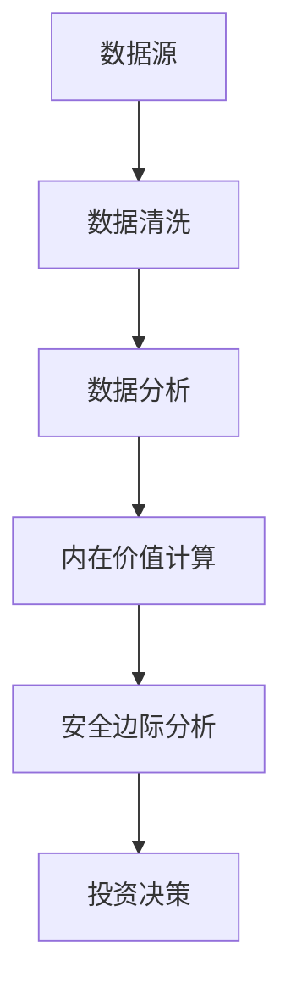
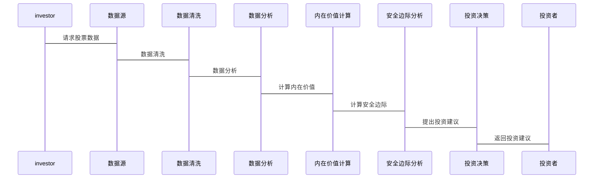

                 


# 格雷厄姆的价值投资公式解析

> 关键词：价值投资，格雷厄姆，内在价值，安全边际，投资公式，股票评估

> 摘要：本文将详细解析格雷厄姆的价值投资公式，探讨其核心概念、算法原理、数学模型，并结合实际案例进行分析，帮助投资者更好地理解和应用这一经典投资方法。

---

## 第一部分: 格雷厄姆价值投资公式的核心概念与背景

### 第1章: 价值投资的定义与背景

#### 1.1 价值投资的基本概念

##### 1.1.1 投资的本质与核心目标
投资的本质是通过合理配置资源，实现资产的保值与增值。其核心目标是在风险可控的前提下，最大化资产的长期收益。

##### 1.1.2 价值投资的定义与特征
价值投资是一种以基本面分析为基础的投资策略，强调以低于内在价值的价格购买优质资产。其核心特征包括：
- **注重内在价值**：分析企业的基本面，寻找市场价格低于内在价值的股票。
- **长期投资**：基于对企业价值的深入理解，长期持有优质资产。
- **安全边际**：在买入价格与内在价值之间留出安全边际，以降低投资风险。

##### 1.1.3 价值投资与其他投资策略的对比
与短期交易、趋势投资等策略相比，价值投资更注重企业的长期价值和内在质量。它强调对企业基本面的深入研究，而非市场的短期波动。

#### 1.2 格雷厄姆的生平与贡献

##### 1.2.1 格雷厄姆的学术背景与投资实践
本杰明·格雷厄姆（Benjamin Graham）是20世纪最伟大的投资理论家之一。他早年就读于哥伦比亚大学，后来进入华尔街从事投资银行业务。他的投资实践和理论研究为现代价值投资奠定了基础。

##### 1.2.2 格雷厄姆对现代投资理论的影响
格雷厄姆的学生和追随者（如沃伦·巴菲特）将他的理论发扬光大，使其成为现代投资学的重要组成部分。格雷厄姆的价值投资理论强调安全边际和内在价值，为投资者提供了长期稳定的收益策略。

##### 1.2.3 格雷厄姆价值投资理论的传承与发展
格雷厄姆的价值投资理论经过时间的检验，不断被修正和完善。其核心思想至今仍然是投资领域的重要参考。

---

### 第2章: 格雷厄姆价值投资公式的背景与问题分析

#### 2.1 价值投资公式的提出背景

##### 2.1.1 20世纪初美国股市的不稳定性
20世纪初，美国股市经历了多次剧烈波动，投资者急需一种稳定可靠的的投资方法。

##### 2.1.2 投资者在市场波动中的困境
市场的短期波动常常导致投资者决策失误，格雷厄姆试图通过价值投资公式为投资者提供一个长期稳定的收益框架。

##### 2.1.3 格雷厄姆提出公式的初衷
格雷厄姆希望通过公式化的方法，帮助投资者找到具有安全边际的优质股票，从而实现长期稳健的投资收益。

#### 2.2 格雷厄姆价值投资公式的核心问题

##### 2.2.1 什么是内在价值？
内在价值是企业未来现金流的现值，反映了企业在市场上真正的价值。

##### 2.2.2 如何衡量安全边际？
安全边际是买入价格与内在价值之间的差距，用以降低投资风险。

##### 2.2.3 价值投资公式在实际中的应用边界
价值投资公式适用于基本面稳定、财务健康的企业，对周期性行业和高科技企业可能需要额外的分析。

#### 2.3 格雷厄姆价值投资公式的外延与局限

##### 2.3.1 公式的适用场景
适用于成熟行业中的稳定企业，特别适合防御型投资者。

##### 2.3.2 公式的局限性与改进空间
- 低估了市场的波动性。
- 未充分考虑宏观经济因素。
- 需要对行业和企业进行深入分析。

##### 2.3.3 现代对格雷厄姆公式的修正与扩展
结合现代金融理论和大数据分析，不断完善和优化价值投资公式。

---

### 第3章: 格雷厄姆价值投资公式的结构与核心要素

#### 3.1 公式的整体结构

##### 3.1.1 公式的数学表达式
$$ V = \frac{E}{P/E} \times (1 + g) $$

其中：
- \( V \)：内在价值
- \( E \)：企业净利润
- \( P/E \)：市盈率
- \( g \)：预期增长率

##### 3.1.2 公式中各变量的含义
- 内在价值（\( V \)）：企业未来现金流的现值。
- 每股收益（\( E \)）：企业的盈利能力。
- 市盈率（\( P/E \)）：股价与每股收益的比率。
- 预期增长率（\( g \)）：企业未来收益的增长速度。

##### 3.1.3 公式的核心逻辑
通过分析企业的盈利能力、成长潜力和市场估值，计算其内在价值，并与市场价格进行比较。

#### 3.2 核心要素分析

##### 3.2.1 内在价值的计算
$$ V = \sum_{t=1}^{n} \frac{CF_t}{(1 + r)^t} $$

其中：
- \( CF_t \)：第\( t \)年的自由现金流
- \( r \)：折现率
- \( n \)：评估期

##### 3.2.2 安全边际的确定
$$ \text{安全边际} = \text{内在价值} - \text{市场价格} $$

##### 3.2.3 股东权益的评估
通过分析企业的财务报表，评估其股东权益，包括资产、负债和所有者权益。

#### 3.3 核心要素之间的关系

##### 3.3.1 内在价值与安全边际的互动
- 内在价值是安全边际的基础。
- 安全边际反映了市场价格与内在价值的差异。

##### 3.3.2 股东权益与其他要素的关系
股东权益影响企业的财务健康状况，进而影响其内在价值和市场价格。

---

## 第四部分: 格雷厄姆价值投资公式的系统分析与架构设计

### 第4章: 系统分析与架构设计方案

#### 4.1 问题场景介绍
- 投资者需要通过基本面分析，找到具有安全边际的股票。
- 系统需要提供数据支持、分析工具和决策建议。

#### 4.2 系统功能设计

##### 4.2.1 数据收集模块
- 数据来源：股票市场数据、财务报表、行业报告。
- 数据处理：清洗、转换、存储。

##### 4.2.2 分析模块
- 内在价值计算：使用格雷厄姆公式评估股票的内在价值。
- 安全边际分析：计算市场价格与内在价值的差异。

##### 4.2.3 决策模块
- 筛选出符合安全边际要求的股票。
- 提供投资建议。

#### 4.3 系统架构设计

##### 4.3.1 系统架构图


##### 4.3.2 系统接口设计
- 数据接口：从数据源获取股票数据。
- 分析接口：调用内在价值和安全边际计算模块。
- 决策接口：输出投资建议。

#### 4.4 系统交互设计

##### 4.4.1 系统交互流程


---

## 第五部分: 格雷厄姆价值投资公式的项目实战

### 第5章: 项目实战

#### 5.1 环境安装

##### 5.1.1 系统环境
- 操作系统：Windows 10 或 macOS 12
- 开发工具：Python 3.9+，Jupyter Notebook

##### 5.1.2 数据获取
- 使用Yahoo Finance API获取股票数据。

#### 5.2 核心实现

##### 5.2.1 内在价值计算
```python
def calculate_intrinsic_value(eps, pe_ratio, growth_rate):
    intrinsic_value = eps * pe_ratio * (1 + growth_rate)
    return intrinsic_value
```

##### 5.2.2 安全边际分析
```python
def calculate_margin_of_safety(intrinsic_value, market_price):
    margin_of_safety = intrinsic_value - market_price
    return margin_of_safety
```

#### 5.3 实际案例分析

##### 5.3.1 案例选择
以苹果公司为例，假设其2023年的数据如下：
- 每股收益（EPS）：3.0
- 市盈率（PE）：20
- 预期增长率（g）：8%

##### 5.3.2 计算内在价值
$$ V = 3.0 \times 20 \times (1 + 0.08) = 64.8 $$

##### 5.3.3 安全边际计算
假设市场价格为60美元：
$$ \text{安全边际} = 64.8 - 60 = 4.8 $$

---

## 第六部分: 格雷厄姆价值投资公式的最佳实践

### 第6章: 最佳实践

#### 6.1 投资策略建议
- 长期持有优质股票。
- 分散投资以降低风险。
- 定期评估和调整投资组合。

#### 6.2 小结
格雷厄姆的价值投资公式为投资者提供了一种科学的股票评估方法，帮助他们在市场波动中找到安全的投资机会。

#### 6.3 注意事项
- 价值投资需要结合宏观经济环境和行业趋势。
- 公式结果仅供参考，需结合实际情况调整。

#### 6.4 拓展阅读
- 《证券分析》（Benjamin Graham）
- 《巴菲特的投资组合》（Mason, H.）

---

## 作者：AI天才研究院/AI Genius Institute & 禅与计算机程序设计艺术 /Zen And The Art of Computer Programming

---

以上是基于格雷厄姆的价值投资公式进行的详细解析，涵盖核心概念、算法原理、系统架构和项目实战。通过本文的分析，读者可以更好地理解价值投资的精髓，并在实际投资中灵活应用。

