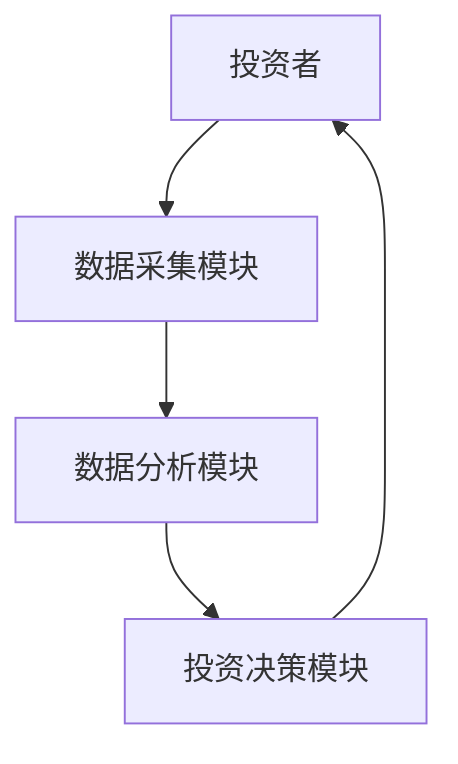
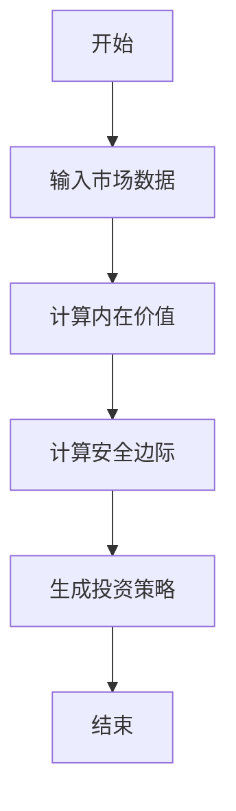

                 


```markdown
# 格雷厄姆的价值投资原则在不同市场周期中的应用

> 关键词：价值投资，市场周期，格雷厄姆，内在价值，安全边际，风险管理

> 摘要：本文深入探讨了格雷厄姆的价值投资原则在不同市场周期中的应用，结合数学模型和系统架构，详细分析了如何在牛市、熊市和经济衰退期中灵活运用这些原则。通过实际案例和系统设计，本文为投资者提供了在复杂市场环境中做出明智投资决策的指导。

---

## 第一部分: 引言

### 1.1 核心概念与背景
- **价值投资**：一种以低于内在价值的价格购买优质股票的投资策略，强调长期持有和安全边际。
- **格雷厄姆**：价值投资的鼻祖，提出“安全边际”和“内在价值”等核心概念。
- **市场周期**：指市场从繁荣到衰退再到复苏的循环过程，包括牛市、熊市和经济衰退期等阶段。

### 1.2 问题背景与目标
- **问题背景**：在不同市场周期中，价值投资的原则需要灵活调整以应对市场变化。
- **目标**：通过分析不同市场周期的特点，探讨如何在这些周期中有效应用格雷厄姆的价值投资原则。

---

## 第二部分: 格雷厄姆价值投资的核心原则

### 2.1 核心概念与术语
- **内在价值**：资产在市场中的真实价值，与市场价格可能不同。
- **安全边际**：买入价格与内在价值之间的差距，用于降低投资风险。
- **复利效应**：通过长期持有优质资产实现财富的指数级增长。

### 2.2 核心原理与数学模型

#### 2.2.1 内在价值的计算
- 格雷厄姆的内在价值公式：
  $$ \text{内在价值} = \frac{\text{净利润} \times (5 + \text{永续年金因素})}{\text{资本成本}} $$
- 示例：假设净利润为$100，资本成本为10%，则内在价值为：
  $$ \text{内在价值} = \frac{100 \times (5 + 0.1)}{0.1} = 550 $$

#### 2.2.2 安全边际的计算
- 安全边际公式：
  $$ \text{安全边际} = \text{内在价值} - \text{市场价格} $$
- 示例：内在价值为$550，市场价格为$400，则安全边际为$150。

---

## 第三部分: 不同市场周期中的投资策略

### 3.1 牛市周期
- **市场特征**：市场情绪高涨，股价可能被高估。
- **投资策略**：
  1. 寻找被高估的股票，减少投资仓位。
  2. 增加对防御性股票的投资。
  3. 提高安全边际要求。

### 3.2 熊市周期
- **市场特征**：市场情绪低落，股价可能被低估。
- **投资策略**：
  1. 寻找被低估的股票，增加投资仓位。
  2. 利用市场恐慌，增加对优质股票的投资。
  3. 降低安全边际要求。

### 3.3 经济衰退期
- **市场特征**：经济活动停滞，企业盈利下降。
- **投资策略**：
  1. 选择具有强大财务基础的企业。
  2. 增加对公用事业、消费品等防御性行业的投资。
  3. 长期持有优质股票，等待市场复苏。

---

## 第四部分: 数学模型与系统分析

### 4.1 系统架构设计


### 4.2 投资决策算法


### 4.3 核心算法实现
```python
def calculate_intrinsic_value(net_profit, cost_of_capital):
    return net_profit * (5 + (1 / cost_of_capital))

def calculate_margin_of_safety(intrinsic_value, market_price):
    return intrinsic_value - market_price
```

---

## 第五部分: 实战案例与代码实现

### 5.1 案例分析
- **案例**：2020年新冠疫情对价值投资策略的影响。
- **分析**：在市场恐慌期间，许多优质股票被低估，投资者可以利用格雷厄姆的原则增加仓位。

### 5.2 代码实现
```python
# 示例代码：计算内在价值和安全边际
net_profit = 100  # 净利润
cost_of_capital = 0.1  # 资本成本
market_price = 400  # 市场价格

intrinsic_value = calculate_intrinsic_value(net_profit, cost_of_capital)
margin_of_safety = calculate_margin_of_safety(intrinsic_value, market_price)

print(f"内在价值: {intrinsic_value}")
print(f"安全边际: {margin_of_safety}")
```

---

## 第六部分: 总结与展望

### 6.1 总结
- 格雷厄姆的价值投资原则在不同市场周期中具有强大的指导意义。
- 通过灵活调整策略，投资者可以在各种市场环境中实现长期稳定的收益。

### 6.2 投资建议
- 保持长期投资思维，避免短期市场波动的干扰。
- 定期评估投资组合，根据市场周期调整策略。
- 重视风险管理，合理控制仓位和杠杆。

### 6.3 展望
- 结合人工智能和大数据技术，进一步优化价值投资模型。
- 在全球化背景下，探索跨国投资机会。

---

## 作者

作者：AI天才研究院/AI Genius Institute & 禅与计算机程序设计艺术 /Zen And The Art of Computer Programming
```

