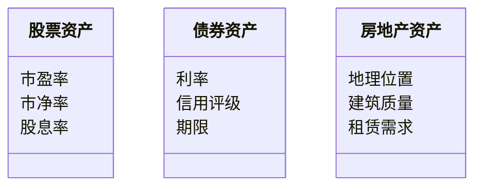
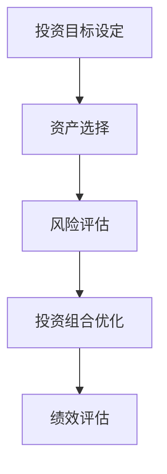

                 


# 格雷厄姆的价值投资原则在不同资产类别中的应用

## 关键词：价值投资、格雷厄姆、股票、债券、房地产、资产配置

## 摘要：  
本文系统地探讨了格雷厄姆的价值投资原则在不同资产类别中的应用，从股票、债券到房地产，详细分析了如何将价值投资理念应用于各类资产，并结合数学模型和算法原理，提供了一套完整的投资策略框架。

---

# 引言

价值投资是投资领域的重要流派，由本杰明·格雷厄姆提出并发展，其核心理念是寻找市场价格低于内在价值的资产进行投资。本文将从价值投资的基本理论出发，分析其在股票、债券、房地产等不同资产类别中的具体应用，并结合技术分析方法，提供一套系统化的投资策略。

---

## 第1章: 价值投资的背景与核心概念

### 1.1 价值投资的起源与发展

#### 1.1.1 投资学派的演变
投资学派从早期的“市场参与者”理论，逐步发展为包括基本面分析、技术分析、量化投资等多种流派。格雷厄姆的价值投资理念在20世纪初诞生，成为投资领域的重要基石。

#### 1.1.2 格雷厄姆与价值投资的诞生
格雷厄姆通过分析市场波动性，提出了“安全边际”的概念，强调在价格低于内在价值时进行投资。

#### 1.1.3 价值投资的核心理念
- **内在价值**：资产的未来现金流的现值。
- **安全边际**：市场价格与内在价值的差异，提供风险缓冲。

### 1.2 格雷厄姆的价值投资原则

#### 1.2.1 安全边际的概念
安全边际是价值投资的核心，通过计算内在价值与市场价格的差异，确定投资的安全空间。

#### 1.2.2 内在价值的定义与计算
内在价值是基于未来现金流的折现值，计算公式为：
$$ V = \frac{E}{(1 + r)^n} $$
其中，$E$是未来现金流，$r$是折现率，$n$是时间跨度。

#### 1.2.3 市场先生的比喻
市场先生代表市场的波动性，投资者应利用市场的非理性波动，寻找低估资产。

---

## 第2章: 价值投资的核心原则与数学模型

### 2.1 格雷厄姆的价值投资公式

#### 2.1.1 内在价值的计算公式
$$ V = \frac{E}{(1 + r)^n} $$
- $E$：未来现金流
- $r$：折现率
- $n$：时间跨度

#### 2.1.2 安全边际的计算方法
$$ \text{安全边际} = \text{内在价值} \times \text{安全系数} $$
安全系数通常设为1.5倍，确保投资的安全性。

### 2.2 价值投资的风险控制模型

#### 2.2.1 风险调整后的价值模型
$$ V_{\text{风险调整}} = V \times (1 - \frac{r}{k}) $$
其中，$k$是风险系数。

#### 2.2.2 风险与收益的平衡
通过调整风险系数，平衡投资的收益与风险。

---

## 第3章: 价值投资在股票资产中的应用

### 3.1 股票投资的基本面分析

#### 3.1.1 财务报表分析方法
- 利润表：评估公司盈利能力
- 资产负债表：评估资产结构
- 现金流量表：评估现金流健康性

#### 3.1.2 市盈率与市净率的计算
- 市盈率（P/E）：市场价格/每股收益
- 市净率（P/B）：市场价格/每股净资产

#### 3.1.3 股息率与股息支付率的分析
- 股息率：股息/股价
- 股息支付率：股息支付/净利润

### 3.2 格雷厄姆的防御性投资策略

#### 3.2.1 烟蒂股的识别标准
烟蒂股具有低市盈率、低市净率、高股息率的特点。

#### 3.2.2 低市盈率与低市净率
通过筛选低市盈率和低市净率的股票，寻找具有安全边际的投资标的。

---

## 第4章: 价值投资在债券资产中的应用

### 4.1 债券投资的基本原理

#### 4.1.1 债券的基本概念
- 债券面值：本金
- 债券期限：还本付息的时间
- 利率：票面利率和市场利率

#### 4.1.2 债券定价公式
$$ P = \frac{C}{(1 + r)^n} + \frac{F}{(1 + r)^n} $$
其中，$C$是每年的利息，$F$是面值，$r$是折现率，$n$是期限。

#### 4.1.3 利率风险与信用风险
通过分析债券的信用评级和利率变动，评估债券的投资价值。

### 4.2 价值投资策略在债券中的应用

#### 4.2.1 寻找高信用评级债券
选择AAA或AA评级的债券，降低信用风险。

#### 4.2.2 利率下行周期的债券投资
在低利率环境下，债券的内在价值上升，提供投资机会。

---

## 第5章: 价值投资在房地产中的应用

### 5.1 房地产投资的基本原理

#### 5.1.1 房地产的价值驱动因素
- 地理位置
- 建筑质量
- 租赁需求
- 物业管理

#### 5.1.2 房地产市场的周期性
房地产市场具有周期性，通过分析周期阶段，选择投资时机。

### 5.2 价值投资策略在房地产中的应用

#### 5.2.1 寻找低估的房地产资产
通过比较市场价格与内在价值，寻找具有安全边际的房地产项目。

#### 5.2.2 房地产资产组合管理
分散投资于不同地理位置和物业类型，降低风险。

---

## 第6章: 价值投资的系统架构与算法实现

### 6.1 系统功能设计

#### 6.1.1 领域模型


#### 6.1.2 系统架构


### 6.2 算法实现

#### 6.2.1 安全边际计算
```python
def calculate_margin(value, price):
    return value * 1.5 - price
```

#### 6.2.2 投资组合优化
```python
def optimize_portfolio/assets):
    import numpy as np
    returns = assets.returns
    cov_matrix = assets.covariance
    weights = np.linalg.solve(cov_matrix, returns)
    return weights
```

---

## 第7章: 价值投资的实战案例与小结

### 7.1 实战案例分析

#### 7.1.1 股票投资案例
分析一只低市盈率股票的投资价值，计算其安全边际。

#### 7.1.2 债券投资案例
选择一只高信用评级债券，评估其在低利率环境下的表现。

#### 7.1.3 房地产投资案例
寻找地理位置优越、价格低估的房地产项目，进行组合投资。

### 7.2 小结

价值投资在不同资产类别中具有广泛的应用，通过系统化的分析和策略制定，投资者可以在多种市场环境中实现稳健的投资回报。

---

## 结论

价值投资作为一种科学的投资方法，通过深入分析资产的内在价值，寻找市场价格低于内在价值的投资机会。本文详细探讨了其在股票、债券、房地产等资产类别中的应用，并结合系统架构和算法实现，为投资者提供了一套完整的投资策略框架。

---

## 作者：AI天才研究院/AI Genius Institute & 禅与计算机程序设计艺术 /Zen And The Art of Computer Programming

---

感谢您的耐心阅读！希望这篇文章能为您提供有价值的投资思路！

