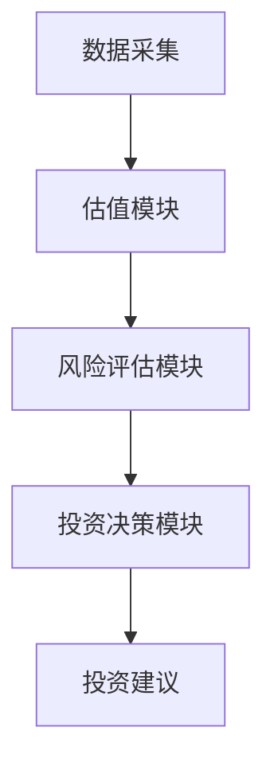

                 


# 格雷厄姆的价值投资原则现代解读

> 关键词：价值投资，格雷厄姆，安全边际，内在价值，现代投资，风险管理

> 摘要：本文从格雷厄姆的价值投资理论出发，结合现代金融环境和技术创新，对价值投资的核心原则进行重新解读。通过分析安全边际、内在价值等核心概念，探讨其在现代投资中的应用，并结合数学模型和系统架构，展示如何将格雷厄姆的理论应用于实际投资决策中。文章最后通过项目实战和案例分析，总结价值投资在现代金融环境中的优势与挑战。

---

## 第一部分：价值投资的背景与核心理念

### 1.1 价值投资的定义与核心理念

#### 1.1.1 投资的定义与分类
投资是指将资金投入到能够产生收益的资产中，以实现财富增值的行为。根据投资对象的不同，可以将投资分为股票、债券、房地产、黄金等多种类型。其中，股票投资是最受关注的领域之一。

#### 1.1.2 价值投资的核心理念
价值投资是一种以基本面分析为基础的投资策略，强调以低于资产内在价值的价格买入优质资产，长期持有，等待市场对其价值的重新认识。其核心理念包括：
1. **安全边际**：买入价格低于内在价值，确保投资的安全性。
2. **长期持有**：避免频繁交易，降低交易成本，同时利用复利效应。
3. **基本面分析**：通过分析企业的财务状况、行业地位和盈利能力，选择具有竞争优势的公司。

#### 1.1.3 格雷厄姆与价值投资的起源
本杰明·格雷厄姆（Benjamin Graham）被誉为“价值投资之父”，他在20世纪初提出了价值投资的理念，并在《证券分析》（Security Analysis）一书中详细阐述了这一理论。格雷厄姆的学生沃伦·巴菲特（Warren Buffett）继承并发扬了这一理念，使其成为现代投资理论的重要组成部分。

---

### 1.2 格雷厄姆的投资哲学

#### 1.2.1 格雷厄姆的生平与贡献
格雷厄姆出生于1894年，是美国著名的投资学家和经济学家。他在哥伦比亚大学教授证券分析课程，并与戴维·多德（David Dodd）合作撰写了《证券分析》。他的投资理念影响了无数投资者，包括巴菲特、彼得·林奇等。

#### 1.2.2 投资的三大原则
格雷厄姆提出了投资的三大原则：
1. **安全第一**：投资的首要目标是保护本金，避免重大损失。
2. **价值发现**：通过深入分析企业的基本面，寻找被市场低估的投资标的。
3. **长期视角**：投资不是短期交易，而是长期持有优质资产，分享企业成长的成果。

#### 1.2.3 投资者的心理与行为
格雷厄姆认为，投资者的行为往往受到情绪的影响，容易在市场高点买入、低点卖出。因此，他强调理性投资，避免被市场波动左右。

---

## 第二部分：格雷厄姆的核心投资原则

### 2.1 安全边际

#### 2.1.1 安全边际的定义
安全边际是指买入价格与资产内在价值之间的差距。通过预留安全边际，投资者可以在市场波动中规避风险，确保投资本金的安全。

#### 2.1.2 安全边际的计算方法
安全边际 = 内在价值 - 市场价格

#### 2.1.3 安全边际在投资中的应用
以某公司为例，假设其内在价值为100元，市场价格为80元，安全边际为20元。这意味着即使市场价格波动，投资者仍能获得20元的安全空间。

---

### 2.2 内在价值

#### 2.2.1 内在价值的定义
内在价值是资产在合理市场条件下应有的公平价格，通常通过基本面分析计算得出。

#### 2.2.2 内在价值的计算方法
内在价值的计算方法因资产类型而异。对于股票而言，常用的方法包括：
1. **DCF模型（Discounted Cash Flow）**：通过预测未来现金流，折现至当前价值。
2. **市盈率法**：通过比较市盈率与行业平均水平，估算合理价格。

#### 2.2.3 内在价值与市场价格的关系
市场价格围绕内在价值波动，内在价值是投资决策的核心依据。

---

### 2.3 股票分析与投资组合管理

#### 2.3.1 股票分析的基本步骤
1. **行业分析**：选择具有增长潜力的行业。
2. **财务分析**：分析公司的财务报表，重点关注盈利能力、资产负债情况和现金流。
3. **竞争优势分析**：评估公司是否具有竞争优势，如品牌、技术、成本优势等。

#### 2.3.2 投资组合的构建与优化
1. **分散投资**：通过投资不同行业的股票，降低投资风险。
2. **资产配置**：根据市场环境调整股票、债券等资产的比例。

#### 2.3.3 风险管理与投资组合的调整
1. **止损策略**：设定止损点，避免重大损失。
2. **定期再平衡**：根据市场变化，定期调整投资组合。

---

## 第三部分：格雷厄姆价值投资原则的数学模型

### 3.1 安全边际的数学公式

安全边际 = 内在价值 - 市场价格

$$\text{安全边际} = \text{内在价值} - \text{市场价格}$$

例如，某股票的内在价值为$100，市场价格为$80，则安全边际为$20。

---

### 3.2 内在价值的数学模型

#### DCF模型

$$\text{内在价值} = \sum_{t=1}^{n} \frac{\text{现金流}}{(1 + r)^t}$$

其中，r为折现率，n为预测年数。

---

## 第四部分：格雷厄姆价值投资原则的系统架构

### 4.1 投资分析系统的功能设计

#### 系统功能模块划分
1. **数据采集模块**：获取股票的基本面数据。
2. **估值模块**：计算股票的内在价值。
3. **风险评估模块**：评估投资组合的风险。
4. **投资决策模块**：根据分析结果，生成投资建议。

#### 系统功能流程图



---

## 第五部分：格雷厄姆价值投资原则的项目实战

### 5.1 项目环境与工具安装

#### 5.1.1 开发环境的搭建
推荐使用Python作为开发语言，安装以下工具：
- **Jupyter Notebook**：用于数据分析和可视化。
- **Pandas**：用于数据处理。
- **Matplotlib**：用于数据可视化。

#### 5.1.2 数据源的获取与处理
从Yahoo Finance获取股票数据，清洗数据并计算内在价值。

---

### 5.2 核心算法实现

#### 安全边际计算代码

```python
def calculate_margin(intrinsic_value, market_price):
    return intrinsic_value - market_price
```

#### 内在价值计算代码

```python
def calculate_intrinsic_value(cash_flows, discount_rate):
    return sum(cash_flows / (1 + discount_rate)**t for t in range(len(cash_flows)))
```

---

## 第六部分：格雷厄姆价值投资原则的现代应用与拓展

### 6.1 现代金融环境下的价值投资

#### 1.2.1 新兴金融工具对价值投资的影响
现代金融工具，如ETF、期权等，为投资者提供了更多选择，但也增加了复杂性。

---

## 第七部分：总结与展望

### 7.1 价值投资的核心理念
格雷厄姆的价值投资理论强调安全边际和内在价值，为现代投资提供了重要的指导。

### 7.2 价值投资的现代挑战
随着市场的复杂化，投资者需要结合新技术和新工具，不断优化投资策略。

---

## 参考文献

1. 《证券分析》——本杰明·格雷厄姆 & 戴维·多德
2. 《巴菲特致股东的信》——沃伦·巴菲特

---

## 作者

作者：AI天才研究院/AI Genius Institute & 禅与计算机程序设计艺术 /Zen And The Art of Computer Programming

