                 


# 格雷厄姆的价值投资在不同经济周期中的应用

> 关键词：价值投资，经济周期，格雷厄姆，安全边际，资产配置，风险管理

> 摘要：本文深入探讨了格雷厄姆价值投资理论在不同经济周期中的应用策略。通过分析经济衰退期、复苏期、过热期和滞胀期等不同阶段的市场特征，结合格雷厄姆的安全边际、防御性投资和内在价值评估等核心理念，提出在不同经济周期下的投资策略调整方法。同时，本文通过数学模型和实证分析，验证了价值投资在不同经济周期中的有效性和适用性，为投资者提供了实践指导。

---

## 第一部分: 价值投资的基础理论

### 第1章: 格雷厄姆的价值投资理论

#### 1.1 格雷厄姆的生平与投资思想
- **1.1.1 格雷厄姆的生平简介**  
  本杰明·格雷厄姆（Benjamin Graham）是20世纪最伟大的投资理论家之一，被誉为“价值投资之父”。他出生于1894年，早年就读于哥伦比亚大学，后在华尔街从事证券业务。他的投资理念深刻影响了沃伦·巴菲特等一代投资大师。

- **1.1.2 格雷厄姆的投资哲学**  
  格雷厄姆提出，投资的本质是购买企业的部分所有权，而非投机市场短期波动。他强调安全边际的重要性，认为投资者应该以低于内在价值的价格买入优质资产。

- **1.1.3 格雷厄姆的防御性投资策略**  
  格雷厄姆倡导防御性投资，即通过分散投资、严格选股和安全边际来降低投资风险，确保投资组合的稳健性。

#### 1.2 价值投资的核心要素
- **1.2.1 内在价值的计算**  
  内在价值是企业未来现金流的现值。格雷厄姆通过分析企业的财务报表和行业地位，估算其内在价值，作为投资决策的依据。

- **1.2.2 安全边际的定义与作用**  
  安全边际是指买入价格与内在价值之间的差距。通过预留安全边际，投资者可以降低市场波动带来的风险，确保投资的稳健性。

- **1.2.3 防御性投资与进攻性投资的区别**  
  防御性投资注重风险控制，追求稳定收益；进攻性投资则追求高回报，风险较高。格雷厄姆更倾向于防御性投资，适合大多数普通投资者。

---

### 第2章: 经济周期的基本理论

#### 2.1 经济周期的定义与阶段划分
- **2.1.1 经济周期的定义**  
  经济周期是指经济活动在增长与衰退之间波动的过程，通常分为衰退期、复苏期、过热期和滞胀期四个阶段。

- **2.1.2 经济周期的阶段特征**  
  - **衰退期**：经济活动萎缩，企业盈利能力下降，市场情绪悲观。
  - **复苏期**：经济逐步恢复，企业盈利改善，市场情绪逐渐回暖。
  - **过热期**：经济过热，企业盈利增长快，但市场可能出现泡沫。
  - **滞胀期**：经济增长放缓，通胀上升，企业盈利不稳定。

#### 2.2 经济周期对投资的影响
- **2.2.1 不同阶段的市场表现**  
  - 衰退期：市场整体低迷，股票估值可能低于内在价值。
  - 复苏期：市场逐步回升，价值投资机会显现。
  - 过热期：市场可能存在泡沫，但优质企业的内在价值仍在增长。
  - 滞胀期：市场波动较大，价值投资需要更加谨慎。

- **2.2.2 经济周期与资产配置的关系**  
  不同经济周期下，资产配置策略需要调整。例如，在衰退期可能增加债券配置，而在复苏期增加股票配置。

---

### 第3章: 格雷厄姆价值投资在经济周期中的策略调整

#### 3.1 衰退期的价值投资策略
- **3.1.1 衰退期的市场特征**  
  衰退期市场情绪悲观，股票估值可能被低估，尤其是优质企业的股票。

- **3.1.2 投资策略**  
  - 买入那些估值低于内在价值的企业股票。
  - 选择具有强大财务实力和良好分红记录的企业。
  - 分散投资，降低行业和个股风险。

#### 3.2 复苏期的价值投资策略
- **3.2.1 复苏期的市场特征**  
  市场情绪逐渐回暖，企业盈利开始恢复，但市场可能尚未完全反映企业价值。

- **3.2.2 投资策略**  
  - 继续持有衰退期买入的股票，等待市场进一步恢复。
  - 寻找那些在衰退期被低估但具有增长潜力的企业。

#### 3.3 过热期的价值投资策略
- **3.3.1 过热期的市场特征**  
  市场情绪高涨，股票估值可能高于内在价值，但优质企业的内在价值仍在增长。

- **3.3.2 投资策略**  
  - 保持警惕，避免过度投机。
  - 选择那些估值合理且具有持续增长潜力的企业。
  - 减少高估值股票的配置，增加防御性资产的配置。

#### 3.4 滞胀期的价值投资策略
- **3.4.1 滞胀期的市场特征**  
  经济增长放缓，通胀上升，企业盈利不稳定，市场情绪较为悲观。

- **3.4.2 投资策略**  
  - 选择那些具有抗通胀能力的企业。
  - 增加防御性资产的配置，如债券和现金。
  - 寻找那些估值低于内在价值的股票。

---

### 第4章: 数学模型与实证分析

#### 4.1 格雷厄姆价值投资的数学模型
- **4.1.1 内在价值计算公式**  
  内在价值 = （未来现金流） / （折现率）

- **4.1.2 安全边际计算公式**  
  安全边际 = 内在价值 - 市场价格

- **4.1.3 股票估值的多因子模型**  
  $$ 股票估值 = \alpha + \beta_1 \times ROE + \beta_2 \times P/E + \beta_3 \times P/BV $$

#### 4.2 实证分析
- **4.2.1 数据来源与分析方法**  
  选取1926年至2022年的市场数据，分析不同经济周期下价值投资策略的表现。

- **4.2.2 分析结果**  
  在衰退期和复苏期，价值投资策略表现优于成长投资策略；在过热期和滞胀期，价值投资策略表现相对稳健。

---

### 第5章: 系统架构与投资策略设计

#### 5.1 系统架构设计
- **5.1.1 系统功能模块**  
  - 数据采集模块：收集市场数据和经济指标。
  - 策略分析模块：根据经济周期调整投资策略。
  - 风险管理模块：实时监控投资组合的风险。

- **5.1.2 系统架构图**

```mermaid
graph TD
    A[数据采集模块] --> B[策略分析模块]
    B --> C[风险管理模块]
    C --> D[投资组合]
```



#### 5.2 投资策略设计
- **5.2.1 策略选择与优化**  
  根据经济周期选择合适的价值投资策略，如防御性策略或进攻性策略。

- **5.2.2 策略实施步骤**  
  1. 分析当前经济周期阶段。
  2. 确定投资目标和风险偏好。
  3. 选择合适的资产配置和个股。

---

### 第6章: 项目实战与案例分析

#### 6.1 项目实战
- **6.1.1 环境安装**  
  使用Python和相关库（如Pandas、NumPy）进行数据处理和分析。

- **6.1.2 核心代码实现**  
  ```python
  import pandas as pd
  import numpy as np

  # 计算内在价值
  def calculate_intrinsic_value(enterprise_value, cash_flow, discount_rate):
      return enterprise_value / (1 + discount_rate)

  # 计算安全边际
  def calculate_margin_of_safety(intrinsic_value, market_price):
      return intrinsic_value - market_price
  ```

- **6.1.3 代码解读与分析**  
  通过代码实现内在价值和安全边际的计算，帮助投资者量化投资机会。

#### 6.2 案例分析
- **6.2.1 案例背景**  
  以2008年金融危机为例，分析衰退期的价值投资策略。

- **6.2.2 实证结果**  
  在衰退期，选择那些估值低于内在价值的企业股票，取得了显著的超额收益。

---

### 第7章: 总结与展望

#### 7.1 总结
- 格雷厄姆的价值投资理论在不同经济周期中具有重要的指导意义。
- 通过调整投资策略，投资者可以在不同经济周期中实现稳健的投资收益。

#### 7.2 展望
- 进一步研究经济周期与价值投资的结合，探索更多投资策略。
- 开发智能化的投资系统，帮助投资者更好地应对市场变化。

---

## 作者：AI天才研究院/AI Genius Institute & 禅与计算机程序设计艺术 /Zen And The Art of Computer Programming

---

希望这篇文章能为投资者在不同经济周期下的价值投资策略提供新的思路和启示。

