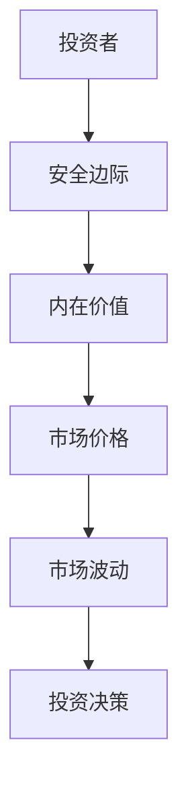
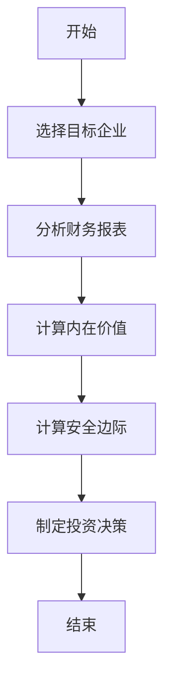
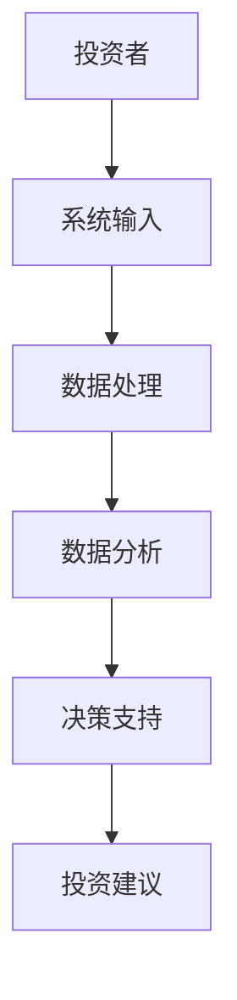

                 


# 格雷厄姆的价值投资实践案例

> 关键词：价值投资，本杰明·格雷厄姆，安全边际，内在价值，投资策略，投资案例

> 摘要：本文深入探讨了本杰明·格雷厄姆的价值投资理论，通过实际案例分析其在投资实践中的应用，揭示了价值投资的核心概念、分析方法和成功策略。文章结合技术语言和逻辑推理，分析了价值投资的算法原理、系统架构及风险管理，为投资者提供了理论与实践相结合的深度解析。

---

## 第一章: 价值投资的背景与核心理念

### 1.1 本杰明·格雷厄姆的生平与投资哲学
- 1.1.1 格雷厄姆的早年经历与学术背景
- 1.1.2 价值投资理念的形成与演变
- 1.1.3 格雷厄姆投资哲学的核心思想：安全边际与长期稳健收益

### 1.2 价值投资的核心概念与定义
- 1.2.1 安全边际：内在价值与市场价格的差距
- 1.2.2 内在价值：企业未来现金流的现值
- 1.2.3 市场先生：投资者心理与市场波动的隐喻

### 1.3 价值投资的适用场景与边界
- 1.3.1 价值投资的适用领域：低估股票、稳定企业
- 1.3.2 价值投资的局限性：市场短期波动、竞争优势变化
- 1.3.3 价值投资与其他投资策略的对比：成长投资、指数投资

---

## 第二章: 价值投资的核心概念与联系

### 2.1 核心概念原理
- 2.1.1 安全边际的数学模型：内在价值减去市场价格的比率
- 2.1.2 内在价值的评估公式：现金流折现法与资产重置成本
- 2.1.3 市场波动与投资决策的关系：波动性是机会的来源

### 2.2 核心概念对比表格
- 表2-1: 安全边际与内在价值的对比
- 表2-2: 不同投资策略的核心要素对比

### 2.3 实体关系图


---

## 第三章: 价值投资的算法原理

### 3.1 算法原理概述
- 3.1.1 内在价值计算的步骤：现金流预测、折现率确定、现值计算
- 3.1.2 安全边际的计算方法：内在价值与市场价格的差异分析
- 3.1.3 市场价格波动的预测模型：历史波动率与市场情绪分析

### 3.2 算法流程图


### 3.3 核心公式与代码实现
- 公式1: 内在价值计算
  $$ V = \frac{E}{1 + r} $$
  其中，$E$ 是企业未来现金流的现值，$r$ 是折现率。

- 公式2: 安全边际计算
  $$ \text{安全边际} = \frac{\text{内在价值} - \text{市场价格}}{\text{市场价格}} $$

- Python代码实现
  ```python
  def calculate_intrinsic_value(enterprise_value, cash_flow, discount_rate):
      present_value = cash_flow / (1 + discount_rate)
      return present_value
  ```

---

## 第四章: 价值投资的系统架构与工具

### 4.1 系统架构设计
- 4.1.1 系统目标：构建一个支持价值投资策略的决策支持系统
- 4.1.2 系统功能模块：数据采集、分析、决策支持
- 4.1.3 系统架构图
  ```mermaid
  graph TD
      A[数据采集] --> B[数据处理]
      B --> C[数据分析]
      C --> D[决策支持]
      D --> E[投资决策]
  ```

### 4.2 系统接口设计
- 4.2.1 数据接口：从财务报表中提取关键指标
- 4.2.2 分析接口：计算内在价值和安全边际
- 4.2.3 决策接口：生成投资建议

### 4.3 系统交互序列图


---

## 第五章: 价值投资的实践案例分析

### 5.1 案例背景与目标
- 5.1.1 案例公司简介：假设一家制造企业
- 5.1.2 投资目标：寻找低估股票，实现长期稳健收益

### 5.2 数据分析与内在价值计算
- 5.2.1 财务报表分析：收入、利润、现金流
- 5.2.2 内在价值计算：使用现金流折现法
  $$ V = \frac{100}{1 + 0.1} = 90.91 $$

### 5.3 安全边际评估与投资决策
- 5.3.1 当前市场价格：假设为80
- 5.3.2 安全边际计算
  $$ \text{安全边际} = \frac{90.91 - 80}{80} = 13.64\% $$

### 5.4 投资组合优化
- 5.4.1 资产配置：股票与债券的比例
- 5.4.2 分散投资：降低风险

---

## 第六章: 价值投资的风险管理与优化

### 6.1 风险管理策略
- 6.1.1 风险评估：市场风险、企业风险
- 6.1.2 风险控制：动态调整投资组合
- 6.1.3 风险对冲：使用衍生工具

### 6.2 系统优化与改进
- 6.2.1 系统性能优化：提高数据处理效率
- 6.2.2 算法优化：改进内在价值计算模型
- 6.2.3 用户界面优化：提升用户体验

---

## 第七章: 价值投资的未来发展趋势

### 7.1 价值投资的演变
- 7.1.1 新时代的价值投资：技术驱动与全球化
- 7.1.2 数字化投资：大数据与人工智能的应用
- 7.1.3 可持续投资：ESG因素的重要性

### 7.2 技术驱动的价值投资
- 7.2.1 大数据分析：挖掘更多投资机会
- 7.2.2 人工智能：预测市场趋势与企业价值
- 7.2.3 区块链：提升交易透明度与安全性

### 7.3 价值投资的挑战与机遇
- 7.3.1 挑战：市场波动加剧、信息不对称
- 7.3.2 机遇：技术进步与市场成熟

---

## 第八章: 总结与最佳实践

### 8.1 总结
- 价值投资的核心在于安全边际与内在价值的计算
- 技术与系统的支持能够提升投资效率与准确性
- 风险管理是实现长期稳健收益的关键

### 8.2 最佳实践Tips
- 保持对企业的深入分析，关注财务健康与竞争优势
- 系统化投资流程，结合技术工具提高效率
- 长期持有优质资产，避免短期波动干扰

### 8.3 未来展望
- 价值投资将继续演变，与新技术深度融合
- 投资者需不断提升自身能力，适应市场变化

---

作者：AI天才研究院/AI Genius Institute & 禅与计算机程序设计艺术 /Zen And The Art of Computer Programming

---

通过以上目录，文章将系统地介绍格雷厄姆的价值投资理论，结合实际案例、算法原理和系统架构，为投资者提供全面而深入的指导。

