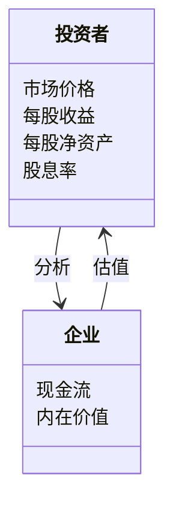
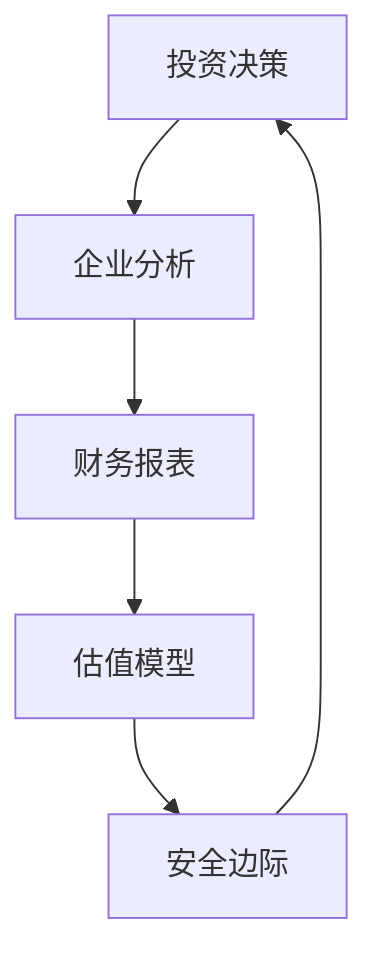

                 


# 格雷厄姆的价值投资者修炼之道

## 关键词：
- 价值投资、格雷厄姆、内在价值、安全边际、投资策略、股票分析

## 摘要：
本文深入探讨了格雷厄姆的价值投资理论，从核心概念到实际应用，详细阐述了价值投资者修炼的各个方面。通过分析安全边际、内在价值等关键概念，结合数学模型和实际案例，帮助读者系统性地理解和应用价值投资策略。

---

# 第一章: 价值投资的背景与核心理念

## 1.1 价值投资的起源与发展
### 1.1.1 价值投资的起源
价值投资起源于20世纪初，由本杰明·格雷厄姆和他的合作伙伴戴维·多德共同提出。这一理念强调以低于内在价值的价格买入股票，长期持有，等待市场的合理估值。

### 1.1.2 格雷厄姆与价值投资的形成
格雷厄姆是哥伦比亚大学的教授，他在教学和投资实践中总结出了一套以基本面分析为核心的价值投资方法。他主张投资者应关注企业的内在价值，而非市场的短期波动。

### 1.1.3 价值投资在现代投资学中的地位
尽管价值投资在学术上不如现代资产组合理论受到关注，但其在实践中的成功使其成为投资领域的重要流派，尤其是在机构投资和个人投资中。

## 1.2 价值投资的核心概念
### 1.2.1 价值投资的定义
价值投资是一种以低于市场价格买入优质股票的投资策略，核心在于识别市场价格与内在价值之间的差异。

### 1.2.2 格雷厄姆的价值投资理论
格雷厄姆提出，股票的内在价值是其未来现金流的现值，投资者应寻找市场价格低于内在价值的股票。

### 1.2.3 价值投资与其他投资理念的区别
与成长投资相比，价值投资更关注低估值和安全边际，而成长投资则更注重企业的成长潜力。

## 1.3 价值投资的基本原则
### 1.3.1 安全边际的概念
安全边际是市场价格与内在价值之间的差距，确保在市场价格下跌时仍能保持盈利。

### 1.3.2 内在价值的计算
内在价值是企业未来现金流的现值，计算时需要考虑企业的盈利能力、财务状况和行业地位。

### 1.3.3 股票与企业价值的关联
股票不仅是企业的一部分，还反映了市场的预期。价值投资者关注企业的实际价值，而非市场情绪。

## 1.4 价值投资的适用场景
### 1.4.1 价值投资的适用市场环境
在市场低迷或估值过低时，价值投资策略更为有效。

### 1.4.2 不同行业中的价值投资策略
某些行业如公用事业和金融行业更适合价值投资，因为这些行业的资产更易于估值。

### 1.4.3 价值投资的长期性与周期性
价值投资是一种长期投资策略，需要耐心等待市场重新评估企业的内在价值。

## 1.5 本章小结
价值投资的核心在于识别低估值的股票，并通过安全边际和内在价值的计算，降低投资风险。

---

# 第二章: 价值投资的核心概念与联系

## 2.1 价值投资的理论框架
### 2.1.1 格雷厄姆的估值模型
格雷厄姆提出，股票的内在价值可以通过DCF（现金流折现法）计算，同时考虑企业的资产价值。

### 2.1.2 内在价值的计算公式
$$
\text{内在价值} = \sum_{t=1}^{n} \frac{\text{现金流}}{(1 + r)^t}
$$

其中，r是折现率，n是企业寿命。

### 2.1.3 安全边际的数学表达
安全边际可以通过市场价格与内在价值的差额计算：
$$
\text{安全边际} = \text{内在价值} - \text{市场价格}
$$

## 2.2 核心概念对比分析
### 2.2.1 内在价值与市场价值的对比
- **内在价值**：基于企业未来现金流的现值。
- **市场价值**：由市场供需决定，可能高于或低于内在价值。

### 2.2.2 安全边际与风险控制的关系
安全边际提供了缓冲，降低了市场波动对投资组合的影响。

### 2.2.3 价值投资与成长投资的对比
- **价值投资**：关注低估值，注重安全边际。
- **成长投资**：关注高成长性，愿意支付溢价。

## 2.3 实体关系图


---

# 第三章: 价值投资的算法原理与数学模型

## 3.1 格雷厄姆的估值方法
### 3.1.1 市盈率法
$$
\text{市盈率} = \frac{\text{股价}}{\text{每股收益}}
$$
市盈率低于行业平均水平时，股票可能被低估。

### 3.1.2 市净率法
$$
\text{市净率} = \frac{\text{股价}}{\text{每股净资产}}
$$
市净率低于1时，股票可能具有投资价值。

### 3.1.3 股息率法
$$
\text{股息率} = \frac{\text{股息/每股}}{\text{股价}}
$$
高股息率可能表明股票被低估。

## 3.2 内在价值的计算公式
$$
\text{内在价值} = \frac{\text{每股收益} \times (8.5 + 市盈率)}{12.5}
$$
这是格雷厄姆提出的简化模型，用于快速估算内在价值。

## 3.3 价值投资的数学模型
### 3.3.1 现金流折现模型
$$
\text{内在价值} = \sum_{t=1}^{n} \frac{\text{现金流}_t}{(1 + r)^t}
$$
其中，r是折现率，现金流_t是第t年的现金流。

### 3.3.2 安全边际计算
$$
\text{安全边际} = \text{内在价值} - \text{市场价格}
$$
安全边际越高，投资风险越小。

---

# 第四章: 价值投资的系统分析与架构设计

## 4.1 问题场景介绍
价值投资者需要分析企业的财务状况、行业地位和竞争优势，以确定其内在价值。

## 4.2 系统功能设计


## 4.3 系统架构设计


---

# 第五章: 价值投资的项目实战

## 5.1 环境安装
需要安装财务分析工具，如Excel或Python的pandas库。

## 5.2 核心实现代码
```python
import pandas as pd

def calculate_intrinsic_value(eps, growth_rate, discount_rate):
    terminal_growth = 0.05
    perpetual_value = eps * (1 + terminal_growth) / (discount_rate - terminal_growth)
    present_value = 0
    for year in range(1, 11):
        cash_flow = eps * (1 + growth_rate) ** (year - 1)
        present_value += cash_flow / (1 + discount_rate) ** year
    return present_value + perpetual_value

# 示例计算
eps = 5
growth_rate = 0.1
discount_rate = 0.1
intrinsic_value = calculate_intrinsic_value(eps, growth_rate, discount_rate)
print(f"内在价值: {intrinsic_value}")
```

## 5.3 案例分析
以苹果公司为例，计算其内在价值，并与市场价格进行对比，判断是否存在安全边际。

---

# 第六章: 最佳实践与小结

## 6.1 小结
价值投资是一种长期、耐心的投资策略，关键在于识别低估值股票并计算安全边际。

## 6.2 注意事项
- 避免追涨杀跌
- 保持足够的安全边际
- 定期复核企业的基本面

## 6.3 拓展阅读
推荐阅读格雷厄姆的《 Intelligent Investor》和巴菲特的股东大会演讲。

---

# 作者：AI天才研究院 & 禅与计算机程序设计艺术

