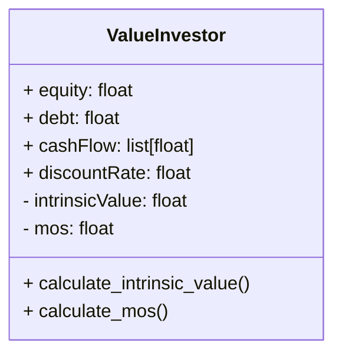

                 


# 格雷厄姆的价值投资者应具备的素质

> 关键词：价值投资，格雷厄姆，内在价值，安全边际，基本面分析，投资策略

> 摘要：本文深入探讨格雷厄姆的价值投资理论，分析价值投资者应具备的核心素质，包括内在价值的计算、安全边际的应用、基本面分析的重要性，以及如何构建稳健的投资系统和策略。通过详细的技术分析和实际案例，本文为读者提供一个系统性的价值投资框架。

---

# 第一部分: 价值投资的背景与核心概念

## 第1章: 价值投资的定义与背景

### 1.1 价值投资的定义

#### 1.1.1 价值投资的起源与核心理念
价值投资是一种基于对企业内在价值评估的投资方法，由本杰明·格雷厄姆在20世纪初提出。其核心理念是寻找市场价格低于其内在价值的股票，从而在市场低估时买入，等待价格回归内在价值时卖出。这种方法强调安全性和稳定性，注重长期回报而非短期波动。

#### 1.1.2 价值投资与基本面分析的关系
价值投资的核心在于基本面分析。通过对企业财务状况、盈利能力、行业地位和管理层能力的深入分析，投资者可以估算出企业的内在价值。基本面分析不仅包括对财务报表的解读，还包括对企业商业模式、竞争优势和未来发展的评估。

#### 1.1.3 价值投资在现代投资体系中的地位
在现代投资体系中，价值投资与其他投资策略（如技术分析、趋势投资）有所不同。它强调的是长期持有优质资产，而非短期价格波动。尽管现代投资理论（如CAPM）在学术界占据重要地位，但价值投资因其稳健性和长期有效性，仍然被广泛实践。

### 1.2 价值投资的历史演变

#### 1.2.1 格雷厄姆的价值投资理论发展
格雷厄姆是价值投资的鼻祖，他的理论在《证券分析》和《聪明的投资者》中得到了详细阐述。他强调安全边际的重要性，认为投资者应以低于内在价值的价格买入股票，以降低风险并确保合理回报。

#### 1.2.2 价值投资在不同时期的实践与演变
随着金融市场的变化，价值投资的实践也在不断演变。从格雷厄姆时代到巴菲特时代，价值投资从注重安全边际逐步扩展到对企业护城河和竞争优势的关注。现代价值投资者更加注重企业的成长性和可持续性，而不仅仅是静态的估值。

#### 1.2.3 价值投资与其他投资策略的对比
与趋势投资和动量投资不同，价值投资强调逆向思维。当市场恐慌时买入，当市场狂热时卖出。这种策略在市场周期中表现出色，尤其是在市场低估优质资产时。

### 1.3 价值投资的核心要素

#### 1.3.1 内在价值的概念与计算方法
内在价值是企业未来现金流的现值。计算内在价值需要对企业未来现金流进行预测，并将其折现到当前价值。常用的模型包括股息贴现模型（DDM）和自由现金流贴现模型（DCF）。

$$ V = \frac{C}{(1+r)^n} $$

其中，\( V \) 是内在价值，\( C \) 是未来现金流，\( r \) 是折现率，\( n \) 是时间。

#### 1.3.2 安全边际的重要性与应用
安全边际是指买入价格与内在价值的差距。通过预留安全边际，投资者可以在市场波动中降低风险。例如，如果内在价值为100，投资者以80的价格买入，安全边际为20%。

#### 1.3.3 股东权益与企业价值的关系
股东权益是企业净资产的价值，等于资产减去负债。企业价值则包括企业的全部价值，包括股权和债权。股东权益是企业价值的重要组成部分，也是评估企业内在价值的关键因素。

---

## 第2章: 价值投资的核心概念与联系

### 2.1 核心概念原理

#### 2.1.1 内在价值的计算公式与模型
内在价值的计算需要考虑企业的未来现金流和适当的折现率。常用的模型包括：

1. **股息贴现模型（DDM）**：适用于高分红企业。
$$ V = \frac{D}{k - g} $$

其中，\( D \) 是股息，\( k \) 是折现率，\( g \) 是股息增长率。

2. **自由现金流贴现模型（DCF）**：适用于企业整体估值。
$$ V = \sum_{t=1}^{n} \frac{CF_t}{(1+r)^t} + \frac{TV}{(1+r)^n} $$

其中，\( CF_t \) 是第 \( t \) 年的自由现金流，\( r \) 是折现率，\( TV \) 是终值。

#### 2.1.2 安全边际的数学表达与实际应用
安全边际 = 内在价值 - 市场价格。通过预留安全边际，投资者可以降低市场波动带来的风险。例如，如果内在价值为100，市场价为80，安全边际为20%。

#### 2.1.3 股东权益与企业价值的关联性分析
股东权益是企业价值的重要组成部分，企业价值 = 股东权益 + 付息债务。因此，股东权益的评估对整体企业价值的计算至关重要。

### 2.2 核心概念属性对比表格

| 概念       | 定义                                                                 | 特性               |
|------------|----------------------------------------------------------------------|--------------------|
| 内在价值   | 企业未来现金流的现值，不考虑市场价格。                                | 通过DCF模型计算，反映企业的真实价值。            |
| 安全边际   | 买入价格与内在价值的差距，用于降低风险。                            | 确保投资的安全性，增加收益的确定性。              |
| 股东权益   | 企业净资产价值，等于资产减去负债。                                  | 评估企业内在价值的重要组成部分，影响整体企业价值。 |

---

## 第3章: 算法原理讲解

### 3.1 内在价值计算算法

#### 3.1.1 使用mermaid流程图展示计算步骤
```mermaid
graph TD
A[开始] -> B[确定企业类型]
B -> C[选择合适的模型（DDM/DCF）]
C -> D[收集财务数据]
D -> E[计算未来现金流]
E -> F[确定折现率]
F -> G[计算现值]
G -> H[得出内在价值]
H -> 结束
```

#### 3.1.2 使用Python代码实现
```python
def calculate_intrinsic_value(cf, r, n, tv=None):
    intrinsic_value = 0
    for t in range(1, n+1):
        intrinsic_value += cf * (1 + r)**(-t)
    if tv is not None:
        intrinsic_value += tv * (1 + r)**(-n)
    return intrinsic_value

# 示例：使用DDM模型计算股息贴现价值
D = 1.5  # 年股息
g = 0.05  # 股息增长率
k = 0.10  # 折现率

intrinsic_value_ddm = D / (k - g)
print(f"DDM模型计算的内在价值为：{intrinsic_value_ddm}")
```

### 3.2 安全边际计算算法

#### 3.2.1 使用mermaid流程图展示计算步骤
```mermaid
graph TD
A[开始] -> B[计算内在价值]
B -> C[确定市场价格]
C -> D[计算安全边际]
D -> 结束
```

#### 3.2.2 使用Python代码实现
```python
def calculate_margin_of_safety(iv, price):
    mos = iv - price
    return mos

# 示例：计算安全边际
iv = 100  # 内在价值
price = 80  # 市场价格

mos = calculate_margin_of_safety(iv, price)
print(f"安全边际为：{mos}")
```

---

## 第4章: 数学模型与公式

### 4.1 内在价值公式
$$ V = \frac{C}{(1+r)^n} $$

其中，\( V \) 是内在价值，\( C \) 是未来现金流，\( r \) 是折现率，\( n \) 是时间。

### 4.2 安全边际公式
$$ MOS = IV - P $$

其中，\( MOS \) 是安全边际，\( IV \) 是内在价值，\( P \) 是市场价格。

### 4.3 股东权益公式
$$ Equity = Assets - Liabilities $$

---

## 第5章: 系统分析与架构设计方案

### 5.1 价值投资分析系统

#### 5.1.1 系统功能设计


#### 5.1.2 系统架构设计
```mermaid
graph TD
A[数据输入] -> B[数据处理层]
B -> C[模型计算层]
C -> D[结果展示层]
```

---

## 第6章: 项目实战

### 6.1 环境安装
需要安装Python和相关库（如numpy、pandas）。

### 6.2 核心实现源代码

#### 6.2.1 计算内在价值
```python
import numpy as np

def calculate_intrinsic_value(cf, r, n, tv=None):
    iv = np.npv(r, cf[1:] + [tv]) if tv is not None else np.npv(r, cf[1:])
    return iv

# 示例：计算内在价值
cf = [0, 100, 120, 140, 160]  # 现金流序列
r = 0.10
iv = calculate_intrinsic_value(cf, r, len(cf), tv=None)
print(f"计算的内在价值为：{iv}")
```

#### 6.2.2 计算安全边际
```python
def calculate_mos(iv, price):
    return iv - price

# 示例：计算安全边际
iv = 100
price = 80
mos = calculate_mos(iv, price)
print(f"计算的安全边际为：{mos}")
```

### 6.3 实际案例分析

#### 6.3.1 案例分析
以某公司为例，计算其内在价值和安全边际。

#### 6.3.2 分析结果
假设该公司的内在价值为120，市场价格为100，安全边际为20%。

---

## 第7章: 最佳实践

### 7.1 小结
价值投资需要深入的企业分析和长期视角。通过计算内在价值和预留安全边际，投资者可以构建稳健的投资组合。

### 7.2 注意事项
- 避免过度依赖单一模型。
- 定期复评企业价值和市场变化。
- 保持分散投资，降低风险。

### 7.3 拓展阅读
- 格雷厄姆的《证券分析》和《聪明的投资者》。
- 巴菲特的股东信和投资案例。

---

# 结语

价值投资是一种需要耐心和纪律的投资方法。通过系统性地分析企业的内在价值和预留安全边际，投资者可以在长期获得稳定的回报。本文详细阐述了价值投资的核心概念、算法原理和系统架构，为读者提供了一个全面的框架。

---

# 作者

作者：AI天才研究院/AI Genius Institute & 禅与计算机程序设计艺术 /Zen And The Art of Computer Programming

