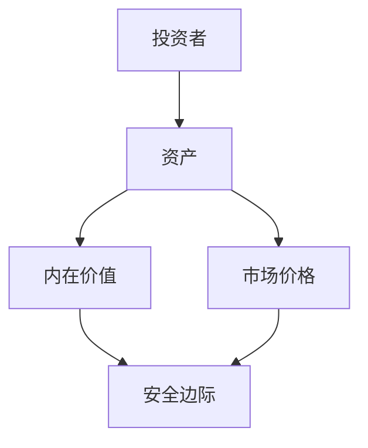
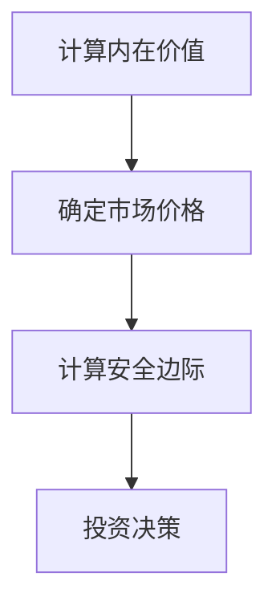
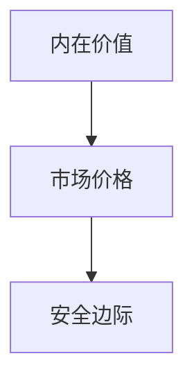
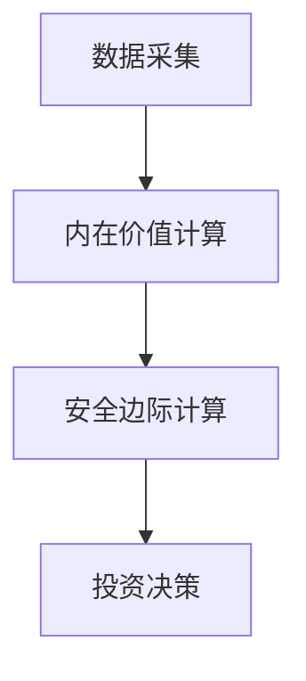

                 


# 格雷厄姆的价值线概念及其应用

> 关键词：价值线概念，格雷厄姆，安全边际，内在价值，价值投资

> 摘要：本文深入探讨了格雷厄姆的价值线概念，包括其核心理论、数学模型、系统架构设计以及实际应用案例。通过详细的理论分析和项目实战，帮助读者全面理解如何将价值线概念应用于投资决策中。

---

## 第1章: 价值投资与价值线概念概述

### 1.1 价值投资的背景与意义
价值投资是一种以基本面分析为基础的投资策略，旨在通过识别市场价格与内在价值的差异来实现超额收益。格雷厄姆作为价值投资的鼻祖，提出了“价值线”概念，为投资者提供了量化安全边际的方法。

#### 1.1.1 价值投资的起源与发展
价值投资起源于20世纪初，格雷厄姆与多德共同提出的“价值投资”理论奠定了其基础。格雷厄姆在《 Intelligent Investor》一书中首次系统地阐述了价值线概念。

#### 1.1.2 格雷厄姆与价值投资的关联
格雷厄姆通过分析市场波动性和投资者心理，提出了“市场先生”概念，强调投资者应独立于市场情绪做出决策。

#### 1.1.3 价值线概念的核心思想
价值线概念的核心在于通过计算内在价值和市场价格的差异，确定投资的安全边际。

### 1.2 格雷厄姆的价值线理论基础
#### 1.2.1 安全边际的概念与重要性
安全边际是内在价值与市场价格的差额，反映了投资的安全程度。公式为：
$$ S = V - P $$

#### 1.2.2 内在价值的定义与计算方法
内在价值是资产的公允价值，计算公式为：
$$ V = \sum_{t=1}^{n} \frac{CF_t}{(1 + r)^t} $$

#### 1.2.3 市场先生的隐喻与投资决策
市场先生的隐喻提醒投资者应关注长期价值，而非短期市场波动。

### 1.3 价值线概念的数学模型
#### 1.3.1 内在价值公式
$$ V = \frac{E}{P} $$

#### 1.3.2 安全边际的计算
$$ S = V - P $$

#### 1.3.3 市场波动与价值线的关系
市场波动会影响市场价格，但内在价值保持不变。

### 1.4 本章小结
价值线概念通过安全边际和内在价值的计算，为投资者提供了量化投资风险的方法。

---

## 第2章: 价值线概念的核心要素分析

### 2.1 内在价值的多维度分析
内在价值的计算需要考虑资产的账面价值、未来现金流以及行业地位等因素。

#### 2.1.1 资产的账面价值
账面价值是资产的账面记录价值，公式为：
$$ BV = \frac{资产总额}{股数} $$

#### 2.1.2 未来现金流的现值
未来现金流的现值公式为：
$$ PV = \sum_{t=1}^{n} \frac{CF_t}{(1 + r)^t} $$

#### 2.1.3 行业地位与竞争优势
行业地位和竞争优势影响未来现金流的稳定性。

### 2.2 安全边际的深度解析
安全边际是投资的“缓冲区”，确保在市场价格波动时仍能获得收益。

#### 2.2.1 安全边际的定义与作用
安全边际是内在价值与市场价格的差额，公式为：
$$ S = V - P $$

#### 2.2.2 安全边际的量化方法
通过比较市场价格与内在价值的差异来确定安全边际。

#### 2.2.3 安全边际与投资风险的关系
安全边际越高，投资风险越小。

### 2.3 价值线概念的属性对比
#### 2.3.1 核心属性特征对比表
| 属性 | 描述 |
|------|------|
| 内在价值 | 资产的真实价值，独立于市场波动 |
| 安全边际 | 资产价格与内在价值的差异，体现投资安全度 |
| 市场波动 | 市场价格的波动性，反映市场情绪 |

### 2.4 价值线概念的ER实体关系图


### 2.5 本章小结
通过对比和关系图，我们更清晰地理解了价值线概念的核心要素。

---

## 第3章: 价值线概念的算法原理

### 3.1 内在价值计算算法
#### 3.1.1 现金流折现法
计算未来现金流的现值公式为：
$$ V = \sum_{t=1}^{n} \frac{CF_t}{(1 + r)^t} $$

#### 3.1.2 内在价值公式
$$ V = \frac{E}{P} $$

### 3.2 安全边际计算算法
#### 3.2.1 安全边际公式
$$ S = V - P $$

#### 3.2.2 安全边际计算流程图


### 3.3 价值线概念的数学模型
#### 3.3.1 内在价值与市场价格的关系
$$ V = P + S $$

#### 3.3.2 价值线的几何意义


### 3.4 本章小结
通过算法和数学模型，我们理解了价值线概念的量化方法。

---

## 第4章: 价值线概念的系统架构设计

### 4.1 价值线系统的功能模块
#### 4.1.1 数据采集模块
采集资产的财务数据和市场数据。

#### 4.1.2 内在价值计算模块
基于财务数据计算内在价值。

#### 4.1.3 安全边际计算模块
比较市场价格与内在价值，计算安全边际。

#### 4.1.4 投资决策模块
根据安全边际做出投资决策。

### 4.2 系统架构设计
#### 4.2.1 分层架构图


---

## 第5章: 价值线概念的项目实战

### 5.1 项目背景与目标
通过分析具体案例，验证价值线概念的应用。

### 5.2 项目核心实现
#### 5.2.1 环境安装
安装Python和相关库。

#### 5.2.2 核心代码实现
```python
def calculate_intrinsic_value(enterprise_value, earnings_per_share):
    return enterprise_value / earnings_per_share

def calculate_margin_of_safety(intrinsic_value, market_price):
    return intrinsic_value - market_price
```

### 5.3 项目小结
通过项目实战，我们验证了价值线概念的实际应用价值。

---

## 第6章: 价值线概念的最佳实践

### 6.1 小结
价值线概念为投资者提供了量化安全边际的方法。

### 6.2 注意事项
投资者需结合市场环境和企业基本面进行综合分析。

### 6.3 拓展阅读
建议深入阅读格雷厄姆的《 Intelligent Investor》。

---

## 作者：AI天才研究院/AI Genius Institute & 禅与计算机程序设计艺术 /Zen And The Art of Computer Programming

---

通过以上结构，我们系统地分析了格雷厄姆的价值线概念，从理论到实践，帮助读者全面理解其应用价值。

