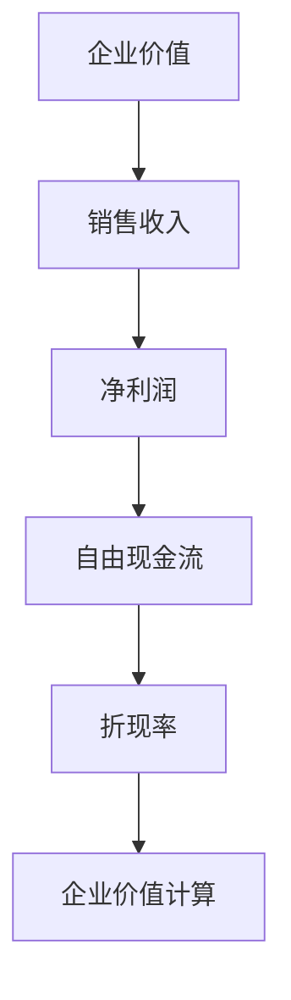
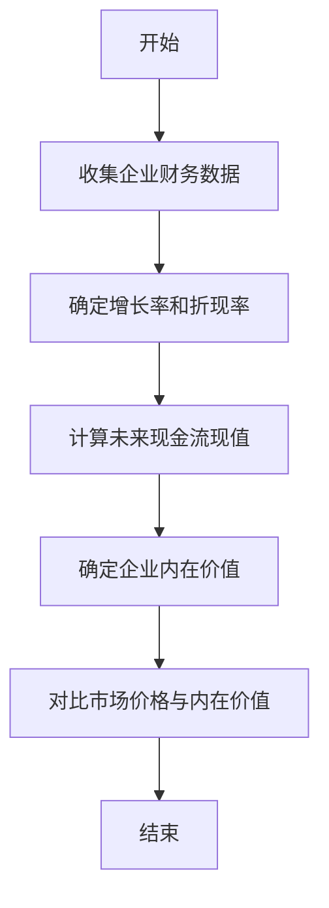
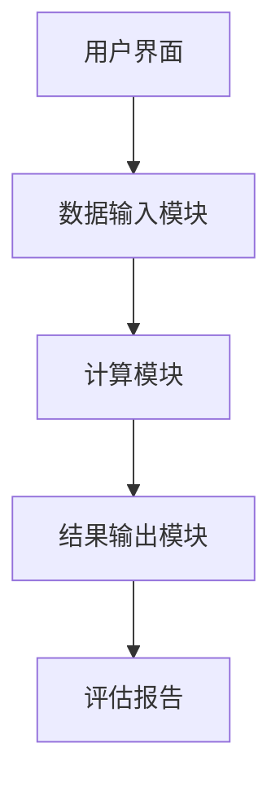

                 


# 格雷厄姆的企业价值计算方法

---

## 关键词：
- 企业价值计算
- 格雷厄姆投资理论
- 价值投资
- 股票评估
- 财务分析

---

## 摘要：
格雷厄姆的企业价值计算方法是价值投资的核心工具之一，旨在通过分析企业的基本面数据，计算其内在价值，从而确定是否被市场低估。本文将从背景介绍、核心概念、计算公式、系统架构设计、项目实战以及最佳实践等多个维度，详细解析格雷厄姆的企业价值计算方法，帮助读者掌握这一经典投资工具的原理与应用。

---

# 第一部分：企业价值计算的背景与意义

## 第1章：企业价值计算的背景介绍

### 1.1 企业价值计算的定义与概念
企业价值（Enterprise Value，EV）是指企业整体的经济价值，包括所有权益、债务和所有者的权益。它反映了企业的真实价值，是投资者评估企业的重要指标。格雷厄姆将企业价值定义为企业的内在价值，即企业在未来现金流的现值。

### 1.2 企业价值计算的重要性
企业价值计算是投资决策的核心，它可以帮助投资者识别被低估的企业，避免因市场波动导致的投资失误。格雷厄姆的企业价值计算方法强调基本面分析，通过对企业盈利能力、成长潜力和财务状况的深入研究，找到具有长期投资价值的企业。

### 1.3 格雷厄姆的贡献
格雷厄姆是价值投资的鼻祖，他提出的企业价值计算方法奠定了现代投资学的基础。他强调安全边际的概念，即通过计算企业的内在价值，寻找市场价格低于内在价值的企业进行投资。这种方法在今天仍然被广泛应用于股票评估和企业估值。

---

## 第2章：格雷厄姆与价值投资

### 2.1 格雷厄姆的生平与贡献
本·格雷厄姆（Ben Graham）是20世纪初著名的投资家和学者，他的投资理念深刻影响了沃伦·巴菲特等后来的投资大师。格雷厄姆强调安全边际和价值投资，主张通过对企业基本面的深入分析，找到具有长期竞争优势的企业。

### 2.2 价值投资的基本原理
价值投资的核心是寻找市场价格低于内在价值的企业。格雷厄姆的企业价值计算方法通过对企业未来现金流的现值进行评估，确定企业的内在价值。这种方法强调对企业财务状况、盈利能力和发展潜力的全面分析。

### 2.3 格雷厄姆方法与现代投资理论的联系
格雷厄姆的企业价值计算方法为现代投资理论奠定了基础。他的方法强调对企业基本面的分析，而现代投资理论则通过资本资产定价模型（CAPM）和套利定价理论（APT）进一步发展了这一思想。格雷厄姆的方法与现代投资理论在企业估值方面具有高度的关联性。

---

## 第3章：企业价值计算的基本框架

### 3.1 企业价值的构成要素
企业价值的计算涉及多个关键要素，包括企业的销售收入、净利润、自由现金流、折现率和未来增长潜力等。格雷厄姆强调通过对企业盈利能力、财务状况和市场地位的分析，确定企业的内在价值。

### 3.2 格雷厄姆公式与现代企业价值计算的联系
格雷厄姆的公式通过对企业未来现金流的现值进行评估，计算企业的内在价值。这种方法与现代企业价值计算中的贴现现金流模型（DCF）有相似之处，但格雷厄姆的方法更注重企业的安全边际和长期竞争优势。

### 3.3 企业价值计算的边界与外延
企业价值计算的边界包括企业的财务状况、市场环境和宏观经济因素。格雷厄姆的方法强调对企业财务状况的深入分析，而现代企业价值计算则更注重对市场环境和宏观经济因素的考虑。

---

# 第二部分：格雷厄姆企业价值计算的核心概念与联系

## 第4章：核心概念原理

### 4.1 格雷厄姆公式的基本原理
格雷厄姆的企业价值计算公式通过对企业未来现金流的现值进行评估，确定企业的内在价值。公式如下：

$$EV = \frac{P \times (1 + g)^n}{(1 + r)^n}$$

其中，P是企业当前的净利润，g是企业的年增长率，r是折现率，n是评估的年数。

### 4.2 格雷厄姆公式与现代企业价值计算的对比
格雷厄姆公式与现代企业价值计算的核心思路相似，但侧重点不同。格雷厄姆更注重企业的安全边际和长期竞争优势，而现代企业价值计算则更注重对市场环境和宏观经济因素的考虑。

### 4.3 格雷厄姆公式的核心要素关系
格雷厄姆公式的核心要素包括企业的净利润、增长率、折现率和评估年数。这些要素之间的关系决定了企业的内在价值。

---

## 第5章：核心概念属性对比表格

### 5.1 格雷厄姆企业价值计算与现代企业价值计算的对比
| 对比维度 | 格雷厄姆方法 | 现代DCF模型 |
|----------|--------------|-------------|
| 核心思想 | 安全边际与长期竞争优势 | 现金流贴现与市场环境 |
| 计算方法 | 基于历史数据与安全边际 | 基于未来现金流贴现 |
| 适用场景 | 中长期投资 | 短期与长期投资 |

### 5.2 格雷厄姆公式与DCF模型的对比
| 对比维度 | 格雷厄姆公式 | DCF模型 |
|----------|--------------|-----------|
| 计算基础 | 净利润与安全边际 | 自由现金流 |
| 折现率 | 基于企业风险 | 基于市场利率 |
| 适用性 | 中小型企业 | 大型企业 |

---

## 第6章：ER实体关系图架构

### 6.1 企业价值计算的实体关系图


---

# 第三部分：格雷厄姆企业价值计算的算法原理

## 第7章：算法原理概述

### 7.1 格雷厄姆公式的基本原理
格雷厄姆的企业价值计算公式通过对企业未来现金流的现值进行评估，确定企业的内在价值。公式如下：

$$EV = \frac{P \times (1 + g)^n}{(1 + r)^n}$$

其中，P是企业当前的净利润，g是企业的年增长率，r是折现率，n是评估的年数。

### 7.2 格雷厄姆公式的核心步骤
1. 收集企业的历史财务数据，包括销售收入、净利润和自由现金流。
2. 确定企业的增长率和折现率。
3. 计算企业的未来现金流的现值，确定企业的内在价值。
4. 对比企业的市场价格与内在价值，判断是否被低估。

### 7.3 格雷厄姆公式与DCF模型的联系
格雷厄姆公式与DCF模型的核心思路相似，但侧重点不同。格雷厄姆更注重企业的安全边际和长期竞争优势，而DCF模型更注重对市场环境和宏观经济因素的考虑。

---

## 第8章：算法流程图



---

# 第四部分：格雷厄姆企业价值计算的系统分析与架构设计

## 第9章：系统分析与架构设计方案

### 9.1 问题场景介绍
本文将设计一个基于格雷厄姆企业价值计算方法的系统，用于评估企业的内在价值。系统将收集企业的财务数据，计算未来现金流的现值，并对比市场价格，判断企业是否被低估。

### 9.2 系统功能设计
- **数据输入**：收集企业的财务数据，包括销售收入、净利润和自由现金流。
- **参数设置**：确定企业的增长率和折现率。
- **计算模块**：计算企业的未来现金流现值，确定企业内在价值。
- **结果输出**：对比市场价格与内在价值，生成评估报告。

### 9.3 系统架构设计


---

## 第10章：系统核心实现源代码

### 10.1 代码实现
```python
def calculate_ev(net_income, growth_rate, discount_rate, years):
    ev = net_income * (1 + growth_rate) ** years / (1 + discount_rate) ** years
    return ev

# 示例计算
net_income = 1000000
growth_rate = 0.05
discount_rate = 0.1
years = 5
ev = calculate_ev(net_income, growth_rate, discount_rate, years)
print(f"企业内在价值为：{ev}")
```

### 10.2 代码解读
- **函数定义**：`calculate_ev` 函数接受企业的净利润、增长率、折现率和年数作为参数，计算企业的内在价值。
- **计算公式**：使用格雷厄姆的企业价值计算公式，计算未来现金流的现值。
- **示例计算**：假设企业净利润为100万元，年增长率为5%，折现率为10%，评估年限为5年，计算企业内在价值。

---

## 第11章：项目实战

### 11.1 案例分析
假设我们有一家企业的财务数据如下：
- 净利润：100万元
- 年增长率：5%
- 折现率：10%
- 评估年限：5年

根据格雷厄姆的企业价值计算公式，计算企业的内在价值：

$$EV = \frac{1000000 \times (1 + 0.05)^5}{(1 + 0.1)^5} \approx 660,111.78$$

---

## 第12章：最佳实践、小结、注意事项和拓展阅读

### 12.1 最佳实践
- 在实际应用中，企业价值计算需要结合企业的实际情况，考虑市场环境和宏观经济因素。
- 格雷厄姆的方法强调安全边际，建议投资者在市场价格显著低于内在价值时进行投资。

### 12.2 小结
格雷厄姆的企业价值计算方法是价值投资的核心工具之一，通过对企业基本面的深入分析，计算企业的内在价值，判断是否被低估。本文详细解析了格雷厄姆的方法，并通过实际案例展示了其应用。

### 12.3 注意事项
- 企业价值计算需要结合企业的实际情况，考虑市场环境和宏观经济因素。
- 格雷厄姆的方法适用于长期投资，不适用于短期交易。

### 12.4 拓展阅读
- 《证券分析》（Ben Graham）
- 《聪明的投资者》（Warren Buffett）
- 现代投资理论（CAPM, APT）

---

# 作者：AI天才研究院/AI Genius Institute & 禅与计算机程序设计艺术 /Zen And The Art of Computer Programming

