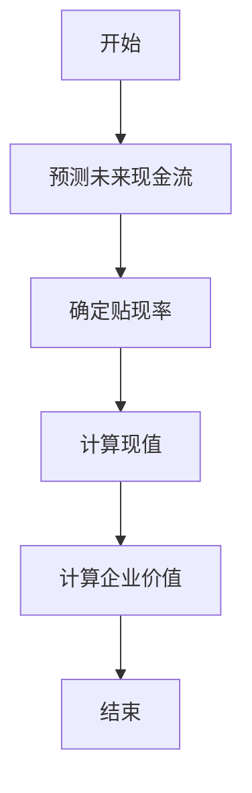
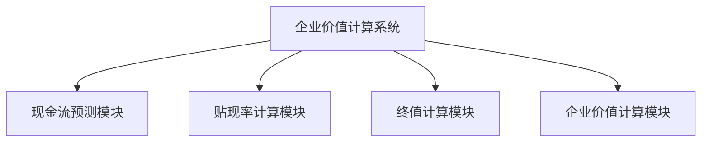
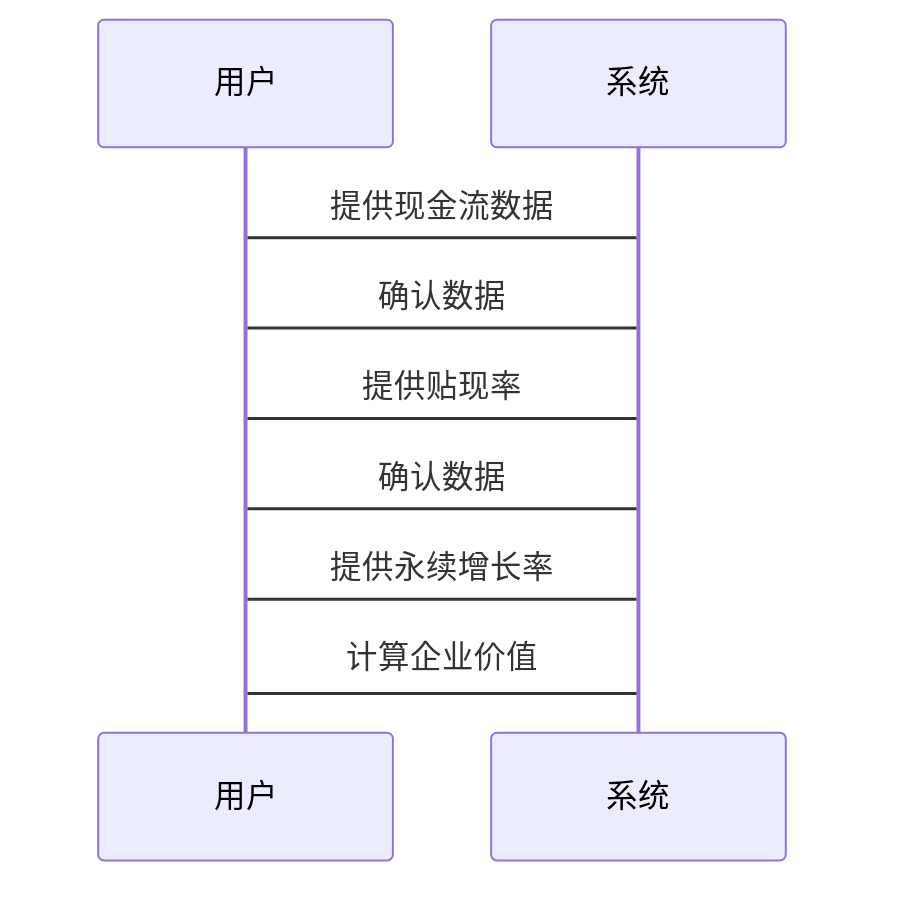

                 


# 《格雷厄姆的企业价值计算方法》

> 关键词：企业价值计算、价值投资、现金流折现法、贴现率、永续增长率

> 摘要：本文系统介绍了格雷厄姆的企业价值计算方法，从核心概念到算法原理，从系统设计到项目实战，深入剖析了企业价值计算的理论与实践。文章通过详细讲解企业价值计算的背景、核心概念、算法原理、系统架构、项目实战以及总结与展望，帮助读者全面掌握企业价值计算的方法和技巧。文章结合了数学公式、流程图、类图和序列图等技术手段，确保读者能够深入理解企业价值计算的原理和应用。

---

# 第一部分：企业价值计算的背景与重要性

## 第1章：企业价值计算的基本概念

### 1.1 什么是企业价值
企业价值（Enterprise Value，EV）是指一家企业整体的市场价值，包括其所有资产和负债的公允价值。企业价值不仅仅是账面价值，还包括未来的现金流折现值。

### 1.2 企业价值与股东价值的关系
企业价值是股东价值和债权价值的总和。通过计算企业价值，可以更好地理解股东和债权人的利益分配。

### 1.3 企业价值计算的重要性
企业价值计算是投资决策、企业并购和融资的重要依据，能够帮助投资者和企业管理者做出更科学的决策。

---

## 第2章：企业价值计算的历史与发展

### 2.1 早期的企业价值计算方法
早期的企业价值计算主要基于账面价值和资产价值，忽略了未来现金流的折现。

### 2.2 格雷厄姆的价值投资理论
格雷厄姆提出了“安全边际”和“内在价值”概念，强调通过分析企业未来现金流的折现值来确定其内在价值。

### 2.3 现代企业价值计算的发展
现代企业价值计算结合了财务模型和市场数据，形成了以现金流折现法（DCF）为核心的多种计算方法。

---

## 第3章：企业价值计算的应用场景

### 3.1 企业并购与估值
企业并购中，企业价值计算是确定目标企业合理价格的核心方法。

### 3.2 投资决策中的应用
投资者通过计算企业价值，可以评估股票的合理价格，避免高估或低估。

### 3.3 企业融资与资本预算
企业融资和资本预算中，企业价值计算是评估投资项目价值的重要工具。

---

# 第二部分：企业价值计算的核心概念与联系

## 第4章：现金流的概念与计算

### 4.1 现金流的定义
现金流是指企业在一定时期内的现金流入和流出，包括经营活动、投资活动和筹资活动的现金流。

### 4.2 现金流的分类
- 经营活动现金流：企业日常运营中的现金流。
- 投资活动现金流：企业投资活动中的现金流。
- 筹资活动现金流：企业筹资活动中的现金流。

### 4.3 现金流的计算公式
$$ \text{现金流} = \text{营业收入} - \text{营业成本} - \text{税费} $$

---

## 第5章：贴现率的定义与计算

### 5.1 贴现率的定义
贴现率是将未来现金流折现到现值的利率，反映了资金的时间价值和风险。

### 5.2 贴现率的计算方法
贴现率通常基于无风险利率和风险溢价，可以通过市场数据和企业风险评估确定。

### 5.3 贴现率的公式
$$ \text{现值} = \frac{\text{终值}}{(1 + \text{贴现率})^n} $$

---

## 第6章：永续增长率的计算

### 6.1 永续增长率的定义
永续增长率是指企业在未来无限期的现金流增长率，通常用于永续年金的计算。

### 6.2 永续增长率的假设
永续增长率通常假设企业在稳定状态下保持恒定的增长率。

### 6.3 永续增长率的公式
$$ \text{终值} = \frac{\text{现金流}}{\text{贴现率} - \text{永续增长率}} $$

---

# 第三部分：企业价值计算的算法原理

## 第7章：现金流折现法（DCF）原理

### 7.1 DCF模型的定义
现金流折现法（Discounted Cash Flow，DCF）是通过将未来现金流折现到现值来计算企业价值的方法。

### 7.2 DCF模型的步骤
1. 预测未来现金流。
2. 确定贴现率。
3. 计算未来现金流的现值。
4. 计算企业价值。

### 7.3 DCF模型的公式
$$ \text{企业价值} = \sum_{t=1}^{\infty} \frac{\text{现金流}_t}{(1 + \text{贴现率})^t} $$

---

## 第8章：企业价值计算的数学模型

### 8.1 现金流折现的数学公式
$$ \text{现值} = \sum_{t=1}^{n} \frac{\text{现金流}_t}{(1 + r)^t} $$

### 8.2 终值计算的数学公式
$$ \text{终值} = \text{现金流}_t \times \left( \frac{1}{(1 + r)^t} \right) $$

---

## 第9章：企业价值计算的流程图

### 9.1 流程图设计


---

# 第四部分：系统分析与架构设计

## 第10章：企业价值计算系统的设计

### 10.1 系统功能模块
- 现金流预测模块
- 贴现率计算模块
- 终值计算模块
- 企业价值计算模块

### 10.2 系统架构图


---

## 第11章：系统接口与交互设计

### 11.1 系统接口
- 输入接口：现金流数据、贴现率、永续增长率。
- 输出接口：企业价值。

### 11.2 系统交互


---

# 第五部分：项目实战

## 第12章：企业价值计算的Python实现

### 12.1 环境安装
安装Python和相关库（如numpy、pandas）。

### 12.2 核心代码实现
```python
def calculate_enterprise_value(cash_flows, discount_rate, growth_rate):
    enterprise_value = 0
    for t in range(len(cash_flows)):
        if t == 0:
            discounted_cash_flow = cash_flows[t] / (1 + discount_rate)**t
        else:
            discounted_cash_flow = cash_flows[t] / (1 + discount_rate)**t
        enterprise_value += discounted_cash_flow
    return enterprise_value
```

### 12.3 代码解读与分析
- 代码通过循环计算每个现金流的现值，并累加得到企业价值。

---

## 第13章：企业价值计算的案例分析

### 13.1 案例背景
某企业未来5年的现金流分别为100、120、140、160、180万元，贴现率为10%，永续增长率为5%。

### 13.2 计算过程
$$ \text{企业价值} = \sum_{t=1}^{5} \frac{\text{现金流}_t}{(1 + 0.1)^t} $$

---

## 第14章：项目小结

### 14.1 项目总结
通过Python代码实现企业价值计算，验证了现金流折现法的可行性。

### 14.2 注意事项
在实际应用中，需考虑更多的变量和风险因素。

---

# 第六部分：总结与展望

## 第15章：企业价值计算的最佳实践

### 15.1 最佳实践
- 使用可靠的数据源。
- 考虑市场风险和行业风险。
- 定期更新模型参数。

### 15.2 小结
企业价值计算是投资决策的重要工具，需要结合理论与实践。

---

## 第16章：企业价值计算的注意事项

### 16.1 注意事项
- 数据的准确性。
- 模型的适用性。
- 风险的评估。

### 16.2 拓展阅读
建议阅读《格雷厄姆证券分析》和《巴菲特的思维方式》。

---

# 作者：AI天才研究院/AI Genius Institute & 禅与计算机程序设计艺术/Zen And The Art of Computer Programming

