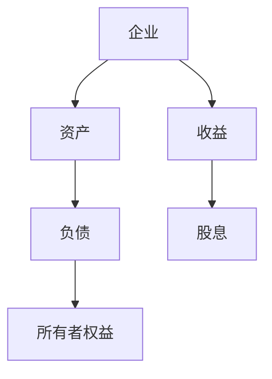
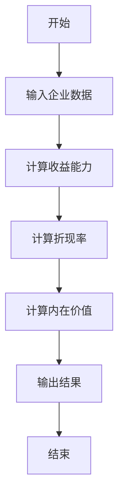
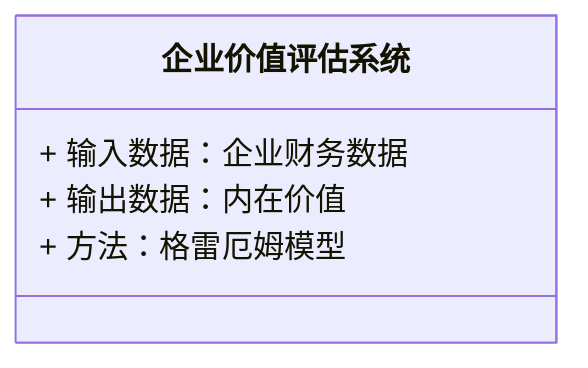
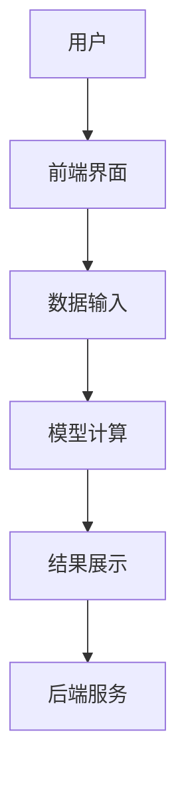

                 


# 格雷厄姆的企业价值评估方法

> 关键词：格雷厄姆，企业价值评估，价值投资，内在价值，折现率

> 摘要：本文详细介绍了格雷厄姆的企业价值评估方法，从其核心概念、算法原理到系统设计和项目实战，全面解析了这一经典方法在现代的应用与实践。通过本文，读者将掌握如何运用格雷厄姆的理论来评估企业的内在价值，从而做出更明智的投资决策。

---

## 第一章: 企业价值评估的背景与基础

### 1.1 企业价值评估的定义与重要性

企业价值评估（Corporate Value Evaluation）是通过对企业的资产、负债、收益能力等多方面因素进行综合分析，估算其内在价值的过程。这种评估方法在投资决策中具有重要意义，能够帮助投资者识别被低估的企业，从而实现超额收益。

#### 1.1.1 企业价值评估的定义
企业价值评估是指通过对企业未来现金流的预测，结合适当的折现率，计算其内在价值的过程。这一过程旨在揭示企业的实际价值，而非其市场交易价格。

#### 1.1.2 企业价值评估的重要性
- **投资决策**：评估企业的真实价值，避免市场泡沫的影响。
- **风险管理**：识别高风险企业，降低投资风险。
- **价值发现**：寻找被市场低估的企业，实现超额收益。

#### 1.1.3 企业价值评估的核心目标
- **确定内在价值**：计算企业的真实价值。
- **识别投资机会**：通过比较市场价与内在价值，寻找低估企业。
- **动态调整**：根据市场变化和企业经营状况，及时调整评估结果。

### 1.2 格雷厄姆投资理念的起源

本杰明·格雷厄姆（Benjamin Graham）是价值投资的鼻祖，他的投资理念对企业价值评估领域产生了深远影响。格雷厄姆的投资策略注重安全边际，强调以低于内在价值的价格买入优质企业。

#### 1.2.1 格雷厄姆的生平简介
格雷厄姆出生于1894年，是20世纪初美国著名的投资家和金融分析师。他在投资领域的主要贡献在于创立了价值投资理论，强调基本面分析和安全边际。

#### 1.2.2 格雷厄姆与价值投资的渊源
格雷厄姆在哥伦比亚大学教授证券分析，培养了包括沃伦·巴菲特在内的众多投资大师。他的著作《证券分析》是价值投资领域的经典之作，详细阐述了企业价值评估的方法。

#### 1.2.3 格雷厄姆对企业价值评估的贡献
格雷厄姆提出了“内在价值”概念，认为企业的真实价值可以通过对其未来现金流的折现计算得出。这一方法为现代企业价值评估奠定了基础。

### 1.3 企业价值评估的现代发展

随着金融理论的发展和市场的变化，企业价值评估方法也在不断演变。格雷厄姆的理论与现代评估方法相结合，形成了更完善的评估体系。

#### 1.3.1 格雷厄姆方法与现代评估的结合
现代企业价值评估方法在格雷厄姆的基础上，引入了更多因素，如市场环境、行业竞争状况等，使评估结果更加准确。

#### 1.3.2 不同行业中的应用差异
不同行业的企业具有不同的特点，如科技企业的研发投入高，而制造业企业更注重资产规模。因此，企业价值评估需要根据不同行业的特点进行调整。

#### 1.3.3 企业价值评估的未来趋势
随着大数据和人工智能的应用，企业价值评估将更加依赖于数据驱动的方法，实现更精准的预测和评估。

---

## 第二章: 核心概念与联系

### 2.1 核心概念原理

企业价值评估的核心在于准确计算企业的内在价值，这需要综合考虑企业的收益能力、资产状况和市场环境等多个因素。

#### 2.1.1 企业价值评估的基本原理
企业价值 = 未来现金流的现值

$$ V = \sum_{t=1}^{n} \frac{CF_t}{(1 + r)^t} $$

其中，\( CF_t \) 是第 \( t \) 年的现金流，\( r \) 是折现率，\( n \) 是预测期数。

#### 2.1.2 格雷厄姆模型的核心要素
- **收益能力**：企业的盈利能力是内在价值的基础。
- **折现率**：反映投资风险的指标。
- **未来现金流**：预测企业未来的现金流入。

#### 2.1.3 企业价值评估的关键假设
- 收益稳定增长。
- 贴现率不变。
- 企业永续经营。

### 2.2 核心概念属性特征对比表

表2-1: 格雷厄姆模型与其他评估方法的对比

| 评估方法   | 核心假设                 | 适用场景             | 优点                           | 缺点                           |
|------------|--------------------------|----------------------|-------------------------------|-------------------------------|
| 格雷厄姆模型 | 稳定收益，合理折现率     | 成熟企业             | 计算简单，易于理解             | 适用于收益稳定的行业           |
| 市盈率法   | 市场价格与净利润相关       | 各类企业             | 易于计算，数据来源广泛         | 不能反映未来增长潜力           |
| 现金流折现法| 预测未来现金流           | 高增长企业           | 更精确，考虑未来增长           | 计算复杂，依赖假设             |

### 2.3 ER实体关系图



图2-1：企业价值评估的ER实体关系图，展示了企业与其资产、负债、收益等核心要素之间的关系。

---

## 第三章: 格雷厄姆企业价值评估的算法原理

### 3.1 格雷厄姆模型的数学公式

格雷厄姆模型的核心公式是将企业的预期收益折现，计算其内在价值。

$$ V = \frac{E}{1 + r} $$

其中，\( E \) 是企业的预期收益，\( r \) 是折现率。

### 3.2 格雷厄姆模型的实现步骤

#### 3.2.1 确定企业的收益能力
- 收益能力 = 净利润 + 非经营性资产的收益。

#### 3.2.2 估算合理的折现率
- 折现率 = 无风险利率 + 风险溢价。

#### 3.2.3 计算企业内在价值
- 内在价值 = 收益能力 / (1 + 折现率)。

### 3.3 算法流程图



图3-1：格雷厄姆模型的算法流程图，展示了从输入数据到输出结果的整个计算过程。

### 3.4 代码实现

```python
def calculate_intrinsic_value(revenue, discount_rate):
    return revenue / (1 + discount_rate)

# 示例计算
revenue = 1000000
discount_rate = 0.1
intrinsic_value = calculate_intrinsic_value(revenue, discount_rate)
print(f"企业的内在价值为：{intrinsic_value}")
```

代码3-1：计算企业内在价值的Python函数，输入收益和折现率，输出内在价值。

---

## 第四章: 系统分析与架构设计

### 4.1 系统分析

企业价值评估系统需要具备数据收集、模型计算、结果展示等功能，能够支持用户进行多维度的分析。

#### 4.1.1 问题场景介绍
投资者需要快速评估多个企业的价值，以便做出投资决策。

#### 4.1.2 系统功能设计
- 数据输入：支持用户输入企业数据。
- 模型计算：自动计算企业的内在价值。
- 结果展示：以图表形式展示评估结果。



图4-1：企业价值评估系统的类图，展示了系统的组成和功能。

#### 4.1.3 系统架构设计



图4-2：企业价值评估系统的架构图，展示了用户与系统之间的交互流程。

---

## 第五章: 项目实战

### 5.1 环境安装

需要安装Python和相关库（如numpy、pandas），用于数据处理和计算。

### 5.2 核心实现

代码5-1：实现格雷厄姆模型的Python代码。

```python
import numpy as np
import pandas as pd

def calculate_intrinsic_value(revenue, discount_rate):
    return revenue / (1 + discount_rate)

# 示例数据
data = {'公司': ['A', 'B', 'C'],
         '收益': [1000000, 1500000, 2000000],
         '折现率': [0.1, 0.12, 0.08]}
df = pd.DataFrame(data)

# 计算内在价值
df['内在价值'] = df.apply(lambda x: calculate_intrinsic_value(x['收益'], x['折现率']), axis=1)
print(df)
```

### 5.3 案例分析

以公司A为例，收益为1,000,000，折现率为10%，计算其内在价值：

$$ V = \frac{1,000,000}{1 + 0.1} = 909,090.91 $$

---

## 第六章: 总结与展望

### 6.1 最佳实践 tips

- **数据准确性**：确保输入数据的准确性。
- **模型适用性**：根据企业特点选择合适的评估方法。
- **持续更新**：定期更新数据和模型参数。

### 6.2 小结

本文详细介绍了格雷厄姆的企业价值评估方法，从理论基础到实际应用，帮助读者掌握这一经典方法。通过案例分析和系统设计，进一步加深了对模型的理解和应用能力。

### 6.3 注意事项

- 折现率的选择对结果影响较大，需结合市场环境和企业风险。
- 模型假设可能与实际情况存在偏差，需进行适当调整。

### 6.4 拓展阅读

- 《证券分析》——本杰明·格雷厄姆
- 《价值投资：格雷厄姆与多德的智慧》——乔尔·蒂博戴尔

---

## 作者：AI天才研究院 & 禅与计算机程序设计艺术

---

这篇文章从理论到实践，系统地介绍了格雷厄姆的企业价值评估方法，适合对价值投资感兴趣的技术爱好者和金融从业者阅读。希望本文能够帮助读者更好地理解和应用这一经典方法，做出更明智的投资决策。

