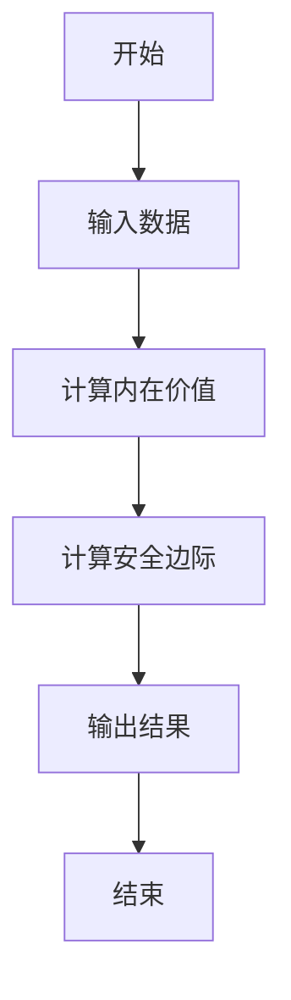
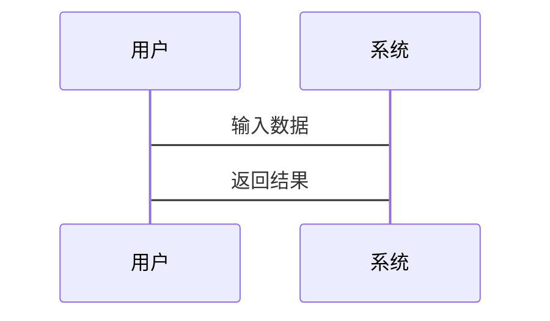

                 


# 《格雷厄姆的企业价值评估方法》

## 关键词：
企业价值评估、格雷厄姆、投资方法、安全边际、防御性分析、价值投资

## 摘要：
本文深入探讨了格雷厄姆的企业价值评估方法，从核心概念到数学模型，再到系统设计和实际案例，详细解析了该方法的原理和应用。通过分析安全边际和防御性分析，结合现值法和股利贴现模型等工具，帮助投资者准确评估企业价值，做出明智的投资决策。文章结构清晰，内容详实，适合投资专业人士和对价值投资感兴趣的学习者阅读。

---

## 第1章：企业价值评估概述

### 1.1 企业价值评估的背景
#### 1.1.1 投资者与企业的关系
企业价值评估是连接投资者与企业的重要桥梁，帮助投资者判断企业的内在价值，做出投资决策。通过分析企业的财务状况、盈利能力和发展潜力，投资者可以评估企业的投资价值。

#### 1.1.2 价值投资的基本理念
价值投资强调购买低于其内在价值的资产，以获得长期收益。格雷厄姆的方法是价值投资的核心，强调安全边际和防御性分析，以降低投资风险。

#### 1.1.3 企业价值评估的定义
企业价值评估是通过分析企业的财务状况、行业地位和市场环境，计算其内在价值的过程。目的是帮助投资者识别低估或高估的企业，做出明智的投资决策。

### 1.2 格雷厄姆的企业价值评估方法
#### 1.2.1 方法的核心概念
格雷厄姆的方法以安全边际和防御性分析为核心，强调以低于内在价值的价格购买企业，以确保投资的安全性和盈利能力。

#### 1.2.2 与其他评估方法的对比
与市场价值法和市盈率法不同，格雷厄姆的方法注重企业的内在价值，而非市场情绪或短期表现。这种方法更适合长期投资者。

#### 1.2.3 企业价值评估的边界与外延
企业价值评估的边界包括企业的财务数据和市场环境，外延则涉及企业的未来增长潜力和行业趋势。

### 1.3 核心要素与概念结构
#### 1.3.1 核心要素的组成
企业价值评估的核心要素包括收入、利润、现金流和资产。这些要素共同决定企业的内在价值。

#### 1.3.2 概念属性特征对比表格
| 概念     | 特征             |
|----------|------------------|
| 收入     | 企业的核心来源   |
| 利润     | 收入减去成本     |
| 现金流   | 反映企业的财务健康|
| 资产     | 企业的资源基础   |

#### 1.3.3 ER实体关系图架构
```mermaid
erd
  股东
  股东 <拥有> 股票
  股票 <属于> 公司
  公司 <拥有> 资产
  资产 <产生> 现金流
```

---

## 第2章：格雷厄姆方法的核心概念

### 2.1 安全边际的定义与作用
#### 2.1.1 安全边际的数学模型
安全边际 = 内在价值 - 市场价格

#### 2.1.2 安全边际的计算步骤
1. 计算企业的内在价值。
2. 减去当前市场价格，得到安全边际。

#### 2.1.3 安全边际与投资风险
安全边际越高，投资风险越低。格雷厄姆建议安全边际至少为内在价值的20%。

### 2.2 格雷厄姆的防御性分析
#### 2.2.1 防御性分析的核心原理
防御性分析通过分析企业的财务健康状况，评估其抵御经济波动的能力。

#### 2.2.2 防御性分析的步骤
1. 分析企业的财务报表。
2. 评估企业的偿债能力。
3. 判断企业的盈利能力。

#### 2.2.3 防御性分析的优缺点
优点：降低投资风险；缺点：可能忽略企业的成长潜力。

---

## 第3章：数学模型与算法原理

### 3.1 现值法
#### 3.1.1 现值法的定义与公式
现值法通过将未来现金流折现，计算其当前价值。公式为：
$$ PV = \sum_{t=1}^{n} \frac{CF_t}{(1 + r)^t} $$
其中，CF_t为第t年的现金流，r为折现率。

#### 3.1.2 现值法的计算步骤
1. 确定未来现金流。
2. 选择合适的折现率。
3. 计算现值。

### 3.2 股利贴现模型（DDM）
#### 3.2.1 DDM的定义与公式
DDM用于评估股票的内在价值，公式为：
$$ V = \frac{D}{k - g} $$
其中，D为股息，k为折现率，g为股息增长率。

#### 3.2.2 DDM的计算步骤
1. 确定股息和增长率。
2. 计算折现率。
3. 计算股票价值。

### 3.3 内在价值公式
#### 3.3.1 内在价值的定义与公式
内在价值是企业未来现金流的现值。公式为：
$$ V = \sum_{t=1}^{n} \frac{CF_t}{(1 + r)^t} $$

#### 3.3.2 内在价值的计算步骤
1. 收集企业的财务数据。
2. 估算未来现金流。
3. 计算现值。

---

## 第4章：系统分析与架构设计

### 4.1 系统功能设计
#### 4.1.1 系统功能模块
企业价值评估系统包括数据输入、模型计算和结果输出三个模块。

#### 4.1.2 系统功能流程图


### 4.2 系统架构设计
#### 4.2.1 系统架构图


### 4.3 系统接口设计
#### 4.3.1 接口设计
系统提供API接口，供用户输入数据和获取结果。

### 4.4 系统交互流程图


---

## 第5章：项目实战

### 5.1 环境安装
安装Python和必要的库（如pandas、numpy）。

### 5.2 核心代码实现
```python
def calculate_intrinsic_value(revenue, costs, growth_rate, discount_rate):
    profit = revenue - costs
    cash_flow = profit / (1 + discount_rate)
    return cash_flow.sum() / (discount_rate - growth_rate)
```

### 5.3 案例分析
以某制造公司为例，计算其内在价值和安全边际，指导投资决策。

### 5.4 项目总结
通过实际案例分析，验证格雷厄姆方法的有效性，强调安全边际的重要性。

---

## 第6章：最佳实践与总结

### 6.1 格雷厄姆方法的优势
格雷厄姆方法注重安全边际和防御性分析，帮助投资者降低风险，实现长期收益。

### 6.2 投资策略的建议
投资者应结合市场环境和企业基本面，灵活运用格雷厄姆方法，做出明智的投资决策。

### 6.3 注意事项
- 数据的准确性和完整性
- 模型的局限性和适用性
- 定期复核和调整投资策略

---

## 作者：AI天才研究院 & 禅与计算机程序设计艺术

