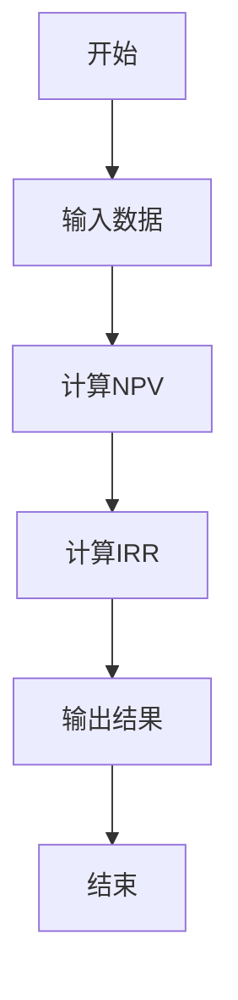
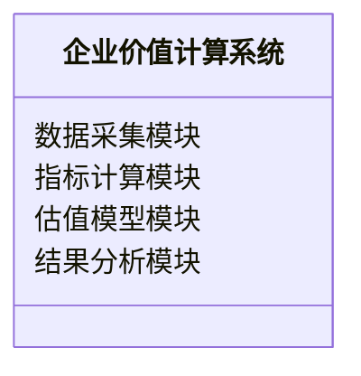

                 


# 格雷厄姆的企业内在价值计算：现代化的方法与工具

## 关键词：企业内在价值，格雷厄姆，价值投资，现代方法，计算工具

## 摘要：  
本文系统性地探讨了格雷厄姆的企业内在价值计算方法在现代环境下的应用与创新。通过结合数学模型、算法实现和系统架构设计，文章详细介绍了如何利用现代化工具和方法来优化企业内在价值的计算过程。从核心概念的解析到数学模型的建立，再到系统实现与实战案例，本文为读者提供了一个全面而深入的视角，帮助其理解和应用格雷厄姆的投资理论。

---

## 第1章：企业内在价值的核心概念

### 1.1 企业内在价值的定义与背景  
企业内在价值是指企业在未来经营中能够为股东创造的净现值，是衡量企业价值的核心指标。格雷厄姆在其投资理论中强调，内在价值是长期投资的基础，但传统方法在面对现代企业时显得力不从心。  

**1.1.1 格雷厄姆投资理论的现代意义**  
格雷厄姆的“安全边际”理论在当今市场环境下依然具有重要价值，但需要结合现代企业的特点进行调整。  

**1.1.2 现代企业与传统估值方法的冲突**  
现代企业的复杂性和多样性使得传统估值方法难以全面适用，需要引入更灵活和动态的计算工具。

### 1.2 企业内在价值的核心要素  
企业内在价值的计算涉及多方面因素，包括企业的盈利能力、财务健康度、行业地位等。

**1.2.1 财务指标的核心地位**  
ROE（净资产收益率）和ROA（资产回报率）是衡量企业盈利能力的关键指标。  

**1.2.2 财务健康度的多维度评估**  
包括资产负债率、现金流稳定性等指标，反映了企业的抗风险能力。

---

## 第2章：现代企业内在价值计算的方法论

### 2.1 格雷厄姆原始方法的局限性  
传统估值法在面对新兴行业和技术驱动型企业时，往往无法准确反映其价值。

**2.1.1 传统估值法的适用场景**  
适用于成熟行业和传统企业的估值。  

**2.1.2 现代企业面临的挑战**  
包括高成长性、轻资产模式、数据驱动等因素，使得传统方法难以适用。

### 2.2 现代企业内在价值计算的核心原理  
通过引入动态模型和多维度指标，优化企业价值的计算过程。

**2.2.1 综合估值模型的构建**  
结合ROE、ROA、现金流等指标，构建多维度的估值模型。  

**2.2.2 企业生命周期与估值方法的动态调整**  
根据不同生命周期阶段，选择合适的估值方法。

---

## 第3章：企业内在价值计算的系统架构

### 3.1 系统功能模块设计  
为实现高效的内在价值计算，系统划分为数据采集、指标计算、估值模型和结果分析四大模块。

**3.1.1 数据采集模块**  
负责收集企业的财务数据、市场数据等。  

**3.1.2 指标计算模块**  
计算ROE、ROA等关键指标，并进行权重分配。  

**3.1.3 估值模型模块**  
基于综合模型计算企业内在价值。  

**3.1.4 结果分析模块**  
对计算结果进行可视化和分析。

### 3.2 系统架构设计  
采用模块化设计，确保系统的可扩展性和灵活性。

**3.2.1 模块化设计**  
各模块独立运行，便于维护和升级。  

**3.2.2 数据流设计**  
数据从采集到处理，再到最终结果的输出，形成闭环。  

**3.2.3 系统交互设计**  
用户友好的界面设计，方便输入和输出。

---

## 第4章：企业内在价值计算的数学模型

### 4.1 核心公式推导  
通过数学公式量化企业的内在价值。

**4.1.1 净现值模型**  
$$ NPV = \sum_{t=1}^{n} \frac{CF_t}{(1 + r)^t} $$  

**4.1.2 内部收益率模型**  
$$ IRR = r \text{ 使得 } \sum_{t=1}^{n} \frac{CF_t}{(1 + r)^t} = 0 $$  

### 4.2 模型对比分析  
不同模型的适用场景和优缺点对比。

---

## 第5章：企业内在价值计算的算法实现

### 5.1 算法原理  
通过代码实现内在价值的计算。

**5.1.1 Python代码实现**  
```python
import numpy as np

def calculate_intrinsic_value(financial_data):
    npv = np.npv(discount_rate, financial_data)
    irr = np.irr(financial_data)
    return npv, irr
```

### 5.2 算法流程图  


---

## 第6章：系统实现

### 6.1 系统功能设计  
通过实际案例展示系统的功能实现。

**6.1.1 案例分析**  
以某科技公司为例，展示系统的数据采集、指标计算、估值模型和结果分析过程。

### 6.2 系统架构图  


---

## 第7章：项目实战

### 7.1 环境安装  
安装必要的开发工具和库，如Python、numpy、pandas等。

### 7.2 核心实现  
编写代码实现内在价值的计算。

### 7.3 案例分析  
通过具体案例分析，展示系统的应用效果。

---

## 第8章：总结与展望

### 8.1 最佳实践  
总结在实际应用中需要注意的问题和最佳实践。

### 8.2 未来展望  
探讨未来可能的发展方向，如引入AI技术优化计算过程。

---

## 作者  
作者：AI天才研究院 & 禅与计算机程序设计艺术

