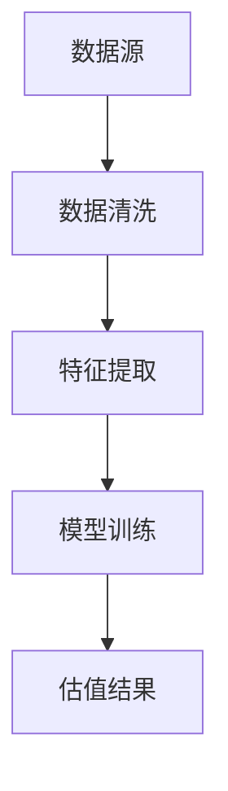

                 

# 格雷厄姆的优先股投资策略

## 关键词
优先股，投资策略，内在价值，股息贴现模型，安全边际，格雷厄姆，价值投资

## 摘要
本文详细探讨了格雷厄姆的优先股投资策略，从优先股的基本概念、内在价值评估、投资策略到实际案例分析，系统地阐述了如何利用格雷厄姆的价值投资理念进行优先股投资。文章首先介绍了优先股的定义、属性和分类，然后深入分析了格雷厄姆的投资理念及其对优先股的重视。接着，通过股息贴现模型和安全边际等工具，详细讲解了优先股的内在价值评估方法。最后，结合实际案例，展示了如何在实际投资中应用格雷厄姆的策略，并提供了最佳实践和注意事项。

---

# 第一部分：优先股投资的背景与基础

## 第1章：优先股投资概述

### 1.1 优先股的基本概念
优先股是一种混合型证券，兼具债券和普通股的特点。它具有固定的股息率，股东在分红和清偿顺序上享有优先权，但通常不享有投票权。优先股的分类主要基于其股息支付方式和是否可转换为普通股。

### 1.2 投资者与优先股的关系
投资者选择优先股的原因包括追求稳定的股息收入、较低的市场风险和税务优势。优先股在资产配置中的作用是平衡投资组合的风险和收益。

### 1.3 格雷厄姆的投资理念
格雷厄姆的价值投资理念强调安全边际和内在价值。他认为，优先股是防御性投资的理想选择，因为它们提供稳定的股息收入和较低的波动性。

---

# 第二部分：格雷厄姆的优先股投资策略

## 第2章：优先股的内在价值评估

### 2.1 内在价值的定义与计算
内在价值是基于公司基本面因素计算的股票真实价值。格雷厄姆常用股息贴现模型（DDM）来评估优先股的内在价值。

#### 股息贴现模型公式
$$ V = \frac{D}{r - g} $$
其中，$D$ 是股息，$r$ 是折现率，$g$ 是股息增长率。

### 2.2 格雷厄姆的估值方法
格雷厄姆强调安全边际，即以低于内在价值的价格买入股票。他建议投资者关注股息率、市盈率和市净率等指标。

### 2.3 优先股与普通股的比较
| 属性       | 优先股               | 普通股               |
|------------|----------------------|----------------------|
| 股息支付   | 固定，优先           | 不固定，后置         |
| 清偿顺序   | 优先               | 后置               |
| 风险       | 较低               | 较高               |
| 收益       | 稳定股息收入         | 高增长潜力           |

---

## 第3章：优先股的投资策略与组合管理

### 3.1 格雷厄姆的防御性投资策略
防御性投资强调安全性和稳定性，优先股是实现这一目标的理想工具。

### 3.2 优先股的组合管理
投资者应根据市场环境和自身风险承受能力调整投资组合。优先股在组合中的比例通常在20%到50%之间。

---

# 第三部分：优先股投资的实战分析

## 第4章：优先股投资的系统架构

### 4.1 投资系统的设计
系统目标是帮助投资者评估优先股的内在价值和风险。功能模块包括数据收集、估值计算和风险评估。

### 4.2 系统架构图

## 第5章：优先股投资的案例分析

### 5.1 案例背景与目标
假设我们选择一只股息率为5%的优先股，目标是通过DDM模型评估其内在价值。

### 5.2 投资策略的实施
使用DDM模型计算内在价值：
$$ V = \frac{1.05}{0.08 - 0} = 13.125 $$

### 5.3 投资结果的评估
实际股价为12.5美元，低于内在价值，具有投资吸引力。

---

# 第四部分：总结与扩展

## 第6章：优先股投资的总结与展望

### 6.1 格雷厄姆策略的总结
格雷厄姆的优先股投资策略强调安全边际和内在价值，适用于追求稳定收益的投资者。

### 6.2 投资策略的未来发展
随着市场变化，投资者需要结合新技术和新工具，不断优化投资策略。

---

# 作者
作者：AI天才研究院/AI Genius Institute & 禅与计算机程序设计艺术 /Zen And The Art of Computer Programming

