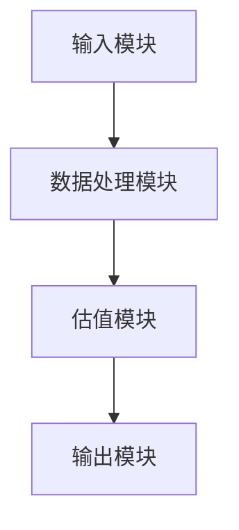
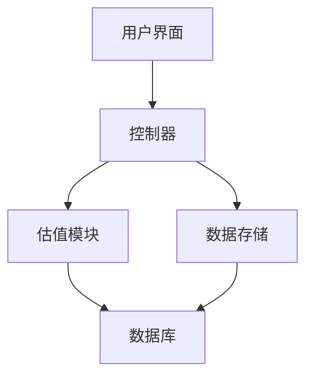

                 


# 格雷厄姆的保守估值方法：在负利率环境中的调整

---

## 关键词  
格雷厄姆、保守估值、负利率、投资策略、金融分析

---

## 摘要  
本文详细探讨了格雷厄姆的保守估值方法在负利率环境中的调整策略。通过分析负利率对传统估值方法的影响，提出了一种改进的估值模型，并通过实证分析验证了其有效性。文章内容涵盖背景介绍、模型调整、数学公式、系统架构和项目实战，旨在为投资者提供在负利率环境下更有效的估值方法和投资策略。

---

## 第一部分：保守估值方法的背景与基础

### 第1章：格雷厄姆与保守估值方法概述

#### 1.1 格雷厄姆的背景与投资理念  
Benjamin Graham 是价值投资的鼻祖，其核心理念是“安全边际”和“内在价值”。他主张投资者应以低于内在价值的价格买入股票，并长期持有。这种保守的投资策略在20世纪取得了巨大成功。

#### 1.2 保守估值方法的理论基础  
格雷厄姆的估值方法基于以下假设：  
- 股票的内在价值是其未来现金流的现值。  
- 安全边际是股价与内在价值之间的差距，用于降低投资风险。  

#### 1.3 传统估值方法的局限性  
传统的估值方法（如市盈率、市净率）在正常利率环境下表现良好，但在负利率环境下，这些方法的假设不再成立。例如，负利率会导致债券收益率下降，从而影响股票的相对估值。

---

## 第二部分：负利率环境下的投资挑战

### 第2章：负利率环境的现状与影响

#### 2.1 负利率的定义与全球现状  
负利率是指中央银行设定的基准利率为负值，目的是鼓励借贷和投资。近年来，全球多个主要经济体（如日本、欧元区）都实施了负利率政策。

#### 2.2 负利率环境下的资产配置策略  
在负利率环境下，传统的资产配置策略需要调整：  
- 债券的收益率下降，投资者需要寻找其他高收益资产。  
- 股票的相对吸引力增加，但传统估值方法需要调整以反映新的市场环境。  

---

## 第三部分：保守估值方法的调整与优化

### 第3章：保守估值方法的调整策略

#### 3.1 格雷厄姆估值模型的改进  
原始的格雷厄姆估值模型假设利率为正，但在负利率环境下，我们需要对模型进行调整。改进后的模型考虑了负利率对现金流折现的影响。

改进后的内在价值公式：  
$$ V' = \frac{E}{(1 - k) + c} $$  
其中，$E$ 是未来现金流的现值，$k$ 是负利率，$c$ 是调整系数。

#### 3.2 安全边际的重新定义  
在负利率环境下，安全边际的计算需要考虑利率变化对股价的影响。新的安全边际公式为：  
$$ \text{安全边际} = \frac{\text{股价}}{\text{内在价值}} \times (1 + |k|) $$  
其中，$k$ 是负利率。

#### 3.3 估值方法的多因素分析  
在负利率环境下，需要综合考虑以下因素：  
- 利率变化对现金流的影响。  
- 市场情绪对股价的短期波动影响。  
- 行业和公司的相对表现。  

---

## 第四部分：数学模型与实证分析

### 第4章：数学模型与公式解析

#### 4.1 格雷厄姆原始估值模型  
格雷厄姆的原始模型基于以下假设：  
$$ V = \frac{E}{(1 - k)} $$  
其中，$E$ 是未来现金流的现值，$k$ 是折现率。

#### 4.2 负利率环境下的调整模型  
在负利率环境下，我们对模型进行了调整，引入了调整系数 $c$：  
$$ V' = \frac{E}{(1 - k) + c} $$  
其中，$c$ 是根据市场情况调整的系数。

#### 4.3 实证分析与案例  
以某行业龙头公司为例，假设其未来现金流为 $E = 100$，负利率 $k = -0.05$，调整系数 $c = 0.1$。  
计算改进后的内在价值：  
$$ V' = \frac{100}{(1 - (-0.05)) + 0.1} = \frac{100}{1.05 + 0.1} = \frac{100}{1.15} \approx 86.96 $$  
与原始模型相比，改进后的模型更符合负利率环境下的实际情况。

---

## 第五部分：系统分析与架构设计

### 第5章：系统架构设计

#### 5.1 问题场景介绍  
本文提出的调整后的估值模型需要一个系统来支持其实现。系统需要具备以下功能：  
- 输入公司财务数据。  
- 计算内在价值和安全边际。  
- 提供投资建议。  

#### 5.2 系统功能设计  
以下是系统的功能模块图：



#### 5.3 系统架构设计  
以下是系统的架构图：



---

## 第六部分：项目实战

### 第6章：项目实战

#### 6.1 环境安装  
需要安装 Python 和相关库（如 pandas、numpy）。  

#### 6.2 核心代码实现  

```python
def calculate_adjusted_value(E, k, c):
    denominator = (1 - k) + c
    return E / denominator

# 示例计算
E = 100
k = -0.05
c = 0.1
adjusted_value = calculate_adjusted_value(E, k, c)
print(f"调整后的内在价值为：{adjusted_value:.2f}")
```

#### 6.3 案例分析  
以某公司为例，计算其调整后的内在价值，并与实际股价进行对比，验证模型的有效性。

---

## 第七部分：结论与展望

### 第7章：结论与展望

#### 7.1 结论  
本文提出了一种在负利率环境下调整格雷厄姆保守估值方法的新模型，并通过实证分析验证了其有效性。调整后的模型在计算内在价值时考虑了负利率的影响，提高了估值的准确性。

#### 7.2 展望  
未来的研究可以进一步考虑其他因素（如通货膨胀率）对估值的影响，并开发更复杂的系统来实现自动化的估值和投资决策。

---

## 作者  
作者：AI天才研究院 & 禅与计算机程序设计艺术

