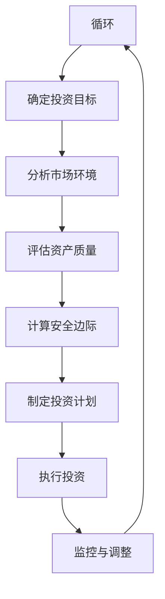
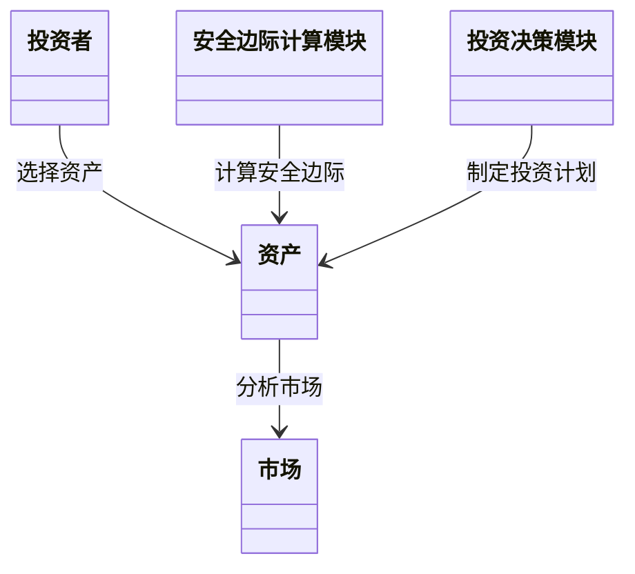
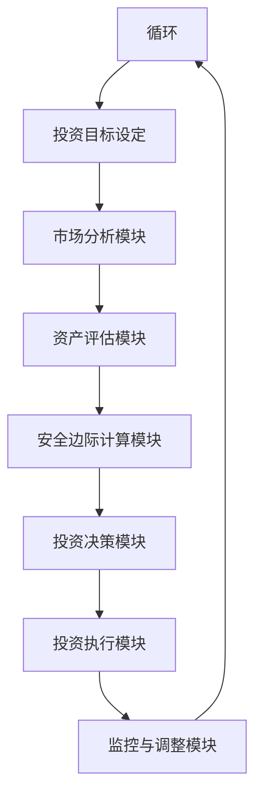

                 


# 格雷厄姆的保守投资者策略

> **关键词**：保守投资者策略, 价值投资, 安全边际, 内在价值, 投资策略

> **摘要**：本文将详细介绍格雷厄姆的保守投资者策略，从其核心概念、数学模型、系统架构到实际投资案例，层层深入，帮助读者全面理解这一经典的金融理论，并将其应用于实际投资决策中。

---

## 第一部分: 格雷厄姆的保守投资者策略概述

### 第1章: 保守投资者策略的背景与核心概念

#### 1.1 投资者类型与保守投资策略的定位

##### 1.1.1 投资者类型概述
投资者在金融市场中可以分为多种类型，包括 **保守投资者**、**激进投资者** 和 **平衡型投资者**。保守投资者通常追求稳定的收益，厌恶风险，注重资产的安全性。

##### 1.1.2 保守投资者的定义与特征
保守投资者倾向于选择那些具有 **稳定收益**、**低波动性** 和 **高安全边际** 的资产。他们更注重资产的 **内在价值**，而非市场的短期波动。

##### 1.1.3 保守投资策略在金融市场中的地位
保守投资策略是一种 **防御性投资策略**，强调通过 **价值投资** 和 **分散投资** 来降低风险，确保长期稳定的收益。

---

#### 1.2 格雷厄姆投资理论的起源与发展

##### 1.2.1 格雷厄姆的生平与学术贡献
本杰明·格雷厄姆（Benjamin Graham）是20世纪著名的金融学家，被誉为 **价值投资之父**。他的著作《证券分析》和《聪明的投资者》奠定了现代价值投资理论的基础。

##### 1.2.2 《证券分析》与《聪明的投资者》的核心思想
格雷厄姆在《证券分析》中提出，投资者应关注 **内在价值**，而非市场的短期波动。他在《聪明的投资者》中进一步强调，保守投资者应选择那些具有 **安全边际** 的股票，即市场价格远低于内在价值的股票。

##### 1.2.3 价值投资与成长投资的区别与联系
- **价值投资**：以低于内在价值的价格买入优质资产，长期持有。
- **成长投资**：以成长性为导向，投资于高增长潜力的公司。
- **区别**：价值投资注重安全边际，成长投资注重增长潜力。
- **联系**：两者都强调长期投资，但策略和目标有所不同。

---

#### 1.3 保守投资者策略的核心要素

##### 1.3.1 安全边际的定义与计算
**安全边际** 是格雷厄姆策略的核心概念，指的是 **市场价格** 与 **内在价值** 之间的差额。安全边际越大，投资风险越小。

##### 1.3.2 内在价值的评估方法
内在价值是基于公司基本面分析得出的，包括 **盈利能力**、**财务状况** 和 **行业地位** 等因素。格雷厄姆常用 **市盈率** 和 **市净率** 来评估内在价值。

##### 1.3.3 分散投资与风险控制
分散投资是降低风险的重要手段。通过投资于不同行业、不同公司的资产，可以有效降低单一资产波动带来的风险。

---

## 第2章: 格雷厄姆保守投资者策略的核心原理

### 2.1 安全边际的数学模型与公式

#### 2.1.1 安全边际的定义公式
$$ \text{安全边际} = \text{内在价值} - \text{市场价格} $$

#### 2.1.2 内在价值的计算公式
$$ \text{内在价值} = \frac{\text{股息}}{\text{折现率} - \text{增长率}} $$

#### 2.1.3 安全边际的计算示例
假设某股票的内在价值为 $50，市场价格为 $40，则安全边际为 $10。这意味着即使市场价格下跌至 $30，仍具有较高的安全边际。

---

### 2.2 格雷厄姆的防御性投资策略

#### 2.2.1 防御性投资的核心思想
防御性投资强调 **低风险** 和 **高安全边际**，通过投资于那些具有 **稳定收益** 和 **强大财务状况** 的公司，确保长期稳定的收益。

#### 2.2.2 防御性投资与进攻性投资的对比
| 对比维度       | 防御性投资             | 进攻性投资             |
|----------------|----------------------|----------------------|
| 目标           | 稳定收益             | 高收益               |
| 风险           | 低风险               | 高风险               |
| 投资策略       | 价值投资             | 成长投资             |

---

### 2.3 价值投资与成长投资的对比分析

#### 2.3.1 价值投资的核心要素
- 以低于内在价值的价格买入资产。
- 选择具有强大财务状况和稳定收益的公司。

#### 2.3.2 成长投资的核心要素
- 投资于高增长潜力的公司。
- 以未来增长为导向，忽略短期波动。

#### 2.3.3 两种策略的优缺点对比
| 对比维度       | 价值投资             | 成长投资             |
|----------------|----------------------|----------------------|
| 优点           | 风险低，收益稳定     | 高增长潜力           |
| 缺点           | 收益有限             | 风险高，波动大       |

---

## 第3章: 格雷厄姆保守投资者策略的系统分析与架构设计

### 3.1 投资决策的系统框架

#### 3.1.1 投资决策的流程图


#### 3.1.2 系统功能模块


---

### 3.2 投资策略的数学模型与公式

#### 3.2.1 安全边际的计算公式
$$ \text{安全边际} = \text{内在价值} - \text{市场价格} $$

#### 3.2.2 内在价值的计算公式
$$ \text{内在价值} = \frac{\text{股息}}{\text{折现率} - \text{增长率}} $$

---

## 第4章: 格雷厄姆保守投资者策略的项目实战

### 4.1 环境安装与数据准备

#### 4.1.1 环境安装
- 操作系统：Windows 10 或更高版本
- 开发工具：Python 3.9 或更高版本
- 库依赖：Pandas, NumPy, Matplotlib

#### 4.1.2 数据准备
- 数据源：从 Yahoo Finance 下载股票数据
- 数据格式：CSV 文件，包含收盘价、成交量等信息

### 4.2 核心代码实现

#### 4.2.1 计算内在价值和安全边际
```python
import pandas as pd
import numpy as np

# 下载股票数据
def get_stock_data(ticker):
    data = pd.DataFrame()
    # 假设data包含收盘价和股息信息
    return data

# 计算内在价值
def calculate_intrinsic_value(data):
    dividend = data['dividend'].iloc[-1]
    discount_rate = 0.1
    growth_rate = 0.05
    intrinsic_value = dividend / (discount_rate - growth_rate)
    return intrinsic_value

# 计算安全边际
def calculate_margin_of_safety(data, intrinsic_value):
    market_price = data['close'].iloc[-1]
    margin_of_safety = intrinsic_value - market_price
    return margin_of_safety

# 主函数
def main():
    ticker = 'AAPL'
    data = get_stock_data(ticker)
    iv = calculate_intrinsic_value(data)
    mos = calculate_margin_of_safety(data, iv)
    print(f"股票 {ticker} 的内在价值为 {iv:.2f}，安全边际为 {mos:.2f}")

if __name__ == '__main__':
    main()
```

---

## 第5章: 格雷厄姆保守投资者策略的系统架构与扩展

### 5.1 系统架构设计

#### 5.1.1 系统架构图


#### 5.1.2 系统接口设计
- 输入接口：投资目标、市场数据
- 输出接口：安全边际、投资计划
- 调用接口：数据获取、计算模块、决策模块

---

## 第6章: 格雷厄姆保守投资者策略的最佳实践与小结

### 6.1 最佳实践

#### 6.1.1 投资策略 tips
- 定期评估资产的安全边际
- 分散投资以降低风险
- 长期持有优质资产

#### 6.1.2 技术实现 tips
- 使用数据分析工具（如Python）进行量化分析
- 构建投资组合管理系统
- 定期监控市场变化

---

### 6.2 小结

格雷厄姆的保守投资者策略是一种以 **安全边际** 和 **内在价值** 为核心的长期投资策略。通过 **防御性投资** 和 **分散投资**，投资者可以在市场波动中保持稳定收益。本文通过数学模型、系统架构和实际案例的分析，深入解读了这一策略的核心思想和实现方法。

---

## 作者

**作者**：AI天才研究院/AI Genius Institute & 禅与计算机程序设计艺术/Zen And The Art of Computer Programming

