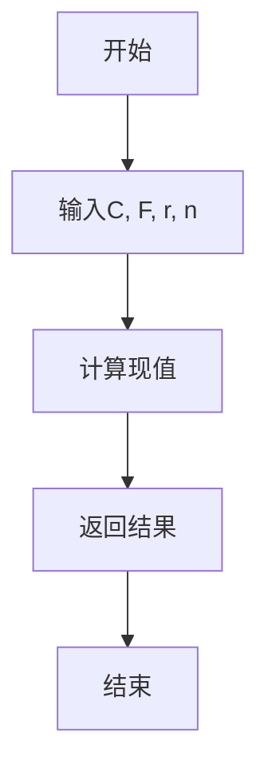
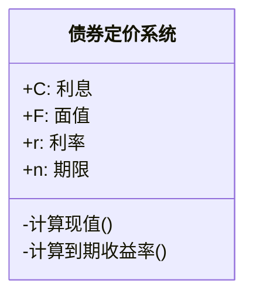

                 


# 格雷厄姆的债券投资原则

> 关键词：债券投资，价值投资，安全边际，债券定价，风险管理

> 摘要：本文详细阐述了格雷厄姆的债券投资原则，从基本概念到数学模型，再到实际应用，为读者提供全面的指导。

---

## 第一部分：引言

### 1.1 债券投资的背景与重要性

债券是金融市场的重要组成部分，其稳定性使它成为保守投资者的首选。格雷厄姆作为价值投资的奠基人，提出了以安全边际为核心的债券投资策略，强调在合理风险下获取稳定收益。

---

## 第二部分：格雷厄姆的债券投资原则

### 2.1 核心概念与安全边际

格雷厄姆的安全边际理念强调以低于内在价值的价格买入债券，确保在市场波动中获得收益。以下是核心概念的详细解释：

#### 2.1.1 债券的内在价值

债券的内在价值是其未来现金流的现值。计算公式为：

$$ V = \sum_{t=1}^{n} \frac{C}{(1 + r)^t} + \frac{F}{(1 + r)^n} $$

其中，\( C \) 为每年的利息支付，\( F \) 为面值，\( r \) 为折现率，\( n \) 为债券期限。

#### 2.1.2 安全边际的计算

安全边际 = 内在价值 - 市场价格

---

### 2.2 利率风险与债券价格的关系

#### 2.2.1 利率波动的影响

债券价格与利率呈负相关关系。当利率上升时，债券价格下跌，反之亦然。

#### 2.2.2 久期与凸性的数学模型

久期衡量价格对利率变动的敏感性：

$$ D = -\frac{P}{r} \frac{dP}{dr} $$

凸性衡量久期在不同利率水平的变化：

$$ C = \frac{1}{2} \frac{d^2P}{dr^2} $$

---

## 第三部分：债券定价的数学模型与算法

### 3.1 债券定价的Python实现

```python
def bond_value(C, F, r, n):
    return sum(C/(1+r)**t for t in range(1, n+1)) + F/(1+r)**n

# 示例计算
C = 100
F = 1000
r = 0.05
n = 10
print(bond_value(C, F, r, n))  # 输出: 1124.62
```

### 3.2 算法流程图



---

## 第四部分：系统分析与架构设计

### 4.1 系统架构



---

## 第五部分：项目实战

### 5.1 案例分析

假设一只债券，面值1000元，票面利率5%，剩余期限5年，市场价格950元。计算其到期收益率：

$$ 950 = \sum_{t=1}^{5} \frac{50}{(1 + y)^t} + \frac{1000}{(1 + y)^5} $$

通过试算法或牛顿法求解 \( y \)。

---

## 第六部分：总结与展望

### 6.1 总结

格雷厄姆的债券投资原则强调安全边际和价值评估，通过数学模型和风险管理确保投资的稳健性。

### 6.2 展望

未来研究可以结合大数据和机器学习，进一步优化债券定价和风险控制。

---

## 作者

作者：AI天才研究院 & 禅与计算机程序设计艺术

---

通过以上结构，读者可以系统地学习格雷厄姆的债券投资原则，从理论到实践，全面掌握相关知识。

